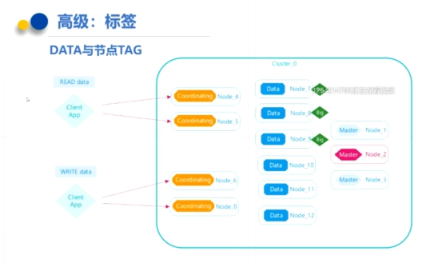
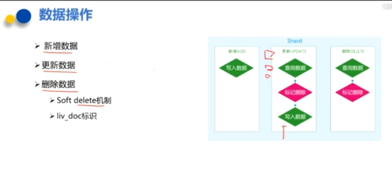

# elasticsearch

## 项目流程

### 数据导入

现在需要将数据从数据库中查询出来，然后将数据导入到ES中。


1.创建一个JavaBean，在JavaBean（SkuInfo）中添加索引库映射配置（一些注解）

FieldType.Text:Text类型，Text支持分词

index=true；添加数据时，是否分词

analyzer=“ik_smart”:创建索引的分词器

store=false;是否存储

searchAnalyzer="ik_smart":搜索时使用的分词器

2.创建Feign，实现查询所有Sku集合

3.在搜索微服务中调用Feign,查询所有Sku集合，并将Sku集合转化为SkuInfo的集合

4.Controller-Service-调用Dao（继承ElasticsearchRepository）实现数据导入到Elasticsearch

### 文档映射Bean创建

搜索商品的时候，会根据如下属性搜索数据,并且不是所有的属性都需要分词搜索，我们创建JavaBean，将JavaBean数据存入到ES中要以搜索条件和搜索展示

结果为依据，部分关键搜索条件分析如下：

1.可能会根据商品名称搜索，而且可以搜索商品名称中的任意一个词语，所以

需要分词

2.可能会根据商品分类搜索，商品分类不需要分词

3.可能会根据商品品牌搜索，商品品牌不需要分词

4.可能会根据商品商家搜索，商品商家不需要分词

5.可能根据规格进行搜索，规格时一个键值对结构，用Map

### 关键字搜索

![畅 购  到 0 CHANG GOU  全 品 分 类  关 键 字 索  服 装 城  华 为 ×  美 妆 馆  青 橙 超 市  全 球 购  Q  Stiger 、  闪 购  联 湮 4G  团 购  有 趣  秒 杀  全 部 结 果 / 智 能 手 机  手 机 、 数 码 、 配 亻 牛  品 牌  网 络 制 式  显 示 屏 尺 寸  像 头 像 寮  价  更 多 筛 选 项  锥 晕 新 品  iPhone ×  条 亻 牛 索  萦 尼 0  GSM （ 移 动 / 联 湮 2G ）  OPPO ×  电 信 2G  多 选  更 多  长 (C 能 ．  Stig 亿 0  电 信 3G  联 湮 3G  电 信 3G  移 动 3G  (C) 匚 H  联 湮 3G  EX 匚 囗  联 湮 4G  nMSUN  生 0 一 生 9 英 ，  12 開 万 以 上  生 0 一 生 9 英 寸  800-1199 万  500 一 1000 兀  0 一 5D0 兀  恃 点  1200 一 1599 万  100D 一 1500 兀  卡 双 卡  移 动 3G  16 開 万 以 上  15D0 一 2D00 兀  其 他  200D 一 3000 兀  3000 元 以 上  系 统  手 机 内 存  评 价 ](ElasticSearch/clip_image004.gif)

我们先使用SpringDataElasticsearch实现一个简单的搜索功能，先实现根据关键字搜索，从上面搜索图片可以看得到，每次搜索的时候，除了关键字外，还有可能有品

牌、分类、规格等，后台接收搜索条件使用Map接收比较合适。

查询关键字为诺基亚的商品，key为keywords，value为诺基亚

### 分类统计

看下面的SQL语句，我们在执行搜索的时候，第1条SQL语句是执行搜，第2条语句是根据分类名字分组查看有多少分类，大概执行了2个步骤就可以获取数据结果以及分类统计，我

们可以发现他们的搜索条件完全一样。

\```sql

-- 查询所有

SELECT * FROM tb_sku WHERE name LIKE '%手机%';

-- 根据分类名字分组查询

SELECT category_name FROM tb_sku WHERE name LIKE '%手机%' GROUP BY category_name;

\```


我们每次执行搜索的时候，需要显示商品分类名称，这里要显示的分类名称其实就是符合搜素条件的所有商品的分类集合，我们可以按照上面的实现思路，使用ES根据分组名称做

一次分组查询即可实现。

### 品牌统计


-- 查询所有

SELECT * FROM tb_sku WHERE name LIKE '%手机%';

-- 根据品牌名字分组查询

SELECT brand_name FROM tb_sku WHERE name LIKE '%手机%' GROUP BY brand_name;

### 规格统计


-- 查询所有

SELECT * FROM tb_sku WHERE name LIKE '%手机%';

-- 根据规格名字分组查询

SELECT spec FROM tb_sku WHERE name LIKE '%手机%' GROUP BY spec;

上述SQL语句执行后的结果如下图：


获取到的规格数据我们发现有重复，不过也可以解决，解决思路如下：

1.获取所有规格数据

2.将所有规格数据转换成Map

3.定义一个Map<String,Set>,key是规格名字，防止重复所以用Map，valu是规格值，规格值

有多个，所以用集合，为了防止规格重复，用Set去除重复

4.循环规格的Map，将数据填充到定义的Map<String,Set>中

### 条件筛选 


分类、品牌筛选

页面每次向后台传入对应的分类和品牌，后台据分类和品牌进行条件过滤可。

规格过滤

规格这一块，需要向后台发送规格名字以及规格值，我们可以按照一定要求来发送数据，例如规格名字以特殊前缀提交到后台：spec_网络制式：电信4G、spec_显示屏尺寸：4.0-4.9英寸

后台接到数据后，可以根据前缀spec_来区分是否是规格，如果以spec_xxx开始的数据则为规格数据，需要根据指定规格找信息。


上图是规格的索引存储格式，真实数据在spechMap.规格名字.keyword中，所以找数据也是按照如下格式去找：spechMap.规格名字.keyword

价格区间查询

价格区间查询，每次需要将价格传入到后台，前端传入后台的价格大概是`price=0-500`或者`price=500-1000`依次类推，最后一个是`price=3000`,后台可以根据-分割，如果分割得到的结果最多有2个，第1个表示`x<price`，第2个表示`price<=y`。

### 搜索排序

排序这里总共有根据价格排序、根据评价排序、根据新品排序、根据销量排序，排序要想实现非常简单，只需要告知排序的域以及排序方式即可实现。

价格排序：只需要根据价格高低排序即可，降序价格高->低，升序价格低->高

评价排序：评价分为好评、中评、差评，可以在数据库中设计3个列，用来记录好评、中评、差评的量，每次排序的时候，好评的比例来排序，当然还要有条数限制，评价条数需要超过N条。

新品排序：直接根据商品的发布时间或者更新时间排序。

销量排序：销量排序除了销售数量外，还应该要有时间段限制。

这里我们不单独针对某个功能实现排序，我们只需要在后台接收2个参数，分别是排

序域名字和排序方式（升序，降序）

### 高亮显示

高亮搜索实现步骤解析：

将之前的搜索换掉，换成高亮搜索，我们需要做3个步骤：

1.指定高亮域，也就是设置哪个域需要高亮显示设置高亮域的时候，需要指定前缀和后缀，也就是关键词用什么html标签包裹，再给该标签样式

2.高亮搜索实现

3.将非高亮数据替换成高亮数据

第1点，例如在百度中搜索数据的时候，会有2个地方高亮显示，分别是标题和描述，商城搜索的时候，只是商品名称高亮显示了。而高亮显示其实就是添加了样式，例如<span style="color:red;">笔记本</span>,而其中span开始标签可以称为前缀，span结束标签可以称为后缀。

第2点，高亮搜索使用ElasticsearchTemplate实现。

第3点，高亮搜索后，会搜出非高亮数据和高亮数据，高亮数据会加上第1点中的高亮样式，此时我们需要将非高亮数据换成高亮数据即可。例如非高亮:华为笔记本性能超强悍 高亮数据：华为<span style="color:red;"笔记本</span>性能超强悍,将非高亮的换成高亮的，到页面就能显示样式了。

## 倒排索引


term dictionary相当于给term作了一个排序

term index 维护了term的前缀以及偏移量（位置）


posting List中存放了后面的那些

这些词在文章中的偏移量

权重：TFIDF 词频逆文档频率

那如果反过来我想查询 name 中包含了 li 的数据有哪些?这样如何高效查询呢?

仅仅通过上文提到的正排索引显然起不到什么作用，只能依次将所有数据遍历后判断名称中是否包含 li ;这样效率十分低下。

但如果我们重新构建一个索引结构：


当要查询 name 中包含 li 的数据时，只需要通过这个索引结构查询到 Posting List 中所包含的数据，再通过映射的方式查询到最终的数据。

这个索引结构其实就是倒排索引。

### Term Dictionary

但如何高效的在这个索引结构中查询到 li 呢，结合我们之前的经验，只要我们将 Term 有序排列，便可以使用二叉树搜索树的数据结构在 o(logn) 下查询到数据。

将一个文本拆分成一个一个独立Term 的过程其实就是我们常说的分词。

而将所有 Term 合并在一起就是一个 Term Dictionary，也可以叫做单词词典。

英文的分词相对简单，只需要通过空格、标点符号将文本分隔便能拆词，中文则相对复杂，但也有许多开源工具做支持(由于不是本文重点，对分词感兴趣的可以自行搜索)。

当我们的文本量巨大时，分词后的 Term 也会很多，这样一个倒排索引的数据结构如果存放于内存那肯定是不够存的，但如果像 MySQL 那样存放于磁盘，效率也没那么高。

### Term Index

所以我们可以选择一个折中的方法，既然无法将整个 Term Dictionary 放入内存中，那我们可以为 Term Dictionary 创建一个索引然后放入内存中。

这样便可以高效的查询 Term Dictionary ，最后再通过 Term Dictionary 查询到 Posting List。

相对于 MySQL 中的 B+树来说也会减少了几次磁盘 IO。


这个 Term Index 我们可以使用这样的 Trie 树，也就是我们常说的字典树来存放。


如果我们是以 j 开头的 Term 进行搜索，首先第一步就是通过在内存中的 Term Index 查询出以 j 打头的 Term 在 Term Dictionary 字典文件中的哪个位置(这个位置可以是一个文件指针，可能是一个区间范围)。

紧接着在将这个位置区间中的所有 Term 取出，由于已经排好序，便可通过二分查找快速定位到具体位置;这样便可查询出 Posting List。

最终通过 Posting List 中的位置信息便可在原始文件中将目标数据检索出来。

## 分词

### 分词器的组成

分词器是专门处理分词的组件，分词器由以下三部分组成：

Character Filters

：针对原始文本处理，比如去除 html 标签

Tokenizer

：按照规则切分为单词，比如按照空格切分

Token Filters

：将切分的单词进行加工，比如大写转小写，删除 stopwords，增加同义语


同时 Analyzer 三个部分也是有顺序的，从图中可以看出，从上到下依次经过 Character Filters，Tokenizer 以及 Token Filters，这个顺序比较好理解，一个文本进来肯定要先对文本数据进行处理，再去分词，最后对分词的结果进行过滤。

### **ES** **分词器**

首先来介绍下 Stamdard Analyzer 分词器：

**Stamdard Analyzer**


它是 ES **默认的分词器**，它会对输入的文本**按词的方式进行切分**，切分好以后会进行**转小写**处理，**默认的** **stopwords** **是关闭的**。

可以看出是按照空格、非字母的方式对输入的文本进行了转换，比如对 Java 做了转小写，对一些停用词也没有去掉，比如 in。

其中 token 为分词结果；start_offset 为起始偏移；end_offset 为结束偏移；position 为分词位置。

IK提供了两个分词算法ik_smart 和 ik_max_word ，其中 ik_smart 为最少切分，ik_max_word为最细粒度划分 

https://zhuanlan.zhihu.com/p/111775508

## 基础概念


Mapping：描述一个文档：有多少key，怎么分词的

安全状态：绿色：安全  黄色：有分片没有备份    红色：有数据丢失

架构：其实就是说分片和副本是怎样分布的

使用场景：还有日志，大数据量机器学习等，百度搜索，B站搜索

Elasticsearch是面向文档(document oriented)的，这意味着它可以存储整个对象或文档(document)。然而它不仅 

仅是存储，还会索引(index)每个文档的内容使之可以被搜索。在Elasticsearch中，你可以对文档（而非成行成列的 

数据）进行索引、搜索、排序、过滤。Elasticsearch比传统关系型数据库如下： 

Relational DB ‐> Databases ‐> Tables ‐> Rows ‐> Columns 

Elasticsearch ‐> Indices  ‐> Types ‐> Documents ‐> Fields

## Elasticsearch核心概念 

### 索引 index 

一个索引就是一个拥有几分相似特征的文档的集合。比如说，你可以有一个客户数据的索引，另一个产品目录的索 引，还有一个订单数据的索引。一个索引由一个名字来标识（必须全部是小写字母的），并且当我们要对对应于这 个索引中的文档进行索引、搜索、更新和删除的时候，都要使用到这个名字。在一个集群中，可以定义任意多的索 引。 

### 类型 type 

在一个索引中，你可以定义一种或多种类型。一个类型是你的索引的一个逻辑上的分类/分区，其语义完全由你来 定。通常，会为具有一组共同字段的文档定义一个类型。比如说，我们假设你运营一个博客平台并且将你所有的数 据存储到一个索引中。在这个索引中，你可以为用户数据定义一个类型，为博客数据定义另一个类型，当然，也可以为评论数据定义另一个类型。 

###  字段Field 

相当于是数据表的字段，对文档数据根据不同属性进行的分类标识 

### 映射 mapping 

mapping是处理数据的方式和规则方面做一些限制，如某个字段的数据类型、默认值、分析器、是否被索引等等， 这些都是映射里面可以设置的，其它就是处理es里面数据的一些使用规则设置也叫做映射，按着最优规则处理数据 对性能提高很大，因此才需要建立映射，并且需要思考如何建立映射才能对性能更好。 

### 文档 document 

一个文档是一个可被索引的基础信息单元。比如，你可以拥有某一个客户的文档，某一个产品的一个文档，当然， 也可以拥有某个订单的一个文档。文档以JSON（Javascript Object Notation）格式来表示，而JSON是一个到处存 在的互联网数据交互格式。 

在一个index/type里面，你可以存储任意多的文档。注意，尽管一个文档，物理上存在于一个索引之中，文档必须 被索引/赋予一个索引的type。 

### 接近实时 NRT 

Elasticsearch是一个接近实时的搜索平台。这意味着，从索引一个文档直到这个文档能够被搜索到有一个轻微的延迟（通常是1秒以内） 

###  集群 cluster 

一个集群就是由一个或多个节点组织在一起，它们共同持有整个的数据，并一起提供索引和搜索功能。一个集群由 

一个唯一的名字标识，这个名字默认就是“elasticsearch”。这个名字是重要的，因为一个节点只能通过指定某个集 群的名字，来加入这个集群 

###  节点 node 

一个节点是集群中的一个服务器，作为集群的一部分，它存储数据，参与集群的索引和搜索功能。和集群类似，一 个节点也是由一个名字来标识的，默认情况下，这个名字是一个随机的漫威漫画角色的名字，这个名字会在启动的 时候赋予节点。这个名字对于管理工作来说挺重要的，因为在这个管理过程中，你会去确定网络中的哪些服务器对应于Elasticsearch集群中的哪些节点。 

一个节点可以通过配置集群名称的方式来加入一个指定的集群。默认情况下，每个节点都会被安排加入到一个叫 做“elasticsearch”的集群中，这意味着，如果你在你的网络中启动了若干个节点，并假定它们能够相互发现彼此， 它们将会自动地形成并加入到一个叫做“elasticsearch”的集群中。 在一个集群里，只要你想，可以拥有任意多个节点。而且，如果当前你的网络中没有运行任何Elasticsearch节点， 这时启动一个节点，会默认创建并加入一个叫做“elasticsearch”的集群。 

###  分片和复制 shards&replicas 

一个索引可以存储超出单个结点硬件限制的大量数据。比如，一个具有10亿文档的索引占据1TB的磁盘空间，而任 一节点都没有这样大的磁盘空间；或者单个节点处理搜索请求，响应太慢。为了解决这个问题，Elasticsearch提供 了将索引划分成多份的能力，这些份就叫做分片。当你创建一个索引的时候，你可以指定你想要的分片的数量。每 个分片本身也是一个功能完善并且独立的“索引”，这个“索引”可以被放置到集群中的任何节点上。分片很重要，主要有两方面的原因： 1）允许你水平分割/扩展你的内容容量。 2）允许你在分片（潜在地，位于多个节点上）之上 进行分布式的、并行的操作，进而提高性能/吞吐量。 至于一个分片怎样分布，它的文档怎样聚合回搜索请求，是完全由Elasticsearch管理的，对于作为用户的你来说， 这些都是透明的。 

在一个网络/云的环境里，失败随时都可能发生，在某个分片/节点不知怎么的就处于离线状态，或者由于任何原因 消失了，这种情况下，有一个故障转移机制是非常有用并且是强烈推荐的。为此目的，Elasticsearch允许你创建分 片的一份或多份拷贝，这些拷贝叫做复制分片，或者直接叫复制。 复制之所以重要，有两个主要原因： 在分片/节点失败的情况下，提供了高可用性。因为这个原因，注意到复制分片从不与原/主要（original/primary）分片置于同一节点上是非常重要的。扩展你的搜索量/吞吐量，因为搜索可以 在所有的复制上并行运行。总之，每个索引可以被分成多个分片。一个索引也可以被复制0次（意思是没有复制） 或多次。一旦复制了，每个索引就有了主分片（作为复制源的原来的分片）和复制分片（主分片的拷贝）之别。分 片和复制的数量可以在索引创建的时候指定。在索引创建之后，你可以在任何时候动态地改变复制的数量，但是你 

事后不能改变分片的数量。 

默认情况下，Elasticsearch中的每个索引被分片5个主分片和1个复制，这意味着，如果你的集群中至少有两个节 点，你的索引将会有5个主分片和另外5个复制分片（1个完全拷贝），这样的话每个索引总共就有10个分片。

 

## 写入数据的工作原理


## 查询数据的原理


## ES部署如何优化


## 腾讯课堂

### 集群




### 索引


数据可变性问题：当更新数据的时候会触发分段的合并


es文档的格式相当于作了一层json封装，Json形式更好操作，lucene文件相当于只有下面这种键值对的形式


也会找到doc的id，再去倒排索引去查数据


### 数据更新


先写到主分片，副本分片是同步过来的




删除的时候只标记，等到合并的时候不合并标记的数据就是删除了


弱一致性：不能保证主副的数据每一时刻都是最新的


本地检查点：两个segment合并到哪一步了

全局检查点：复制到哪一步了


### 查询数据


为什么比传统数据库快：（1）因为字典树相当于是第一层索引，放在内存中，词典相当于是第二层索引，放在磁盘中，（2）各种算法的优化，不同情况进行选择

例如查询ABC模糊查询：先到字典树中查到数据在哪些块，在到词典中根据倒排索引查到编号（链表形式），结果合并是链表生成了跳表，跳表非常合适去做合并

若不是模糊匹配而是精确匹配，用位图的话合并的速度会更快


索引结构是一个多维的，比如说100个字段（都是数字的），那么就会建立100维的索引，这样就会比传统数据库快


倒排索引还要排序，根据term和文档的关联度打分并排序


filter精确查询会更快，比模糊匹配更快，因为这个bitmap算法，并且会做缓存


参照点：查第二页的时候把第一页的最后一条数据的id给我


局部：先分片内排序，在整体汇总排序

全局：把词的信息做一个汇总，再排序，排完序在提出来


 

 