# JVM

## 概念

JVM全称Java Virtual Machine，即Java虚拟机。它本身是一个虚拟计算机。Java虚拟机基于二进制字节码执行，由一套字节码指令集、一组寄存器、一个栈、一个垃圾回收堆、一个方法区等组成。JVM屏蔽了与操作系统平台相关的信息，从而能够让Java程序只需要生成能够在JVM上运行的字节码文件。通过该机制实现的跨平台性。因此这也是为什么说Java能够做到“一处编译、处处运行”的原因。

## JVM生命周期

JVM的生命周期分为三个阶段，分别为：启动、运行、死亡。

\- **启动：**

 当启动一个Java程序时，JVM的实例就已经产生。对于拥有main函数的类就是JVM实例运行的起点。

\- **运行：**

 main()方法是一个程序的初始起点，任何线程均可由在此处启动。在JVM内部有两种线程类型，分别为：用户线程和守护线程。JVM通常使用的是守护线程，而main()使用的则是用户线程。守护线程会随着用户线程的结束而结束。

\- **死亡：**

 当程序中的用户线程都中止，JVM才会退出。

## 内存结构

内存是非常重要的系统资源，是硬盘和 CPU 的中间仓库及桥梁，承载着操作系统和应用程序的实时运行。JVM 内存结构规定了 Java 在运行过程中内存申请、分配、管理的策略，保证了 JVM 的高效稳定运行。

 

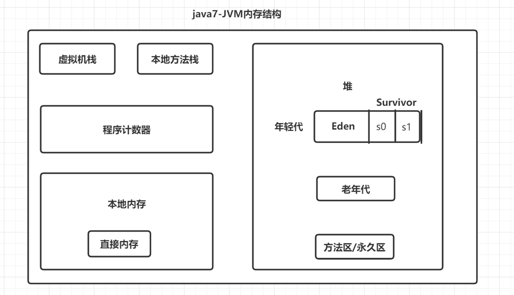

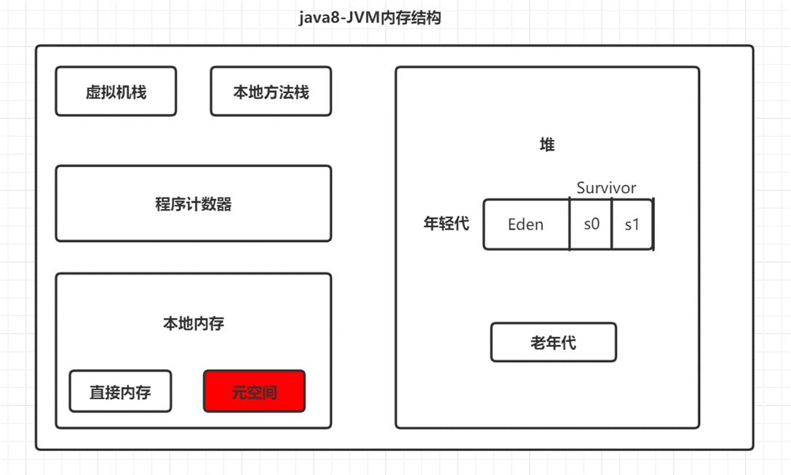

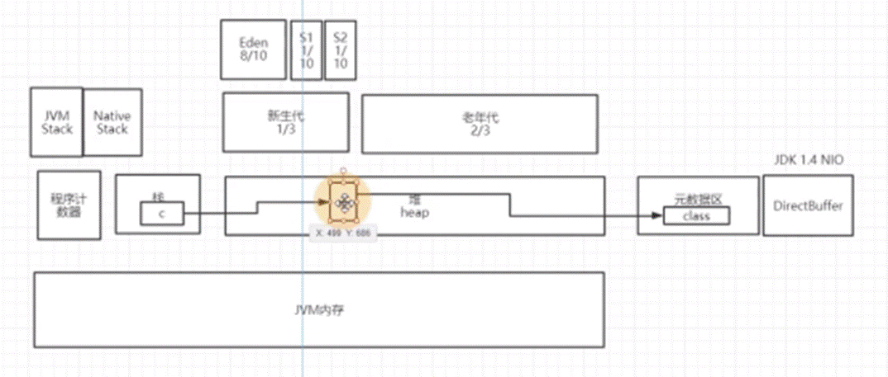

**虚拟机栈：**

​    线程私有的，虚拟机栈对应方法调用到执行完成的整个过程。保存执行方法时的**局部变量、动态连接信息、方法返回地址信息**等等。方法开始执行的时候会进栈，方法执行完会出栈【相当于清空了数据】。不需要进行GC。

Java 虚拟机栈会出现两种错误： StackOverFlowError 和 OutOfMemoryError 。

- StackOverFlowError ： 若 Java 虚拟机栈的内存⼤⼩不允许动态扩展，那么当线程请求栈的深度超过当前 Java 虚拟机栈的最⼤深度的时候，就抛出 StackOverFlowError 错误。 

- OutOfMemoryError ： 若 Java 虚拟机堆中没有空闲内存，并且垃圾回收器也⽆法提供更多内存的话。就会抛出 OutOfMemoryError 错误。

**本地方法栈：**

​    与虚拟机栈类似。本地方法栈是为虚拟机**执行本地方法时提供服务的**。不需要进行GC。本地方法一般是由其他语言编写。

**程序计数器：**

​    线程私有的。内部保存的字节码的行号。用于记录正在执行的字节码指令的地址。

1. 字节码解释器通过改变程序计数器来依次读取指令，从⽽实现代码的流程控制，如：顺序执 ⾏、选择、循环、异常处理。

2. 在多线程的情况下，程序计数器⽤于记录当前线程执⾏的位置，从⽽当线程被切换回来的时候能够知道该线程上次运⾏到哪⼉了

注意：程序计数器是唯⼀⼀个不会出现 OutOfMemoryError 的内存区域，它的⽣命周期随着线 程的创建⽽创建，随着线程的结束⽽死亡。

​    java虚拟机对于多线程是通过线程轮流切换并且分配线程执行时间。在任何的一个时间点上，一个处理器只会处理执行一个线程，如果当前被执行的这个线程它所分配的执行时间用完了【挂起】。处理器会切换到另外的一个线程上来进行执行。并且这个线程的执行时间用完了，接着处理器就会又来执行被挂起的这个线程。

​    那么现在有一个问题就是，当前处理器如何能够知道，对于这个被挂起的线程，它上一次执行到了哪里？那么这时就需要从程序计数器中来回去到当前的这个线程他上一次执行的行号，然后接着继续向下执行。

​    程序计数器是JVM规范中唯一一个没有规定出现OOM的区域，所以这个空间也不会进行GC。

**本地内存：**

​    它又叫做**堆外内存**，线程共享的区域，本地内存这块区域是不会受到JVM的控制的，也就是说对于这块区域是不会发生GC的。因此对于整个java的执行效率是提升非常大的。

**堆：**

​    线程共享的区域。主要用来保存**对象实例，数组**等，当堆中没有内存空间可分配给实例，也无法再扩展时，则抛出OutOfMemoryError异常。

​    在JAVA7中堆内会存在**年轻代、老年代和方法区****(****永久代****)**。

​    1）Young区被划分为三部分，Eden区和两个大小严格相同的Survivor区，其中，Survivor区间中，某一时刻只有其中一个是被使用的，另外一个留做垃圾收集时复制对象用。在Eden区变满的时候， GC就会将存活的对象移到空闲的Survivor区间中（先移动到s0,等到再次满，移动到s1，再次满移动到s0），根据JVM的策略，在经过几次垃圾收集后，任然存活于Survivor的对象将被移动到Tenured（长期保有的，老年代）区间。

​    2）Tenured区主要保存生命周期长的对象，一般是一些老的对象，当一些对象在Young复制转移一定的次数以后，对象就会被转移到Tenured区。

​    3）Perm代主要保存**保存的类信息、静态变量、常量、编译后的代码**，在java7中堆上方法区会受到GC的管理的。方法区【永久代】是有一个大小的限制的。如果大量的动态生成类，就会放入到方法区【永久代】，很容易造成OOM。

​    为了避免方法区出现OOM，所以在java8中将堆上的方法区【永久代】给移动到了本地内存上，重新开辟了一块空间，叫做**元空间**。那么现在就可以避免掉OOM的出现了。

##  **元空间**(MetaSpace)介绍

在 HotSpot JVM 中，永久代（ ≈ 方法区）中用于存放类和方法的元数据以及常量池，比如Class 和 Method。每当一个类初次被加载的时候，它的元数据都会放到永久代中。

​    永久代是有大小限制的，因此如果加载的类太多，很有可能导致永久代内存溢出，即OutOfMemoryError，为此不得不对虚拟机做调优。

**Java 8** **中** **PermGen** **为什么被移出** **HotSpot JVM** **了？**

移除永久代是为融合HotSpot JVM与 JRockit VM而做出的努力，因为JRockit没有永久代，不需要配置永久代。

1）由于 PermGen 内存经常会溢出，引发OutOfMemoryError，因此 JVM 的开发者希望这一块内存可以更灵活地被管理，不要再经常出现这样的 OOM。

1. 字符串存在永久代中，容易出现性能问题和内存溢出。

2. 类及方法的信息等比较难确定其大小，因此对于永久代的大小指定比较困难，太小容易出现永久代溢出，太大则容易导致老年代溢出。

3. 永久代会为 GC 带来不必要的复杂度，并且回收效率偏低。

2）移除 PermGen 可以促进 HotSpot JVM 与 JRockit VM 的融合，因为 JRockit 没有永久代。

​    准确来说，Perm 区中的字符串常量池被移到了堆内存中是在 Java7 之后，Java 8 时，PermGen 被元空间代替，其他内容比如**类元信息、字段、静态属性、方法、常量**等都移动到元空间区。比如 java/lang/Object 类元信息、静态属性 System.out、整型常量等。

​    元空间的本质和永久代类似，都是对 JVM 规范中方法区的实现。不过元空间与永久代之间最大的区别在于：元空间并不在虚拟机中，而是使用本地内存。因此，默认情况下，元空间的大小仅受本地内存限制。

# 类加载器

## Java文件编译执行的过程

要想理解类加载器的话，务必要先清楚对于一个Java文件，它从编译到执行的整个过程。

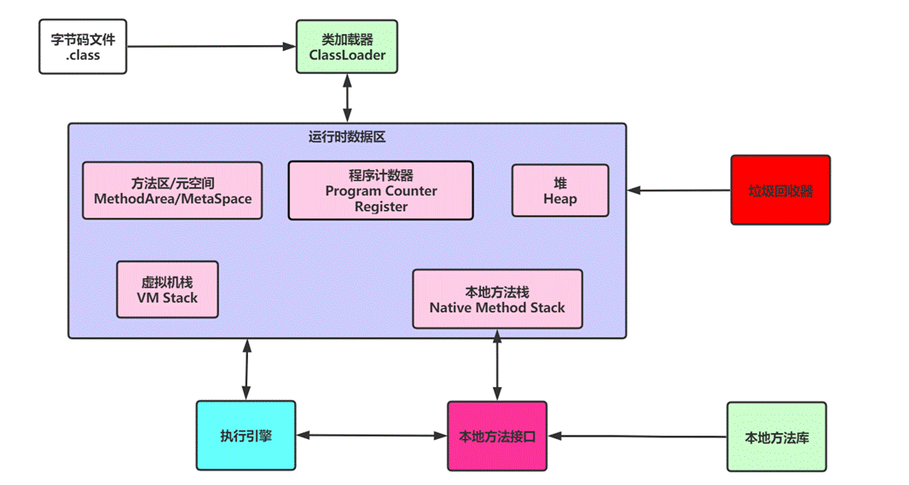

- 类加载器：用于装载字节码文件(.class文件)
- 运行时数据区：用于分配存储空间
- 执行引擎：执行字节码文件或本地方法
- 垃圾回收器：用于对JVM中的垃圾内容进行回收

## 类加载过程

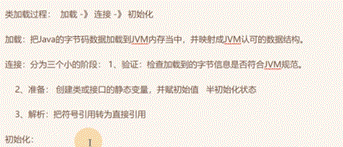

解析：使栈中指针指向堆中变量

初始化：程序员写的初始化代码（自己写的静态代码块）

## 一个对象从加载到JVM，再到被GC清楚，都经历了什么过程？

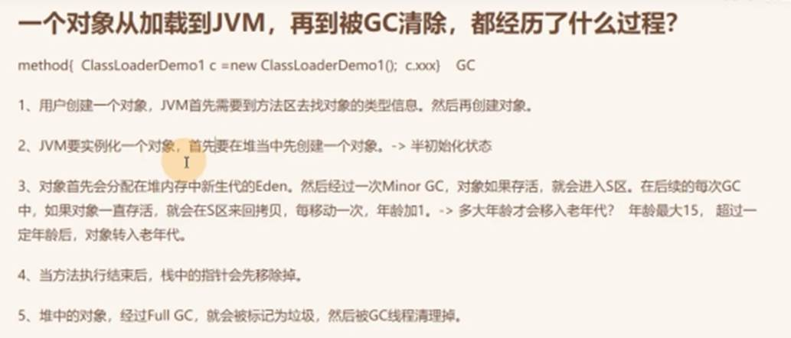

1.中：每一个对象有一个markword，中有一个class point 指向元空间中的class信息

对象有可能分配在栈中，生命周期会很简单

## 类加载器种类

类加载器根据各自加载范围的不同，划分为四种类加载器：

\- **启动类加载器(BootStrap ClassLoader)：**

 该类并不继承ClassLoader类，其是由C++编写实现。用于加载**JAVA_HOME/jre/lib**目录下的类库。

\- **扩展类加载器(ExtClassLoader)：**

 该类是ClassLoader的子类，主要加载**JAVA_HOME/jre/lib/ext**目录中的类库。

\- **应用类加载器(AppClassLoader)：**

 该类是ClassLoader的子类，主要用于加载**classPath**下的类，也就是加载开发者自己编写的Java类。

\- **自定义类加载器：**

 开发者自定义类继承ClassLoader，实现自定义类加载规则。

上述三种类加载器的层次结构如下如下：

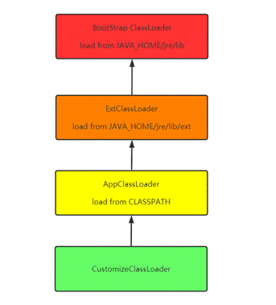

​    类加载器的体系并不是“继承”体系，而是**委派体系**，类加载器首先会到自己的parent中查找类或者资源，如果找不到才会到自己本地查找。类加载器的委托行为动机是为了避免相同的类被加载多次。

## 类加载模型

在JVM中，对于类加载模型提供了三种，分别为全盘加载、双亲委派、缓存机制。

\- **全盘加载：**

​    即当一个类加载器负责加载某个Class时，该Class所依赖和引用的其他Class也将由该类加载器负责载入，除非显示指定使用另外一个类加载器来载入。

\- **双亲委派：**

​    即先让父类加载器试图加载该Class，只有在父类加载器无法加载该类时才尝试从自己的类路径中加载该类。简单来说就是，某个特定的类加载器在接到加载类的请求时，首先将加载任务委托给父加载器，依次递归，如果父加载器可以完成类加载任务，就成功返回；只有父加载器无法完成此加载任务时，才自己去加载。

\- **缓存机制：**

​    会保证所有加载过的Class都会被缓存，当程序中需要使用某个Class时，类加载器先从缓存区中搜寻该Class，只有当缓存区中不存在该Class对象时，系统才会读取该类对应的二进制数据，并将其转换成Class对象，存入缓冲区中。从而可以理解为什么修改了Class后，必须重新启动JVM，程序所做的修改才会生效的原因。

双亲委派解析

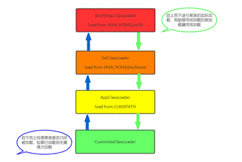

Ext是App的父加载器，Boot是ext的父加载器   并不是父类，并不是继承关系

J**VM**为什么采用双亲委派机制

1）通过双亲委派机制可以避免某一个类被重复加载，当父类已经加载后则无需重复加载，保证唯一性。

2）为了安全，保证类库API不会被修改

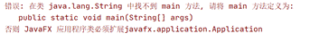

出现该信息是因为由双亲委派的机制，java.lang.String的在启动类加载器(Bootstrap classLoader)得到加载，因为在核心jre库中有其相同名字的类文件，但该类中并没有main方法。这样就能防止恶意篡改核心API库。

## 自定义类加载器

​    对于自定义类加载器的实现也是很简单，只需要继承ClassLoader类，覆写findClass方法即可。编写一个测试实体类，接着生成该类的字节码文件。当存在.java文件时，根据双亲委派机制，显示当前类加载器为AppClassLoader，而当将.java文件删除时，则显示使用的是自定义的类加载器。

# 垃圾回收机制

## **java**的GC与内存泄漏

Java有了GC为什么还会出现内存泄漏问题？

1. 静态集合类泄漏

静态集合类像HashMap，Vector等的使用最容易出现内存泄漏，静态变量的声明周期与应用程序一直，所有的对象Object也不能内释放，因为被其他对象引用着。

2. 单例造成的泄漏

单例对象在初始化后将在JVM的整个生命周期中存在（以静态变量的方式），如果单例对象持有外部的引用，那么这个对象将不能被JVM正常回收，导致内存泄漏。

3. 各种连接

数据库连接，网络连接，IO连接等没有显式调用close()关闭，会导致内存泄漏。

4. 监听器的使用

在释放对象的同时，没有删除相应监听器，也会造成内存泄漏。

在Java语言中，GC Root包括以下几种对象：

1. 虚拟机栈中引用的对象
2. 本地方法栈中JNI引用的对象
3. 方法区中类静态成员变量引用的对象
4. 方法区中常量引用的对象

## 垃圾定位

### 引用计数法

1. 引用计数法

​    一个对象被引用了一次，在当前的对象头上递增一次引用次数，如果这个对象的引用次数为0，代表这个对象可回收

循环引用的话，则引用计数法就会失效

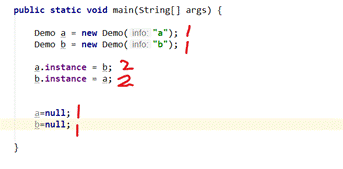

虽然a和b都为null，但是由于a和b存在循环引用，这样a和b永远都不会被回收。

优点：

- 实时性较高，无需等到内存不够的时候，才开始回收，运行时根据对象的计数器是否为0，就可以直接回收。
- 在垃圾回收过程中，应用无需挂起。如果申请内存时，内存不足，则立刻报OOM错误。
- 区域性，更新对象的计数器时，只是影响到该对象，不会扫描全部对象。

缺点：

- 每次对象被引用时，都需要去更新计数器，有一点时间开销。 
- **浪费**CPU资源，即使内存够用，仍然在运行时进行计数器的统计。
- **无法解决循环引用问题，会引发内存泄露**。（最大的缺点） 

### 可达性分析算法

会存在一个根节点【GC Roots】，引出它下面指向的下一个节点，再以下一个节点节点开始找出它下面的节点，依次往下类推。直到所有的节点全部遍历完毕。

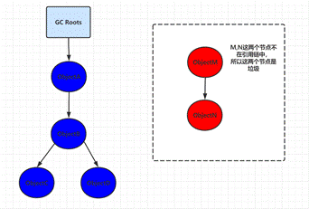

​    M,N这两个节点是可回收的，但是**并不会马上的被回收！！** 对象中存在一个方法【finalize】。当对象被标记为可回收后，当发生GC时，首先**会判断这个对象是否执行了finalize方法**，如果这个方法还没有被执行的话，那么就会先来执行这个方法，接着在这个方法执行中，可以设置当前这个对象与GC ROOTS产生关联，那么这个方法执行完成之后，GC会再次判断对象是否可达，如果仍然不可达，则会进行回收，如果可达了，则不会进行回收。

​    finalize方法对于每一个对象来说，只会执行一次。如果第一次执行这个方法的时候，设置了当前对象与RC ROOTS关联，那么这一次不会进行回收。 那么等到这个对象第二次被标记为可回收时，那么该对象的finalize方法就不会再次执行了。

GC ROOTS：

​    **虚拟机栈中引用的对象**

​    **本地方法栈中引用的对象**

​    **方法区中类静态属性引用的对象**

​    **方法区中常量引用对象**

## 垃圾回收算法 

### 标记清除算法

标记清除算法，是将垃圾回收分为2个阶段，分别是**标记和清除**。

1. 根据可达性分析算法得出的垃圾进行标记

2. 对这些标记为可回收的内容进行垃圾回收

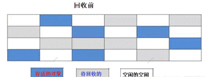

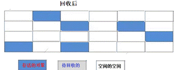

可以看到，标记清除算法解决了引用计数算法中的循环引用的问题，没有从root节点引用的对象都会被回收。

同样，标记清除算法也是有缺点的：

- 效率较低，**标记和清除两个动作都需要遍历所有的对象**，并且在GC时，**需要停止应用程序**，对于交互性要求比较高的应用而言这个体验是非常差的。
- （**重要**）通过标记清除算法清理出来的内存，碎片化较为严重，因为被回收的对象可能存在于内存的各个角落，所以清理出来的内存是不连贯的。

### 复制算法

新生代的垃圾回收算法：大部分对象都不会存活，所以在新生代中使用复制算法较为高效

复制算法的核心就是，**将原有的内存空间一分为二，每次只用其中的一块**，在垃圾回收时，将正在使用的对象复制到另一个内存空间中，然后将该内存空间清空，交换两个内存的角色，完成垃圾的回收。

如果内存中的垃圾对象较多，需要复制的对象就较少，这种情况下适合使用该方式并且效率比较高，反之，则不适合。 

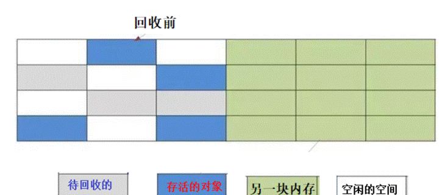

1）将内存区域分成两部分，每次操作其中一个。

2）当进行垃圾回收时，将正在使用的内存区域中的存活对象移动到未使用的内存区域。当移动完对这部分内存区域一次性清除。

3）周而复始。

优点：

\- 在垃圾对象多的情况下，效率较高

\- 清理后，内存无碎片

缺点：

\- 分配的2块内存空间，在同一个时刻，只能使用一半，内存使用率较低

### 标记整理算法

老年代的垃圾回收算法：大部分对象可能会继续存活下去

标记压缩算法是在标记清除算法的基础之上，做了优化改进的算法。和标记清除算法一样，也是从根节点开始，对对象的引用进行标记，在清理阶段，并不是简单的直接清理可回收对象，而是将存活对象都向内存另一端移动，然后清理边界以外的垃圾，从而解决了碎片化的问题。

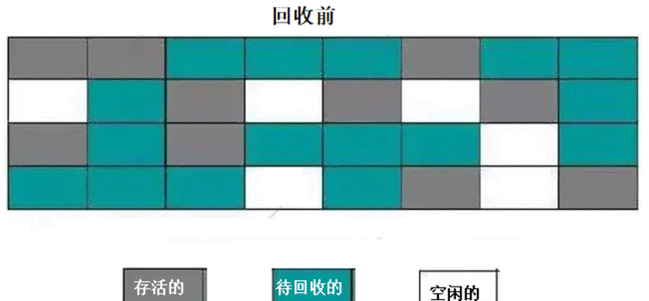

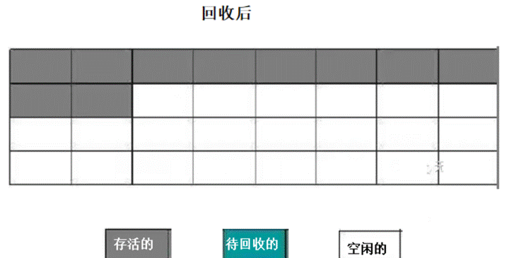

1）标记垃圾。

2）需要清除向右边走，不需要清除的向左边走。

3）清除边界以外的垃圾。

优缺点同标记清除算法（标记需要遍历所有的对象，并且在GC时，需要停止应用程序），解决了标记清除算法的碎片化的问题，同时，标记压缩算法多了一步，对象移动内存位置的步骤，其效率也有有一定的影响。

### 分代收集算法

在java8时，堆被分为了两份：**新生代和老年代【****1****：****2****】**，在java7时，还存在一个永久代。

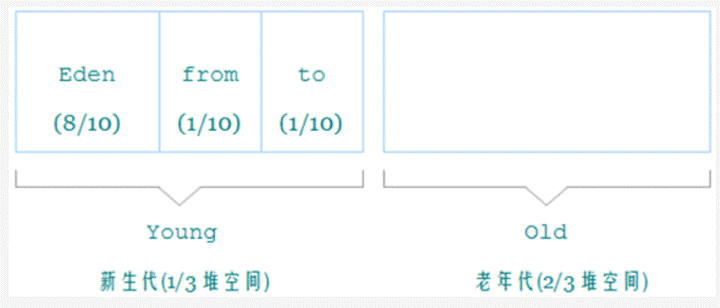

对于新生代，内部又被分为了三个区域。Eden区，S0区，S1区【8：1：1】

当对新生代产生GC：MinorGC【young GC】

当对老年代产生GC：FullGC【OldGC】

3.2.4.1 工作机制

1）当创建一个对象的时候，那么这个对象会被分配在新生代的Eden区。当Eden区要满了时候，触发YoungGC。

2）当进行YoungGC后，此时在Eden区存活的对象被移动到S0区，并且**当前对象的年龄会加**1，清空Eden区。

3）当再一次触发YoungGC的时候，会把Eden区中存活下来的对象和S0中的对象，移动到S1区中，这些对象的年龄会加1，清空Eden区和S0区。

4）当再一次触发YoungGC的时候，会把Eden区中存活下来的对象和S1中的对象，移动到S0区中，这些对象的年龄会加1，清空Eden区和S1区。

3.2.4.2 对象何时晋升到老年代

1）对象的年龄达到了某一个限定的值（**默认****15****岁**，CMS默认6岁 ），那么这个对象就会进入到老年代中。

2）大对象。

3）如果在Survivor区中相同年龄的对象的所有大小之和超过Survivor空间的一半，年龄大于或等于该年龄的对象就可以直接进入老年代。

当老年代满了之后，**触发**FullGC**。**FullGC同时回收新生代和老年代，当前只会存在一个FullGC的线程进行执行，其他的线程全部会被挂起。

# 垃圾收集器

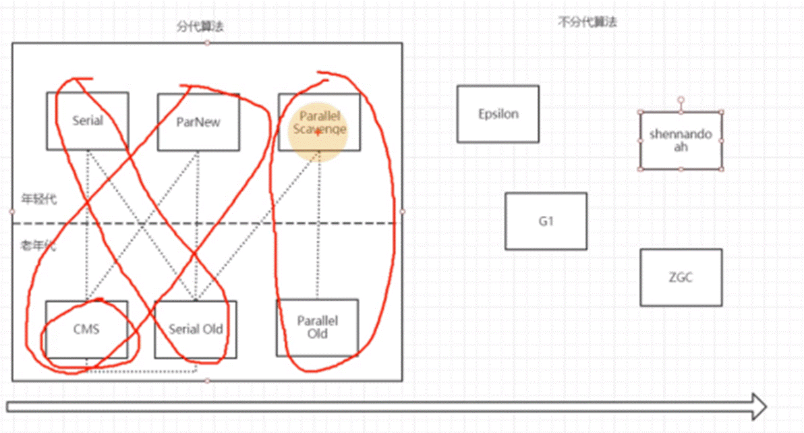

## 串行垃圾收集器

1. Serial收集器

​    **串行垃圾收集器**，作用于**新生代**。是指使用单线程进行垃圾回收，**采用复制算法**。垃圾回收时，只有一个线程在工作，并且java应用中的所有线程都要暂停，等待垃圾回收的完成。这种现象称之为STW（Stop-The-World）。**其应用在年轻代**

​    对于交互性较强的应用而言，这种垃圾收集器是不能够接受的。因此一般在Javaweb应用中是不会采用该收集器的。

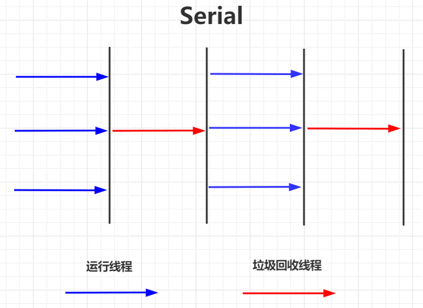

2. **Serial Old**收集器

​    其是运行于**老年代的单线程**Serial收集器，**采用标记****-****整理算法**，主要是给Client模式下的虚拟机使用。

## 并行垃圾收集器

1. ParallelNew收集器

  并行垃圾收集器在串行垃圾收集器的基础之上做了改进，**采用复制算法**。将单线程改为了多线程进行垃圾回收，这样可以缩短垃圾回收的时间。（这里是指，并行能力较强的机器）。但是对于其他的行为（收集算法、stop the world、对象分配规则、回收策略等）同Serial收集器一样。其也是应用在年轻代。**JDK8默认使用此垃圾回收器**

​    当然了，并行垃圾收集器在收集的过程中也会暂停应用程序，这个和串行垃圾回收器是一样的，只是并行执行，速度更快些，暂停的时间更短一些。

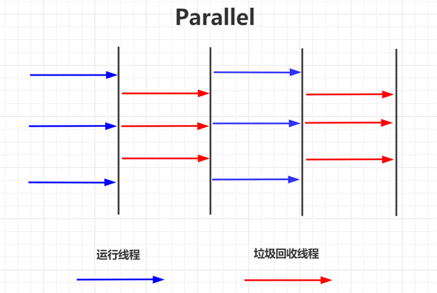

2. Parallel Scavenge收集器

​    其是一个应用于**新生代**的**并行**垃圾回收器，**采用复制算法**。它的目标是达到一个可控的吞吐量（吞吐量=运行用户代码时间 /（运行用户代码时间+垃圾收集时间））即虚拟机总共运行了100分钟，其中垃圾收集花掉1分钟，吞吐量就是99%。这样可以高效率的利用CPU时间，尽快完成程序的运算任务，适合在后台运算而不需要太多交互的任务。

\- 停顿时间越短对于需要与用户交互的程序来说越好，良好的响应速度能提升用户的体验。

\- 高吞吐量可以最高效率地利用CPU时间，尽快地完成程序的运算任务，主要适合在后台运算而不太需要太多交互的任务。

3. Parallel Old收集器

​    其是一个应用于老年代的并行垃圾回收器，**采用标记-整理算法**。在注重吞吐量及CPU资源敏感的场合，都可以优先考虑Parallel Scavenge+Parallel Old收集器。

## CMS（并发）垃圾收集器

CMS全称 Concurrent Mark Sweep，是一款**并发**的、使用**标记-清除**算法的垃圾回收器，该回收器是**针对老年代垃圾回收的**，是一款以获取最短回收停顿时间为目标的收集器，停顿时间短，用户体验就好。**其最大特点是在进行垃圾回收时，应用仍然能正常运行。** 

CMS垃圾回收器的执行过程如下：

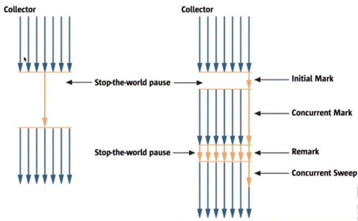

1)初始标记(Initial Mark)：仅仅标记GC Roots能直接关联到的对象，速度快，但是需要“Stop The World”

2)并发标记(Concurrent Mark)：就是进行追踪引用链的过程，可以和用户线程并发执行。

3)重新标记(Remark)：修正并发标记阶段因用户线程继续运行而导致标记发生变化的那部分对象的标记记录，比初始标记时间长但远比并发标记时间短，需要“Stop The World”

4)并发清除(Concurrent Sweep)：清除标记为可以回收对象，可以和用户线程并发执行

​    由于整个过程耗时最长的并发标记和并发清除都可以和用户线程一起工作，所以总体上来看，CMS收集器的内存回收过程和用户线程是并发执行的。

三个CMS收集器缺点：

\- 对CPU资源敏感：

​    并发收集虽然不会暂停用户线程，但因为占用CPU资源，仍会导致系统吞吐量降低、响应变慢

​    CMS的默认收集线程数量是=(CPU数量+3)/4。当CPU数量多于4个，收集线程占用的CPU资源多于25%，对用户程序影响可能较大；不足4个时，影响更大，可能无法接受。

\- 无法处理浮动垃圾：

​    所谓浮动垃圾即在并发清除时，用户线程新产生的垃圾叫浮动垃圾。并发清除时需要预留一定的内存空间，不能像其他收集器在老年代几乎填满再进行收集。如果CMS预留内存空间无法满足程序需要，就会出现一次"Concurrent Mode Failure"失败。这时JVM启用后备预案：临时启用Serail Old收集器，而导致另一次Full GC的产生。

\- 垃圾回收算法导致内存碎片：

​    因为CMS收集器采用标记-清除算法，因此会导致垃圾从内存中被清除后，会出现内存空间碎片化。这样会导致分配大内存对象时，无法找到足够的连续内存，从而需要提前触发另一次Full GC动作。

## G1垃圾收集器

 概述

对于垃圾回收器来说，前面的三种要么一次性回收年轻代，要么一次性回收老年代。而且现代服务器的堆空间已经可以很大了。为了更加优化GC操作，所以出现了G1。

​    它是一款**同时应用于新生代和老年代、采用标记-整理算法、软实时、低延迟、可设定目标(最大STW停顿时间)**的垃圾回收器，用于代替CMS，适用于较大的堆(>4~6G)，**在JDK9之后默认使用G1**。

G1的设计原则就是简化JVM性能调优，开发人员只需要简单的三步即可完成调优：

1. 第一步，开启G1垃圾收集器

2. 第二步，设置堆的最大内存

3. 第三步，可设定目标，设置最大的停顿时间（stw）默认是250ms

### G1的内存布局

G1垃圾收集器相对比其他收集器而言，最大的区别在于它**取消了年轻代、老年代的物理划分**。

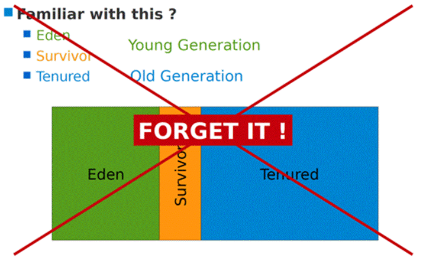

​    取而代之的是将堆划分为**若干个区域（Region）**，这些区域中包含了有**逻辑上的年轻代、老年代区域**。这样做的好处就是，我们再也不用单独的空间对每个代进行设置了，不用担心每个代内存是否足够。

​    此时可以看到，现在出现了一个**新的区域**Humongous，它本身属于老年代区。当现在出现了一个巨大的对象，超出了分区容量的一半，则这个对象会进入到该区域。如果一个H区装不下一个巨型对象，那么G1会寻找连续的H分区来存储。为了能找到连续的H区 ，有时候不得不启动Full GC。

​    同时G1会估计每个Region中的垃圾比例，优先回收垃圾较多的区域。

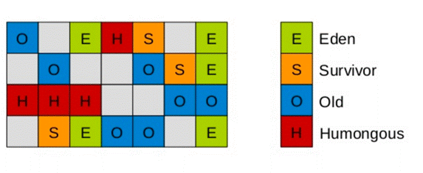

​    在G1划分的区域中，年轻代的垃圾收集依然采用**暂停所有应用线程的方式**，将存活对象拷贝到老年代或者Survivor空间，G1收集器通过将**对象从一个区域复制到另外一个区域，完成了清理工作**。

​    这就意味着，在正常的处理过程中，G1完成了堆的压缩（至少是部分堆的压缩），这样也就不会有cms内存碎片问题的存在了。

### 垃圾回收基本概念

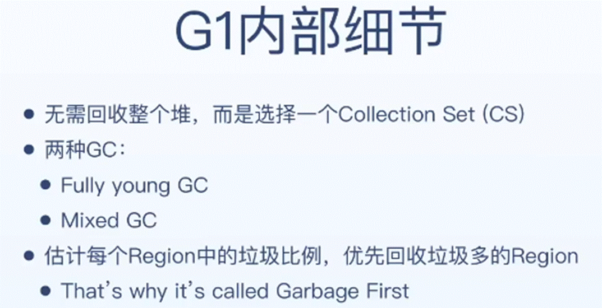

Collection Set回收集合

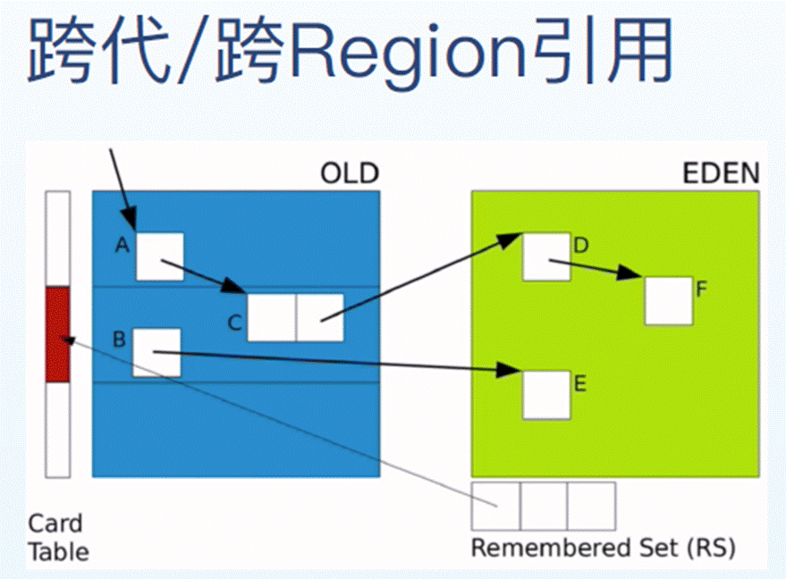

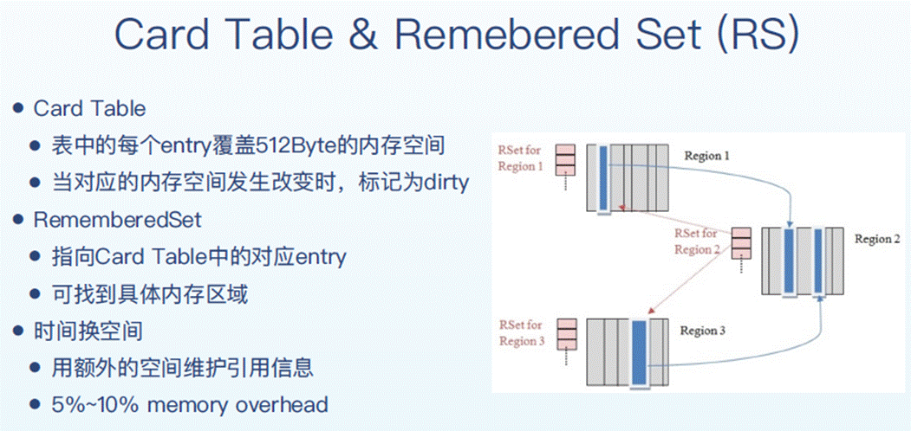

card table：一个region又划分为一个一个区域

对应内存空间发生改变：比如给空间中的引用赋值的时候，就会把这个区域标记为dirty

rememberedSet：region2中的rememberedSet就记录着指向region1部分，因为region1中存在着指向region2的引用，通过rememberedSet就能找到region1

时间换空间：因为现代堆空间很大，所以是值得的

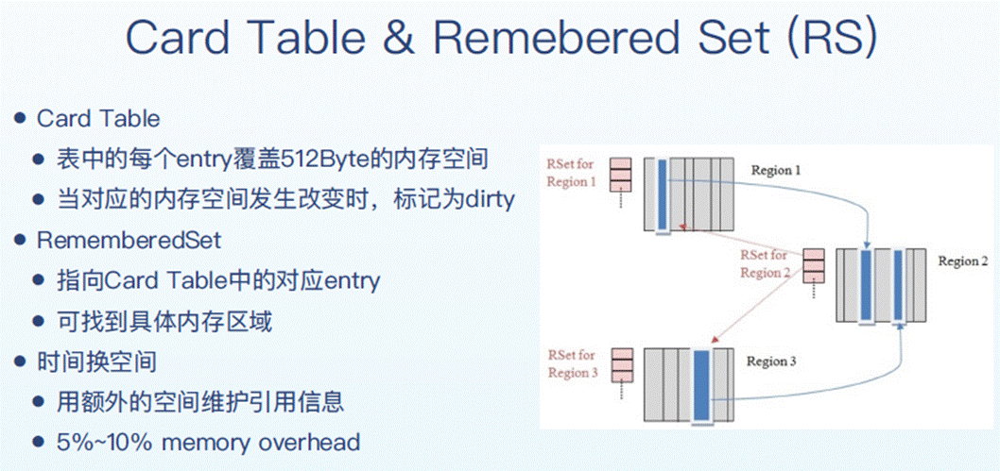

更新指针时：引用发生变化时

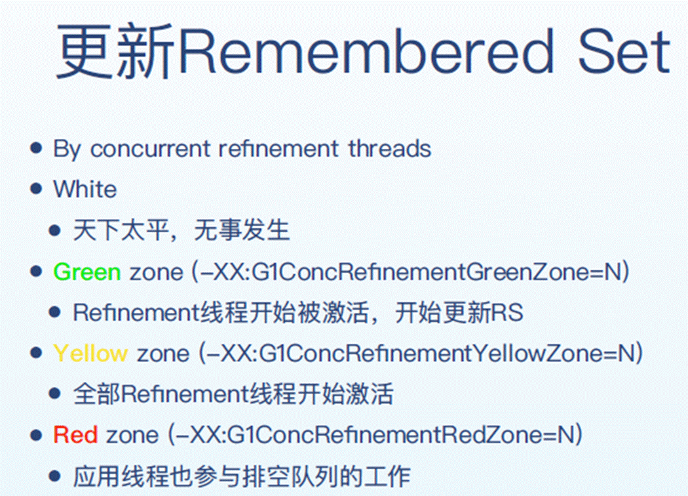

refinement线程：优化线程

更新RS：region1中存在引用指向region2的对象，这时更新的是region2的RS

三种模式垃圾回收模式： **young GC、Mixed GC、Full GC**。在不同的条件下被触发。

### Young GC

发生在年轻代的GC算法，一般对象（除了巨型对象）都是在eden region（区）中分配内存，当所有eden region被耗尽无法申请内存时，就会触发一次young gc，这种触发机制和之前的young gc差不多，执行完一次young gc，活跃对象会被拷贝到survivor region或者晋升到old region中，空闲的region会被放入空闲列表中，等待下次被使用。

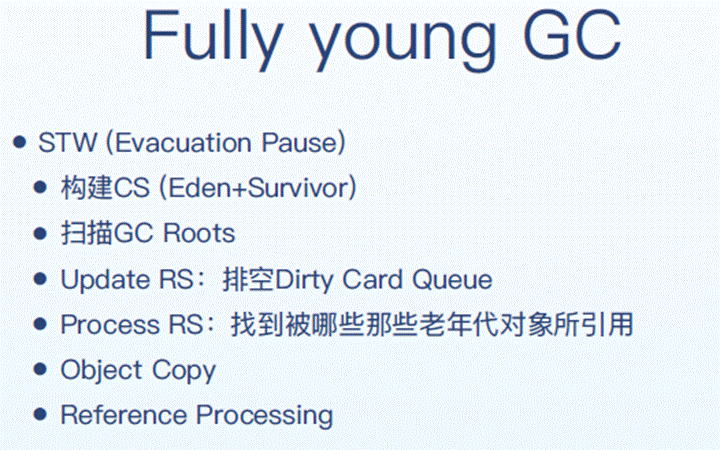

fully young GC：完全的年轻代GC

Evacuation：疏散    构建CS：构建回收集合

Object Copy：把Eden和Survivor区中的对象复制到另一个Survivor区

update RS的目的就是把R set中更新成最新的状态，知道哪些老年代的引用指向了该对象，因为要进行复制算法

为什么年轻代一般都使用的copy

(1) 年轻代 回收效率高 

(2) 年轻代 一般不会很大 

以上2点其实都是根据它的特点来的: 朝生夕死.

使用copy的原因是 它快, 不需要额外的压缩, 没有碎片. 它的缺点就是空间利用率会低一些. 但是本身年轻代不会太大, 所以这个缺点也就不是很严重。

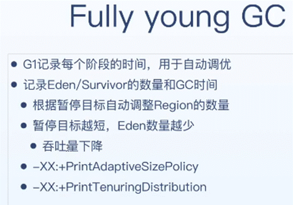

程序员设置的GC时间如果十分严格，G1实在达不到，就会减少年轻代Region数量，也会减少暂停时间，如果太频繁进行GC，那么CPU占用就会增加，造成吞吐量降低。

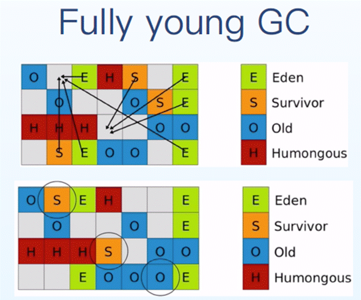

### Mixed GC（OldGC）

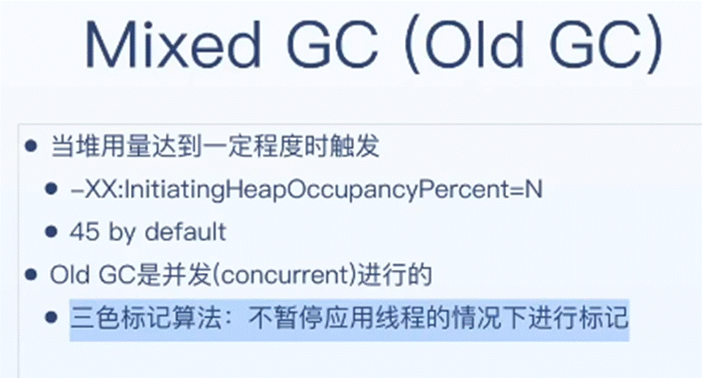

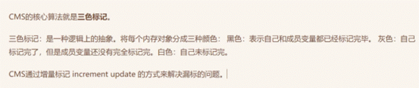

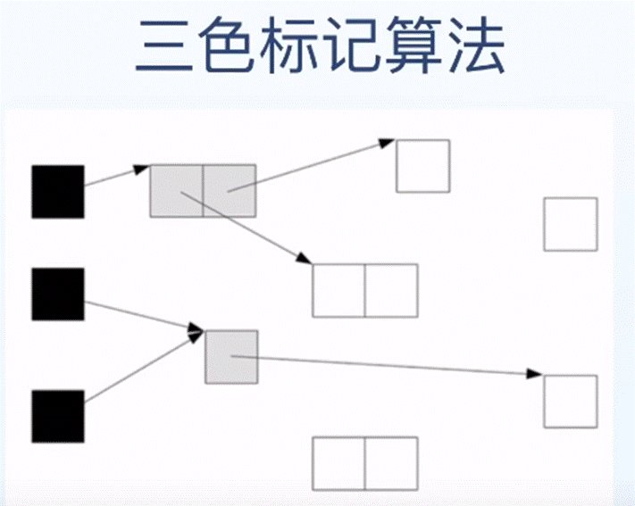

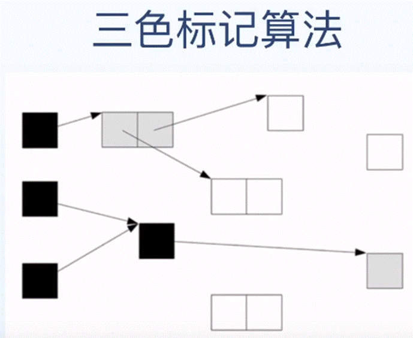

首先把GCROOT标为黑色，将与GCROOT相连的对象标为灰色，灰色放进一个队列，然后挨个取出来，标记为黑色，并把与这个相连的标记为灰色，直到所以都为黑的

错标记和漏标记的问题如下：

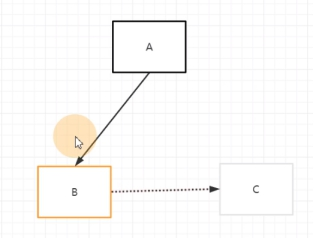

A：黑色 B：灰色    C：白色

在并发标记阶段，引用可能发生了变化：这样的话C永远都标记不到，会被回收，因为A是黑色表示自己和成员变量都被标记了，但C确实没有被标记

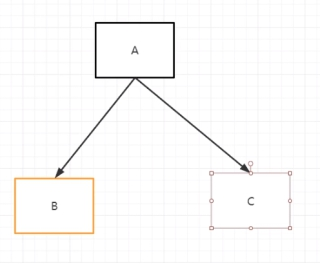

解决方法：

把A标为灰色：并发标记时把A变为灰色

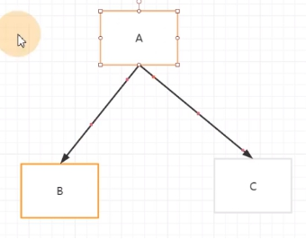

G1的解决方案：

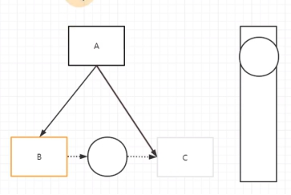

提供了一个快照，保存了没有被标记的region

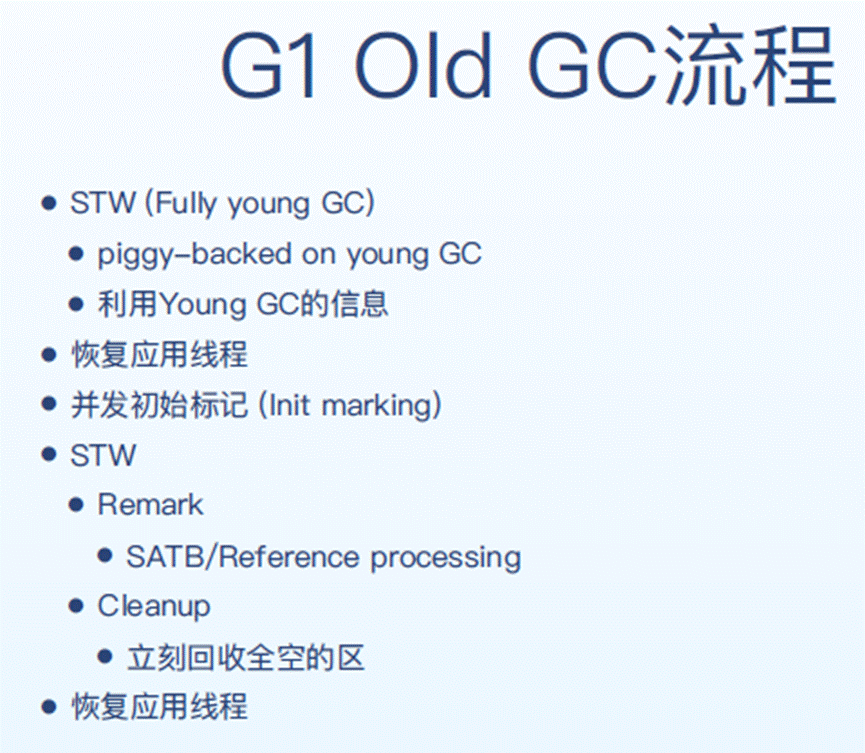

piggy-backed on young GC 骑在young GC的头上，表明old GC里包含young GC

当越来越多的对象晋升到老年代old region时，为了避免堆内存被耗尽，虚拟机会触发一个混合的垃圾收集器，即**mixed gc**，该算法并不是一个old gc，除了回收整个young region，还会回收一部分的old region，这里需要注意：**是一部分老年代，而不是全部老年代**，可以选择哪些old region进行收集，从而可以对垃圾回收的耗时时间进行控制。

在CMS中，当老年代的使用率达到80%就会触发一次cms gc。在G1中，mixed gc也可以通过-XX:InitiatingHeapOccupancyPercent设置阈值，**默认为**45%。当老年代大小占整个堆大小百分比达到该阈值，则触发mixed gc。

其执行过程和cms类似：

1. initial mark: 初始标记过程，整个过程STW，标记了从GC     Root可达的对象。
2. concurrent marking: 并发标记过程，整个过程gc     collector线程与应用线程可以并行执行，标记出GC Root可达对象衍生出去的存活对象，并收集各个Region的存活对象信息。
3. remark: 最终标记过程，整个过程STW，标记出那些在并发标记过程中遗漏的，或者内部引用发生变化的对象。（保证安全的标记，保证找到的对象都是活对象）
4. clean up: 垃圾清除过程，不进行老年代垃圾回收的拷贝，如果发现一个Region中没有存活对象，则把该Region加入到空闲列表中。
5. 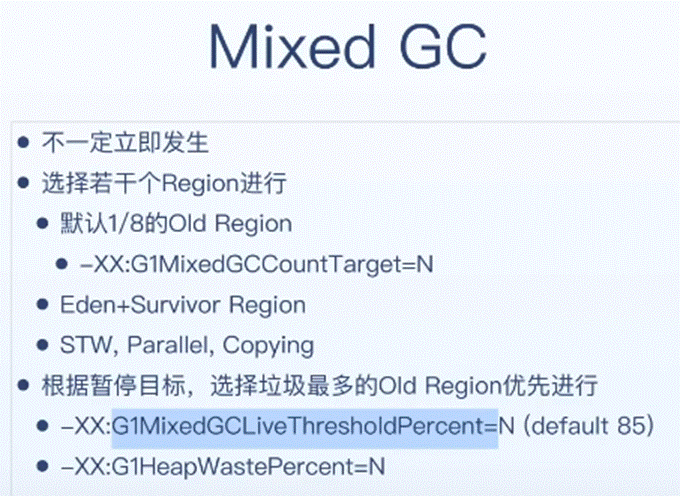

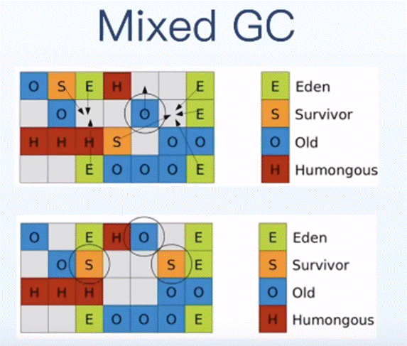

###  Full GC

如果对象内存分配速度过快，mixed gc来不及回收，导致老年代被填满，就会触发一次full gc，G1的full gc算法就是单线程执行的serial old gc，会导致异常长时间的暂停时间，需要进行不断的调优，尽可能的避免full gc.

为何这么多垃圾回收器：因为内存不断扩大，回收越来越复杂

### G1的最佳实践

**不断调优暂停时间指标**

 通过**XX:MaxGCPauseMillis=x**可以设置启动应用程序暂停的时间，G1在运行的时候会根据这个参数选择CSet来满足响应时间的设置。一般情况下这个值设置到100ms或者200ms都是可以的(不同情况下会不一样)，但如果设置成50ms就不太合理。暂停时间设置的太短，就会导致出现G1跟不上垃圾产生的速度。最终退化成Full GC。所以对这个参数的调优是一个持续的过程，逐步调整到最佳状态。

**不要设置新生代和老年代的大小**

 G1收集器在运行时候会调整新生代和老年代的大小。通过改变代的大小来调整对象晋升的速度以及晋升年龄，从而达到我们为收集器设置的暂停时间目标。设置了新生代大小相当于放弃了G1为我们做的自动调优。我们需要做的只是设置整个堆内存的大小，剩下的交给G1自己去分配各个代的大小。

## G1相对CMS的优势

G1相对CMS的优势：

1. G1在压缩空间方面有优势。

2. G1通过将内存空间分成区域（Region）的方式避免内存碎片的问题。

3. Eden、Survivor、Old区不再固定，在内存使用效率上来说更灵活。

4. G1可以通过设置预期停顿时间（Pause Time）来控制垃圾收集时间，避免应用雪崩现象。

5. G1在回收内存后会马上同时做合并空闲内存的工作，而CMS默认是在STW(stop the world)的时候做。

6. G1会在young GC中使用，而CMS只能在老年代中使用。

G1适合的场景：

1. 服务端多核CPU、JVM内存占用较大的应用。

2. 应用在运行过程中会产生大量的内存碎片，需要经常压缩空间。

3. 想要更可控、可预期的GC停顿周期；防止高并发下应用的雪崩现象。

## **ZGC**

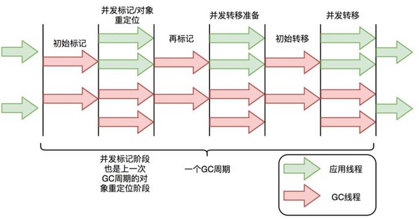

ZGC只有三个STW阶段：**初始标记**，**再标记**，**初始转移**。其中，初始标记和初始转移分别都只需要扫描所有GC Roots，其处理时间和GC Roots的数量成正比，一般情况耗时非常短；再标记阶段STW时间很短，最多1ms，超过1ms则再次进入并发标记阶段。即，ZGC几乎所有暂停都只依赖于GC Roots集合大小，停顿时间不会随着堆的大小或者活跃对象的大小而增加。与ZGC对比，G1的转移阶段完全STW的，且停顿时间随存活对象的大小增加而增加。

ZGC通过着色指针和读屏障技术，解决了转移过程中准确访问对象的问题，实现了并发转移。大致原理描述如下：并发转移中“并发”意味着GC线程在转移对象的过程中，应用线程也在不停地访问对象。假设对象发生转移，但对象地址未及时更新，那么应用线程可能访问到旧地址，从而造成错误。而在ZGC中，应用线程访问对象将触发“读屏障”，如果发现对象被移动了，那么“读屏障”会把读出来的指针更新到对象的新地址上，这样应用线程始终访问的都是对象的新地址。那么，JVM是如何判断对象被移动过呢？就是利用对象引用的地址，即着色指针。

https://zhuanlan.zhihu.com/p/170572432

# 开放性问题

系统运行过程中出现fullGC，怎么排查，什么情况出现fullGC

top -- jstate -- map工具

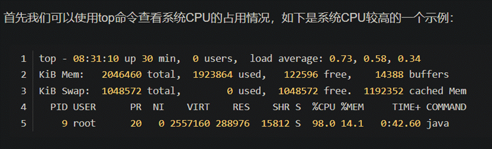

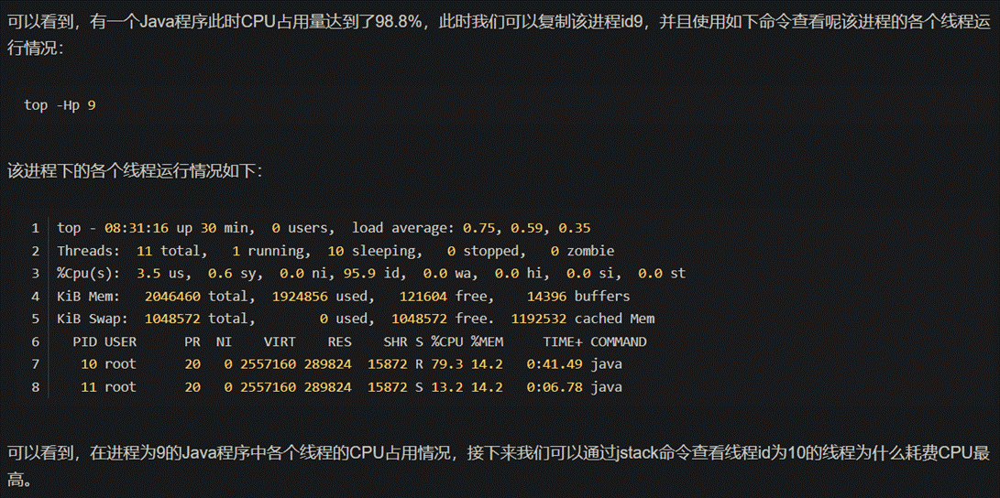

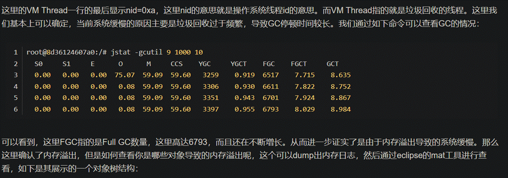

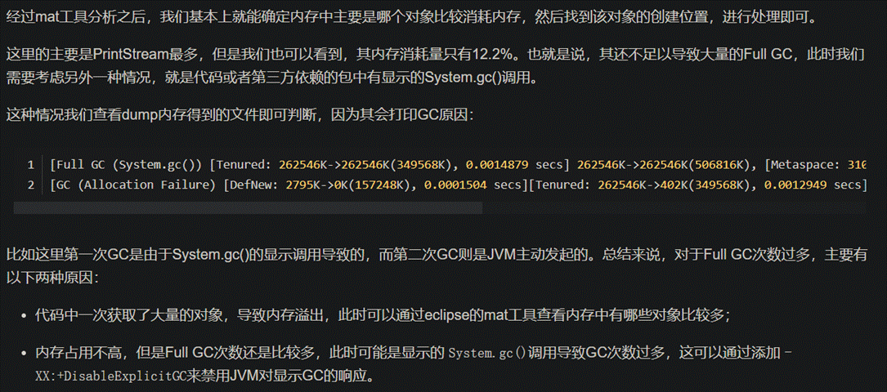

https://blog.csdn.net/xiaoxiaole0313/article/details/104285018/

# 零星知识

## 指针碰撞和空闲列表

假设Java堆中内存是绝对规整的，所有用过的内存都放在一边，空闲的内存放在另一边，中间放着一个指针作为分界点的指示器，那所分配内存就仅仅是把那个指针向空闲空间那边挪动一段与对象大小相等的距离，这种分配方式称为“指针碰撞”（Bump thePointer）。如果Java堆中的内存并不是规整的，已使用的内存和空闲的内存相互交错，那就没有办法简单地进行指针碰撞了，虚拟机就必须维护一个列表，记录上哪些内存块是可用的，在分配的时候从列表中找到一块足够大的空间划分给对象实例，并更新列表上的记录，这种分配方式称为“空闲列表”（FreeList） 

## 内存分配担保机制

在现实社会中，借款会指定担保人，就是当借款人还不起钱，就由担保人来还钱。

在JVM的内存分配时，也有这样的**内存分配担保机制**。就是当在新生代无法分配内存的时候，把新生代的对象转移到老生代，然后把新对象放入腾空的新生代。

# 比较好的博客

Java GC（垃圾回收机制）面试讲解

**总结的较好：** https://www.cnblogs.com/dmzna/p/12913458.html

**讲的较细：** https://www.cnblogs.com/leesf456/p/5218594.html