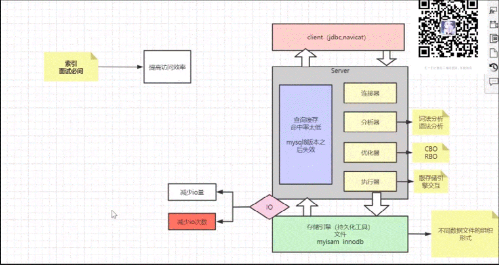

# MVCC

已提交读的readview：每次生成最新的    可重复读的readview：沿用事务中上一次的

事务只有在update的时候才能生成事务id，select的时候，比对规则是针对版本链中的id是否符合比对规则

同一时刻不同事务中同样的查询语句可能查到不同的数据（select1中和select2中最后一条语句）

下面是对于删除情况的说明，并且是对于select2的说明

删除数据数据库文件并未变小

# 索引

## 索引类型

https://www.jianshu.com/p/bf30c2b9a0cf

### 聚集索引 -聚簇索引

聚簇索引（聚集索引）：聚簇索引是一种数据存储方式，InnoDB的聚簇索引就是按照主键顺序构建 B+Tree结构。B+Tree 的叶子节点就是行记录，行记录和主键值紧凑地存储在一起。 这也意味着 InnoDB 的主键索引就是数据表本身，它按主键顺序存放了整张表的数据，占用的空间就是整个表数据量的大小。通常说 的**主键索引**就是聚集索引。

InnoDB的表要求必须要有聚簇索引：

（1）如果表定义了主键，则主键索引就是聚簇索引

（2）如果表没有定义主键，则第一个非空unique列作为聚簇索引

（3）否则InnoDB会从建一个隐藏的row-id作为聚簇索引

### 辅助索引

InnoDB辅助索引，也叫作二级索引，是根据索引列构建 B+Tree结构。但在 B+Tree 的叶子节点中只存了索引列和主键的信息。二级索引占用的空间会比聚簇索引小很多， 通常创建辅助索引就是为了提升查询效率。一个表InnoDB只能创建一个聚簇索引，但可以创建多个辅助索引。

与InnoDB表存储不同，MyISAM数据表的索引文件和数据文件是分开的，被称为非聚簇索引结 构。

### 覆盖索引回表

所有列建索引是不是查询更快，不是的，粒度会太小，索引的维护成本会增加，在索引上的操作会变多

### 唯一索引和非唯一索引（普通索引）

- 唯一索引是这样一种索引，它通过确保表中没有两个数据行具有完全相同的键值来帮助维护数据完整性。为包含数据的现有表创建唯一索引时，会检查组成索引键的列或表达式中的值是否唯一。如果该表包含具有重复键值的行，那么索引创建过程会失败。为表定义了唯一索引之后，每当在该索引内添加或更改键时就会强制执行唯一性。此强制执行包括插入、更新、装入、导入和设置完整性以命名一些键。除了强制数据值的唯一性以外，唯一索引还可用来提高查询处理期间检索数据的性能。

- 非唯一索引不用于对与它们关联的表强制执行约束。相反，非唯一索引通过维护频繁使用的数据值的排序顺序，仅仅用于提高查询性能。

### 全文索引

通过建立倒排索引,可以极大的提升检索效率,解决判断字段是否包含的问题. 例如: 有title字段,需要查询所有包含 "政府"的记录. 需要 like "%政府%"方式查询,查询速度慢,当查询包含"政府" OR "中国"的需要是,sql难以简单满足.全文索引就可以实现这个功能.

https://zhuanlan.zhihu.com/p/88275060

## 索引数据结构的选择

二叉树：不适合存储，没有规律，不适合查找

二叉搜索树：虽然可以二分查找，但是插入数据若是升序或降序则时间复杂度则降级为O(N)

AVL:在二叉搜索树的基础上最长子树和最短子树相差不超过1-------查找效率高的，但是插入效率很低，因为平衡条件太严格

红黑树：:最长子树不能超过最短子树的2倍------随着数据的增多，深度越来越深

红黑树就是介于完全不平衡和完全平衡之间的一种二叉树，通过每个节点有红黑两种颜色、从节点到任意叶子节点会经过相同数量的黑色节点等一系列规则，实现了【树的层数最大也只会有两倍的差距】，这样既能提高插入和删除的效率，又能让树相对平衡从而有还不错的查询效率。从整体上讲，红黑树就是一种中庸之道的二叉树。

B树：

一个磁盘块为16KB，假设索引不占空间，只有data占空间，一个data占1KB，那么一个磁盘块能存16条数据，3层B树最多能存16×16×16=4096条数据，远远不够

B+树：

假设p1和28共占10B，磁盘块16kB可以放16*1024/10个数据索引，那么3层总共能放（16*1024/10）*（16*1024/10）*16个数据，所以要用B+树

索引一般B+树层数为3-4层：由数据量决定

两种引擎B+树的区别：

所有文件先开始都在硬盘，加载的时候才在内存

数据只存一份，即使是创建了两个索引，当在普通字段创建索引时，比如下图是在name字段创建索引，叶子节点放的是主键值，还需要到主键B+树中去查找数据

## 简述索引对于数据库性能的影响

优化隐藏：一般地，对查询语句，查询处理器创建了可以提高性能的执行规划。然而，如果对某一个特定的查询语句例如检索、插入、删除、修改，查询处理器没有创建最好的执行规划，那么用户可以在查询语句中增加优化隐藏来影响查询处理器创建出最优的执行规划。优化隐藏就是指在执行查询语句、使用多表连接检索或者指定查询语句操作的对象表时，明确地指出应该使用的查询方法、连接算法或者对表的操作方式。当使用优化隐藏时，一定要认真考虑优化隐藏对性能的影响。在SQL Server 7.0中，提供了三种类型的优化隐藏，即查询优化隐藏、连接优化隐藏和表优化隐藏。https://zhidao.baidu.com/question/39271452.html

## 索引设计原则

## 创建索引时用int类型还是varchar类型

占用空间小就用：若用varchar表示它的长度是多少个字节，如果你的varchar小于4个字节，那么就用varchar，如果varchar大于4个字节，那么就用int。

## 页：最小的逻辑单元

## **最左匹配原则**

本质上第一个字段是有序的，第二个单看是无序的，结合第一个看是有序的（第一个一样的时候，第二个就是有序的）

## **索引下推**

主键递增

递增的话直接向后面追加就好了，不会影响之前的目录结构

**无特殊需求下Innodb建议使用与业务无关的自增ID作为主键**

InnoDB引擎使用聚集索引，数据记录本身被存于主索引（一颗B+Tree）的叶子节点上。这就要求同一个叶子节点内（大小为一个内存页或磁盘页）的各条数据记录按主键顺序存放，因此每当有一条新的记录插入时，MySQL会根据其主键将其插入适当的节点和位置，如果页面达到装载因子（InnoDB默认为15/16），**则开辟一个新的页（节点）**

1. 如果表使用自增主键，那么每次插入新的记录，记录就会顺序添加到当前索引节点的后续位置，当一页写满，就会自动开辟一个新的页。

   这样就会形成一个紧凑的索引结构，近似顺序填满。**由于每次插入时也不需要移动已有数据，因此效率很高，也不会增加很多开销在维护索引上。**

2.  如果使用非自增主键（如果身份证号或学号等），由于每次插入主键的值近似于随机，因此每次新纪录都要被插到现有索引页得中间某个位置

   此时MySQL不得不为了将新记录插到合适位置而移动数据，甚至目标页面可能已经被回写到磁盘上而从缓存中清掉，此时又要从磁盘上读回来，这增加了很多开销，同时频繁的移动、分页操作造成了大量的碎片，得到了不够紧凑的索引结构，后续不得不通过OPTIMIZE TABLE来重建表并优化填充页面。

   在使用InnoDB存储引擎时，如果没有特别的需要，请永远使用一个与业务无关的自增字段作为主键。

## 代理主键与然主键

代理主键是指与业务无关且能唯一标识数据库中记录,一般是数据库自动生成的,比如mysql可以使用auto_increment,Sql2000可以使用identity生成方式,oracle可以使用sequence生成方式 自然主键指业务相关,由用户指定,且能唯一标识数据库中的任意一条记录

## **文件的存储**

MySQL可以不指定主键建表吗，背后的逻辑是什么

如果没有主动设置主键，就会选一个不包含NULL的第一个唯一索引列作为主键列，并把它用作一个聚集索引。如果没有这样的索引就会使用行号生成一个聚集索引，把它当做主键，这个行号6bytes，自增。可以用select _rowid from table来查询

# **mysql**建唯一索引后重复插入会报错，解决方法

insert ignore 能忽略重复数据，只插入不重复的数据。

replace into 和 insert … on duplicate key update，都是替换原有的重复数据，区别在于replace into是删除原有的行后，再插入新行，如有自增id，这个会造成自增id的改变；insert … on duplicate key update在遇到重复行时，会直接更新原有的行，具体更新哪些字段怎么更新，取决于update后的语句。

https://blog.csdn.net/u012660464/article/details/117416047

# 自适应哈希

InnoDB存储引擎会自动对个索引页上的查询进行监控，如果能够通过使用自适应哈希索引来提高查询效率，其便会自动创建自适应哈希索引，不需要开发人员或运维人员进行任何设置操作。自适应哈希索引是对innodb的缓冲池的B+树页进行创建，不是对整张表创建，因此速度很快。

Innodb存储引擎会监控对表上二级索引的查找，如果发现某二级索引被频繁访问(最近连续被访问三次的数据)，二级索引成为热数据，建立哈希索引可以带来速度的提升，自适应哈希索引通过缓冲池的B+树构造而来，因此建立的速度很快。

特点

1. 无序，没有树高

2. 降低对二级索引树的频繁访问资源

   索引树高<=4，访问索引：访问树、根节点、叶子节点

3. 自适应

缺陷

1. hash自适应索引会占用innodb buffer pool；

2. 自适应hash索引只适合搜索等值的查询，如select * from table where index_col='xxx'，而对于其他查找类型，如范围查找，是不能使用的；

3. 极端情况下，自适应hash索引才有比较大的意义，可以降低逻辑读。

   来自 <https://www.cnblogs.com/geaozhang/p/7252389.html>

# innoDB锁算法

InnoDB通过给索引项加锁来实现行锁，如果没有索引，则通过隐藏的聚簇索引来对记录加锁。如果操作不通过索引条件检索数据，InnoDB 则对表中的所有记录加锁，实际效果就和表锁一样。

- 例如一个索引有10,11,13,20这四个值。InnoDB可以根据需要使用Record Lock将10，11，13，20四个索引锁住，也可以使用Gap Lock将(-∞,10)，(10,11)，(11,13)，(13,20)，(20, +∞)五个范围区间锁住。Next-Key Locking类似于上述两种锁的结合，它可以锁住的区间有为(-∞,10]，(10,11]，(11,13]，(13,20]，(20, +∞)，可以看出它即锁定了一个范围，也会锁定记录本身。
       详细： https://zhuanlan.zhihu.com/p/66676020

乐观锁：

乐观锁不是数据库自带的，需要我们自己去实现。乐观锁是指操作数据库时(更新操作)，想法很乐观，认为这次的操作不会导致冲突，在操作数据时，并不进行任何其他的特殊处理（也就是不加锁），而在进行更新后，再去判断是否有冲突了。

通常实现是这样的：在表中的数据进行操作时(更新)，先给数据表加一个版本(version)字段，每操作一次，将那条记录的版本号加1。也就是先查询出那条记录，获取出version字段,如果要对那条记录进行操作(更新),则先判断此刻version的值是否与刚刚查询出来时的version的值相等，如果相等，则说明这段期间，没有其他程序对其进行操作，则可以执行更新，将version字段的值加1；如果更新时发现此刻的version值与刚刚获取出来的version的值不相等，则说明这段期间已经有其他程序对其进行操作了，则不进行更新操作。

# 数据引擎

innodb在5.6版本之后支持全文检索，MyISAM支持全文检索

innodb索引叶子节点直接存放数据，而MyISAM存放地址

# 事务

## Innodb如何实现事务

## 四大特性（ACID）以及实现原理

1. 一致性

从数据库层面，数据库通过原子性、隔离性、持久性来保证一致性。也就是说ACID四大特性之中，C(一致性)是目的，A(原子性)、I(隔离性)、D(持久性)是手段，是为了保证一致性，数据库提供的手段。一致性是事务追求的最终目标，数据库必须要实现AID三大特性，才有可能实现一致性。例如，原子性无法保证，显然一致性也无法保证，除了数据库层面的保障，一致性的实现也需要应用层面进行保障。

2. Mysql怎么保证原子性的？

利用Innodb的undo log。undo log名为回滚日志，是实现原子性的关键，当事务回滚时能够撤销所有已经成功执行的sql语句，他需要记录你要回滚的相应日志信息。undo log记录了这些回滚需要的信息，当事务执行失败或调用了rollback，导致事务需要回滚，便可以利用undo log中的信息将数据回滚到修改之前的样子。

3. Mysql怎么保证隔离性的？

利用的是锁和MVCC机制。至于MVCC,即多版本并发控制(Multi Version Concurrency Control),一个行记录数据有多个版本对快照数据，这些快照数据在undo log中。如果一个事务读取的行正在做DELELE或者UPDATE操作，读取操作不会等行上的锁释放，而是读取该行的快照版本。

4. Mysql怎么保证持久性的？

利用Innodb的redo log。Mysql是先把磁盘上的数据加载到内存中，在内存中对数据进行修改，再刷回磁盘上。如果此时突然宕机，内存中的数据就会丢失。于是，决定采用redo log解决上面的问题。当做数据修改的时候，不仅在内存中操作，还会在redo log中记录这次操作。当事务提交的时候，会将redo log日志进行刷盘(redo log一部分在内存中，一部分在磁盘上)。当数据库宕机重启的时候，会将redo log中的内容恢复到数据库中，再根据undo log和binlog内容决定回滚数据还是提交数据。

采用redo log的好处？

其实好处就是将redo log进行刷盘比对数据页刷盘效率高，具体表现如下

- redo log体积小，毕竟只记录了哪一页修改了啥，因此体积小，刷盘快。
- redo log是一直往末尾进行追加，属于顺序IO。效率显然比随机IO来的快。

https://blog.csdn.net/weixin_30649859/article/details/95897520

## **4**个隔离级别及其实现原理

1. 读未提交（READ UNCOMMITTED）

​    压根儿就不加锁，所以根本谈不上什么隔离效果，可以理解为没有隔离。

2. 读提交 （READ COMMITTED）

​    在RC级别中，数据的读取都是不加锁的，但是数据的写入、修改和删除是需要加锁的。

如果是没有索引的class_name呢？update class_teacher set teacher_id=3 where class_name = ‘初三一班’; 那么MySQL会给整张表的所有数据行的加行锁。

附加：但在实际使用过程当中，MySQL做了一些改进，在MySQL Server过滤条件，发现不满足后，会调用unlock_row方法，把不满足条件的记录释放锁 (违背了二段锁协议的约束)。这样做，保证了最后只会持有满足条件记录上的锁，但是每条记录的加锁操作还是不能省略的。

3. 可重复读 （REPEATABLE READ）

   1. 解决可重复读问题

   ​	在InnoDB中，会在每行数据后添加两个额外的隐藏的值来实现MVCC，这两个值一个记录这行数据何时被创建，另外一个记录这行数据何时过期（或者被删除）。 在实际操作中，存储的并不是时间，而是事务的版本号，每开启一个新事务，事务的版本号就会递增。 在可重读Repeatable reads事务隔离级别下：

    SELECT时，读取创建版本号<=当前事务版本号，删除版本号为空或>当前事务版本号。

    INSERT时，保存当前事务版本号为行的创建版本号

    DELETE时，保存当前事务版本号为行的删除版本号

    UPDATE时，插入一条新纪录，保存当前事务版本号为行创建版本号，同时保存当前事务版本号到原来删除的行

   2. 为了解决当前读中的幻读问题，MySQL事务使用了Next-Key锁:

   ​    Innodb将这段数据分成几个个区间(negative infinity, 5],(5,30],(30,positive infinity)；

   ​    update class_teacher set class_name=‘初三四班’ where teacher_id=30;不仅用行锁，锁住了相应的数据行；同时也在两边的区间，（5,30]和（30，positive infinity），都加入了gap锁。这样事务B就无法在这个两个区间insert进新数据。行锁防止别的事务修改或删除，GAP锁防止别的事务新增，行锁和GAP锁结合形成的的Next-Key锁共同解决了RR级别在写数据时的幻读问题。

   ​    如果使用的是没有索引的字段，比如update class_teacher set teacher_id=7 where class_name=‘初三八班（即使没有匹配到任何数据）’,那么会给全表加入gap锁。同时，它不能像上文中行锁一样经过MySQL Server过滤自动解除不满足条件的锁，因为没有索引，则这些字段也就没有排序，也就没有区间。除非该事务提交，否则其它事务无法插入任何数据。

4. 串行化 （SERIALIZABLE）

​    这个级别很简单，读加共享锁，写加排他锁，读写互斥。使用的悲观锁的理论，实现简单，数据更加安全，但是并发能力非常差。

并发访问的问题还有：丢失更新 当两个或多个事务选择同一行，然后基于最初选定的值更新该行时，会发生丢失更新问题。每个事务都不知道其它事务的存在。最后的更新将重写由其它事务所做的更新，这将导致数据丢失。

例如，两个编辑人员制作了同一文档的电子复本。每个编辑人员独立地更改其复本，然后保存更改后的复本，这样就覆盖了原始文档。最后保存其更改复本的编辑人员覆盖了第一个编辑人员所做的更改。如果在第一个编辑人员完成之后第二个编辑人员才能进行更改，则可以避免该问题。

https://tech.meituan.com/2014/08/20/innodb-lock.html 美团

https://www.cnblogs.com/fengzheng/p/12557762.html 博客

# 三大log日志

## Binlog

**1. Row格式**

此格式不记录sql语句上下文相关信息，仅保存哪条记录被修改。

优点： binlog中可以不记录执行的sql语句的上下文相关的信息，仅需要记录那一条记录被修改成什么了。所以Row格式的日志内容会非常清楚的记录下每一行数据修改的细节。

缺点:所有的执行的语句当记录到日志中的时候，都将以每行记录的修改来记录，这样**可能会产生大量的日志内容**,比如一条update语句或者一条alter语句，修改多条记录，则binlog中每一条修改都会有记录，每条记录都发生改变，那么该表每一条记录都会记录到日志中，这样造成binlog日志量会很大。

**2. Statement格式**

该格式下每一条会修改数据的sql都会记录在binlog中。

优点：不需要记录每一行的变化，减少了binlog日志量，节约了IO，提高性能。它相比row模式能节约很多性能与日志量，具体节约的多少取决于应用的SQL情况。正常同一条记录修改或者插入row格式所产生的日志量还小于Statement产生的日志量，考虑到整表删除等一些大量数据操作，ROW格式会产生大量日志，所以总体来讲statement模式会稍微好一些。

缺点：由于记录的只是执行语句，为了这些语句能在slave上正确运行，因此还必须记录每条语句在执行的时候的一些相关信息，以保证所有语句能在slave得到和在master端执行时候相同的结果。

**3. Mixed格式**

该格式是以上两种level的混合使用，一般的语句修改使用statment格式保存binlog，当statement无法完成主从复制的操作时(涉及一些函数时)，则采用Row格式保存binlog,MySQL会根据执行的每一条具体的sql语句来区分对待记录的日志形式，也就是在Statement和Row之间选择一种.新版本的MySQL中队Row模式也被做了优化，并不是所有的修改都会以Row模式来记录，像遇到表结构变更的时候就会以statement模式来记录。至于update或者delete等修改数据的语句，还是会记录所有行的变更。https://cloud.tencent.com/developer/article/1533697

# SQL调优

## ⼀条SQL语句在MySQL中如何执⾏

MySQL 主要分为 Server 层和引擎层，Server 层主要包括连接器、查询缓存、分析器、优化器、执行器，同时还有一个日志模块（binlog），这个日志模块所有执行引擎都可以共用,redolog 只有 InnoDB 有。

•引擎层是插件式的，目前主要包括，MyISAM,InnoDB,Memory 等。

•SQL 等执行过程分为两类，一类对于查询等过程如下：权限校验---》查询缓存---》分析器---》优化器---》权限校验---》执行器---》引擎

•对于更新等语句执行流程如下：分析器----》权限校验----》执行器---》引擎---redo log prepare---》binlog---》redo log commit

https://mp.weixin.qq.com/s?biz=Mzg2OTA0Njk0OA==&mid=2247485097&idx=1&sn=84c89da477b1338bdf3e9fcd65514ac1&chksm=cea24962f9d5c074d8d3ff1ab04ee8f0d6486e3d015cfd783503685986485c11738ccb542ba7&token=79317275&lang=zh_CN%23rd

​    注：redolog是宕机后数据恢复用的，用来支持事务的，binlog是主从复制的时候用的

![这 里 肯 定 有 同 学 会 问 ， 为 什 么 要 用 两 个 日 志 模 块 ， 用 一 个 日 志 模 块 不 行 吗 ？  这 是 因 为 最 开 始 MySQL 并 没 与 InnoDB 引 擎 〔 InnoDB 引 擎 是 其 他 公 司 以 插 件 形 式 插 入  MySQL 的 〕 ， MySQL 自 带 的 引 擎 是 MylSAM, 但 是 我 们 知 道 redolog 是 InnoDB 引 擎 特 有  的 ， 其 他 存 储 引 擎 都 没 有 ， 这 就 导 致 会 没 有 crash-safe 的 能 力 (crash-safe 的 能 力 即 使 数 据  库 发 生 异 常 重 启 ， 之 前 提 交 的 记 录 都 不 会 丢 失 〕 ， binlog 日 志 只 能 用 来 归 档 。  并 不 是 说 只 用 一 个 日 志 模 块 不 可 以 ， 只 是 InnoDB 引 擎 就 是 通 过 redo log 来 支 持 事 务 的 。  那 么 ， 又 会 有 同 学 问 ， 我 用 两 个 日 志 模 块 ， 但 是 不 要 这 么 复 杂 行 不 行 ， 为 什 么 redolog 要  引 入 prepare 预 提 交 状 态 ？ 这 里 我 们 用 反 证 法 来 说 明 下 为 什 么 要 这 么 做 ？  先 写 redo 10g 直 接 提 交 ， 然 后 写 binlog, 假 设 写 完 redolog 后 ， 机 器 挂 了 ， binlog 日  志 没 有 被 写 入 ， 那 么 机 器 重 启 后 ， 这 台 机 器 会 通 过 redo log 恢 复 数 据 ， 但 是 这 个 时 候  bingog 并 没 有 记 录 该 数 据 ， 后 续 进 行 机 器 备 份 的 时 候 ， 就 会 丢 失 这 一 条 数 据 ， 同 时 主  从 同 步 也 会 丢 失 这 一 条 数 据 。  先 写 binlog, 然 后 %redolog, 假 设 写 完 了 binlog, 机 器 异 常 重 启 了 ， 由 于 没 有 redo  log, 本 机 是 无 法 恢 复 这 一 条 记 录 的 ， 但 是 binlog 又 有 记 录 ， 那 么 和 上 面 同 样 的 道 理 ，  就 会 产 生 数 据 不 一 致 的 情 况 。  如 果 采 用 redo log 两 阶 段 提 交 的 方 式 就 不 一 样 了 ， 写 完 binglog 后 ， 然 后 再 提 交 redo log  就 会 防 止 出 现 上 述 的 问 题 ， 从 而 保 证 了 数 据 的 一 致 性 。 那 么 问 题 来 了 ， 有 没 有 一 个 极 端 的  情 况 呢 ？ 假 设 redolog 处 于 预 提 交 状 态 ， binglog 也 己 经 写 完 了 ， 这 个 时 候 发 生 了 异 常 重 启  会 怎 么 样 呢 ？ 这 个 就 要 依 赖 于 MySQL 的 处 理 机 制 了 ， MySQL 的 处 理 过 程 如 下 ．  · 判 断 redolog 是 否 完 整 ， 如 果 判 断 是 完 整 的 ， 就 立 即 提 交 。  如 果 redolog 只 是 预 提 交 但 不 是 commit 状 态 ， 这 个 时 候 就 会 去 判 断 binlog 是 否 完  整 ， 如 果 完 整 就 提 交 redolog, 不 完 整 就 回 滚 事 务 。  这 样 就 解 决 了 数 据 一 致 性 的 问 题 。 ](MYSQL/clip_image082.gif)

我们该如何进行sql优化呢， 首先我们需要知道，sql优化其实主要是解决查询的优化问题，所以我们先从数据库的查询开始入手，下面这幅图显示了查询的执行路径：

　① 客户端将查询发送到服务器；

　② 服务器检查查询缓存，如果找到了，就从缓存中返回结果，否则进行下一步。

　③ 服务器解析，预处理。

　④ 查询优化器优化查询

　⑤ 生成执行计划，执行引擎调用存储引擎API执行查询

　⑥服务器将结果发送回客户端。

**查询缓存** 在解析一个查询语句之前，如果查询缓存是打开的，那么MySQL会优先检查这个查询是否命中查询缓存中的数据，如果命中缓存直接从缓存中拿到结果并返回给客户端。这种情况下，查询不会被解析，不用生成执行计划，不会被执行。

**语法解析和预处理器** MySQL通过关键字将SQL语句进行解析，并生成一棵对应的“解析树”。MySQL解析器将使用MySQL语法规则验证和解析查询。

**查询优化器** 语法树被校验合法后由优化器转成查询计划，一条语句可以有很多种执行方式，最后返回相同的结果。优化器的作用就是找到这其中最好的执行计划。

**查询执行引擎** 在解析和优化阶段，MySQL将生成查询对应的执行计划，MySQL的查询执行引擎则根据这个执行计划来完成整个查询。最常使用的也是比较最多的引擎是MyISAM引擎和InnoDB引擎。mysql5.5开始的默认存储引擎已经变更为innodb了。

## SQL语句执⾏得很慢的原因有哪些？

1. 大多数情况下很正常，偶尔很慢，则有如下原因

   (1) 数据库在刷新脏页，例如 redo log 写满了需要同步到磁盘。

   (2) 执行的时候，遇到锁，如表锁、行锁。

2. 这条 SQL 语句一直执行的很慢，则有如下原因。

   (1)

​	（2）没有用上索引：例如该字段没有索引；由于对字段进行运算、函数操作导致无法用索引。

​	（3）

​	(4) 数据库选错了索引。

https://mp.weixin.qq.com/s?__biz=Mzg2OTA0Njk0OA==&mid=2247485185&idx=1&sn=66ef08b4ab6af5757792223a83fc0d45&chksm=cea248caf9d5c1dc72ec8a281ec16aa3ec3e8066dbb252e27362438a26c33fbe842b0e0adf47&token=79317275&lang=zh_CN%23rd

![1 、 数 据 库 在 刷 新 脏 页 (flush) 我 也 无 奈 啊  当 我 们 要 往 数 据 库 插 入 一 条 数 据 、 或 者 要 电 新 一 条 数 据 的 时 候 ， 我 们 知 道 数 据 库 会 在 内 存 中 把 对 应 字 段 的 数 据 更  新 了 ， 但 是 电 新 之 后 ， 这 些 更 新 的 字 段 并 不 会 马 上 同 步 持 久 化 到 磁 盘 中 去 ， 而 是 把 汶 些 更 新 的 记 录 写 入 到 red o  log 日 记 中 去 ， 等 到 空 闲 的 时 候 ， 在 通 过 redo log 里 的 日 记 把 最 新 的 数 据 同 步 到 磁 盘 中 去 。  当 内 存 数 据 页 跟 磁 盘 数 据 页 内 容 不 一 致 的 时 候 ， 我 们 称 这 个 内 存 页 为 “ 脏 页 " 。 内 存 数 据 与 入 到 磁 盘 后 ， 内  存 和 磁 盘 上 的 数 据 页 的 内 容 就 一 致 了 ， 称 为 “ 干 净 页 " 。  刷 页 有 下 面 4 种 场 景 （ 后 两 种 不 用 太 关 注 “ 性 能 " 问 题 ） ：  · red 引 。 g 写 满 了 ： redo log 里 的 容 量 是 有 限 的 ， 如 果 数 据 库 一 直 很 忙 ， 电 新 又 很 频 繁 ， 汶 个 时 候 redo log  很 快 就 会 被 写 满 了 ， 汶 个 时 候 就 没 办 法 等 到 空 闲 的 时 候 冉 把 数 据 同 步 到 磁 盘 的 ， 只 能 暂 停 其 他 操 作 ， 全 身 心  来 把 数 据 同 步 到 磁 盘 中 去 的 ， 而 汶 个 时 候 ， 就 会 粤 致 我 们 平 时 正 常 的 SQL 语 句 突 然 执 行 的 很 慢 ， 所 以 说 ， 数  据 库 在 在 同 步 数 据 到 磁 盘 的 时 候 ， 就 有 可 能 导 致 我 们 的 SQL 语 句 执 行 的 很 悒 了 。  · 内 存 不 够 用 了 ： 如 果 一 次 查 i 旬 较 多 的 数 据 ， 恰 好 碰 到 所 查 数 据 页 不 在 内 存 中 时 ， 需 要 申 请 内 存 ， 而 此 时 恰 好  内 存 不 足 的 时 候 就 需 要 淘 汰 一 部 分 内 存 数 据 页 ， 如 果 是 干 净 页 ， 就 直 接 释 放 ， 如 果 恰 好 是 脏 页 就 需 要 刷 脏  《 页  · MySQL 认 为 系 统 “ 空 闲 ” 的 时 候 ： 这 时 系 统 没 什 么 压 力 。  · MYSQL 正 常 关 闭 的 时 候 ： 这 时 候 ， MYSQL 会 把 内 存 的 脏 页 都 flush 到 磁 盘 上 ， 这 样 下 次 MYSQL 启 动 的  时 候 ， 就 可 以 直 接 从 磁 盘 上 读 数 据 ， 启 动 速 度 会 很 快 0 ](MYSQL/clip_image090.gif)

## 数据库调优

常规调优的思路

针对业务周期性的卡顿，例如在每天10-11点业务特别慢，但是还能够使用，过了这段时间就好了。

- 1. 开启慢查询日志，运行一天
  2. 查看slowlog，分析slowlog，分析出查询慢的语句。
  3. 按照一定优先级，进行一个一个的排查所有慢语句。
  4. 分析top sql，进行explain调试，查看语句执行时间。
  5. 调整索引或语句本身。

开启慢查询日志

- 1. 使用explain关键字可以模拟优化器执行SQL查询语句
  2. 查看表的读取顺序
  3. 查看数据库读取操作的操作类型
  4. 查看哪些索引有可能被用到
  5. 查看哪些索引真正被用到
  6. 查看表之间的引用
  7. 查看表中有多少行记录被优化器查询
  8. type==显示的是访问类型，是较为重要的一个指标，结果值从最好到最坏依次是
           system > const > eq_ref > ref > fulltext > ref_or_null      > index_merge > unique_subquery > index_subquery > range(尽量保证) > index > ALL 
           ==ref== ：非唯一性索引扫描，返回匹配某个单独值的所有行，本质上也是一种索引访问，它返回所有符合条件的行。
           explain select * from t1 where col1='zs1';
           ==range== : 只检索给定范围的行, 使用一个索引来选择行.key列显示的是真正使用了哪个索引,一般就是在where条件中使用between,>,<,in 等范围的条件,这种在索引范围内的扫描比全表扫描要好,因为它只在某个范围中扫描,不需要扫描全部的索引
           explain select * from t1 where id between 1 and 10;
  9. key==查询过程中真正使用的索引，如果为null，则表示没有使用索引 
  10. key_len==索引中使用的字节数，可通过该列计算查询中使用的索引的长度，长度越短越好。
  11. rows==根据表统计信息及索引选用的情况,估算找出所需记录要读取的行数 (有多少行记录被优化器读取) ,越少越好

**定时任务可以限制时间范围**

**普通sql也可以根据条件缩小范围**

## 索引失效情况

- 最左前缀法则(如果索引了多列，要遵守**最左前缀法则**，指的是查询从索引的最左前列开始并且不跳过索引中的列。)
- 不在索引列上做任何操作（计算、函数、(自动or手动)类型转换），如果做的话，会导致索引失效而转向**\****，如果非要操作数据，那么就使用冗余列，存与索引一样的数据值，去操作冗余列
- 存储引擎不能使用索引中范围条件(**between**、**<**、**>**、**in**等)右边的列(范围条件右边与范围条件使用的同一个组合索引，右边的才会失效。若是不同索引则不会失效)。EXPLAIN SELECT * FROM staffs WHERE name = 'July' AND age > 25  AND pos = 'dev'; -- 范围之后的索引失效:即pos没用到索引
- 减少select *，使用哪些字段查哪些字段
- mysql5.7 在使用不等于(!= 或者<>)的时候无法使用索引会导致全表扫描。但8.0不会
- like以%开头('%abc...')mysql索引失效会变成全表扫描的操作
- 字符串不加单引号索引失效 ( 底层进行转换使索引失效，使用了函数造成索引失效)（隐式类型转换）

EXPLAIN SELECT * FROM staffs WHERE NAME = 987

一般在开发中，当要进行调优时，需要有一定的依赖信息，可以通过show status like 'Handler_read%';查看索引的使用情况。

**handler_read_key**：这个值越大说明使用索引查询到的次数越多。
**handler_read_rnd_next**：这个值越高，说明查询低效。

# Mysql主从复制

binlog是记录所有数据库表结构变更（例如CREATE、ALTER TABLE…）以及表数据修改（INSERT、UPDATE、DELETE…）的二进制日志。

复制的基本过程如下：

\- 从节点上的I/O 进程连接主节点，并请求从指定日志文件的指定位置（或者从最开始的日志）之后的日志内容；

\- 主节点接收到来自从节点的I/O请求后，通过负责复制的I/O进程根据请求信息读取指定日志指定位置之后的日志信息，返回给从节点。返回信息中除了日志所包含的信息之外，还包括本次返回的信息的bin-log file 的以及bin-log position；从节点的I/O进程接收到内容后，将接收到的日志内容更新到本机的relay log中，并将读取到的binary log文件名和位置保存到master-info 文件中，以便在下一次读取的时候能够清楚的告诉Master“我需要从某个bin-log 的哪个位置开始往后的日志内容，请发给我”；

\- Slave 的 SQL线程检测到relay-log 中新增加了内容后，会将relay-log的内容解析成在主节点上实际执行过的操作，并在本数据库中执行。

https://zhuanlan.zhihu.com/p/50597960

# 大数据

## 大数据量的分页查询怎么优化

（1）使用子查询优化：这种方式先定位偏移位置的 id，然后往后查询，这种方式适用于 id 递增的情况。 看重一条数据的id

 select * from orders_history where type=8 limit 100000,1; select * from orders_history where type=8 and id>=(select id from orders_history where type=8 limit 100000,1) limit 100; 

（2）使用 id 限定优化：这种方式假设数据表的id是**连续递增**的，则我们根据查询的页数和查询的记录数可以算出查询的id的范围，可以使用 id between and 来查询： 看重id的范围

 select * from orders_history where type=2 and id between 1000000 and 1000100 limit 100; select * from orders_history where id >= 1000001 limit 100; select * from orders_history where id in(select order_id from trade_2 where goods = 'pen')limit 100; 

（3）使用临时表优化：可以考虑使用临时存储的表来记录分页的id，使用分页的id来进行 in 查询。这样能够极大的提高传统的分页查询速度，尤其是数据量上千万的时候。

主键递增且数据有序。其实就是利用B+树的原理进行的，因为在Innodb存储引擎中，数据是通过B+树进行存储，叶子节点存储的是主键id，另外子查询中也用到了覆盖索引。

https://segmentfault.com/a/1190000038856674

## 分库分表，以及可能遇到的问题

1. 垂直分表：拆分是基于关系型数据库中的“列”（字段）进行的。通常情况，某个表中的字段比较多，可以新建立一张“扩展表”，将不经常使用或者长度较大的字段拆分出去放到“扩展表”中。

2. 水平分表：水平分表也称为横向分表，比较容易理解，就是将表中不同的数据行按照一定规律分布到不同的数据库表中（这些表保存在同一个数据库中），这样来降低单表数据量，优化查询性能。最常见的方式就是通过主键或者时间等字段进行 Hash 和取模后拆分。

3. 垂直分库

   垂直分库在“微服务”盛行的今天已经非常普及了。基本的思路就是按照业务模块来划分出不同的数据库，而不是像早期一样将所有的数据表都放到同一个数据库中。

4. 水平分库分表

   水平分库分表与上面讲到的水平分表的思想相同，唯一不同的就是将这些拆分出来的表保存在不同的数据中。这也是很多大型互联网公司所选择的做法。

**分库分表的难点**：

垂直分库带来的问题和解决思路：

1. 跨库 join 的问题：在拆分之前，系统中很多列表和详情页所需的数据是可以通过 sql join 来完成的。而拆分后，数据库可能是分布式在不同实例和不同的主机上，join 将变得非常麻烦。而且基于架构规范，性能，安全性等方面考虑，一般是禁止跨库 join 的。那该怎么办呢？首先要考虑下垂直分库的设计问题，如果可以调整，那就优先调整。如果无法调整的情况，以下总结几种常见的解决思路，并分析其适用场景。

   （1）全局表

   所谓全局表，就是有可能系统中所有模块都可能会依赖到的一些表。比较类似我们理解的“数据字典”。为了避免跨库 join 查询，我们可以将这类表在其他每个数据库中均保存一份。同时，这类数据通常也很少发生修改（甚至几乎不会），所以也不用太担心“一致性”问题。

   （2）字段冗余

   举个电商业务中很简单的场景：

   “订单表”中保存“卖家 Id”的同时，将卖家的“Name”字段也冗余，这样查询订单详情的时候就不需要再去查询“卖家用户表”。字段冗余能带来便利，是一种“空间换时间”的体现。比较适合依赖字段较少的情况。最复杂的还是数据一致性问题，这点很难保证，如果卖家修改了 Name 之后，是否需要在订单信息中同步更新呢？数据同步：定时 A 库中的 tab_a 表和 B 库中 tbl_b 有关联，可以定时将指定的表做同步。当然，同步本来会对数据库带来一定的影响，需要性能影响和数据时效性中取得一个平衡。

   （3）系统层组装

   在系统层面，通过调用不同模块的组件或者服务，获取到数据并进行字段拼装。简单字段组装的情况下，我们只需要先获取“主表”数据，然后再根据关联关系，调用其他模块的组件或服务来获取依赖的其他字段（如例中依赖的用户信息），最后将数据进行组装。

常见的分片策略有随机分片和连续分片这两种

1. 连续分片：（1）范围查找方便（2）扩容方便（3）存在数据热点问题，当需要使用分片字段进行范围查找时，连续分片可以快速定位分片进行高效查询，大多数情况下可以有效避免跨分片查询的问题。后期如果想对整个分片集群扩容时，只需要添加节点即可，无需对其他分片的数据进行迁移。但是，连续分片也有可能存在数据热点的问题，就像图中按时间字段分片的例子，有些节点可能会被频繁查询压力较大，热数据节点就成为了整个集群的瓶颈。而有些节点可能存的是历史数据，很少需要被查询到。

2. 随机分片：（1）数据分布均匀，不容易出现热点和并发访问的瓶颈（2）扩容起来需要迁移旧的数据（3）跨分片查询复杂。随机分片其实并不是随机的，也遵循一定规则。通常，我们会采用 Hash 取模的方式进行分片拆分，所以有些时候也被称为离散分片。随机分片的数据相对比较均匀，不容易出现热点和并发访问的瓶颈。但是，后期分片集群扩容起来需要迁移旧的数据。使用一致性 Hash 算法（jianshu.com/p/528ce5cd7e8f）能够很大程度的避免这个问题，所以很多中间件的分片集群都会采用一致性 Hash 算法。离散分片也很容易面临跨分片查询的复杂问题。

历史数据迁移的问题。一般做法就是通过程序先读出历史数据，然后按照指定的分片规则再将数据写入到各个分片节点中。

**跨分片技术问题：**

1. 跨分片的排序分页：为了最终结果的准确性，我们需要在不同的分片节点中将数据进行排序并返回，并将不同分片返回的结果集进行汇总和再次排序，最后再返回给用户。

如果想取出第 10 页数据，情况又将变得复杂很多，如下图所示：

很显然，这样的操作是比较消耗资源的，用户越往后翻页，系统性能将会越差。

2. 跨分片的函数处理

在使用 Max、Min、Sum、Count 之类的函数进行统计和计算的时候，需要先在每个分片数据源上执行相应的函数处理，然后再将各个结果集进行二次处理，最终再将处理结果返回。

3. 跨分片 join：

（1）全局表

全局表的概念之前在“垂直分库”时提过。基本思想一致，就是把一些类似数据字典又可能会产生 join 查询的表信息放到各分片中，从而避免跨分片的 join。

（2）ER 分片

在关系型数据库中，表之间往往存在一些关联的关系。如果我们可以先确定好关联关系，并将那些存在关联关系的表记录存放在同一个分片上，那么就能很好的避免跨分片 join 问题。

垂直：https://www.infoq.cn/article/key-steps-and-likely-problems-of-split-table

水平：https://www.infoq.cn/article/key-steps-and-likely-problems-of-horizontal-split-table

## “跨库分页查询”的四种方案

**方法一：全局视野法**

（1）将order by time offset X limit Y，改写成order by time offset 0 limit X+Y

（2）服务层对得到的N*(X+Y)条数据进行内存排序，内存排序后再取偏移量X后的Y条记录

这种方法随着翻页的进行，性能越来越低。

**方法二：业务折衷法-禁止跳页查询**

（1）用正常的方法取得第一页数据，并得到第一页记录的time_max

（2）每次翻页，将order by time offset X limit Y，改写成order by time where time>$time_max limit Y

以保证每次只返回一页数据，性能为常量。

**方法三：业务折衷法-允许模糊数据**

（1）将order by time offset X limit Y，改写成order by time offset X/N limit Y/N

**方法四：二次查询法    X=1000  Y=5**

（1）将order by time offset X limit Y，改写成order by time offset X/N limit Y

（2）找到最小值time_min

（3）between二次查询，order by time between $time_min and $time_i_max

（4）设置虚拟time_min，找到time_min在各个分库的offset，从而得到time_min在全局的offset

（5）得到了time_min在全局的offset，自然得到了全局的offset X limit Y

https://www.w3cschool.cn/architectroad/architectroad-cross-database-paging.html

## 一致性Hash

对2的32次方取模

容错性：一台宕机了只用移动部分数据

可扩展性：增加一台只用移动部分数据

数据倾斜问题：虚拟节点机制

一致性Hash算法引入了虚拟节点机制，即对每一个服务器节点计算多个哈希，每个计算结果位置都放置一个此服务节点，称为虚拟节点。具体操作可以为服务器IP或主机名后加入编号来实现。

# 零星问题

## Buffer Pool

1. Buffer Pool 的大小

   缓冲池（Buffer Pool）的默认大小为 128M，可通过 innodb_buffer_pool_size 参数来配置。

2. Buffer Pool 的结构

   当 SQL 执行时，用到的相关表的数据行，会将这些数据行都缓存到 Buffer Pool 中。但是我们可以想象一下，如果像上面的机制那么简单，那么如果是分页的话，不断地查询就要不断地将磁盘文件中数据页的数据缓存到 Buffer Pool 中了，那么这时候缓存池这个机制就显得没什么用了，每次查询还是会有一次或者多次的磁盘IO。

   https://www.cnblogs.com/Howinfun/p/12327490.html

## OLAP，OLTP

## 内连接，左外连接，右外连接区别

内连接：左表右表都匹配的才显示

左外连接：左表全部显示

右外连接：右边全部显示

## MySQL表设计要注意什么？

1. 为什么一定要设一个主键？ 

   回答:因为你不设主键的情况下，innodb也会帮你生成一个隐藏列，作为自增主键。所以啦，反正都要生成一个主键，那你还不如自己指定一个主键，在有些情况下，就能显式的用上主键索引，提高查询效率！

2. 主键是用自增还是UUID?

   回答:肯定答自增啊。innodb 中的主键是聚簇索引。如果主键是自增的，那么每次插入新的记录，记录就会顺序添加到当前索引节点的后续位置，当一页写满，就会自动开辟一个新的页。如果不是自增主键，那么可能会在中间插入，就会引发页的分裂，产生很多表碎片！

   自增主键用完了怎么办：把自增主键的类型改为BigInt类型就好了

   线上怎么修改列的数据类型的？

   ​	方式一:使用mysql5.6+提供的在线修改功能

   ​	方式二:借助第三方工具gh-ost

   ​	方式三：改从库表结构，然后主从切换

   因为自增主键我们用int类型，一般达不到最大值，我们就分库分表了，所以不曾遇见过！"

https://mp.weixin.qq.com/s?biz=MzIwMDgzMjc3NA==&mid=2247484464&idx=1&sn=f783fc5f7fe3d7714247c3c21d0a93f6&chksm=96f66659a181ef4fa02303b4974031b3f40bc1bdd76bad31a60fbaa54f2e63e62fcede88e4cd&scene=21#wechat_redirect

3. 表示枚举的字段为什么不用enum类型？ 

   回答:在工作中表示枚举的字段，一般用tinyint类型。 那为什么不用enum类型呢？下面两个原因 (1)ENUM类型的ORDER BY操作效率低，需要额外操作 (2)如果枚举值是数值，有陷阱

   tinyint类型代表一个字节，如果一个数字大小超过一个字节，则无法保存。

4. 货币字段用什么类型? 

   回答:如果货币单位是分，可以用Int类型。如果坚持用元，用Decimal(DECIMAL数据类型用于要求非常高的精确度的计算中)。 千万不要答float和double，因为float和double是以二进制存储的，所以有一定的误差。 打个比方，你建一个列如下

​	然后insert给price列一个数据为1234567.23，你会发现显示出来的数据变为1234567.25，精度失准！

6. 时间字段用什么类型? 

   回答:此题无固定答案，应结合自己项目背景来答！把理由讲清楚就行！

    (1) varchar，如果用varchar类型来存时间，优点在于显示直观。但是坑的地方也是挺多的。比如，插入的数据没有校验，你可能某天就发现一条数据为2013111的数据，请问这是代表2013年1月11日，还是2013年11月1日？ 其次，做时间比较运算，你需要用STR_TO_DATE等函数将其转化为时间类型，你会发现这么写是无法命中索引的。数据量一大，是个坑！

   (2) timestamp，该类型是四个字节的整数，它能表示的时间范围为1970-01-01 08:00:01到2038-01-19 11:14:07。2038年以后的时间，是无法用timestamp类型存储的。 但是它有一个优势，timestamp类型是带有时区信息的。一旦你系统中的时区发生改变，例如你修改了时区

   SET TIME_ZONE ="america/new_york";

   你会发现，项目中的该字段的值自己会发生变更。这个特性用来做一些国际化大项目，跨时区的应用时，特别注意！

   (3)datetime，datetime储存占用8个字节，它存储的时间范围为1000-01-01 00:00:00 ~ 9999-12-31 23:59:59。显然，存储时间范围更大。但是它坑的地方在于，他存储的是时间绝对值，不带有时区信息。如果你改变[数据库](https://cloud.tencent.com/solution/database?from=10680)的时区，该项的值不会自己发生变更！

   (4)bigint，也是8个字节，自己维护一个时间戳，表示范围比timestamp大多了，就是要自己维护，不大方便。

7. 为什么不直接存储图片、音频、视频等大容量内容?

    回答:我们在实际应用中，都是用HDFS来存储文件。然后mysql中，只存文件的存放路径。mysql中有两个字段类型被用来设计存放大容量文件，也就是text和blob类型。但是，我们在生产中，基本不用这两个类型！ 主要原因有如下两点

   (1)Mysql内存临时表不支持TEXT、BLOB这样的[大数据](https://cloud.tencent.com/solution/bigdata?from=10680)类型，如果查询中包含这样的数据，在排序等操作时，就不能使用内存临时表，必须使用磁盘临时表进行。导致查询效率缓慢

   (2)binlog内容太多。因为你数据内容比较大，就会造成binlog内容比较多。大家也知道，主从同步是靠binlog进行同步，binlog太大了，就会导致主从同步效率问题！

   因此，不推荐使用text和blob类型！

8. 字段为什么要定义为NOT NULL? 

   回答:OK，这问题从两个角度来答 (1)索引性能不好

   Mysql难以优化引用可空列查询，它会使索引、索引统计和值更加复杂。可空列需要更多的存储空间，还需要mysql内部进行特殊处理。可空列被索引后，每条记录都需要一个额外的字节，还能导致MYisam 中固定大小的索引变成可变大小的索引。

   (2)查询会出现一些不可预料的结果

https://cloud.tencent.com/developer/article/1468442

## 范式

范式：

- 第一范式（1NF）：

  数据库表的每一列都是不可分割的原子数据项

- 第二范式（2NF）

  非码属性必须完全依赖于候选码

- 第三范式（3NF）

  在2NF基础上，任何非主[属性](https://baike.baidu.com/item/属性)不依赖于其它非主属性（在2NF基础上消除传递依赖）

- 巴斯-科德范式（BCNF）Boyce-Codd Normal Form（巴斯-科德范式）

  在3NF基础上，任何非主属性不能对主键子集依赖（在3NF基础上消除对主码子集的依赖）