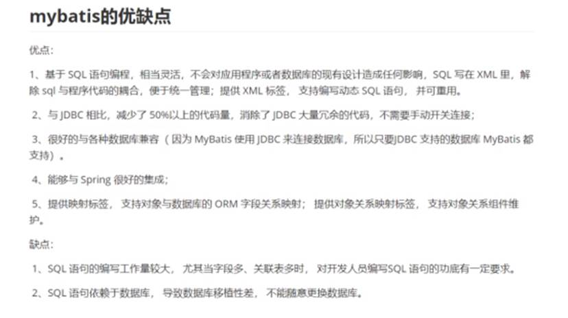
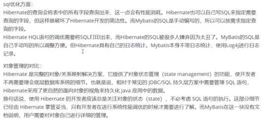
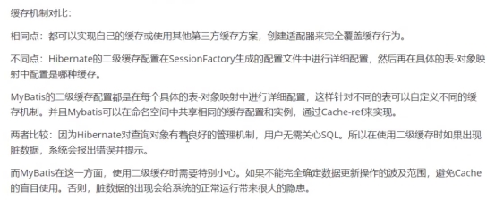
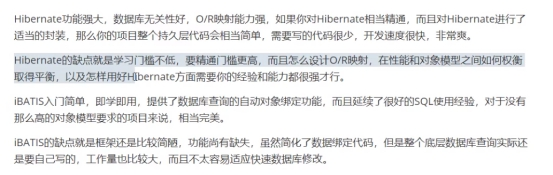
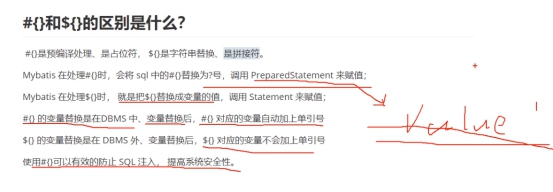
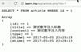
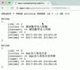

# Mybatis的优缺点

# Mybatis和Hibernate有哪些不同

# \#{}和${}的区别是什么

1. 编译过程

   \#{} 是 占位符 ：动态解析 -> 预编译 -> 执行

   ${} 是 拼接符 ：动态解析 -> 编译 -> 执行

   预编译可以类比java类的编译，java类被编译成class文件，载入虚拟机，sql预编译后会在参数位置用占位符表示。 

   预编译：数据库驱动在发送sql和参数到DBMS之前，先对sql语句进行编译处理，之后DBMS则可以直接对sql进行处理，不需要再次编译，提高了性能。这一点mybatis 默认情况下，将对所有的 sql 进行预编译处理。

   预编译可以将多个操作步骤合并成一个步骤，一般而言，越复杂的sql，编译程度也会复杂，难度大，耗时，费性能，而预编译可以合并这些操作，预编译之后DBMS可以省去编译直接运行sql。

   预编译语句可以重复利用。

   把一个 sql 预编译后产生的 PreparedStatement 对象缓存下来，下次对于同一个sql，可以直接使用这个缓存的 PreparedState 对象。

2. 是否自动加单引号

   \#{} 对应的变量会自动加上单引号

   ${} 对应的变量不会加上单引号

3. 安全性

   \#{} 能防止sql 注入

   ${} 不能防止sql 注入

4. Mybatis默认值不同

   \#{} 默认值 arg0、arg1、arg2 或 0、 1

   ${} 默认值param1、param2、param3 

   https://blog.csdn.net/weixin_41231928/article/details/105120292

5. 补充：

   sql注入：

   本地一段代码为get获取id值，输出实际执行sql以及查询id对应内容。

   当id值传为1时，执行结果如下：

   

   这是正常请求情况，而当我们往id传的参数中注入sql代码时，便可以根据自己需求查询自己想

   要获取的内容，例如：

   

   id值传参数为 -1 OR 1=1 ,此时执行代码中id值带入了我们传参数的sql代码， 1=1 为真，OR 1=1便会查出表中所有的内容。达到攻击目的。所以sql注入攻击就是输入参数未经过滤，直接拼接到sql语句中，解析执行，达到预想之外的行为。

   https://www.cnblogs.com/gyrgyr/p/9876569.html