# rabbitmq

## 为什么使用消息队列？

（1）解耦：系统A在代码中直接调用系统B和系统C的代码，如果将来D系统接入，系统A还需要修改代码，过于麻烦！

（2）异步：非必要的业务逻辑（邮件短信）以异步的方式运行，加快响应速度

（3）削峰：并发量大的时候，所有的请求直接怼到数据库，造成数据库连接异常,系统A慢慢的按照数据库能处理的并发量，从消息队列中慢慢拉取消息。

## 有什么缺点?

（1）系统可用性降低：消息队列挂了系统可用性降低

（2）系统复杂性增加：一致性问题、如何保证消息不被重复消费，如何保证保证消息可靠传输

（3）消息传递路径更长，延时会增加

（4）上游无法知道下游的执行结果，这一点是很致命的

## 选型?    

（1）选RabbitMQ：一方面，erlang语言天生具备高并发的特性，而且他的管理界面用起来十分方便。RabbitMQ的社区十分活跃，可以解决开发过程中遇到的bug。基于AMQP协议来实现。AMQP的主要特征是面向消息、队列、路由（包括点对点和发布/订阅）、可靠性、安全。AMQP协议更多用在企业系统内对数据一致性、稳定性和可靠性要求很高的场景。

（2）排除其他的：数据量没那么大，选消息中间件，应首选功能比较完备的，所以kafka排除，不支持事务，对消息的重复、丢失、错误没有严格要求。不考虑rocketmq的原因是，rocketmq是阿里出品，如果阿里放弃维护rocketmq，中小型公司一般抽不出人来进行rocketmq的定制化开发，因此不推荐。

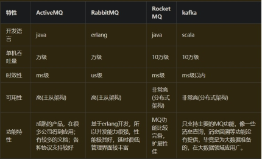

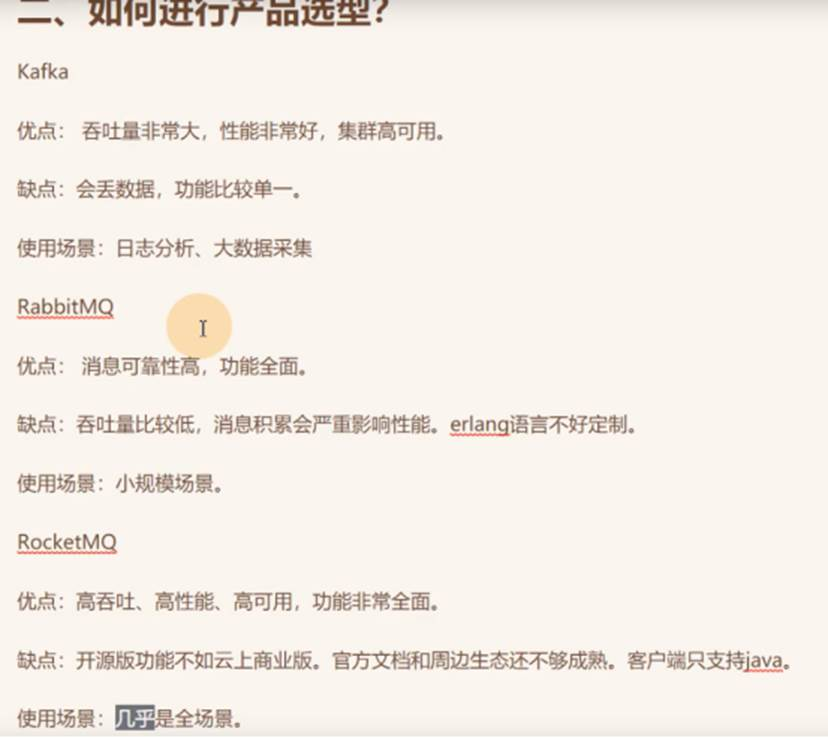

## 集群，如何保证消息队列是高可用的？

集群：

（1）**普通模式：消息实体在其中一个节点上，消费时同步**

增加更多节点时，能线性的增加性能（CPU、内存）和容量（内存和磁盘）。

**（2）镜像模式：消息实体会同步到所有节点上：**把需要的队列做成镜像队列，存在与多个节点属于RabbitMQ的HA（高可用）方案。

该模式带来的副作用也很明显，除了降低系统性能外，如果镜像队列数量过多，加之大量的消息进入，集群内部的网络带宽将会被这种同步通讯大大消耗掉。

https://www.cnblogs.com/gaopengpy/p/13476371.html较总结

https://blog.csdn.net/fgf00/article/details/79558498较细节

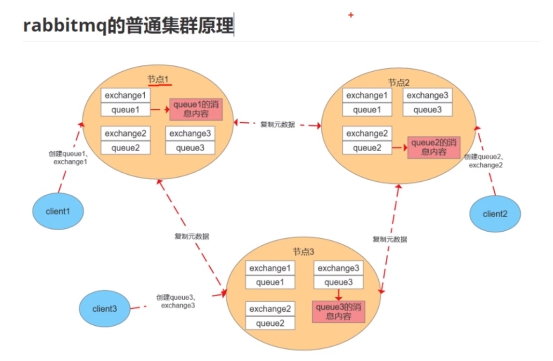

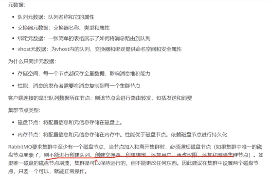

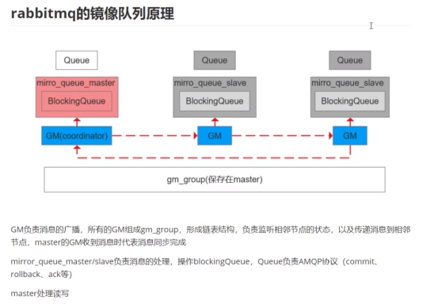

master的GM收到消息后表明走了一圈又回来了

GM不直接操作阻塞队列，通过mirror_queue_/操作

Queue是负责操作的，真正存数据时阻塞队列

## 消息不被重复消费（消息队列的幂等性）?

正常情况下，消费者在消费消息时候，消费完毕后，会发送一个确认信息给消息队列，消息队列就知道该消息被消费了，就会将该消息从消息队列中删除。只是不同的消息队列发送的确认信息形式不同,例如RabbitMQ是发送一个ACK确认消息。因为网络传输等等故障，确认信息没有传送到消息队列，导致消息队列不知道自己已经消费过该消息了，再次将该消息分发给其他的消费者。

（1)  若拿到这个消息做数据库的insert操作。那就容易了，给这个消息做一个唯一主键。

（2）若拿到这个消息做redis的set的操作，不用解决，set操作本来就算幂等操作。

（3）准备一个第三方介质,来做消费记录。以redis为例，给消息分配一个全局id，只要消费过该消息，将<id,message>以K-V形式写入redis。那消费者开始消费前，先去redis中查询有没消费记录即可。

## 消息可靠性传输?

(1) 生产者丢数据：

RabbitMQ提供transaction和confirm模式来确保生产者不丢消息：

a. transaction机制就是说，发送消息前，开启事物(channel.txSelect())，然后发送消息，如果发送过程中出现什么异常，事物就会回滚(channel.txRollback())，如果发送成功则提交事物(channel.txCommit())。然而缺点就是吞吐量下降了。

b. 生产上用confirm模式的居多。一旦channel进入confirm模式，所有在该信道上面发布的消息都将会被指派一个唯一的ID(从1开始)，一旦消息被投递到所有匹配的队列之后，rabbitMQ就会发送一个Ack给生产者(包含消息的唯一ID)，这就使得生产者知道消息已经正确到达目的队列了.如果rabiitMQ没能处理该消息，则会发送一个Nack消息给你，你可以进行重试操作。

(2) 消息队列丢数据

持久化配置可以和confirm机制配合使用，你可以在消息持久化磁盘后，再给生产者发送一个Ack信号。

(3) 消费者丢数据消费者丢数据一般是因为采用了自动确认消息模式。采用手动确认消息即可。完成操作了在回复确认。

## 消息的顺序性？

局部有序：多个qq窗口，只要保证一个窗口内的消息有序就行了，多个订单，一个订单有很多处理步骤，只要保证一个订单的处理步骤不乱就行了

全局有序（mq不保证）：所有窗口的消息之间都要有序

rabbitMq中就是queue，然后只用一个消费者去消费该队列。观点是保证入队有序就行，出队以后的顺序交给消费者自己去保证，没有固定套路。

https://www.cnblogs.com/williamjie/p/9481780.html

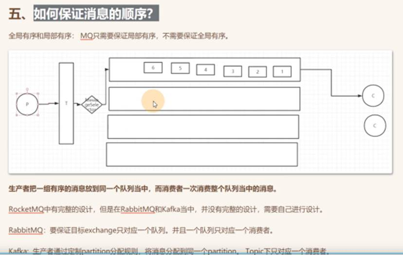

 

## 高效读写_零拷贝

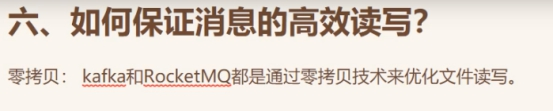

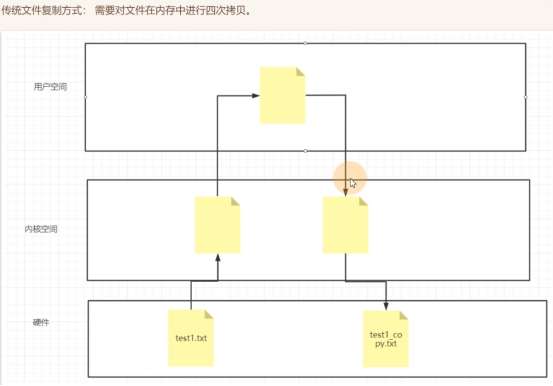

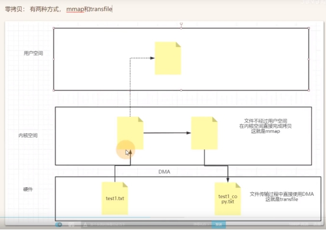

用户空间只拿映射：内存地址，长度，要写的大小

**DMA**(Direct Memory Access），直接存储器访问

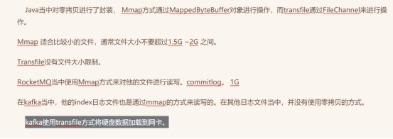

使用MQ如何保证分布式事务的最终一致性

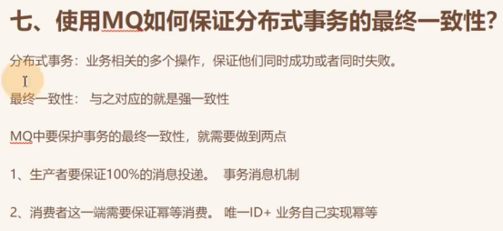

也可用分布式事务

最终一致性：不能保证支付完了，同一时刻下单物流完成，只能保证支付完了，下单物流在一定时间内完成

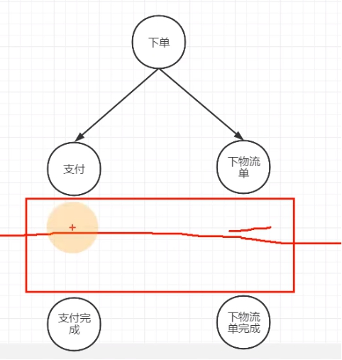

## 分布式MQ的三种语义

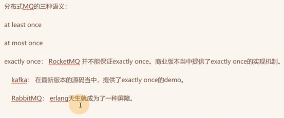

at least once: 发送者至少发送一次，没有成功则继续发，消费者也是至少接受一次，失败了则再次接受

at most once: 只发一次，不管成功没

exactly once: 刚刚好一次就成功

## 让你设计一个MQ，如何设计

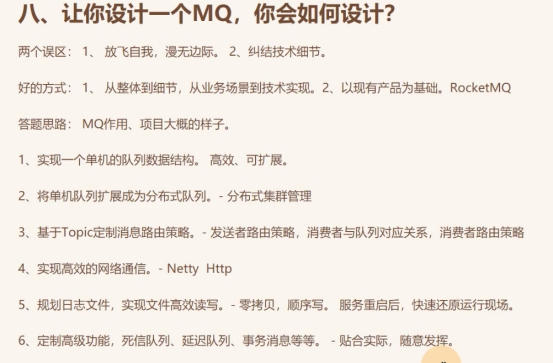

实现一个先进先出的队列，要有消息（进行封装，要有什么字段），可扩展（消息多了队列就增长，少了就缩短）

## RabbitMQ架构设计

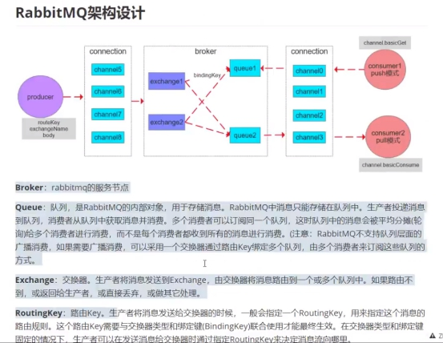

pull和push模式反了

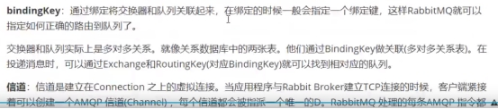

## 交换机类型

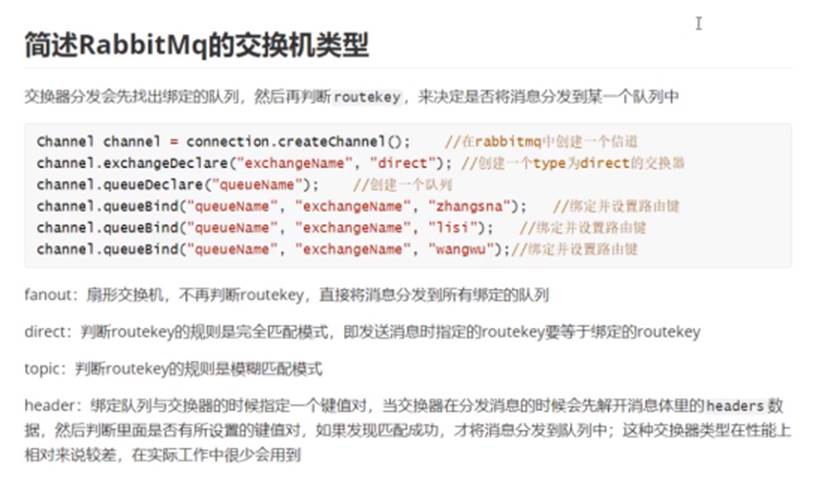

## 可以直连队列吗

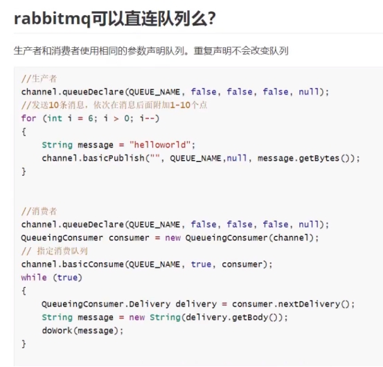

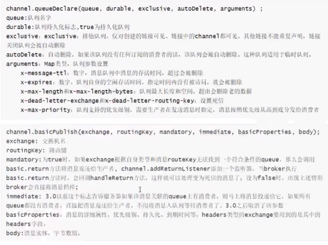

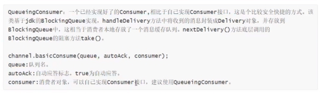

## 持久化机制

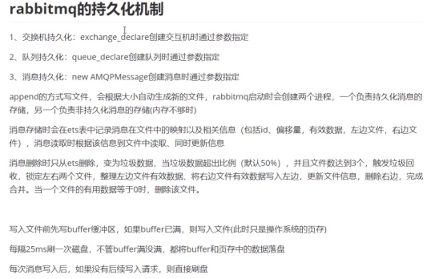

删除时：整理左----中复制到左-----删除中----整理左-----右到复制左---删除右

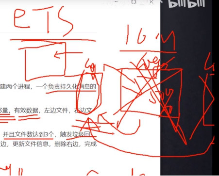

## 事务机制

客户端发送给服务器Tx.Select(开启事务模式)

服务器端返回Tx.Select-Ok（开启事务模式ok）

推送消息

客户端发送给事务提交Tx.Commit

服务器端返回Tx.Commit-Ok

生产者开启事务，发送消息到Q2，若发生异常则将Q2中消息删除，若commit了，则将Q2中消息发送到Q1供消费者消费

消费者方要使用事务应把ack机制置为false，消费方控制队列中的消息是否删除，若异常则不删除，若commit就可删除消息

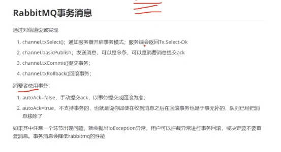

## 死信队列，延迟队列原理

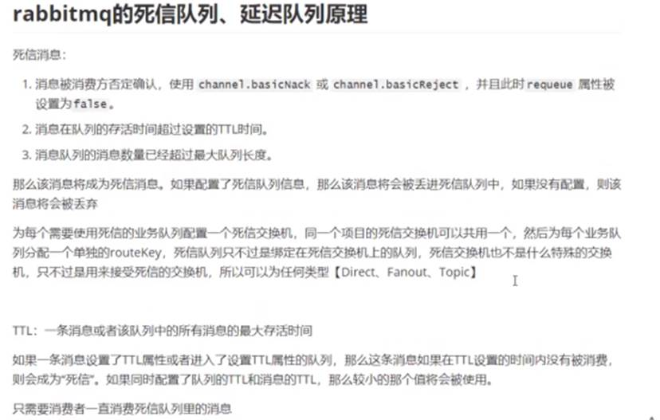

## 消息队列中的数据怎么删除

- 1. 清除队列并添加回其他9条消息
  2. 在用户端检查一条消息并拒绝/忽略该消息
  3. 将所有消息转发到另一个队列,但1条消息除外

 