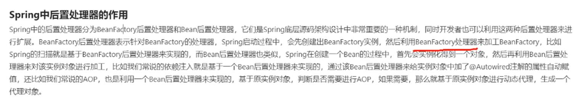

# Spring

## Spring是什么

## 介绍下Spring，读过源码介绍下大致流程

## 对于IOC和AOP和控制反转的理解

IoC（Inverse of Control:控制反转），就是 将原本在程序中⼿动创建对象的控制权，交由**Spring**框架来管理。 **IoC** 容器是**Spring** ⽤来实现 **IoC** 的载体， **IoC** 容器实际上就是个**Map**（**key**，**value**）**,Map** 中存放的是各种对象。 

- 优点1：这个容器可以自动对你的代码进行初始化，你只需要维护一个Configuration（可以是xml可以是一段代码），而不用每次初始化一辆车都要亲手去写那一大段初始化的代码。

- 优点2：**我们在创建实例的时候不需要了解其中的细节。**

## 循环依赖

1. 循环依赖

上图中handler存在于命名空间中，最后是放到BeanDefination中

首先创建a对象，放3a，因为a依赖b对象，所以去创建b对象，放3b,

创建b对象时，去3级缓存找有没有a，发现是有的，放2a（把a放入二级缓存）,删除3a

这时候还是创建b对象过程，发现二级缓存中有a，那么创建b对象，放入1级缓存（1b），删除3b

回来创建a对象流程，发现一级缓存中有b，那么直接注入，删除掉2a

## Spring 中用到了哪些设计模式 :

1. 简单工厂(非23种设计模式中的一种) 

2. 工厂方法 

3. 单例模式

4. 适配器模式 

5. 装饰器模式 

6. 代理模式

7. 观察者模式

8. 策略模式 

9. 模版方法模式

https://zhuanlan.zhihu.com/p/114244039

## @Autowire等这些注解怎么实现的？怎么能够让这些注解即便找不到也不报错？

@Autowired使用

属性注入：

如果我们自己设计@Autowired，我们应该怎么实现？我想做法还是比较简单的 

1. 通过反射查找bean的class下所有注解了@Autowired的字段和方法
2. 获取到字段，通过getBean(字段)获取到对应bean，然后再通过反射调用field的set将bean注入

方法注入：

当@Autowired注解在方法上，例如我们注解在setter方法上，则只需要直接调用该setter方法将参数数组传入即可以

1. @Autowired(required = false)  设置required 属性值为 false，错误提示消失。

2. 用@Resource注解替换@Autowired注解，错误提示消失。

https://www.jianshu.com/p/1002f5a704ea

https://juejin.cn/post/6844903957135884295#heading-3

## BeanFactory和ApplicationContext的区别

ApplicationContext可以在其bean定义中自动检测BeanFactoryPostProcessor bean，**并在创建任何其他**bean之前先创建BeanFactoryPostProcessor

## Spring中后置处理器的作用

## IOC

### 容器和对象的创建流程

- - 容器和对象的创建流程

BeanfactoryPostProcessor：比如占位符的填充操作

PostProcessor这样的处理接口是通过动态代理实现的

使用完事之后销毁

通过实现BeanFactoryAware与ApplicationContextAware方法

### 如果你要实现IOC，请简单描述一下实现步骤？

实现IOC的步骤：

​	①定义用来描述bean的配置的Java类。

​	②解析bean的配置，将bean的配置信息转换为BeanDefinition对象保存到内存中，spring中采用HashMap进行对象存储，其中会用到一些xml的解析技术，如dom4j等。

​	③遍历存放BeanDefinition的HashMap对象，逐条取出BeanDefinition对象，获取bean的配置信息，利用Java的反射机制实例化对象，将实例化后的对象保存到另外一个Map中即可。 

### bean的作用域

https://www.huaweicloud.com/articles/cb0bcf025a17e8501ded9dafa2a19933.html

https://www.huaweicloud.com/articles/b59be8ffdcfbd1f8a1fe28bffe848d20.html

### Spring Bean的生命周期

### bean的作用域

### 单例Bean是线程安全的吗

### bean的自动装配，有哪些方式

### 依赖注入方式

构造方法注入：

set方法注入：

## AOP

AOP(Aspect-Oriented Programming:⾯向切⾯编程)能够将那些与业务⽆关，却为业务模块所共同调⽤的逻辑或责任（例如事务处理、⽇志管理、权限控制等）封装起来，便于减少系统的重复代码，降低模块间的耦合度，并有利于未来的可拓展性和可维护性。**Spring AOP**就是基于动态代理的。

初始化看程序员有没有继承一个类并且实现afterPropertiesSet（）方法，这个方法的主要应用在于赋值一些不在容器中的对象，或者去判断属性是否为空，若为空需要抛出一些异常

执行aop，需要在容器中把所有的切面对象都找出来，再遍历，如果对UserService类进行代理，那么就要匹配切点

## 事务

### Spring支持的事务管理类型

- **编程式事务管理**：这意味你通过编程的方式管理事务，给你带来极大的灵活性，但是难维护。
- **声明式事务管理**：这意味着你可以将业务代码和事务管理分离，你只需用注解和XML配置来管理事务。

### spring 事务实现方式有哪些？

Spring事务的实现方式和实现原理

Spring事务的本质其实就是数据库对事务的支持，没有数据库的事务支持，spring是无法提供事务功能的。真正的数据库层的事务提交和回滚是通过binlog或者redo log实现的。

### 事务隔离级别

- 事务隔离级别

**ISOLATION_DEFAULT** 这是一个PlatfromTransactionManager默认的隔离级别，使用数据库默认的事务隔离级别.另外四个与JDBC的隔离级别相对应 

https://blog.csdn.net/qq_37651267/article/details/92425172

### 事务特征

- - 事务特征

- 原子性：一个事务是一个不可分割的工作单位。

- 一致性：事务必须是使数据库从一个一致性状态变到另一个一致性状态，一致性与原子性是密切相关的。

- 隔离性：一个事务的执行不能被其他事务干扰。即一个事务内部的操作及使用的数据对并发的其他事务是隔离的，并发执行的各个事务之间不能互相干扰。

- 持久性：一个事务一旦提交，它对数据库中数据的改变就应该是永久性的。接下来的其他操作或故障不应该对其有任何影响

### 事务传播行为

- -  事务传播行为
  - 

**事务的传播级别总结版**

- PROPAGATION_MANDATORY：该传播级别要求上下文中必须存在事务，否则抛出异常。

- PROPAGATION_REQUIRED：Spring的默认传播级别，如果上下文中存在事务则加入当前事务，如果不存在事务则新建事务执行。

- PROPAGATION_NESTED：嵌套事务，如果上下文中存在事务则嵌套执行，如果不存在则新建事务。

- PROPAGATION_REQUIRES_NEW：该传播级别每次执行都会创建新事务，并同时将上下文中的事务挂起，执行完当前线程后再恢复上下文中事务。（子事务的执行结果不影响父事务的执行和回滚）

- PROPAGATION_NEVER：该传播级别要求上下文中不能存在事务，否则抛出异常。

- PROPAGATION_NOT_SUPPORTED：当上下文中有事务则挂起当前事务，执行完当前逻辑后再恢复上下文事务。（降低事务大小，将非核心的执行逻辑包裹执行。）

- PROPAGATION_SUPPORTS：如果上下文中存在事务则加入当前事务，如果没有事务则以非事务方式执行。

### spring事务什么时候会失效

4.方法上加了@Trans。。。,但是类上没有加@Service或其他的注解，该类的对象没有放到容器中

# SpringMVC

## Servlet

概念：运行在服务器端的小程序

\*Servlet就是一个接口，定义了Java类被浏览器访问到(tomcat识别)的规则。

\*将来我们自定义一个类，实现Servlet接口，复写方法。

servlet对于http请求是怎样处理的,http是怎样找到对应servlet的

## Spring Boot，Spring MVC和Spring有什么区别

## SpringMVC的工作流程

5中处理器可能是继承了controller接口，也可能是用注解@RequestMapping，也可能是Servlet（中有Service方法），这时就要用到4中的处理器适配器去调用具体的处理器

9中解析器可能用到jstl视图解析技术

10中view可能渲染为jsp页面

## SpringMVC的主要组件

最主要就是前面两个

2中最重要的就是support方法和handle方法，support就是判断是哪种处理器（用instanceof），handle：具体执行方法，若是实现controller接口，则强转为controller类型，再执行方法

# Springboot

## 如何理解Spring Boot中的starter

默认配置比如说8080端口

## SpringBoot的注解及其实现

## Spring Boot的自动装配

import导入类，AutoConfigurationPackageRegister，用来将扫描路径保存到配置类中，其他框架比如jpa来了，就能了解到这些类的路径了

文字第二行：配置类以字符串形式放到spring.factories中

Spring spi就是调用图中的loadFactoryNames方法

EnableAutoConfigrator是一个key值

@Bean就是类中一个方法返回一个对象，若想把它放入容器中，就可以加这个注解

## SpringBoot是如何启动Tmocat的

## SpringBoot中配置文件的加载顺序是怎样的

# SpringCloud

## Spring Cloud和Dubbo的区别

http--restful风格  tcp--rpc形式接口

eureka--ap 注重高可用（剩余一个节点都可用，不能保证数据强一致性） zookeeper--cp 保证强一致性    具体参考：微服务5

生态：比如说springcloud支持熔断，Dubbo不支持，还要自己写

## springcloud核心组件及其作用

hystrix:A调用B，B调用C，A的并发量过大会导致BC不可用，熔断就是把AB之间断掉，会有一个forback函数，熔断的时候可以返回给用户友好提示，降级：并且函数中可以记录参数，日志，发到mq中交由BC去处理，先给用户处理中的友好提示，等处理完了，再给用户提示完成

## SpringCloud Alibaba

