# **博客搭建过程（采用hexo框架+部署到github）**

## **1.前期准备**

### **1.1 注意事项**

- 很多命令既可以用Windows的cmd来完成，也可以使用git bash来完成，但是部分命令会有一些问题，为避免不必要的问题，建议全部使用git bash来执行
- hexo不同版本差别比较大，网上很多文章的配置信息都是基于2.x的，所以注意不要被误导
- hexo有2种_config.yml文件，一个是根目录下的全局的_config.yml，一个是各个theme下的

### **1.2 下载并安装node.js**

- 官网下载：https://nodejs.org/en/
- 安装与使用：见node笔记
- 安装后验证：**node -v**

### **1.3 下载并安装git**

- 官网下载:  https://git-scm.com/download/win
- 安装与使用：见git笔记
- 安装后验证：**git -v**

### **1.4 命令行安装cnpm**

- 命令：**npm install -g cnpm –registry==[https://registry.npm.taobao.org](https://registry.npm.taobao.org/)**
- 安装后验证：**cnpm -v**

### **1.5 命令行安装hexo**

- 命令：**cnpm install -g hexo-cli**
- 安装后验证：**hexo  -v**

------

## **2.配置github**

### **2.1 在github上创建仓库**

**创建：**

- 新建一个名为你的用户名.github.io的仓库
- 比如说，如果你的github用户名是test，那么你就新建test.github.io的仓库（必须是你的用户名，其它名称无效），将来你的网站访问地址就是 [http://test.github.io](http://test.github.io/) 了，是不是很方便？由此可见，每一个github账户最多只能创建一个这样可以直接使用域名访问的仓库。

**注意：**

1. 注册的邮箱一定要验证，否则不会成功；
2. 仓库名字必须是：username.github.io，其中username是你的用户名；
3. 仓库创建成功不会立即生效，需要过一段时间，大概10-30分钟，或者更久；
4. 创建页面如下：

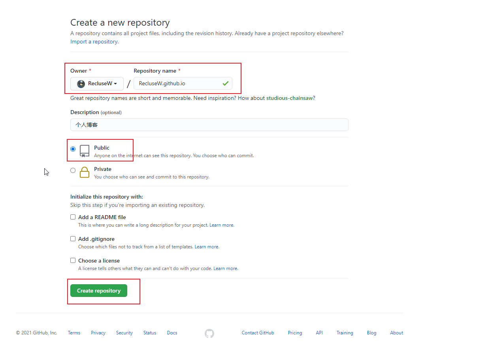

创建成功后，默认会在你这个仓库里生成一些示例页面，以后你的网站所有代码都是放在这个仓库里啦。

### **2.2 绑定域名（这步可省略）**

当然，你不绑定域名肯定也是可以的，就用默认的 xxx.github.io 来访问，如果你想更个性一点，想拥有一个属于自己的域名，那也是OK的。

首先你要注册一个域名，域名注册以前总是推荐去godaddy，现在觉得其实国内的阿里云也挺不错的，价格也不贵，毕竟是大公司，放心！

绑定域名分2种情况：带www和不带www的。

域名配置最常见有2种方式，CNAME和A记录，CNAME填写域名，A记录填写IP，由于不带www方式只能采用A记录，所以必须先ping一下你的用户名.github.io的IP，然后到你的域名DNS设置页，将A记录指向你ping出来的IP，将CNAME指向你的用户名.github.io，这样可以保证无论是否添加www都可以访问，如下：

然后到你的github项目根目录新建一个名为CNAME的文件（无后缀），里面填写你的域名，加不加www看你自己喜好，因为经测试：

- 如果你填写的是没有www的，比如 mygit.me，那么无论是访问 [http://www.mygit.me](http://www.mygit.me/) 还是 [http://mygit.me](http://mygit.me/) ，都会自动跳转到 [http://mygit.me](http://mygit.me/)
- 如果你填写的是带www的，比如 [www.mygit.me](http://www.mygit.me/) ，那么无论是访问 [http://www.mygit.me](http://www.mygit.me/) 还是 [http://mygit.me](http://mygit.me/) ，都会自动跳转到 [http://www.mygit.me](http://www.mygit.me/)
- 如果你填写的是其它子域名，比如 abc.mygit.me，那么访问 [http://abc.mygit.me](http://abc.mygit.me/) 没问题，但是访问 [http://mygit.me](http://mygit.me/) ，不会自动跳转到 [http://abc.mygit.me](http://abc.mygit.me/)

另外说一句，在你绑定了新域名之后，原来的你的用户名.github.io并没有失效，而是会自动跳转到你的新域名。

------

## **3. 配置SSH免密登录**

为什么要配置这个呢？因为你提交代码肯定要拥有你的github权限才可以，但是直接使用用户名和密码太不安全了，所以我们使用ssh key来解决本地和服务器的连接问题。

**操作步骤：**

**第一步：**首先打开电脑文件夹，找到C:\Users\你的用户名.ssh文件夹并删除

**第二步：**在C:\Users\你的用户名 文件夹下右键打开Git Bash Here**输入命令：**ssh-keygen -t rsa -C github邮件地址   生成.ssh秘钥，输入后连敲三次回车，出现下图情况代表成功

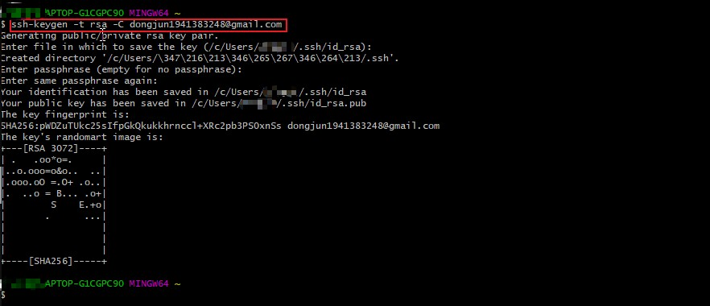

**第三步：**最终生成了一个新的 C:\Users\你的用户名.ssh文件夹，打开这个文件夹，找到.ssh\id_rsa.pub文件，记事本打开并复制里面的内容

**第四步：**打开你的github主页，进入个人设置 -> SSH and GPG keys -> New SSH key，把复制的内容粘贴进去，title随便填，保存即可，我们的公钥就添加成功了，设置好如下图。

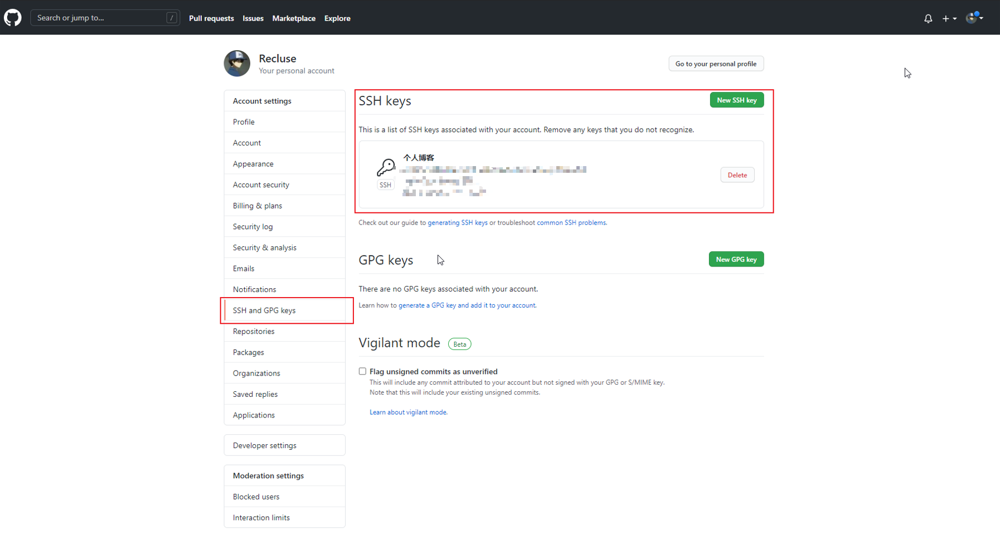

**第五步：检测是否设置成功：**

输入命令：  $ ssh -T [git@github.com](mailto:git@github.com) # 注意邮箱地址不用改

如果提示Are you sure you want to continue connecting (yes/no)?，输入yes，然后会看到：

Hi liuxianan! You’ve successfully authenticated, but GitHub does not provide shell access.

看到这个信息说明SSH已配置成功！

**第六步：此时你还需要配置：**

$ git config –global user.name “liuxianan”// 你的github用户名，非昵称 $ git config –global user.email  “[xxx@qq.com](mailto:xxx@qq.com)“// 填写你的github注册邮箱

具体这个配置是干嘛的我没仔细深究。

------

## **4.使用 hexo 搭建博客**

### **4.1 初始化**

**第一步：**在电脑的某个地方新建一个名为hexo的文件夹（名字可以随便取），比如我的是E:\xpzsData\hexocode，由于这个文件夹将来就作为你存放代码的地方，所以最好不要随便放

**第二步：**在E:\xpzsData\hexocode文件夹下右键打开 Git Bash Here，输入hexo init 初始化

- hexo会自动下载一些文件到这个目录，包括node_modules，目录结构如下图：

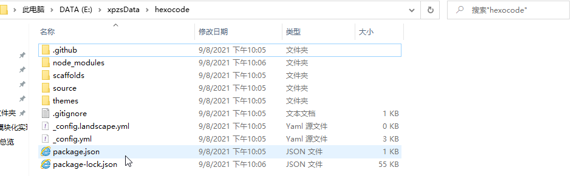

**第三步：**执行以下命令之后，hexo就会在public文件夹生成相关html文件，这些文件将来都是要提交到github去的：

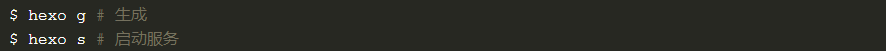

**第四步：**hexo s 是开启本地预览服务，打开浏览器访问 [http://localhost:4000](http://localhost:4000/) 即可看到内容，很多人会碰到浏览器一直在转圈但是就是加载不出来的问题，一般情况下是因为端口占用的缘故，因为4000这个端口太常见了，解决端口冲突问题请参考这篇文章https://www.runoob.com/w3cnote/windows-finds-port-usage.html

- 到这里初始化就完成了

### **4.2 将博客部署到 github 个人主页上**

**第一步：**在E:\xpzsData\hexocode目录下安装 hexo-deployer-git 插件

- **安装命令：** npm install hexo-deployer-git –save  
- 必须安装，否则执行hexo d 的话会报如下错误：

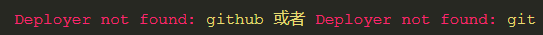

**第二步：**编辑E:\xpzsData\hexocode目录下的 _config.yml 文件, 在文件末尾添加如下内容：

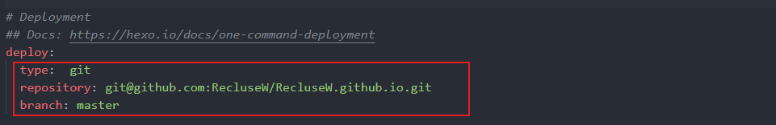

- 注意：其中 repo 中的内容即为 github 个人主页链接地址，具体看下图：

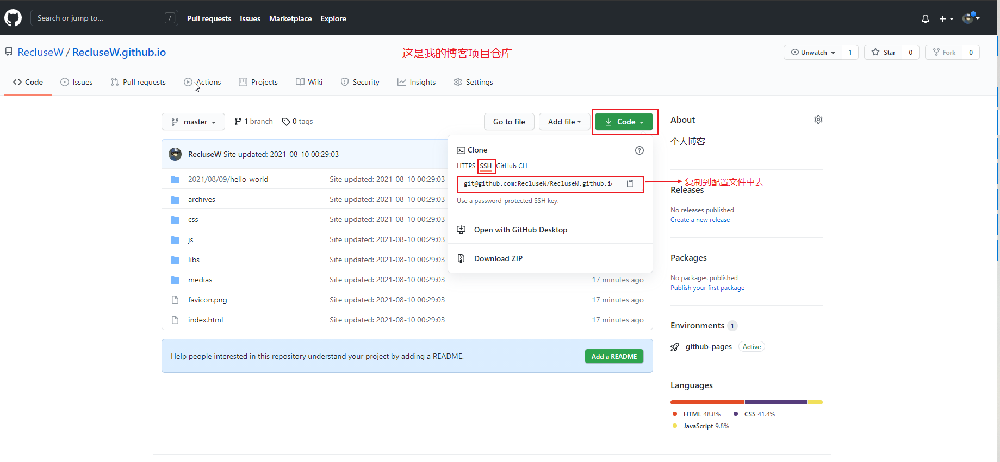

**第三步：**在E:\xpzsData\hexocode目录下, **输入命令：hexo d** 将本地 blog 推送到 github仓库, 也可能需要输入 username & pwd。

- 推送成功后, 在浏览器中输入对应域名, 即可访问 https://reclusew.github.io/

------

## **5. 更换主题**

### **5.1 寻找主题**

- 既然默认主题很丑，那我们别的不做，首先来替换一个好看点的主题。
- 这是hexo官网：https://hexo.io/themes/，可在里面下载主题，点击主题名即可跳转到github上，也可以直接在github上搜索主题
- 在这里我使用github上一个大佬的主题blinkfox/hexo-theme-matery

​              链接：https://github.com/blinkfox/hexo-theme-matery    

### **5.2 下载主题**

**第一步：**Git Bash Here中先cd到E:\xpzsData\hexocode目录

**第二步：**再输入命令 $ git clone 主题http链接  themes/主题名称

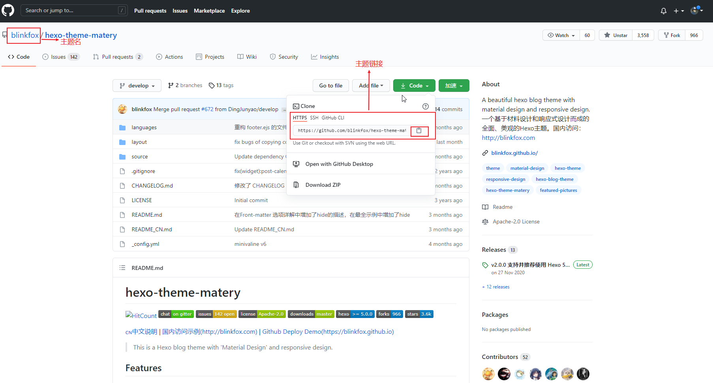

**注意：**

- E:\xpzsData\hexocode目录下的 theme 文件夹下存放的就是博客的主题，主题是否下载成功可到该目录下查看：

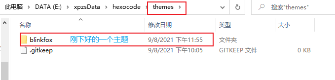

### **5.3 使用主题**

- 打开E:\xpzsData\hexocode目录下的_config.yml文件，在里面找到theme: landscape改为theme: blinkfox   （blinkfox为我们要使用的主题名）,然后重新执行hexo g来重新生成。
- 如果出现一些莫名其妙的问题，可以先执行hexo clean来清理一下public的内容，然后再执行hexo g 和 hexo s 重新生成和发布。
- 再次在浏览器中输入对应域名, 即可发现主题已更换

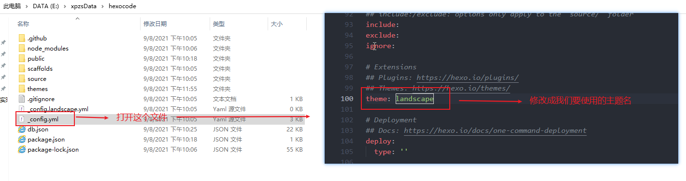

### **5.4 修改主题内容**

在这里我使用的是blinkfox主题，后期相关修改参考这个主题文档

**文档链接：**https://github.com/blinkfox/hexo-theme-matery/blob/develop/README_CN.md

- 注意：一些非md文件可以把他们放到source文件夹下，这里的所有文件都会原样复制（除了md文件）到public目录的
- 大致在下图的文件夹里面修改文件，记得修改后的文件需要关闭后，再在hexocode根目录右键打开Git Bash  Here，输入两个命令：hexo g 重新生成，hexo s 开启本地预览服务,等修改的符合要求了，再输入 hexo d  推送到github仓库即可
- 这样就可以输入网址查看更改后的内容了

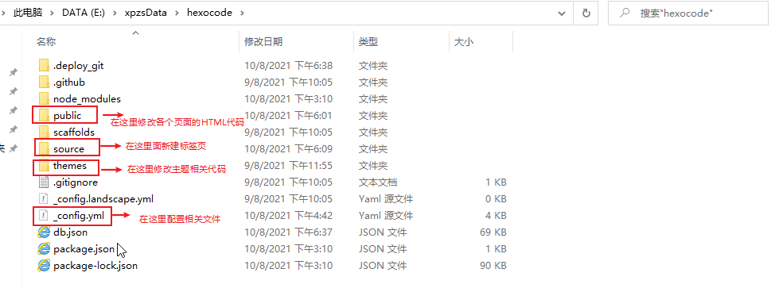

**文档上没有提及的修改：**

- 返回按钮样式修改：在主题下面的 blinkfox\layout_partial 文件夹中的 back-top.esj 文件中修改

**特别注意：**

- **修改生成的默认页面信息，要到主题下面的_config.yml文件里面去改，而不是根目录下的_config.yml文件**

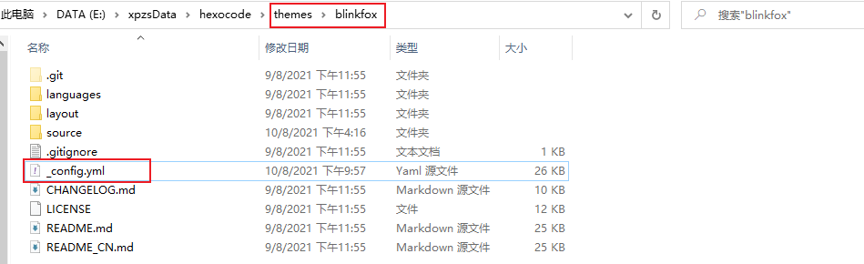

- **要把根目录下的_config.yml文件中的这些信息替换成自己的和设置中文**

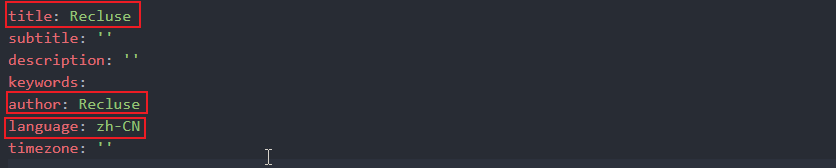

### **5.5 blinkfox主题的相关配置问题**

**配置音乐播放器：**使用网易云音乐id不行，这里用的是QQ音乐

**配置留言功能（利用Valine）：**

- 我们的评论系统其实是放在Leancloud上的，因此首先需要去注册一个账号
- 注册完以后需要创建一个应用，名字可以随便起，然后 进入应用->设置->应用key，获取你的appid 和 appkey，复制到主题下面的 _config.yml 文件里面搜索 valine，填入appid 和 appkey
- 最后！记得在Leancloud -> 设置 -> 安全中心 -> Web 安全域名 把你的域名加进去就可以了
- 主题页面显示的内容在主题下面的 layout 文件夹中的 contact.ejs 文件里面更改

------

## **6.利用Typora软件来写博客**

### **6.1 Typora介绍**

- Typora–一款简单高效的Markdown编辑器，保存后直接为md格式，Markdown中点击导入就可以。
- Markdown是一种可以使用普通文本编辑器编写的标记语言，通过简单的标记语法，它可以使普通文本内容具有一定的格式，其目标是实现易读易写，说人话就是删减版的HTML语言
- Markdown教程：https://www.runoob.com/markdown/md-tutorial.html

### **6.2 安装Typora**

**官网：**https://www.typora.io/#windows

### **6.3  写博客的步骤**

**第一步：创建.md文件**

- **方法1：**定位到我们的hexo根目录，Git Bash Here 中执行命令：  hexo new  ‘my-first-blog’                 hexo会帮我们在E:\xpzsData\hexocode\source_posts  下生成相关.md文件，用这个命令的好处是帮我们自动生成了时间，方法1默认生成如下内容：

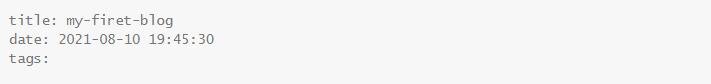

- **方法2：**当然你也可以直接自己打开E:\xpzsData\hexocode\source_posts 目录新建.md文件

**第二步：编写并保存**

我们只需要用typora打开这个文件就可以开始写博客了，写完后Ctrl+S 保存关闭即可

**第三步：**清理然后再生成一下，生成后推送到远程仓库即可，hexo根目录下右键Git Bash Here 中依次输入如下命令：

1. hexo clean
2. hexo g 
3. hexo d 

**补充：**hexo new page ‘postName’命令和hexo new ‘postName’的区别？

- hexo new page ‘My-second-blog’最终部署时生成：hexo\public\my-second-blog\index.html，但是它不会作为文章出现在博文目录。

### **6.4  Typora快捷键**

Typora中只要记住一些基本的快捷键就可以了，所有功能软件里面都有对应按钮，这点不用慌。

**快捷键文章：**https://blog.csdn.net/weixin_39533052/article/details/111115263

### **6.5  注意：所使用的主题的文章 Front-matter 语法**

依据使用的不同主题，一些文章功能所使用的语法可能不一样，例如写博客时给文章添加标签的语法等等，这些都要看所使用的主题的文档，例如我们这里使用的是 **blinkfox** 主题，打开主题文档，往下翻找到**”**  **文章 Front-matter 介绍 “**即可。

**blinkfox主题文档：**[https://github.com/blinkfox/hexo-theme-matery/blob/develop/README_CN.md#%E6%96%87%E7%AB%A0-front-matter-%E4%BB%8B%E7%BB%8D](https://github.com/blinkfox/hexo-theme-matery/blob/develop/README_CN.md#文章-front-matter-介绍)

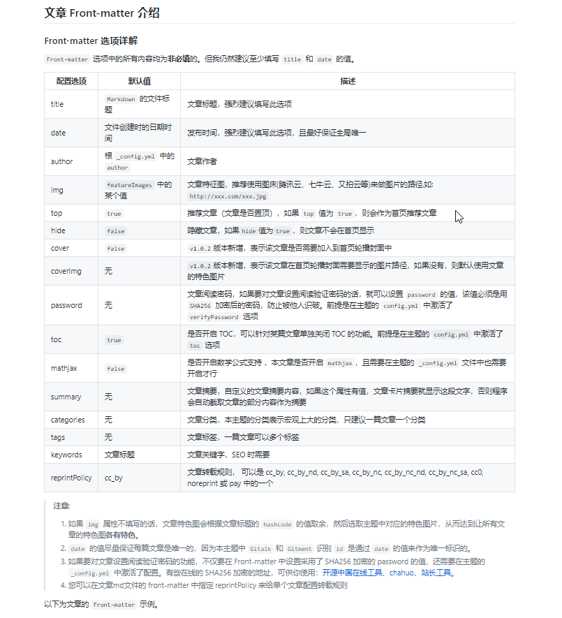

**示例：**

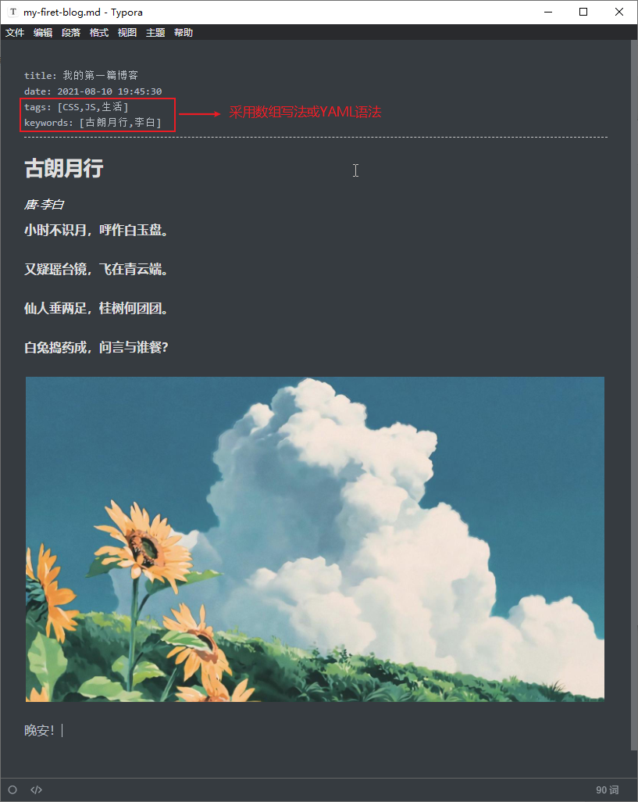

### **6.6 YAML语法（了解）**

像在typora中添加tags时，可以直接用数组的写法，也可以使用YAML语法，如下：

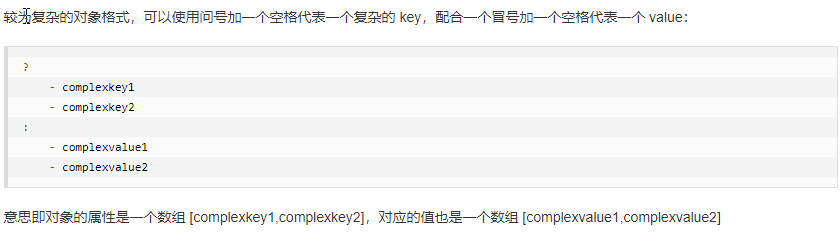

**YAML教程链接：**https://www.runoob.com/w3cnote/yaml-intro.html

------

## **7.如何向hexo博客中插入图片**

### **7.1 使用相对路径的方式**

众所周知，在md文件中插入图片的语法为!/。

其中**方括号**是图片描述，**圆括号**是图片路径。

一般来说有三种图片路径，分别是**相对路径，绝对路径和网络路径**。

所谓的网络路径就是直接引用网上的图片，直接复制图片地址，放在圆括号中就完事了。

这种方式十分的方便，但是也存在一定的问题：

- 图片失效导致无法加载；
- 打开网页后要再请求加载图片；
- 原网站限制，如微信公众号的图片会变得不可见等。

这种方式算是有利有弊。

绝对路径是图片在计算机中的绝对位置，相对路径是相对于当前文件的路径。

由于我们的博客是要部署在网站上，部署后会生成新的文件目录，所以我们选择使用相对路径的方式。

在hexo中使用**文章资源文件夹**需要在config.yaml文件中更改一下配置：

post_asset_folder: true

当该配置被应用后，使用hexo new命令创建新文章时，会生成相同名字的文件夹，也就是文章资源文件夹。

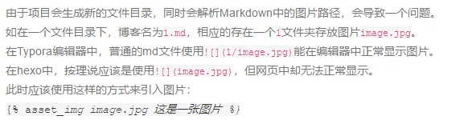

虽然可以正常引用图片了，但是这种引用图片的方式只有一句话能形容，wtf。

### **7.2 hexo-renderer-marked插件的安装与配置**

插件[hexo-renderer-marked](https://github.com/hexojs/hexo-renderer-marked)解决了这个问题

**安装：**npm install hexo-image-link --save  ，之后在config.yaml中更改配置如下：

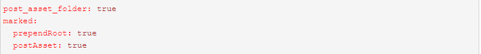

之后就可以愉快的插入图片了

### **7.3 hexo-renderer-marked插件与Typora的完美结合**

如果图片数量众多的话，一张一张的放很影响效率。但是不用怕，我们有很方便的解决方法。

**Typora**是我非常喜欢的Markdown文本编辑器，在之前的文章中也介绍过一点。

Typora对于插入图片的支持做得非常好，在文件->偏好设置或者直接<C-,>进入设置。

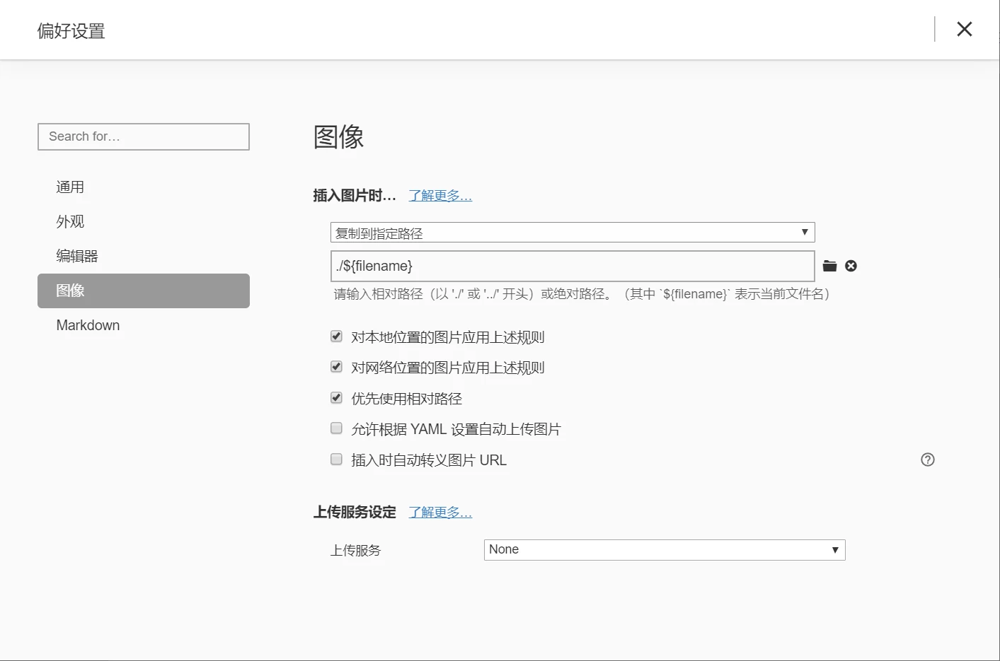

**复制网络路径的图片：**

使用该配置后，可以直接复制网页中的图片地址，粘贴到Typora中后，会直接复制该图片到文章资源文件夹，同时自动更改路径。

如复制网络路径的图片https://…../image.jpg粘贴到Typora中叫文章名的文章后，图片会自动变为(文章名/image.jpg)。

但我们知道部署后，文件路径是不同的，所以当我们插入完所有的图片后，我们还需要删除每个图片路径中的文件名/。不慌，也很简单。

在Typora编辑器中，使用快捷键，将所有的文章名/替换为空即可删除。

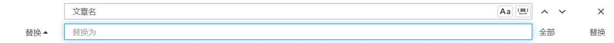

然后再将博客上传，图片就会随着文章一起打包。在网页中就可以看到正常显示的图片，大功告成

------

## 8.总结

这是本人搭建博客过程中遇到的一些问题和解决办法，按照我这个步骤基本就能搭建起来一个不错的博客了，文章里面省略了博客的SEO优化，比如让百度和谷歌搜索引擎收录我们的博客网站，这点大家可以去网上搜索，教程很多的，有什么问题欢迎在下方留言！

参考文献：

1：https://github.com/blinkfox/hexo-theme-matery/blob/develop/README_CN.md

2：https://www.cnblogs.com/liuxianan/p/build-blog-website-by-hexo-github.html

3：https://www.jianshu.com/p/f72aaad7b852