## 接口和抽象类的区别和相同点？

不同点：

1. 类可以实现很多个接口，但是只能继承一个抽象类

2. Java接口中声明的变量默认都是final的。抽象类可以包含非final的变量。

3. 接口中所有的方法隐含的都是抽象的。而抽象类则可以同时包含抽象和非抽象的方法。

4. Java接口中的成员函数默认是public的。抽象类的成员函数可以是private，protected或者是public。

相同点: 

1. 抽象类和接口都不能直接实例化，如果要实例化，抽象类变量必须指向实现所有抽象方法的子类对象，接口变量必须指向实现所有接口方法的类对象。  

2. 抽象类里的抽象方法必须全部被子类所实现（若不是抽象方法则不用全部实现），如果子类不能全部实现父类抽象方法，那么该子类还只能是抽象类。同样，一个类实现接口的时候，如不能全部实现接口方法，那么该类也只能为抽象类。

扩展：对于一个final变量，如果是基本数据类型的变量，则其数值一旦在初始化之后便不能更改；如果是引用类型的变量，则在对其初始化之后便不能再让其指向另一个对象。

两种的使用场景：

abstract class在Java语言中体现的是一种继承关系，父类和派生类之间必须存在“is a”关系，即父类和派生类在概念本质上应该是相同的。对于interface 来说则不然，并不要求interface的实现者和interface定义在概念本质上是一致的，仅仅是实现了interface定义的契约而已。为了使论述便于理解，下面将通过一个简单的实例进行说明。

考虑这样一个例子，假设在我们的问题领域中有一个关于Door的抽象概念，该Door具有执行两个动作open和close，此时我们可以通过abstract class或者interface来定义一个表示该抽象概念的类型，其他具体的Door类型可以extends使用abstract class方式定义的Door或者implements使用interface方式定义的Door。看起来好像使用abstract class和interface没有大的区别。

如果现在要求Door还要具有报警的功能。我们该如何设计针对该例子的类结构呢），下面将罗列出可能的解决方案，并从设计理念层面对这些不同的方案进行分析。

解决方案一：

简单的在Door的定义中增加一个alarm方法，这种方法违反了面向对象设计中的一个核心原则ISP（Interface Segregation Priciple），在Door的定义中把Door概念本身固有的行为方法和另外一个概念“报警器“的行为方法混在了一起。这样引起的一个问题是那些仅仅依赖于Door这个概念的模块会因为“报警器“这个概念的改变（比如：修改alarm方法的参数）而改变。

解决方案二：

既然open、close和alarm属于两个不同的概念，根据ISP原则应该把它们分别定义在代表这两个概念的抽象类中。定义方式有：这两个概念都使用abstract class方式定义；两个概念都使用interface方式定义；一个概念使用abstract class方式定义，另一个概念使用interface方式定义。

显然，由于Java语言不支持多重继承，所以两个概念都使用abstract class方式定义是不可行的。后面两种方式都是可行的，但是对于它们的选择却反映出对于问题领域中的概念本质的理解、对于设计意图的反映是否正确、合理。

如果两个概念都使用interface方式来定义，那么就反映出两个问题：1、我们可能没有理解清楚问题领域，AlarmDoor在概念本质上到底是Door还是报警器？2、如果我们对于问题领域的理解没有问题，比如：我们通过对于问题领域的分析发现AlarmDoor在概念本质上和Door是一致的，那么我们在实现时就没有能够正确的揭示我们的设计意图，因为在这两个概念的定义上（均使用interface方式定义）反映不出上述含义。

如果我们对于问题领域的理解是：AlarmDoor在概念本质上是Door，同时它有具有报警的功能。我们该如何来设计、实现来明确的反映出我们的意思呢？前面已经说过，abstract class在Java语言中表示一种继承关系，而继承关系在本质上是“is a”关系。所以对于Door这个概念，我们应该使用abstarct class方式来定义。另外，AlarmDoor又具有报警功能，说明它又能够完成报警概念中定义的行为，所以报警概念可以通过interface方式定义。

这种实现方式基本上能够明确的反映出我们对于问题领域的理解，正确的揭示我们的设计意图。其实abstract class表示的是“is a”关系，interface表示的是“like a”关系，大家在选择时可以作为一个依据，当然这是建立在对问题领域的理解上的，比如：如果我们认为AlarmDoor在概念本质上是报警器，同时又具有Door的功能，那么上述的定义方式就要反过来了。

具体参考： https://cloud.tencent.com/developer/article/1434229

## 经典排序算法

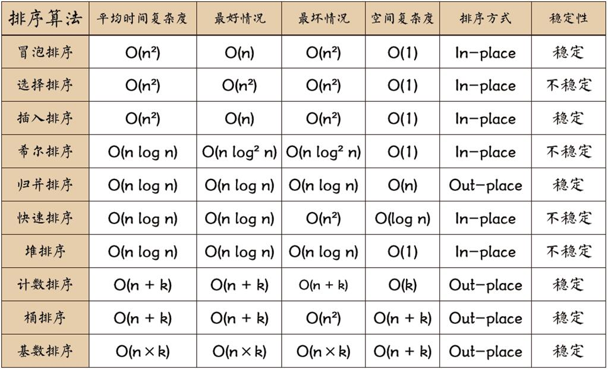


https://www.runoob.com/w3cnote/ten-sorting-algorithm.html

## HashMap 和 Hashtable 的区别

1. 线程是否安全： HashMap 是⾮线程安全的， HashTable 是线程安全的,因为 HashTable 内部的⽅法基本都经过 synchronized 修饰。（如果你要保证线程安全的话就使⽤ConcurrentHashMap 吧！）； 

2. 效率： 因为线程安全的问题， HashMap 要⽐ HashTable 效率⾼⼀点。另外， HashTable 基本被淘汰，不要在代码中使⽤它； 

3. 对 **Null key** 和 **Null value** 的⽀持： HashMap 可以存储 null 的 key 和 value，但 null 作为 键只能有⼀个，null 作为值可以有多个；HashTable 不允许有 null 键和 null 值，否则会抛出 NullPointerException 。 

4. 初始容量⼤⼩和每次扩充容量⼤⼩的不同 ： ① 创建时如果不指定容量初始值， Hashtable 默认的初始⼤⼩为 11，之后每次扩充，容量变为原来的 2n+1。 HashMap 默认的初始化⼤ ⼩为 16。之后每次扩充，容量变为原来的 2 倍。② 创建时如果给定了容量初始值，那么 Hashtable 会直接使⽤你给定的⼤⼩，⽽ HashMap 会将其扩充为 2 的幂次⽅⼤⼩ （ HashMap 中的 tableSizeFor() ⽅法保证，下⾯给出了源代码）。也就是说 HashMap 总是使⽤ 2 的幂作为哈希表的⼤⼩,后⾯会介绍到为什么是 2 的幂次⽅。 

5. 底层数据结构： JDK1.8 以后的 HashMap 在解决哈希冲突时有了重⼤的变化，当链表⻓度⼤于阈值（默认为 8）（将链表转换成红⿊树前会判断，如果当前数组的⻓度⼩于 64，那么 会选择先进⾏数组扩容，⽽不是转换为红⿊树）时，将链表转化为红⿊树，以减少搜索时 间。Hashtable 没有这样的机制

## 关于JAVA中接口存在的意义

1. 重要性：在Java语言中， abstract class 和interface 是支持抽象类定义的两种机制。正是由于这两种机制的存在，才赋予了Java强大的 面向对象能力。

2. 简单、规范性：如果一个项目比较庞大，那么就需要一个能理清所有业务的架构师来定义一些主要的接口，这些接口不仅告诉开发人员你需要实现那些业务，而且也将命名规范限制住了（防止一些开发人员随便命名导致别的程序员无法看明白）。

3. 维护、拓展性：比如有一个类，实现了某个功能，突然有一天，发现这个类满足不了需求了，然后又要重新设计这个类，更糟糕是你可能要放弃这个类，那么其他地方可能有引用他，这样修改起来很麻烦。如果一开始定义一个接口，把功能放在接口里，然后定义类时实现这个接口，然后只要用这个接口去引用实现它的类就行了，以后要换的话只不过是引用另一个类而已，这样就达到维护、拓展的方便性。比如有个method1的方法，如果用接口，【接口名】 【对象名】=new 【实现接口的类】，这样想用哪个类的对象就可以new哪个对象了，new a（）；就是用a的方法，new b（）就是用b的方法，就和USB接口一样，插什么读什么，就是这个原理。你要做一个画板程序，其中里面有一个面板类，主要负责绘画功能，然后你就这样定义了这个类。

4. 安全、严密性：接口是实现软件松耦合的重要手段，它描叙了系统对外的所有服务，而不涉及任何具体的实现细节。这样就比较安全、严密一些（一般软件服务商考虑的比较多，jdk中很多方法就是实现了某个接口）。

 **一. 对接口的三个疑问** 

很多初学者都大概清楚interface是1个什么, 我们可以定义1个接口, 然后在里面定义一两个常量(static final) 或抽象方法.然后以后写的类就可以实现这个接口, 重写里面的抽象方法. 很多人说接口通常跟多态性一起存在.接口的用法跟抽象类有点类似.但是为何要这么做呢.

1. 为什么不直接在类里面写对应的方法, 而要多写1个接口(或抽象类)?

2. 既然接口跟抽象类差不多, 什么情况下要用接口而不是抽象类.

3. 为什么interface叫做接口呢? 跟一般范畴的接口例如usb接口, 显卡接口有什么联系呢?

答案：

1. 需要实现多态

   很明显, 接口其中一个存在意义就是为了实现多态.：农夫喂不同动物水而抽象类(继承) 也可以实现多态

2. 要实现的方法(功能)不是当前类族的必要(属性). 根本原因就是抽象类不能多继承

   上面的例子就表明, 捕猎这个方法不是动物这个类必须的,在动物的派生类（老虎需要，山羊不需要）中, 有些类需要, 有些不需要. 如果把捕猎方法写在动物超类里面是不合理的浪费资源.所以把捕猎这个方法封装成1个接口, 让派生类自己去选择实现!

3. 要为不同类族的多个类实现同样的方法(功能).上面说过了, 其实不是只有Animal类的派生类才可以实现Huntable接口.如果Farmer实现了这个接口, 那么农夫自己就可以去捕猎动物了...

## 方法覆盖(Overriding)和方法重载(Overload)

方法重写的原则：

- 1. 重写方法的方法名称、参数列表必须与原方法的相同，返回类型可以相同也可以是原类型的子类型(从Java SE5开始支持)。      
  2. 重写方法不能比原方法访问性差（即访问权限不允许缩小）。      
  3. 重写方法不能比原方法抛出更多的异常。      
  4. 被重写的方法不能是final类型，因为final修饰的方法是无法重写的。 
  5. 被重写的方法不能为private，否则在其子类中只是新定义了一个方法，并没有对其进行重写。 
  6. 被重写的方法不能为static。如果父类中的方法为静态的，而子类中的方法不是静态的，但是两个方法除了这一点外其他都满足重写条件，那么会发生编译错误；反之亦然。即使父类和子类中的方法都是静态的，并且满足重写条件，但是仍然不会发生重写，因为静态方法是在编译的时候把静态方法和类的引用类型进行匹配。      
  7. 重写是发生在运行时的，因为编译期编译器不知道并且没办法确定该去调用哪个方法，JVM会在代码运行的时候作出决定。 

方法重载的原则：

- 1. 方法名称必须相同。 
  2. 参数列表必须不同（个数不同、或类型不同、参数类型排列顺序不同等）。      
  3. 方法的返回类型可以相同也可以不相同。      
  4. 仅仅返回类型不同不足以成为方法的重载。      
  5. 重载是发生在编译时的，因为编译器可以根据参数的类型来选择使用哪个方法。      

重写和重载的不同：

- 1. 方法重写要求参数列表必须一致，而方法重载要求参数列表必须不一致。      
  2. 方法重写要求返回类型必须一致(或为其子类型)，方法重载对此没有要求。 
  3. 方法重写只能用于子类重写父类的方法，方法重载用于同一个类中的所有方法。      
  4. 方法重写对方法的访问权限和抛出的异常有特殊的要求，而方法重载在这方面没有任何限制。      
  5. 父类的一个方法只能被子类重写一次，而一个方法可以在所有的类中可以被重载多次。      
  6. 重载是编译时多态，重写是运行时多态。

## Java反射高频面试题

1. 除了使用new创建对象之外，还可以用什么方法创建对象？

使用Java反射可以创建对象!

2. Java反射创建对象效率高还是通过new创建对象的效率高？

通过new创建对象的效率比较高。通过反射时，先找查找类资源，使用类加载器创建，过程比较繁琐，所以效率较低

3. java反射的作用

反射机制是在运行时，对于任意一个类，都能够知道这个类的所有属性和方法；对于任意个对象，都能够调用它的任意一个方法。在java中，只要给定类的名字，就可以通过反射机制来获得类的所有信息。 这种动态获取的信息以及动态调用对象的方法的功能称为Java语言的反射机制。

4. 哪里会用到反射机制？

   jdbc就是典型的反射,这就是反射。如hibernate，struts等框架使用反射实现的。


5. 反射的实现方式：

   第一步：获取Class对象，有4中方法：

   1）Class.forName(“类的路径”)；

   2）类名.class

   3）对象名.getClass()

   4）基本类型的包装类，可以调用包装类的Type属性来获得该包装类的Class对象

6. 实现Java反射的类：

   1）Class：表示正在运行的Java应用程序中的类和接口

   注意： 所有获取对象的信息都需要Class类来实现。

   2）Field：提供有关类和接口的属性信息，以及对它的动态访问权限。

   3）Constructor：提供关于类的单个构造方法的信息以及它的访问权限

   4）Method：提供类或接口中某个方法的信息

7. 反射机制的优缺点：

   优点：

   1）能够运行时动态获取类的实例，提高灵活性；

   2）与动态编译结合

    缺点：

   1）使用反射性能较低，需要解析字节码，将内存中的对象进行解析。

   解决方案：

   1. 通过setAccessible(true)关闭JDK的安全检查来提升反射速度；

   2. 多次创建一个类的实例时，有缓存会快很多

   3. ReflflectASM工具类，通过字节码生成的方式加快反射速度

   4. 相对不安全，破坏了封装性（因为通过反射可以获得私有方法和属性）

8. Java 反射 API

   反射 API 用来生成 JVM 中的类、接口或则对象的信息。

   1. Class 类：反射的核心类，可以获取类的属性，方法等信息。
   2. Field 类：Java.lang.reflec包中的类，表示类的成员变量，可以用来获取和设置类之中的属性值。
   3. Method 类： Java.lang.reflec包中的类，表示类的方法，它可以用来获取类中的方法信息或者执行方法。
   4. Constructor 类： Java.lang.reflec 包中的类，表示类的构造方法。

9. 反射使用步骤（获取 Class 对象、调用对象方法）
   1. 获取想要操作的类的 Class 对象，他是反射的核心，通过 Class 对象我们可以任意调用类的方法。
   2. 调用 Class 类中的方法，既就是反射的使用阶段。
   3. 使用反射 API 来操作这些信息。

10. 获取 Class 对象有几种方法

    调用某个对象的 getClass()方法


​	调用某个类的 class 属性来获取该类对应的 Class 对象 


​	使用 Class 类中的 forName()静态方法(最安全/性能最好) 当我们获得了想要操作的类的 Class 对象后，可以通过 Class 类中的方法获取并查看该类中的方法和属性。

11、利用反射动态创建对象实例

Class 对象的 newInstance()

1. 使用 Class 对象的 newInstance()方法来创建该 Class 对象对应类的实例，但是这种方法要求该 Class 对象对应的类有默认的空构造器, 调用 Constructor 对象的 newInstance()
2. 先使用 Class 对象获取指定的 Constructor 对象，再调用 Constructor 对象的 newInstance()方法来创建 Class 对象对应类的实例,通过这种方法可以选定构造方法创建实例
3. 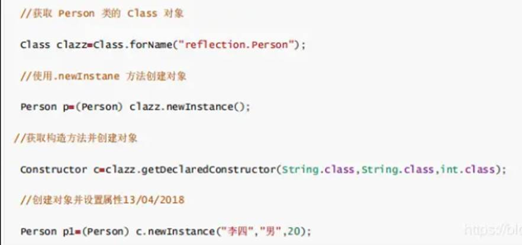

## 数据类型


## i++由几个指令，如何实现原子性

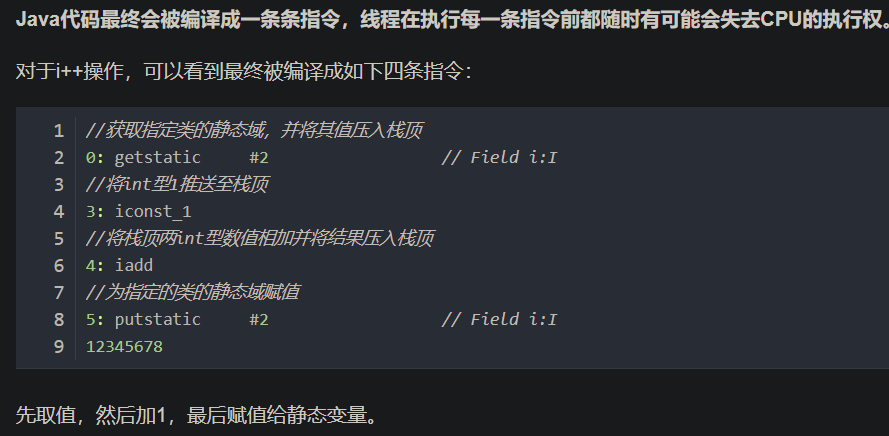

- 1. **使用juc中的lock**
  2. **使用java关键字synchronized**
  3. **使用juc中的AtomicInteger**
  4. **volatile****并不能保证原子性操作**

## 泛型

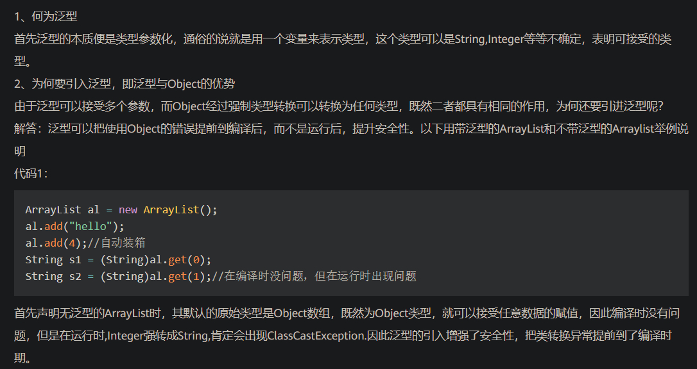

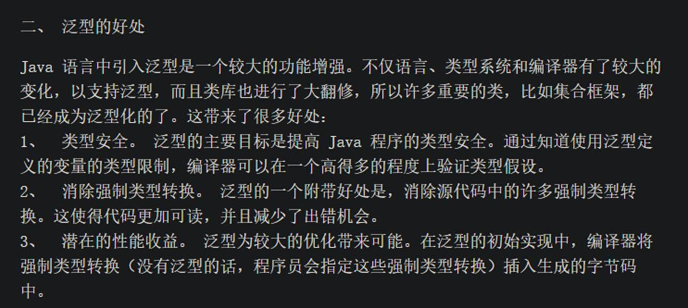

## 字节码？采用字节码的好处

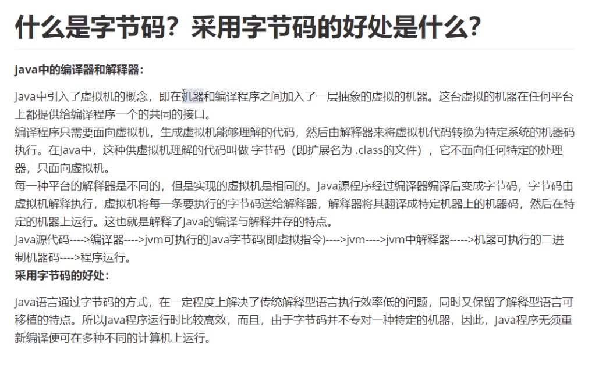

## 对于线程安全的理解

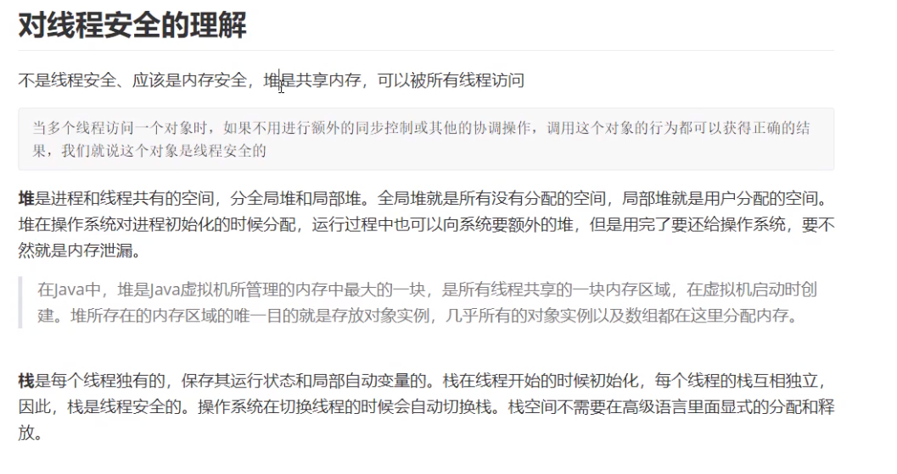

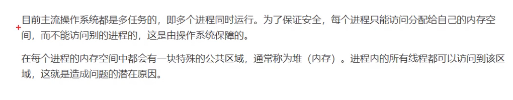

## 守护线程的理解

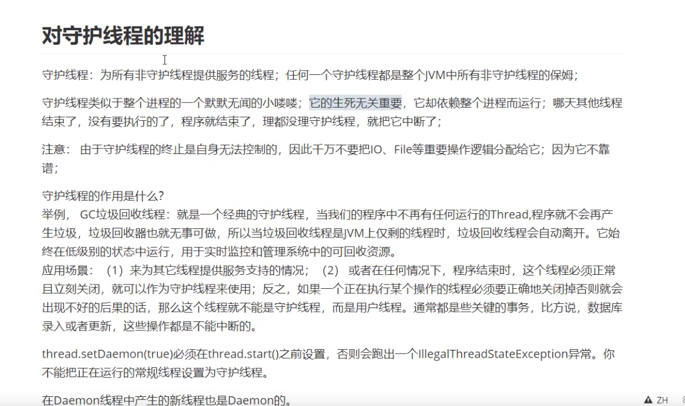

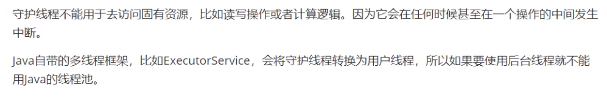

## 字符串常量池的设计思想

- 1. 字符串的分配，和其他的对象分配一样，耗费高昂的时间与空间代价，作为最基础的数据类型，大量频繁的创建字符串，极大程度地影响程序的性能
  2. JVM为了提高性能和减少内存开销，在实例化字符串常量的时候进行了一些优化

- - 为字符串开辟一个字符串常量池，类似于缓存区
  - 创建字符串常量时，首先检查字符串常量池是否存在该字符串
  - 存在该字符串，返回引用实例，不存在，实例化该字符串并放入池中

## 对面向对象的理解

在我理解,面向对象是向现实世界模型的自然延伸，这是一种“万物皆对象”的编程思想。在现实生活中的任何物体都可以归为一类事物，而每一个个体都是一类事物的实例。面向对象的编程是以对象为中心，以消息为驱动，所以程序=对象+消息。

面向对象有三大特性，封装、继承和多态。

- 封装就是将一类事物的属性和行为抽象成一个类，使其属性私有化，行为公开化，提高了数据的隐秘性的同时，使代码模块化。这样做使得代码的复用性更高。

- 继承则是进一步将一类事物共有的属性和行为抽象成一个父类，而每一个子类是一个特殊的父类--有父类的行为和属性，也有自己特有的行为和属性。这样做扩展了已存在的代码块，进一步提高了代码的复用性。

- 多态,如果说封装和继承是为了使代码重用，那么多态则是为了实现接口重用。多态的一大作用就是为了解耦--为了解除父子类继承的耦合度。如果说继承中父子类的关系式IS-A的关系，那么接口和实现类之之间的关系式HAS-A。简单来说，多态就是允许父类引用(或接口)指向子类(或实现类)对象。很多的设计模式都是基于面向对象的多态性设计的。


总结一下，如果说封装和继承是面向对象的基础，那么多态则是面向对象最精髓的理论。掌握多态必先了解接口，只有充分理解接口才能更好的应用多态。

## java中list与map区别

java中list与map区别为：性质不同、顺序不同、重复不同。

一、性质不同

1. list是存储单列数据的集合。

2. map是存储键和值双列数据的集合。

二、顺序不同

1. list存储的数据是有顺序的。

2. map存储的数据是没有顺序的。

三、重复不同

1. list存储的数据允许重复。

2. map存储的数据其键是不能重复的，它的值是可以有重复的。

## cookie和session的区别

1. session 在服务器端，cookie 在客户端（浏览器）
2. cookie不是很安全
3. 单个cookie保存的数据不能超过4K，很多浏览器都限制一个站点最多保存20个cookie。(Session对象没有对存储的数据量的限制，其中可以保存更为复杂的数据类型)
4. session 可以放在 文件、数据库、或内存中都可以。
5. session 的运行依赖 session id，而     session id 是存在 cookie 中的，也就是说，如果浏览器禁用了 cookie ，同时 session 也会失效（但是可以通过其它方式实现，比如在 url 中传递 session_id） 
6. 用户验证这种场合一般会用 session

## 自然排序与定制排序

自然排序：java.lang.Comparable

- Comparable接口强行对实现它的每个类的对象进行整体排序。这种排序被称 为类的自然排序。 

- 实现 Comparable 的类必须实现 compareTo(Object obj) 方法，两个对象即 通过 compareTo(Object obj) 方法的返回值来比较大小。如果当前对象this大 于形参对象obj，则返回正整数，如果当前对象this小于形参对象obj，则返回 负整数，如果当前对象this等于形参对象obj，则返回零。 

- ·实现Comparable接口的对象列表（和数组）可以通过 Collections.sort 或 Arrays.sort进行自动排序。实现此接口的对象可以用作有序映射中的键或有 序集合中的元素，无需指定比较器。

定制排序：java.util.Comparator

- 当元素的类型没有实现java.lang.Comparable接口而又不方便修改代码， 或者实现了java.lang.Comparable接口的排序规则不适合当前的操作，那 么可以考虑使用 Comparator 的对象来排序，强行对多个对象进行整体排 序的比较

- 重写compare(Object o1,Object     o2)方法，比较o1和o2的大小：如果方法返 回正整数，则表示o1大于o2；如果返回0，表示相等；返回负整数，表示 o1小于o2

- 可以将 Comparator 传递给 sort 方法（如 Collections.sort 或 Arrays.sort）， 从而允许在排序顺序上实现精确控制。 

https://www.cnblogs.com/xiao-ran/p/12492783.html

## Comparable 和Comparator的区别:

①　Comparable 自然排序 ，实体类实现Comparable接口，可以去重写compareTo()方法,解决实际排序问题。 把元素放到TreeSet里面去，就会自动的调用CompareTo方法; 但是这个Comparable并不是专为TreeSet设计的;只是说TreeSet顺便利用而已; 就像haashCode和equals 也一样，不是说专门为HashSet设计一样;只是你顺便利用而已;

②　Compartor第三方的比较器接口，也不是专门为TreeSet设计。 用法：设计一个比较器. 创建一个类，实现这个接口，覆写compare()方法,解决不同问题的需求。

https://www.cnblogs.com/gshao/p/10129139.html

## 同步和异步

1. 同步与异步**同步和异步关注的是**消息通信机制*(synchronous communication/ asynchronous communication)所谓同步，就是在发出一个*调用*时，在没有得到结果之前，该*调用*就不返回。但是一旦调用返回，就得到返回值了。换句话说，就是由*调用者*主动等待这个*调用*的结果。*而异步则是相反，**调用在发出之后，这个调用就直接返回了，所以没有返回结果**。换句话说，当一个异步过程调用发出后，调用者不会立刻得到结果。而是在*调用*发出后，*被调用者*通过状态、通知来通知调用者，或通过回调函数处理这个调用。

   典型的异步编程模型比如Node.js

   举个通俗的例子：你打电话问书店老板有没有《分布式系统》这本书，如果是同步通信机制，书店老板会说，你稍等，”我查一下"，然后开始查啊查，等查好了（可能是5秒，也可能是一天）告诉你结果（返回结果）。而异步通信机制，书店老板直接告诉你我查一下啊，查好了打电话给你，然后直接挂电话了（不返回结果）。然后查好了，他会主动打电话给你。在这里老板通过“回电”这种方式来回调。

2. 阻塞与非阻塞阻塞和非阻塞关注的是**程序在等待调用结果（消息，返回值）时的状态.**

   阻塞调用是指调用结果返回之前，当前线程会被挂起。调用线程只有在得到结果之后才会返回。非阻塞调用指在不能立刻得到结果之前，该调用不会阻塞当前线程。

   还是上面的例子，你打电话问书店老板有没有《分布式系统》这本书，你如果是阻塞式调用，你会一直把自己“挂起”，直到得到这本书有没有的结果，如果是非阻塞式调用，你不管老板有没有告诉你，你自己先一边去玩了， 当然你也要偶尔过几分钟check一下老板有没有返回结果。在这里阻塞与非阻塞与是否同步异步无关。跟老板通过什么方式回答你结果无关。

## Java为什么需要默认的无参构造函数

类本身默认的实例化、初始化：对象的实例化一般都是通过 new 构造器的方式来进行的，如果自定义的类中没有显式提供构造器，则肯定需要一个默认的无参的空构造器用于 new 实例化、初始化(Java编译器插入的)，不然就无法用正常的方式实例化了，例如私有的构造器。换个角度看，默认的无参空构造器使得类可以直接 new 实例化。

父类的实例化、初始化：子类的实例化必然是伴随着父类的先一步实例化。子类如果没有通过 super 来显式调用父类的构造器，则都会默认调用父类的无参构造器来进行父类的初始化。如果此时父类没有无参构造器，则会出现编译错误。

https://blog.csdn.net/weixin_35255032/article/details/114548992?utm_medium=distribute.pc_relevant.none-task-blog-baidujs_baidulandingword-1&spm=1001.2101.3001.4242

## 为什么静态方法不能调用非静态方法和变量？

静态方法是属于类的，在类加载的时候就会分配内存，可以 通过类名直接去访问，非静态成员（变量和方法）属于类的对象，所以只有在对象初始化之后才存在，然后通过类的对象去访问。

https://blog.csdn.net/weixin_47067712/article/details/106525107

## java中的TLAB

TLAB的全称是Thread Local Allocation Buffer，即线程本地分配缓存区，这是一个线程专用的内存分配区域。

- 那为什么需要TLAB呢？

  在日常的业务过程中，Java对象会不断的被新建和不断的被回收，这就涉及到对象的分配了，而新建的对象一般都是分配在堆上，而堆却是线程共享的。所以如果同一时间，有多个线程要在堆上申请空间，这里可以类比多线程访问共享变量的操作，要保证共享变量的线程安全，就得采取线程安全的手段。所以每一次对象分配都要做同步，而越多的线程要在堆上申请空间，竞争就会越激烈，效率就会降低。因此Java虚拟机采用了TLAB这种线程专属的区域来避免出现多线程冲突，提高对象分配的效率。TLAB是默认启动的，在该情况下，JAVA虚拟机会为每一个线程都分配一个TLAB区域。

  如果设置了虚拟机参数 -XX:UseTLAB，在线程初始化时，同时也会申请一块指定大小的内存，只给当前线程使用，这样每个线程都单独拥有一个空间，如果需要分配内存，就在自己的空间上分配，这样就不存在竞争的情况，可以大大提升分配效率。

  TLAB空间的内存非常小，缺省情况下仅占有整个Eden空间的1%，也可以通过选项-XX:TLABWasteTargetPercent设置TLAB空间所占用Eden空间的百分比大小。 

  TLAB的本质其实是三个指针管理的区域：start，top 和 end，每个线程都会从Eden分配一块空间，例如说100KB，作为自己的TLAB，其中 start 和 end 是占位用的，标识出 eden 里被这个 TLAB 所管理的区域，卡住eden里的一块空间不让其它线程来这里分配。

  TLAB只是让每个线程有私有的分配指针，但底下存对象的内存空间还是给所有线程访问的，只是其它线程无法在这个区域分配而已。从这一点看，它被翻译为 线程私有分配区 更为合理一点 当一个TLAB用满（分配指针top撞上分配极限end了），就新申请一个TLAB，而在老TLAB里的对象还留在原地什么都不用管——它们无法感知自己是否是曾经从TLAB分配出来的，而只关心自己是在eden里分配的。 

- TLAB的缺点 

  事务总不是完美的，TLAB也又自己的缺点。因为TLAB通常很小，所以放不下大对象。 1，TLAB空间大小是固定的，但是这时候一个大对象，我TLAB剩余的空间已经容不下它了。(比如100kb的TLAB，来了个110KB的对象) 2，TLAB空间还剩一点点没有用到，有点舍不得。(比如100kb的TLAB，装了80KB，又来了个30KB的对象) 所以JVM开发人员做了以下处理，设置了最大浪费空间。 当剩余的空间小于最大浪费空间，那该TLAB属于的线程在重新向Eden区申请一个TLAB空间。进行对象创建，还是空间不够，那你这个对象太大了，去Eden区直接创建吧！ 当剩余的空间大于最大浪费空间，那这个大对象请你直接去Eden区创建，我TLAB放不下没有使用完的空间。 

  当然，又回造成新的病垢。 3，Eden空间够的时候，你再次申请TLAB没问题，我不够了，Heap的Eden区要开始GC， 4，TLAB允许浪费空间，导致Eden区空间不连续，积少成多。以后还要人帮忙打理。

## 字面量

字面量就是指这个量本身，比如字面量3。也就是指3. 再比如 string类型的字面量"[ABC](https://www.baidu.com/s?wd=ABC&tn=44039180_cpr&fenlei=mv6quAkxTZn0IZRqIHckPjm4nH00T1d9rjn3PW6suh7BuWcYPjm30ZwV5Hcvrjm3rH6sPfKWUMw85HfYnjn4nH6sgvPsT6KdThsqpZwYTjCEQLGCpyw9Uz4Bmy-bIi4WUvYETgN-TLwGUv3EPHnsPjRvn10k)", 这个"[ABC](https://www.baidu.com/s?wd=ABC&tn=44039180_cpr&fenlei=mv6quAkxTZn0IZRqIHckPjm4nH00T1d9rjn3PW6suh7BuWcYPjm30ZwV5Hcvrjm3rH6sPfKWUMw85HfYnjn4nH6sgvPsT6KdThsqpZwYTjCEQLGCpyw9Uz4Bmy-bIi4WUvYETgN-TLwGUv3EPHnsPjRvn10k)" 通过字来描述。 所以就是字面量，虽然很难下定义。 你就理解成一眼就能知道的量。 对比下 string x; 那么x 是多少呢？ 它是个变量，你不确定它的值。 但是string x="[ABC](https://www.baidu.com/s?wd=ABC&tn=44039180_cpr&fenlei=mv6quAkxTZn0IZRqIHckPjm4nH00T1d9rjn3PW6suh7BuWcYPjm30ZwV5Hcvrjm3rH6sPfKWUMw85HfYnjn4nH6sgvPsT6KdThsqpZwYTjCEQLGCpyw9Uz4Bmy-bIi4WUvYETgN-TLwGUv3EPHnsPjRvn10k)"， 你当然知道"ABC" 就是"ABC"了，一眼就能看到值的量（有点像常量）。 string x="ABC" 意思是把字面量"ABC" 赋值给变量X. 再举例 const string y="[cbd](https://www.baidu.com/s?wd=cbd&tn=44039180_cpr&fenlei=mv6quAkxTZn0IZRqIHckPjm4nH00T1d9rjn3PW6suh7BuWcYPjm30ZwV5Hcvrjm3rH6sPfKWUMw85HfYnjn4nH6sgvPsT6KdThsqpZwYTjCEQLGCpyw9Uz4Bmy-bIi4WUvYETgN-TLwGUv3EPHnsPjRvn10k)". 意思是把字面量"[cbd](https://www.baidu.com/s?wd=cbd&tn=44039180_cpr&fenlei=mv6quAkxTZn0IZRqIHckPjm4nH00T1d9rjn3PW6suh7BuWcYPjm30ZwV5Hcvrjm3rH6sPfKWUMw85HfYnjn4nH6sgvPsT6KdThsqpZwYTjCEQLGCpyw9Uz4Bmy-bIi4WUvYETgN-TLwGUv3EPHnsPjRvn10k)" 赋值给了常量y. 明白了吧？ 总之就是描述自己的量。 "ABC" 它描述了自己，你看到了就知道它是"ABC"了。

## 句柄

使用句柄访问对象，会在堆中开辟一块内存作为句柄池，句柄中储存了对象实例数据（属性值结构体）的内存地址，访问对象类型数据的内存地址（类信息，方法类型信息）

对象实例数据一般也在heap中开辟，类型数据一般储存在方法区中。使用句柄访问的好处是句柄中储存的是稳定的对象地址，当对象被移动时候，只需要更新句柄中的对象实例部分的值即可，句柄本身不用被移动修改。

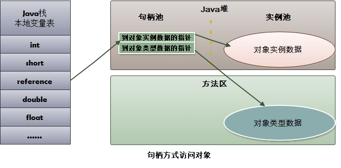

- 句柄（Handle）来标示应用程序中不同的对象和同类中不同的实例 注意：句柄有人认为是指针、或者引用

- 对象实例数据（堆）:对象中各个实例字段的数据

- 对象类型数据（方法区）：对象的类型、父类、实现的接口、方法等

- 静态区（也在方法区中）用来存放静态变量，静态块


详细： https://blog.csdn.net/lly983909814/article/details/72529773

## 节点流与处理流


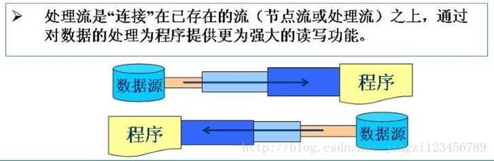

提供缓冲区的流BufferedWriter，字符编码转换的流InputStreamReader

https://blog.csdn.net/jingzi123456789/article/details/72123937

## java序列化

- - **序列化：将对象写入到**IO流中
  - 反序列化：从IO流中恢复对象
  - 意义：序列化机制允许将实现序列化的Java对象转换位字节序列，这些字节序列可以保存在磁盘上，或通过网络传输，以达到以后恢复成原来的对象。序列化机制使得对象可以脱离程序的运行而独立存在。
  - **使用场景：所有可在网络上传输的对象都必须是可序列化的，**比如RMI（remote method invoke,即远程方法调用），传入的参数或返回的对象都是可序列化的，否则会出错；**所有需要保存到磁盘的**java对象都必须是可序列化的。通常建议：程序创建的每个JavaBean类都实现Serializeable接口。

## 引用变量所指向的具体实例对象在运行期才确定

父类或者接口定义的引用变量可以指向子类或者具体实现类的实例对象，由于程序调用方法是在运行期才动态绑定的，那么引用变量所指向的具体实例对象在运行期才确定。

## 值传递和引用传递

JAVA中只有值传递，没有引用传递 

- 值传递（pass by value）是指在调用函数时将实际参数复制一份传递到函数中，这样在函数中如果对参数进行修改，将不会影响到实际参数。

- 引用传递（pass by reference）是指在调用函数时将实际参数的地址 直接 传递到函数中，那么在函数中对参数所进行的修改，将影响到实际参数。 

  注意：地址值也是值，传递地址值不一定就是引用传递。 

  **值传递和引用传递的区别并不是传递的内容。而是实参到底有没有被复制一份给形参。**

  **详细参考：** https://www.iteye.com/blog/guhanjie-1683637

  ​				   https://www.jianshu.com/p/2fe41262e498

## 自动拆装箱

首先知道String是引用类型不是基本类型，引用类型声明的变量是指该变量在内存中实际存储的是一个引用地址，实体在堆中。引用类型包括类、接口、数组等。String类还是final修饰的。 

**基本数据类型有什么好处**

我们都知道在Java语言中，new一个对象是存储在堆里的，我们通过栈中的引用来使用这些对象；所以，对象本身来说是比较消耗资源的。

对于经常用到的类型，如int等，如果我们每次使用这种变量的时候都需要new一个Java对象的话，就会比较笨重。

而包装类就属于引用类型，自动装箱和拆箱就是基本类型和引用类型之间的转换。

**为什么需要包装类**

因为基本类型转换为引用类型后，就可以new对象，从而调用包装类中封装好的方法进行基本类型之间的转换或者toString（当然用类名直接调用也可以，便于一眼看出该方法是静态的），还有就是如果集合中想存放基本类型，泛型的限定类型只能是对应的包装类型。

详细： https://www.hollischuang.com/archives/2700

## 类什么时候被Java虚拟机载入

1. 编译和运行概念要搞清:编译即javac的过程，负责将zhi.java文件compile成.class文件，主要是类型、格式检查与编译成字节码文件，而加载是指java *的过程，将.class文件加载到内存中去解释执行，即运行的时候才会有加载一说。

2. 类的加载时机，肯定是在运行时，但并不是一次性全部加载，而是按需动态，依靠反射来实现动态加载，一般来说一个class只会被加载一次，之后就会从jvm的class实例的缓存中获取，谁用谁取就可以了，不会再去文件系统中加载.class文件了。

具体细节参考： https://blog.csdn.net/first_m/article/details/107286563

​						  https://www.cnblogs.com/Auge/p/11550213.html

## 静态绑定和动态绑定

1. 绑定

      把一个方法与其所在的类/对象 关联起来叫做方法的绑定。绑定分为静态绑定（前期绑定）和动态绑定（后期绑定）。

2. 静态绑定

   ​    静态绑定（前期绑定）是指：在程序运行前就已经知道方法是属于那个类的，在编译的时候就可以连接到类的中，定位到这个方法。在Java中，final、private、static修饰的方法以及构造函数都是静态绑定的，不需程序运行，不需具体的实例对象就可以知道这个方法的具体内容。

3. 动态绑定

   动态绑定（后期绑定）是指：在程序运行过程中，根据具体的实例对象才能具体确定是哪个方法。
   动态绑定是多态性得以实现的重要因素，它通过方法表来实现：每个类被加载到虚拟机时，在方法区保存元数据，其中，包括一个叫做 方法表（method table）的东西，表中记录了这个类定义的方法的指针，每个表项指向一个具体的方法代码。如果这个类重写了父类中的某个方法，则对应表项指向新的代码实现处。从父类继承来的方法位于子类定义的方法的前面。

​    **动态绑定语句的编译、运行原理**：我们假设 Father ft=new Son(); ft.say(); Son继承自Father，重写了say()。

1. 编译：我们知道，向上转型时，用父类引用执行子类对象，并可以用父类引用调用子类中重写了的同名方法。但是不能调用子类中新增的方法，为什么呢？

   因为**在代码的编译阶段**，编译器通过 **声明对象的类型（即引用本身的类型）** 在方法区中该类型的方法表中查找匹配的方法（最佳匹配法：参数类型最接近的被调用），如果有则编译通过。（这里是根据声明的对象类型来查找的，所以此处是查找 Father类的方法表，而Father类方法表中是没有子类新增的方法的，所以不能调用。）
   编译阶段是确保方法的存在性，保证程序能顺利、安全运行。

       2. 运行：我们又知道，ft.say()调用的是Son中的say()，这不就与上面说的，查找Father类的方法表的匹配方法矛盾了吗？不，这里就是动态绑定机制的真正体现。
          上面编译阶段在 声明对象类型 的方法表中查找方法，**只是为了安全地通过编译（也为了检验方法是否是存在的）**。而在实际**运行这条语句**时，在执行 Father ft=new Son(); 这一句时创建了一个Son实例对象，然后在 ft.say() 调用方法时，JVM会把刚才的son对象压入操作数栈，用它来进行调用。而用实例对象进行方法调用的过程就是动态绑定：**根据实例对象所属的类型去查找它的方法表，找到匹配的方法进行调用。**我们知道，子类中如果重写了父类的方法，则方法表中同名表项会指向子类的方法代码；若无重写，则按照父类中的方法表顺序保存在子类方法表中。故此：动态绑定根据对象的类型的方法表查找方法是一定会匹配（因为编译时在父类方法表中以及查找并匹配成功了，说明方法是存在的。这也解释了为何向上转型时父类引用不能调用子类新增的方法：**在父类方法表中必须先对这个方法的存在性进行检验，如果在运行时才检验就容易出危险****——可能子类中也没有这个方法**）。

4. 区分

   程序在JVM运行过程中，会把类的类型信息、static属性和方法、final常量等元数据加载到方法区，**这些在类被加载时就已经知道，不需对象的创建就能访问的，就是静态绑定的内容；需要等对象创建出来，使用时根据堆中的实例对象的类型才进行取用的就是动态绑定的内容。**

## Jdk8,9新特性

### Jdk1.8

1. HashMap

   有人会在问你HashMap的时候会问你JDK1.7和1.8有什么变化;

   主要还是HashMap中链长度大于8时采取红黑树的结构存储。(1.7的时候是链表结构)红黑树，除了添加，效率高于链表结构。

2. ConcurrentHashMap

   Jdk1.7时隔壁级别CocnurrentLevel（锁分段机制）默认为16。

   JDK1.8采取了CAS算法

   CAS原理主要涉及的有:锁机制、CAS 操作;具体可以参考CAS原理分析

   Jdk1.8没有永久区，取而代之的是MetaSpace元空间，用的是物理内存。

3. Lambda表达式

   Lambda表达式的基础语法：Java8引入了一个新的操作符“->”，该操作符成为箭头操作符或者Lambda操作符，箭头操作符将Lambda表达式拆分成两部分

   左侧：Lambda表达式的参数列表

   右侧：Lambda表达式中所需执行的功能，即Lambda体。

4. 并行流

   Fork/Join框架：在必要的情况下，将一个大任务进行必要的拆分Fork成若干个小任务，再将小任务的运算结果进行Join汇总。

5. Optional类

   Optional 类(java.util.Optional) 是一个容器类，代表一个值存在或不存在，原来用null 表示一个值不存在，现在Optional 可以更好的表达这个概念。并且可以避免空指针异常。

### Jdk9

1. Java平台模块化系统

   整个jar都会被JVM加载到内存当中去，模块化可以根据模块的需要加载程序运行需要的class

2. 新工具JShell

   Java 9首次为Java语言提供了REPL工具，名为JShell。我们可以在命令行或者在IntelliJ IDEA的终端中运行该REPL。java可作为脚本语言。

3. 多版本兼容Jar

   多版本兼容 JAR 功能能让你创建仅在特定版本的 Java 环境中运行库程序时选择使用的 class 版本

4.  java.net新内容

   引入了一个新的package:java.net.http，里面提供了对Http访问很好的支持，不仅支持Http1.1而且还支持HTTP2，以及WebSocket

5. JVM优化

   使用G1垃圾回收器作为默认的垃圾回收器

### Jdk14

- 305: instanceof的模式匹配 (预览)
- 343: 打包工具 (Incubator)

- 345: G1的NUMA内存分配优化

- 349: JFR事件流

- 352: 非原子性的字节缓冲区映射

- 358: 友好的空指针异常

- 359: Records (预览)

- 361: Switch表达式 (标准)

- 362: 弃用Solaris和SPARC端口

- 363: 移除CMS（Concurrent Mark Sweep）垃圾收集器

- 364: macOS系统上的ZGC

- 365: Windows系统上的ZGC

- 366: 弃用ParallelScavenge + SerialOld GC组合

- 367: 移除Pack200 Tools和API

- 368: 文本块 (第二个预览版)

- 370: 外部存储器API (Incubator)

## 为什么 String 是不可变的？

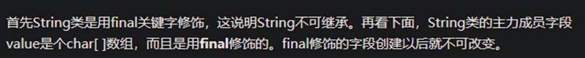

并且是私有的。

## 为什么 String 要设计为不可变的？

原因可以从四个方面说起，缓存、安全性、同步和高性能。

1. 字符串常量池

   字符串恐怕是 Java 中最常用的数据形式了，如果字符串非要谦虚地说自己是老二，就没有人敢说自己是老大。

   因此，把字符串缓存起来，并且重复使用它们会节省大量堆空间（堆内存用来存储 Java 中的对象，无论是成员变量、局部变量，还是类变量，它们指向的对象都存储在堆内存中），因为不同的字符串变量引用的是字符串常量池中的同一个对象。这也正是字符串常量池存在的目的。

   字符串常量池是 Java 虚拟机用来存储字符串的一个特殊的区域，由于字符串是不可变的，因此 Java 虚拟机可以在字符串常量池中只为同一个字符串存储一个字符串副本来节省空间。

2. 安全性

   字符串在 Java 应用程序中的使用范围非常广，几乎无处不在，比如说存储用户名、密码、数据库连接地址等等这些非常敏感的信息，因此，必须要保证 String 类的绝对安全性。

   通常情况下，用户名由客户端传递到服务器端，服务器端接收后要先对用户名进行检查，再进行其他操作，因为客户端传递过来的信息不一定值得信任。

   如果字符串是可变的，那么我们在执行 executeUpdate 更新数据库的时候，就有点不放心，因为即便是安全性检查通过了，字符串仍然有可能被修改。

3. 线程安全

   由于字符串是不可变的，因此可以在多线程之间共享，如果一个线程把字符串的值修改为另外一个，那么就会在字符串常量池中创建另外一个字符串，原有的字符串仍然会保持不变。

4. 哈希码

   字符串广泛应用于 HashMap、HashTable、HashSet 等需要哈希码作为键的数据结构中，在对这些哈希表进行操作的时候，需要频繁调用 hashCode() 方法来获取键的哈希码。

   由于字符串是不可变性，这就保证了键值的哈希值不会发生改变，因此在第一次调用 String 类的 hashCode() 方法时，就对哈希值进行了缓存，此后，就一直返回相同的值。

   https://www.zhihu.com/question/20618891

## [String类](https://so.csdn.net/so/search?q=String类&spm=1001.2101.3001.7020)型的对象，是保存在堆里还是在栈里呢？

在Java的实现中，new出来的String对象一般是放在堆中的。如果是 String s =“xxx”; 这种,那就是放在[常量池](https://so.csdn.net/so/search?q=常量池&spm=1001.2101.3001.7020)中.

## new创建对象和用字符串常量创建对象的区别

```java
public class StringDemo2 {
  public static void main(String[] args) {
    String s1 = new String("hello");
    String s2 = "hello";
    System.out.println(s1 == s2);// false
    System.out.println(s1.equals(s2));// true
  }
}
```

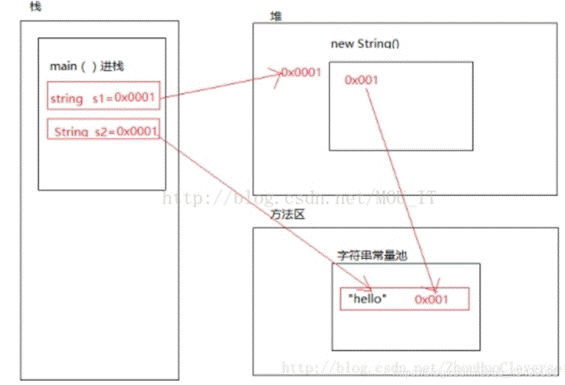

 

1. 首先，通过main（）方法进栈。

2. 然后再栈中定义一个对象s1,s1由new创建，因此去堆中开辟一个内存空间，将内存空间的引用赋值给s1，“hello”是常量，然后去[字符串](https://so.csdn.net/so/search?q=字符串&spm=1001.2101.3001.7020)常量池查看是否有hello字符串对象，没有的话分配一个空间存放hello，并且将其空间地址存入堆中new出来的空间中。

3. 在栈中定义一个对象s2，s2不是由new创建，因此去字符串常量池中查看是否有”hello”字符串对象，有则直接把“hello”的地址赋值给s2。

4. 即s1中存的是堆中分配的空间，堆中分配的空间中存的是字符串常量池中分配空间存放”hello”的空间的地址值。而s2中之中存的是字符串常量池中分配空间存放”hello”的空间的地址值。

5. 由于s1与s2中存放的地址不同，所以输出false。因为，类String重写了equals()方法，它比较的是引用类型的 的值是否相等，所以输出true。即结果为false、true。

## final、finally、finalize

- - final 用于声明属性,方法和类, 分别表示属性不可变, 方法不可覆盖, 类不可继承.
  - finally 是异常处理语句结构的一部分，表示总是执行.
  - finalize 是Object类的一个方法，在垃圾收集器执行的时候会调用被回收对象的此方法，可以覆盖此方法提供垃圾收集时的其他资源回收，例如关闭文件等. JVM不保证此方法总被调用.

## 深拷贝和浅拷贝


## 泛型中extends和super的区别

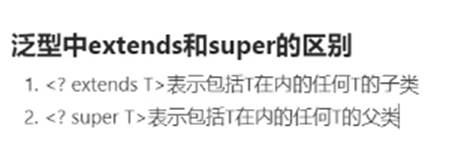