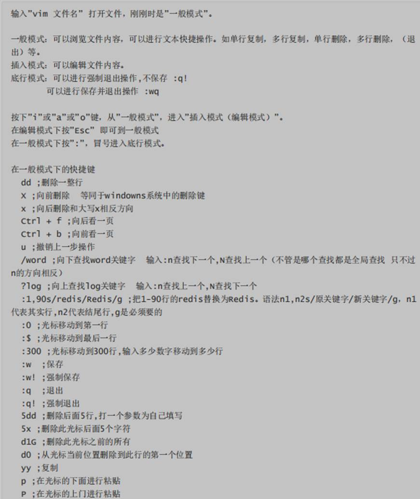
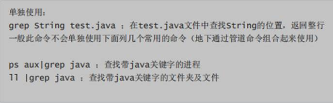
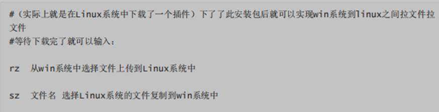
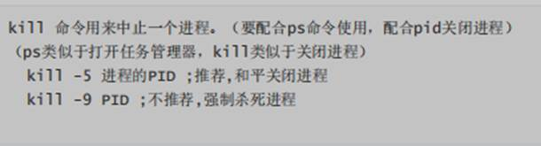
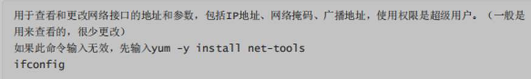
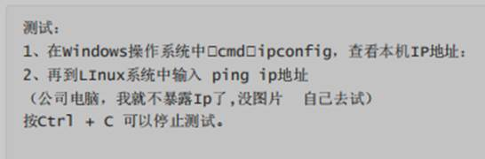
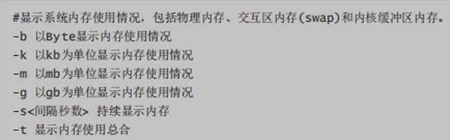
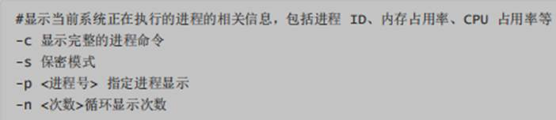
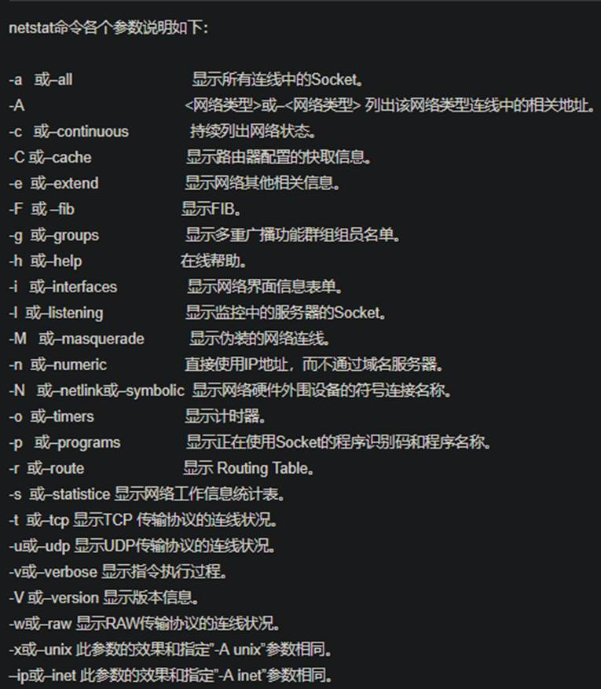

linux命令

cd （change directory：英文释义是改变目录）切换目录

pwd （print working directory：显示当前工作目录的绝对路径）

ls （ls：list的缩写，查看列表）查看当前目录下的所有文件夹（ls 只列出文件名或目录名）

[ll （ll：list的缩写，查看列表详情）查看当前目录下的所有详细信息和文件夹（ll 结果是详细,有时间,](onenote:#linux命令&section-id={44B498D6-A518-443F-8C52-13F8CE0811F2}&page-id={7D79A25B-C637-4B0E-A434-47829260B059}&object-id={9A26314E-3D14-4B11-9C65-8F3062C200F8}&E3&base-path=https://d.docs.live.net/73ef43393996c94e/文档/java/linux命令.one)

[touch （touch：创建文件）创建文件](onenote:#linux命令&section-id={44B498D6-A518-443F-8C52-13F8CE0811F2}&page-id={7D79A25B-C637-4B0E-A434-47829260B059}&object-id={9A26314E-3D14-4B11-9C65-8F3062C200F8}&E7&base-path=https://d.docs.live.net/73ef43393996c94e/文档/java/linux命令.one)

[mkdir （mkdir：创建目录） 创建目录](onenote:#linux命令&section-id={44B498D6-A518-443F-8C52-13F8CE0811F2}&page-id={7D79A25B-C637-4B0E-A434-47829260B059}&object-id={9A26314E-3D14-4B11-9C65-8F3062C200F8}&E9&base-path=https://d.docs.live.net/73ef43393996c94e/文档/java/linux命令.one)

[cat （concatenate：显示或把多个文本文件连接起来）查看文件命令（可以快捷查看当前文件的内](onenote:#linux命令&section-id={44B498D6-A518-443F-8C52-13F8CE0811F2}&page-id={7D79A25B-C637-4B0E-A434-47829260B059}&object-id={9A26314E-3D14-4B11-9C65-8F3062C200F8}&EB&base-path=https://d.docs.live.net/73ef43393996c94e/文档/java/linux命令.one)

[more （more：更多的意思）分页查看文件命令（不能快速定位到最后一页）](onenote:#linux命令&section-id={44B498D6-A518-443F-8C52-13F8CE0811F2}&page-id={7D79A25B-C637-4B0E-A434-47829260B059}&object-id={9A26314E-3D14-4B11-9C65-8F3062C200F8}&F3&base-path=https://d.docs.live.net/73ef43393996c94e/文档/java/linux命令.one)

[less （lese：较少的意思）分页查看文件命令（可以快速定位到最后一页）](onenote:#linux命令&section-id={44B498D6-A518-443F-8C52-13F8CE0811F2}&page-id={7D79A25B-C637-4B0E-A434-47829260B059}&object-id={DA9CB2AD-BC4C-4FAC-ADB7-772BA8951298}&AE&base-path=https://d.docs.live.net/73ef43393996c94e/文档/java/linux命令.one)

[tail（尾巴） 查看文件命令（看最后多少行）](onenote:#linux命令&section-id={44B498D6-A518-443F-8C52-13F8CE0811F2}&page-id={7D79A25B-C637-4B0E-A434-47829260B059}&object-id={DE16D083-F97E-4561-97C0-3A3B300829BC}&A&base-path=https://d.docs.live.net/73ef43393996c94e/文档/java/linux命令.one)

[cp（copy单词缩写，复制功能](onenote:#linux命令&section-id={44B498D6-A518-443F-8C52-13F8CE0811F2}&page-id={7D79A25B-C637-4B0E-A434-47829260B059}&object-id={DE16D083-F97E-4561-97C0-3A3B300829BC}&16&base-path=https://d.docs.live.net/73ef43393996c94e/文档/java/linux命令.one)

[mv（move单词缩写，移动功能，该文件名称功能）](onenote:#linux命令&section-id={44B498D6-A518-443F-8C52-13F8CE0811F2}&page-id={7D79A25B-C637-4B0E-A434-47829260B059}&object-id={DE16D083-F97E-4561-97C0-3A3B300829BC}&32&base-path=https://d.docs.live.net/73ef43393996c94e/文档/java/linux命令.one)

[rm（remove：移除的意思）删除文件，或文件夹](onenote:#linux命令&section-id={44B498D6-A518-443F-8C52-13F8CE0811F2}&page-id={7D79A25B-C637-4B0E-A434-47829260B059}&object-id={DE16D083-F97E-4561-97C0-3A3B300829BC}&47&base-path=https://d.docs.live.net/73ef43393996c94e/文档/java/linux命令.one)

[fifind （fifind：找到的意思）查找指定文件或目录](onenote:#linux命令&section-id={44B498D6-A518-443F-8C52-13F8CE0811F2}&page-id={7D79A25B-C637-4B0E-A434-47829260B059}&object-id={DE16D083-F97E-4561-97C0-3A3B300829BC}&A2&base-path=https://d.docs.live.net/73ef43393996c94e/文档/java/linux命令.one)

[vi （VIsual：视觉）文本编辑器 类似win的记事本 （操作类似于地下的vim命令，看底下vim 的操](onenote:#linux命令&section-id={44B498D6-A518-443F-8C52-13F8CE0811F2}&page-id={7D79A25B-C637-4B0E-A434-47829260B059}&object-id={DE16D083-F97E-4561-97C0-3A3B300829BC}&F0&base-path=https://d.docs.live.net/73ef43393996c94e/文档/java/linux命令.one)[作）](onenote:#linux命令&section-id={44B498D6-A518-443F-8C52-13F8CE0811F2}&page-id={7D79A25B-C637-4B0E-A434-47829260B059}&object-id={DE16D083-F97E-4561-97C0-3A3B300829BC}&F2&base-path=https://d.docs.live.net/73ef43393996c94e/文档/java/linux命令.one)

[vim （VI IMproved：改进版视觉）改进版文本编辑器 （不管是文件查看还是文件编辑 按 Shift + 上或](onenote:#linux命令&section-id={44B498D6-A518-443F-8C52-13F8CE0811F2}&page-id={7D79A25B-C637-4B0E-A434-47829260B059}&object-id={DE16D083-F97E-4561-97C0-3A3B300829BC}&F4&base-path=https://d.docs.live.net/73ef43393996c94e/文档/java/linux命令.one)[者下可以上下移动查看视角）](onenote:#linux命令&section-id={44B498D6-A518-443F-8C52-13F8CE0811F2}&page-id={7D79A25B-C637-4B0E-A434-47829260B059}&object-id={DE16D083-F97E-4561-97C0-3A3B300829BC}&F6&base-path=https://d.docs.live.net/73ef43393996c94e/文档/java/linux命令.one)

[| 管道命令（把多个命令组合起来使用）](onenote:#linux命令&section-id={44B498D6-A518-443F-8C52-13F8CE0811F2}&page-id={7D79A25B-C637-4B0E-A434-47829260B059}&object-id={DE16D083-F97E-4561-97C0-3A3B300829BC}&FF&base-path=https://d.docs.live.net/73ef43393996c94e/文档/java/linux命令.one)

[grep （grep ：正则表达式）正则表达式，用于字符串的搜索工作(模糊查询)。不懂可以先过](onenote:#linux命令&section-id={44B498D6-A518-443F-8C52-13F8CE0811F2}&page-id={7D79A25B-C637-4B0E-A434-47829260B059}&object-id={8DFFABF0-6FC5-459C-B2E0-2FCCF58C05C2}&19&base-path=https://d.docs.live.net/73ef43393996c94e/文档/java/linux命令.one)

[yum install -y lrzsz 命令（实现win到Linux文件互相简单上传文件）](onenote:#linux命令&section-id={44B498D6-A518-443F-8C52-13F8CE0811F2}&page-id={7D79A25B-C637-4B0E-A434-47829260B059}&object-id={8DFFABF0-6FC5-459C-B2E0-2FCCF58C05C2}&2C&base-path=https://d.docs.live.net/73ef43393996c94e/文档/java/linux命令.one)

[tar （解压 压缩 命令）](onenote:#linux命令&section-id={44B498D6-A518-443F-8C52-13F8CE0811F2}&page-id={7D79A25B-C637-4B0E-A434-47829260B059}&object-id={8DFFABF0-6FC5-459C-B2E0-2FCCF58C05C2}&3E&base-path=https://d.docs.live.net/73ef43393996c94e/文档/java/linux命令.one)

[ps （process status：进程状态，类似于windows的任务管理器）](onenote:#linux命令&section-id={44B498D6-A518-443F-8C52-13F8CE0811F2}&page-id={7D79A25B-C637-4B0E-A434-47829260B059}&object-id={8DFFABF0-6FC5-459C-B2E0-2FCCF58C05C2}&47&base-path=https://d.docs.live.net/73ef43393996c94e/文档/java/linux命令.one)

[clear 清屏命令。](onenote:#linux命令&section-id={44B498D6-A518-443F-8C52-13F8CE0811F2}&page-id={7D79A25B-C637-4B0E-A434-47829260B059}&object-id={8DFFABF0-6FC5-459C-B2E0-2FCCF58C05C2}&53&base-path=https://d.docs.live.net/73ef43393996c94e/文档/java/linux命令.one)

[kill指令](onenote:#linux命令&section-id={44B498D6-A518-443F-8C52-13F8CE0811F2}&page-id={7D79A25B-C637-4B0E-A434-47829260B059}&object-id={8DFFABF0-6FC5-459C-B2E0-2FCCF58C05C2}&5E&base-path=https://d.docs.live.net/73ef43393996c94e/文档/java/linux命令.one)

[ifconfifig命令](onenote:#linux命令&section-id={44B498D6-A518-443F-8C52-13F8CE0811F2}&page-id={7D79A25B-C637-4B0E-A434-47829260B059}&object-id={8DFFABF0-6FC5-459C-B2E0-2FCCF58C05C2}&66&base-path=https://d.docs.live.net/73ef43393996c94e/文档/java/linux命令.one)

[ping （用于检测与目标的连通性）语法：ping ip地址](onenote:#linux命令&section-id={44B498D6-A518-443F-8C52-13F8CE0811F2}&page-id={7D79A25B-C637-4B0E-A434-47829260B059}&object-id={8DFFABF0-6FC5-459C-B2E0-2FCCF58C05C2}&72&base-path=https://d.docs.live.net/73ef43393996c94e/文档/java/linux命令.one)

[free 命令 （显示系统内存）](onenote:#linux命令&section-id={44B498D6-A518-443F-8C52-13F8CE0811F2}&page-id={7D79A25B-C637-4B0E-A434-47829260B059}&object-id={8DFFABF0-6FC5-459C-B2E0-2FCCF58C05C2}&78&base-path=https://d.docs.live.net/73ef43393996c94e/文档/java/linux命令.one)

[top 命令](onenote:#linux命令&section-id={44B498D6-A518-443F-8C52-13F8CE0811F2}&page-id={7D79A25B-C637-4B0E-A434-47829260B059}&object-id={8DFFABF0-6FC5-459C-B2E0-2FCCF58C05C2}&81&base-path=https://d.docs.live.net/73ef43393996c94e/文档/java/linux命令.one)

[netstat 命令](onenote:#linux命令&section-id={44B498D6-A518-443F-8C52-13F8CE0811F2}&page-id={7D79A25B-C637-4B0E-A434-47829260B059}&object-id={8DFFABF0-6FC5-459C-B2E0-2FCCF58C05C2}&8D&base-path=https://d.docs.live.net/73ef43393996c94e/文档/java/linux命令.one)

[fifile （可查看文件类型）](onenote:#linux命令&section-id={44B498D6-A518-443F-8C52-13F8CE0811F2}&page-id={7D79A25B-C637-4B0E-A434-47829260B059}&object-id={8DFFABF0-6FC5-459C-B2E0-2FCCF58C05C2}&93&base-path=https://d.docs.live.net/73ef43393996c94e/文档/java/linux命令.one)

[重启linux](onenote:#linux命令&section-id={44B498D6-A518-443F-8C52-13F8CE0811F2}&page-id={7D79A25B-C637-4B0E-A434-47829260B059}&object-id={8DFFABF0-6FC5-459C-B2E0-2FCCF58C05C2}&9D&base-path=https://d.docs.live.net/73ef43393996c94e/文档/java/linux命令.one)

[关机linux](onenote:#linux命令&section-id={44B498D6-A518-443F-8C52-13F8CE0811F2}&page-id={7D79A25B-C637-4B0E-A434-47829260B059}&object-id={8DFFABF0-6FC5-459C-B2E0-2FCCF58C05C2}&9F&base-path=https://d.docs.live.net/73ef43393996c94e/文档/java/linux命令.one)

[同步时间命令](onenote:#linux命令&section-id={44B498D6-A518-443F-8C52-13F8CE0811F2}&page-id={7D79A25B-C637-4B0E-A434-47829260B059}&object-id={8DFFABF0-6FC5-459C-B2E0-2FCCF58C05C2}&A1&base-path=https://d.docs.live.net/73ef43393996c94e/文档/java/linux命令.one)

[更改为北京时间命令](onenote:#linux命令&section-id={44B498D6-A518-443F-8C52-13F8CE0811F2}&page-id={7D79A25B-C637-4B0E-A434-47829260B059}&object-id={8DFFABF0-6FC5-459C-B2E0-2FCCF58C05C2}&A3&base-path=https://d.docs.live.net/73ef43393996c94e/文档/java/linux命令.one)

[查看时间命令：](onenote:#linux命令&section-id={44B498D6-A518-443F-8C52-13F8CE0811F2}&page-id={7D79A25B-C637-4B0E-A434-47829260B059}&object-id={8DFFABF0-6FC5-459C-B2E0-2FCCF58C05C2}&A5&base-path=https://d.docs.live.net/73ef43393996c94e/文档/java/linux命令.one)

[netstat查看服务及监听端口详解](onenote:#linux命令&section-id={44B498D6-A518-443F-8C52-13F8CE0811F2}&page-id={7D79A25B-C637-4B0E-A434-47829260B059}&object-id={01FAA507-E64F-4FC0-833B-507A3B2C60FC}&11&base-path=https://d.docs.live.net/73ef43393996c94e/文档/java/linux命令.one)

cd （change directory：英文释义是改变目录）切换目录 

cd ../ ;跳到上级目录 

cd /opt ;不管现在到那直接跳到指定的opt文件夹中 

cd ~ ;切换当前用户的家目录。root用户的家目录就是root目录。 

pwd （print working directory：显示当前工作目录的绝对路径） 

ls （ls：list的缩写，查看列表）查看当前目录下的所有文件夹（ls 只列出文件名或目录名） 

ls -a ;显示所有文件夹,隐藏文件也显示出来 

ls -R ;连同子目录一起列出来 

ll （ll：list的缩写，查看列表详情）查看当前目录下的所有详细信息和文件夹（ll 结果是详细,有时间, 

是否可读写等信息） 

ls -a ;显示所有文件夹,隐藏文件也显示出来 

ls-R ;连同子目录一 起列出来 

touch （touch：创建文件）创建文件 

touch test.txt ;创建test.txt文件 

touch /opt/java/test.java ;在指定目录创建test.java文件 

 

mkdir （mkdir：创建目录） 创建目录 

mkdir 文件夹名称 ;在此目录创建文件夹 

mkdir /opt/java/jdk ;在指定目录创建文件夹 

 

cat （concatenate：显示或把多个文本文件连接起来）查看文件命令（可以快捷查看当前文件的内 

容）（不能快速定位到最后一页） 

cat lj.log ;快捷查看文件命令 

Ctrl + c ;暂停显示文件 

Ctrl + d ;退出查看文件命令

more （more：更多的意思）分页查看文件命令（不能快速定位到最后一页） 

回车：向下n行，需要定义，默认为1行。 

空格键：向下滚动一屏或Ctrl+F 

B：返回上一层或Ctrl+B 

q：退出more 

 

less （lese：较少的意思）分页查看文件命令（可以快速定位到最后一页） 

 

less -m 显示类似于more命令的百分比。 

less -N 显示每行的行号。(大写的N) 

两参数一起使用如：less -mN 文件名，如此可分页并显示行号。 

空格键：前下一页或page down。 

回车：向下一行。

b：后退一页 或 page up。 

q：退出。 

d：前进半页。 

u：后退半页 

 

tail（尾巴） 查看文件命令（看最后多少行） 

tail -10 ;文件名 看最后10行

 

cp（copy单词缩写，复制功能

cp /opt/java/java.log /opt/logs/ ;把java.log 复制到/opt/logs/下 

cp /opt/java/java.log /opt/logs/aaa.log ;把java.log 复制到/opt/logs/下并且改名为 aaa.log 

cp -r /opt/java /opt/logs ;把文件夹及内容复制到logs文件中 ） 

 

mv（move单词缩写，移动功能，该文件名称功能）

mv /opt/java/java.log /opt/mysql/ ;移动文件到mysql目录下 

mv java.log mysql.log ;把java.log改名为mysql.log 

rm（remove：移除的意思）删除文件，或文件夹

-f或--force 强制删除文件或目录。删除文件不包括文件夹的文件 

-r或-R或--recursive 递归处理，将指定目录下的所有文件及子目录一并删除。 

-rf 强制删除文件夹及内容 

rm 文件名 ;安全删除命令 （yes删除 no取消） 

rm -rf 强制删除文件夹及内容 

rm -rf * 删除当前目录下的所有内容。 

rm -rf /* 删除Linux系统根目录下所有的内容。系统将完蛋。

 

fifind （fifind：找到的意思）查找指定文件或目录

\* 表示0~多个任意字符。 

find -name 文件名;按照指定名称查找在当前目录下查找文件 

find / -name 文件名按照指定名称全局查找文件 

find -name '*文件名' ;任意前缀加上文件名在当前目录下查找文件 

find / -name '*文件名*' ;全局进行模糊查询带文件名的文件 

 

vi （VIsual：视觉）文本编辑器 类似win的记事本 （操作类似于地下的vim命令，看底下vim 的操 

作） 

vim （VI IMproved：改进版视觉）改进版文本编辑器 （不管是文件查看还是文件编辑 按 Shift + 上或 

者下可以上下移动查看视角） 

| 管道命令（把多个命令组合起来使用） 

管道命令的语法：命令1 | 命令2 | 命令3。 

grep （grep ：正则表达式）正则表达式，用于字符串的搜索工作(模糊查询)。不懂可以先过

 

yum install -y lrzsz 命令（实现win到Linux文件互相简单上传文件） 

tar （解压 压缩 命令） 

ps （process status：进程状态，类似于windows的任务管理器）

clear 清屏命令。

kill指令

ifconfifig命令

ping （用于检测与目标的连通性）语法：ping ip地址

free 命令 （显示系统内存） 

top 命令

netstat 命令 

![*Linux  netStat [-acCeFghi IMnNoprstuVvWx] [--ip] ](linux命令/clip_image022.jpg)

fifile （可查看文件类型） 

file 文件名 

重启linux

Linux centos 重启命令：reboot 

关机linux

Linux centos 关机命令：halt 

同步时间命令 

ntpdate ntp1.aliyun.com 

更改为北京时间命令 

rm -rf /etc/localtime 

ln -s /usr/share/zoneinfo/Asia/Shanghai /etc/localtime 

查看时间命令： 

date

netstat查看服务及监听端口详解

https://blog.csdn.net/wade3015/article/details/90779669

 