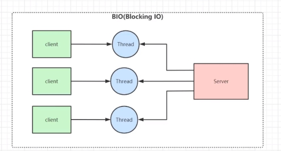

# 基础

## 数据结构

### 数据结构及其使用场景

Redis还有更高级得数据结构，比如：HyperLogLog、Geo、BloomFilter 这几个数据结构

1. String底层实现：

   如果一个字符串对象保存的是整数值， 并且这个整数值可以用 long 类型来表示， 那么字符串对象会将整数值保存在字符串对象结构的 ptr 属性里面（将 void* 转换成 long ）， 并将字符串对象的编码设置为 int 。

   如果字符串对象保存的是一个字符串值， 并且这个字符串值的长度大于 39 字节， 那么字符串对象将使用一个简单动态字符串（SDS）来保存这个字符串值， 并将对象的编码设置为 raw。

   如果字符串对象保存的是一个字符串值， 并且这个字符串值的长度小于等于 39 字节， 那么字符串对象将使用 embstr 编码的方式来保存这个字符串值。

2. List底层实现：

   列表对象的编码可以是 ziplist 或者 linkedlist 。

   列表对象保存的所有字符串元素的长度都小于 64 字节并且保存的元素数量小于 512 个，使用 ziplist 编码；否则使用 linkedlist；

3. Hash底层实现:

   哈希对象的编码可以是 ziplist 或者 hashtable 。

   哈希对象保存的所有键值对的键和值的字符串长度都小于 64 字节并且保存的键值对数量小于 512 个，使用ziplist 编码；否则使用hashtable；

4. Set底层实现：

   集合对象的编码可以是 intset 或者 hashtable 。

   集合对象保存的所有元素都是整数值并且保存的元素数量不超过 512 个，使用intset编码；否则使用hashtable；

5. Sorted Set底层实现：

   有序集合的编码可以是 ziplist 或者 skiplist

   有序集合保存的元素数量小于 128 个并且保存的所有元素成员的长度都小于 64 字节。使用 ziplist 编码；否则使用skiplist；

6. HyperLogLog

   redis HyperLogLog 是用来做基数统计的算法，HyperLogLog 的优点是，在输入元素的数量或者体积非常非常大时，计算基数所需的空间总是固定的、并且是很小的。

   在 Redis 里面，每个 HyperLogLog 键只需要花费 12 KB 内存，就可以计算接近 2^64 个不同元素的基 数。这和计算基数时，元素越多耗费内存就越多的集合形成鲜明对比。

   但是，因为 HyperLogLog 只会根据输入元素来计算基数，而不会储存输入元素本身，所以 HyperLogLog 不能像集合那样，返回输入的各个元素。 

   应用场景：

   可以用来统计网站的登陆人数以及其他指标

7. GEO

   基本概念： 

   在 Redis 3.2 版本中新增了一种叫 geo 的数据结构，它主要用来存储地理位置信息，并对存储的信息进行操作。 

   使用： 

   geoadd 用于存储指定的地理空间位置，可以将一个或多个经度(longitude)、纬度(latitude)、位置名称(member)添加到指定的 key 中。

8. BloomFilter

   基本概念： 

   一种数据结构，是由一串很长的二进制向量组成，可以将其看成一个二进制数组。既然是二进制，那么里面存放的不是0，就是1，但是初始默认值都是0。他的主要作用是：判断一个元素是否在某个集合中。比如说，我想判断20亿的号码中是否存在某个号码，如果直接插DB，那么数据量太大时间会很慢；如果将20亿数据放到 缓存中，缓存也装不下。这个时候用 布隆过滤器 最合适了，布隆过滤器的原理是：

   添加元素 
   当要向布隆过滤器中添加一个元素key时，我们通过多个hash函数，算出一个值，然后将这个值所在的方格置为1。

   

   判断元素是否存在：
   	判断元素是否存在，是先将元素经过多个hash函数计算，计算到多个下标值，然后判断这些下标对应的元素值是否都为1，如果存在不是 1 的，那么元素肯定不在集合中；如果都是 1，那么元素大概率在集合中，并不能百分之百肯定元素存在集合中，因为多个不同的数据通过hash函数算出来的结果是会有重复的，所以会存在某个位置是别的数据通过hash函数置为的1。 
    总的来说：布隆过滤器可以判断某个数据一定不存在，但是无法判断一定存在。

   布隆过滤器的优缺点：

   ​	优点：优点很明显，二进制组成的数组，占用内存极少，并且插入和查询速度都足够快。

   ​	缺点：随着数据的增加，误判率会增加；还有无法判断数据一定存在；另外还有一个重要缺点，无法删除数据。

   应用场景：

   ​	解决缓存穿透问题：一般得查询场景都是先去查询缓存，如果缓存没有，那么就去 DB 查询，如果查到了，先存在 缓存 中，然后返回给调用方。如果查不到就返回空。这种情况如果有人频繁的请求缓存中没有得数据，比如id = -1 得数据，那么会对 DB 造成极大得压力，这种情况就可以使用 redis 得布隆过滤器了，可以先将可能得id都存在布隆过滤器中，当查询来的时候，先去布隆过滤器查，如果查不到直接返回，不请求缓存以及DB，如果存在 布隆过滤器 中，那么才去缓存中取数据。

   ​	黑名单校验：可以将黑名单中得ip放入到布隆过滤器中，这样不用每次来都去 db 中查询了。

### Hashmap

扩容时大小：ht[1] 哈希表大小为第一个大于等于 ht[0].used*2 的 2^n(2的n 次方幂) used：当前有多少个键值对

缩容时大小：ht[1] 哈希表大小为第一个大于等于 ht[0].used的 2^n(2的n 次方幂)

扩容的步骤如下：

1. 为字典ht[1]哈希表分配合适的空间；

2. 将ht[0]中所有的键值对rehash到ht[1]：rehash 指的是重新计算键的哈希值和索引值， 然后将键值对 放置到 ht[1] 哈希表的指定位置上；

3. 当 ht[0] 包含的所有键值对都迁移到了 ht[1] 之后 （ht[0] 变为空表）， 释放 ht[0] ， 将 ht[1] 设置 为 ht[0] ， 并在 ht[1] 新创建⼀个空⽩哈希表， 为下⼀次 rehash 做准备。

哈希渐进式rehash的详细步骤：

1. 为ht[1]分配空间，让字典同时持有ht[0]和ht[1]两个哈希表。

2. 在字典中维持一个索引计数器变量rehashidx，并将它的指设置为0，表示rehash工作正式开始。

3. 在rehash进行期间，每次对字典执行添加、删除、查找或者更新操作时，程序除了执行指定的操作以外，还会顺带将ht[0]哈希表在rehashidx索引上的所有键值对rehash到ht[1]，当rehash工作完成之后，程序将rehashidx属性的值加一。

4. 随着字典操作的不断执行，最终在某个时间点，ht[0]的所有键值对都会被rehash至ht[1]，这时程序将rehashidx属性设置为-1，表示rehash已经操作完成 ，h[1]变为h[0]

在 Redis 的实现里，扩容缩容有三条规则：

- 当 Redis 没有进行 BGSAVE 相关操作，且 负载因子>1的时候进行扩容。

- 当 Redis 进行 BGSAVE 相关操作,当负载因子>5的时候，强行进行扩容。

- 当负载因子<0.1的时候，进行缩容。

  负载因子=哈希表以保存节点数量 / 哈希表的大小.

 **Bgsave** 命令用于在后台异步保存当前数据库的数据到磁盘。

[https://juejin.cn/post/6844904049578377230#%E6%89%A9%E5%AE%B9%E4%B8%8E%E7%BC%A9%E5%AE%B9](https://juejin.cn/post/6844904049578377230#扩容与缩容)

### **压缩列表**ziplist

ziplist是一种连续，无序的数据结构。压缩列表是 Redis 为了节约内存而开发的， 由一系列特殊编码的连续内存块组成的顺序型（sequential）数据结构。

组成：

| 属性    | 类型     | 长度 | 用途                                                         |
| ------- | -------- | ---- | ------------------------------------------------------------ |
| zlbytes | uint_32t | 4B   | 记录整个压缩列表占用的内存字节数：在对压缩列表进行内存重分配，  或者计算 zlend的位置时使用 |
| zltail  | uint_32t | 4B   | 记录压缩列表表尾节点距离压缩列表的起始地址有多少字节：通过这个偏移量，程序无须遍历整个压缩列表就可以确定表尾节点的地址。 |
| zllen   | uint_16t | 2B   | 记录了压缩列表包含的节点数量：  当这个属性的值小于UINT16_ MAX （65535）时，  这个属性的值就是压缩列表包含节点的数量； 当这个值等于 UINT16_MAX 时， 节点的真实数量需要遍历整个压缩列表才能计算得出。 |
| entryX  | 列表节点 | 不定 | 压缩列表包含的各个节点，节点的长度由节点保存的内容决定。     |
| zlend   | uint_8t  | 1B   | 特殊值 0xFF （十进制 255 ），用于标记压缩列表的末端。        |

压缩列表节点的构成　一个压缩列表可以包含任意多个节点（entry）， 每个节点可以保存一个字节数组或者一个整数值（小整数值或者长度比较短的字符串）。

- 节点的 previous_entry_length 属性以字节为单位， 记录了压缩列表中前一个节点的长度

- 节点的 encoding 属性记录了节点的 content 属性所保存数据的类型以及长度： 

- 节点的 content 属性负责保存节点的值， 节点值可以是一个字节数组或者整数， 值的类型和长度由节点的 encoding 属性决定。

### 跳表

https://www.cnblogs.com/lixinjie/p/a-post-about-skiplist.html

查找流程：

插入流程：

### 跳表和红黑树的对比_1

- 1. 在做范围查找的时候，平衡树比 skiplist 操作要复杂。在平衡树上，我们找到指定范围的小值之后，还需要以中序遍历的顺序继续寻找其它不超过大值的节点。如果不对平衡树进行一定的改造，这里的中序遍历并不容易实现。而在 skiplist 上进行范围查找就非常简单，只需要在找到小值之后，对第 1 层链表进行若干步的遍历就可以实现。
  2. 查找单个 key ， skiplist 和平衡树的时间复杂度都为 O(log n) ，大体相当；而哈希表在保持较低的哈希值冲突概率的前提下，查找时间复杂度接近 O(1) ，性能更高一些。所以我们平常使用的各种 Map 或 dictionary 结构，大都是基于哈希表实现的。
  3. 平衡树的插入和删除操作可能引发子树的调整，逻辑复杂，而 skiplist 的插入和删除只需要修改相邻节点的指针，操作简单又快速。
  4. 从内存占用上来说， skiplist 比平衡树更灵活一些。一般来说，平衡树每个节点包含 2 个指针（分别指向左右子树），而 skiplist 每个节点包含的指针数目平均为 1/(1-p) ，具体取决于参数 p 的大小。如果像 Redis 里的实现一样，取 p=1/4 ，那么平均每个节点包含 1.33 个指针，比平衡树更有优势。
  5. 从算法实现难度上来比较， skiplist 比平衡树要简单得多。

## 单线程还是多线程？

## BIO，NIO，Epoll，IO多路复用

IO多路复用：单线程或单进程同时监测若干个文件描述符是否可以执行IO操作的能力。

1. 普通IO:

2. BIO:同步阻塞

来一个连接新建一个线程处理

这是服务端程序：划线的地方都会阻塞程序：在接受连接（accept）的时候，若没有客户端连接，accept就会阻塞，有连接后运行，执行到read也会阻塞，因为没有客户端发送消息，发了消息后就会运行

问题：没法处理多个连接，只有轮训到accept的时候才能继续接受连接

开新线程处理：来一个请求开一个线程，会严重影响服务器性能  c10k问题：线程太多了

用线程池限制了线程数量：并发就会减弱，

还有一个严重的问题就是阻塞，客户端迟迟不发请求，那么就会影响造成线程开销浪费很多，每个线程处理一个连接，那么很多线程就一直阻塞着

3. NIO：同步非阻塞

简单版本：

设置socketChannel为非阻塞：即使客户端没有发数据，read函数不会阻塞

socketChannel会放在list中，轮训list

问题：10万个连接，只有100个有收发数据，那么每次需要循环10万个，造成了时间浪费

解决：令拿一个集合放那些有请求的连接：selector（多路复用器）

一个selectionkey对应着一个channel，通过selectionkey就能找到channel

selector.select会阻塞等待连接事件，当有连接时，则运行

select也会阻塞等待读写事件，当两个客户端发生了读写事件时，那么这时候selectionKeys集合里面就是两个，那么就可以轮训处理这两个事件

如果是连接事件，也会把客户端的socketChannel注册到selector，监听读写事件

其实创建的这个selector，linux操作系统返回的就是epoll，linux操作系统一切皆文件，返回的的epfd（ep file discription），就是epoll

4. AIO

epol_ctl才是真正监听事件的方法

fd：Channel的文件描述符

select监听事件

epoll_wait:阻塞等待事件的发生，有连接读写事件才会运行

channel放着连接，rdlist放着事件的列表

阻塞等待事件的发生

3者区别：select每次轮询连接集合，有上限，poll：每次轮询连接集合，无上限，epoll：每次轮询的是有事件发生的连接，无上限

## 主从复制

**当启动一个 slave node 的时候，它会发送一个 PSYNC 命令给 master node。**

如果这是 slave node 初次连接到 master node，那么会触发一次 full resynchronization 全量复制。此时 master 会启动一个后台线程，开始生成一份 RDB 快照文件，

同时还会将从客户端 client 新收到的所有写命令缓存在内存中。RDB 文件生成完毕后， master 会将这个 RDB 发送给 slave，slave 会先写入本地磁盘，然后再从本地磁盘加载到内存中，

接着 master 会将内存中缓存的写命令发送到 slave，slave 也会同步这些数据。

slave node 如果跟 master node 有网络故障，断开了连接，会自动重连，连接之后 master node 仅会复制给 slave 部分缺少的数据。

https://www.cnblogs.com/renpingsheng/p/9796899.html

## 部分同步

部分复制主要是 Redis 针对全量复制的过高开销做出的一种优化措施，使用 psync {runId} {offset} 命令实现。当从节点正在复制主节点时，如果出现网络闪断或者命令丢失等异常情况时，从节点会向主节点要求补发丢失的命令数据，如果主节点的复制积压缓冲区存在这部分数据则直接发送给从节点，这样就保证了主从节点复制的一致性。补发的这部分数据一般远远小于全量数据，所以开销很小。

 当主从节点之间网络出现中断时，如果超过了 repl-timeout 时间，主节点会认为从节点故障并中断复制连接。

 主从连接中断期间主节点依然响应命令，但因复制连接中断命令无法发送给从节点，不过主节点内部存在复制积压缓冲区( repl-backlog-buffer )，依然可以保存最近一段时间的写命令数据，默认最大缓存 1MB。

 当主从节点网络恢复后，从节点会再次连上主节点。

 当主从连接恢复后，由于从节点之前保存了自身已复制的偏移量和主节点的运行ID。因此会把它们作为 psync 参数发送给主节点，要求进行补发复制操作。

 主节点接到 psync 命令后首先核对参数 runId 是否与自身一致，如果一致，说明之前复制的是当前主节点；之后根据参数 offset 在自身复制积压缓冲区查找，如果偏移量之后的数据存在缓冲区中，则对从节点发送 +CONTINUE 响应，表示可以进行部分复制。

 主节点根据偏移量把复制积压缓冲区里的数据发送给从节点，保证主从复制进入正常状态。

## 集群方案

**主从复制模式**

-  Sentinel（哨兵）模式

-  Cluster 模式

**主从复制机制的目的有两个**

-  一个是读写分离，分担 "master" 的读写压力

-  一个是方便做容灾恢复

1. 从数据库启动成功后，连接主数据库，发送 SYNC 命令；

2.  主数据库接收到 SYNC 命令后，开始执行 BGSAVE 命令生成 RDB 文件并使用缓冲区记录此后执行的所有写命令；

3.  主数据库 BGSAVE 执行完后，向所有从数据库发送快照文件，并在发送期间继续记录被执行的写命令；

4.  从数据库收到快照文件后丢弃所有旧数据，载入收到的快照；

5.  主数据库快照发送完毕后开始向从数据库发送缓冲区中的写命令；

6.  从数据库完成对快照的载入，开始接收命令请求，并执行来自主数据库缓冲区的写命令；（从数据库初始化完成）

7.  主数据库每执行一个写命令就会向从数据库发送相同的写命令，从数据库接收并执行收到的写命令（从数据库初始化完成后的操作）

8.  出现断开重连后，2.8之后的版本会将断线期间的命令传给重数据库，增量复制。

9.  主从刚刚连接的时候，进行全量同步；全同步结束后，进行增量同步。当然，如果有需要，slave 在任何时候都可以发起全量同步。Redis 的策略是，无论如何，首先会尝试进行增量同步，如不成功，要求从机进行全量同步。

**主从复制缺点**

 Redis不具备自动容错和恢复功能，主机从机的宕机都会导致前端部分读写请求失败，需要等待机器重启或者手动切换前端的IP才能恢复（也就是要人工介入）；

-  主机宕机，宕机前有部分数据未能及时同步到从机，切换IP后还会引入数据不一致的问题，降低了系统的可用性；如果多个 Slave 断线了，需要重启的时候，尽量不要在同一时间段进行重启。因为只要 Slave 启动，就会发送sync 请求和主机全量同步，当多个 Slave 重启的时候，可能会导致 Master IO 剧增从而宕机。

-  Redis 较难支持在线扩容，在集群容量达到上限时在线扩容会变得很复杂；

### **Sentinel**（哨兵）**模式**

哨兵模式的作用:通过发送命令，让 Redis 服务器返回监控其运行状态，包括主服务器和从服务器；当哨兵监测到 master 宕机，会自动将 slave 切换成 master ，然后通过发布订阅模式通知其他的从服务器，修改配置文件，让它们切换主机；一个哨兵进程对Redis服务器进行监控，也可能会出现问题，为此，我们可以使用多个哨兵进行监控。各个哨兵之间还会进行监控，这样就形成了多哨兵模式。

**故障切换的过程**

假设主服务器宕机，哨兵1先检测到这个结果，系统并不会马上进行 failover 过程，仅仅是哨兵1主观的认为主服务器不可用，这个现象成为**主观下线**。当后面的哨兵也检测到主服务器不可用，并且数量达到一定值时，那么哨兵之间就会进行一次投票，投票的结果由一个哨兵发起，进行 failover 操作。切换成功后，就会通过发布订阅模式，让各个哨兵把自己监控的从服务器实现切换主机，这个过程称为**客观下线**。这样对于客户端而言，一切都是透明的。

**哨兵模式的优缺点**

- 优点：

   哨兵模式是基于主从模式的，所有主从的优点，哨兵模式都具有。

   主从可以自动切换，系统更健壮，可用性更高(可以看作自动版的主从复制)。

- 缺点：

   Redis较难支持在线扩容，在集群容量达到上限时在线扩容会变得很复杂。

### Cluster **集群模式**（Redis官方）

实现了 Redis 的分布式存储，也就是说每台Redis节点上存储不同的内容。

集群的数据分片

Redis 集群没有使用一致性 hash，而是引入了哈希槽【hash slot】的概念。

Redis 集群有16384 个哈希槽，每个 key 通过 CRC16 校验后对 16384 取模来决定放置哪个槽。集群的每个节点负责一部分hash槽，举个例子，比如当前集群有3个节点，那么：

-  节点 A 包含 0 到 5460 号哈希槽

-  节点 B 包含 5461 到 10922 号哈希槽

-  节点 C 包含 10923 到 16383 号哈希槽

**Redis**集群的主从复制模型

为了保证高可用，redis-cluster集群引入了主从复制模型，一个主节点对应一个或者多个从节点，当主节点宕机的时候，就会启用从节点。当其它主节点 ping 一个主节点 A 时，如果半数以上的主节点与 A 通信超时，那么认为主节点 A 宕机了。如果主节点 A 和它的从节点 A1 都宕机了，那么该集群就无法再提供服务了。

https://juejin.cn/post/6844904178154897415

## 持久化机制

怎样保证子进程持久化的时候主进程会处理新的写请求时持久化不会乱：copyandwrite机制，主进程不会直接操作父子共享内存，而是数据复制出来执行，确保子进程是5:00的数据而不是5:01的数据

## 内存淘汰机制

通过定期删除和惰性删除并不能删掉redis中全部的过期key，所以需要通过另外的机制来确保内存的可用性

## 事务

redis可以通过MULTI,EXEC,DISCARD,WATCH等命令来实现事务

Redis 是不⽀持 roll back 的，因⽽不满⾜原⼦性的（⽽且不满⾜持性）。

# 应用

## **缓存雪崩**

缓存在某一个时刻出现大规模的key失效，大量的请求打在了数据库上面

**问题分析：**

两种可能：第一种是Redis宕机，第二种可能就是采用了相同的过期时间。

解决方案：

1. 事前：

   ① 均匀过期：设置不同的过期时间，让缓存失效的时间尽量均匀，避免相同的过期时间导致缓存雪崩，造成大量数据库的访问。

   ② 分级缓存：第一级缓存失效的基础上，访问二级缓存，每一级缓存的失效时间都不同。

   ③ 热点数据缓存永远不过期。

   永不过期实际包含两层意思：

   ​	物理不过期，针对热点key不设置过期时间

   ​	逻辑过期，把过期时间存在key对应的value里，如果发现要过期了，通过一个后台的异步线程进行缓存的构建

   ④ 保证Redis缓存的高可用，防止Redis宕机导致缓存雪崩的问题。可以使用 主从+ 哨兵，Redis集群来避免 Redis 全盘崩溃的情况。

2. 事中：

   ① 互斥锁：在缓存失效后，通过互斥锁或者队列来控制读数据写缓存的线程数量，比如某个key只允许一个线程查询数据和写缓存，其他线程等待。这种方式会阻塞其他的线程，此时系统的吞吐量会下降,那么我们可以在第一个查询数据的请求上使用一个 互斥锁来锁住它。其他的线程走到这一步拿不到锁就等着，等第一个线程查询到了数据，然后做缓存。后面的线程进来发现已经有缓存了，就直接走缓存。

   ② 使用熔断机制，限流降级。当流量达到一定的阈值，直接返回“系统拥挤”之类的提示，防止过多的请求打在数据库上将数据库击垮，至少能保证一部分用户是可以正常使用，其他用户多刷新几次也能得到结果。

3. 事后：

   ① 开启Redis持久化机制，尽快恢复缓存数据，一旦重启，就能从磁盘上自动加载数据恢复内存中的数据。

## **缓存击穿**

缓存击穿是某个热点的key失效

**问题分析：**

两个方面解决，第一是否可以考虑热点key不设置过期时间，第二是否可以考虑降低打在数据库上的请求数量。

解决方案：

- 热点数据缓存永远不过期。

- 互斥锁：在缓存失效后，通过互斥锁或者队列来控制读数据写缓存的线程数量，比如某个key只允许一个线程查询数据和写缓存，其他线程等待。这种方式会阻塞其他的线程，此时系统的吞吐量会下降

## **缓存穿透**

用户请求的数据在缓存中不存在即没有命中，同时在数据库中也不存在，导致用户每次请求该数据都要去数据库中查询一遍。

**问题分析：**

缓存穿透的关键在于在Redis中查不到key值，它和缓存击穿的根本区别在于传进来的key在Redis中是不存在的。

解决方案：

（1）软件层面防止

（2）将无效的key存放进Redis中,并设置其过期时间极短

（3）使用布隆过滤器

## 缓存预热

缓存预热是指系统上线后，提前将相关的缓存数据加载到缓存系统。

缓存预热解决方案：

（1）数据量不大的时候，工程启动的时候进行加载缓存动作；

（2）数据量大的时候，设置一个定时任务脚本，进行缓存的刷新；

（3）数据量太大的时候，优先保证热点数据进行提前加载到缓存。

## **缓存降级**

缓存降级是指缓存失效或缓存服务器挂掉的情况下，不去访问数据库，直接返回默认数据或访问服务的内存数据。

https://blog.csdn.net/a745233700/article/details/88088669

## **如何保证Redis和数据库的数据一致**

删缓存失败了怎么办：重试机制

方案1：

流程如下所示

（1）更新数据库数据；

（2）缓存因为种种问题删除失败

（3）将需要删除的 key 发送至消息队列

（4）自己消费消息，获得需要删除的 key

（5）继续重试删除操作，直到成功

方案2：

流程如下图所示：

（1）更新数据库数据

（2）数据库会将操作信息写入 binlog 日志当中

（3）订阅程序提取出所需要的数据以及 key

（4）另起一段非业务代码，获得该信息

（5）尝试删除缓存操作，发现删除失败

（6）将这些信息发送至消息队列

（7）重新从消息队列中获得该数据，重试操作。

https://xie.infoq.cn/article/47241d099404a1565e168fad4

https://segmentfault.com/a/1190000037611692另一种思路

方案3：异步更新缓存(基于订阅binlog的同步机制)

技术整体思路：

MySQL binlog增量订阅消费+消息队列+增量数据更新到redis

1. 读Redis：热数据基本都在Redis

2. 写MySQL:增删改都是操作MySQL

3. 更新Redis数据：MySQ的数据操作binlog，来更新到Redis

   3.1 数据操作主要分为两大块：

   ​	一个是全量(将全部数据一次写入到redis)

   ​	一个是增量（实时更新）

   ​	这里说的是增量,指的是mysql的update、insert、delate变更数据。

   3.2 读取binlog后分析 ，利用消息队列,推送更新各台的redis缓存数据。

   这样一旦MySQL中产生了新的写入、更新、删除等操作，就可以把binlog相关的消息推送至Redis，Redis再根据binlog中的记录，对Redis进行更新。

   其实这种机制，很类似MySQL的主从备份机制，因为MySQL的主备也是通过binlog来实现的数据一致性。

   使用实例：canel

## **设计一个分布式锁**

## 如何配置key的过期时间，实现原理是什么

SETEX KEY_NAME TIMEOUT VALUE

**原理：时间事件**

Redis的时间事件分为两类：

1. 定时事件：让一段程序在指定的时间之后执行一次。
2. 周期性事件：让一段程序每隔指定时间就执行一次。

一个时间事件主要由以下三个属性组成：

1. id：服务器为时间事件创建的全局唯一ID（标识号）。ID号按从小到大的顺序递增。
2. when：毫秒精度的UNIX时间戳。记录了时间事件到达时间。
3. timeProc：时间处理器，一个函数。当时间事件到达时，服务器就会调用相应的处理器来处理事件。
            服务器将所有时间都放在一个无序列表中，每当时间事件执行器运行时，它遍历整个链表查找所有已到达的时间事件，并调用相应的时间处理器。
            无序指的是不按照when属性值进行排序，由于新创建的时间事件是插入到链表的表头，所以链表中时间事件是按照id属性降序排序的。

一个保存了三个时间事件链表的例子：

注： 由于没有按照执行时间进行排序，所以时间事件执行器运行时，它必须遍历链表中的所有时间事件，这样才能确保服务器中所有已到达的时间事件都会被处理。

# 开放性问题

## **为什么性能非常高**

Redis性能非常高的原因主要有以下几点：

\- 内存存储：Redis是使用内存(in-memeroy)存储,没有磁盘IO上的开销

\- 单线程实现：Redis使用单个线程处理请求，避免了多个线程之间线程切换和锁资源争用的开销

\- 非阻塞IO：Redis使用多路复用IO技术，在poll，epool，kqueue选择最优IO实现

\- 优化的数据结构：Redis有诸多可以直接应用的优化数据结构的实现，应用层可以直接使用原生的数据结构提升性能

https://segmentfault.com/a/1190000022088928

时间处理器：看是读事件还是写事件

### 并发量数据

单机压测

环境：windows10 64位、i5 8250U + 8G 内存。 redis单实例

先打开redis， 执行以下命令

./redis-benchmark -r 1000000 -n 2000000 -t get,set,lpush,lpop -P 16 -q

14万左右并发

截一张官网的测试结果：

55万并发

原文链接：https://blog.csdn.net/sishenhzy/article/details/100918712

## **海量数据下如何快速查找一条记录**

## 为什么使用缓存？

高性能

对于更新频率不高并且读取频率比较大的数据，没必要每次都读取数据库。第一次读取以后，将数据放入缓存，后面再读取数据则直接从缓存获取，提高系统性能。

高并发

数据库本身并发量是非常有限的，mysql的qps一般是几千左右，如果所有请求都直接打到数据库，数据库很有可能会直接挂掉。Redis是直接基于内存进行操作的，天生就是支持高并发。根据上一篇的压测结果，单机redis并发都是几十万级别的，并发相当高。

原文链接：https://blog.csdn.net/sishenhzy/article/details/101029114

## 在项目中是如何使用缓存的

对于项目中一些读取频率比较高的，同时数据改变频率比较小的数据，可以放入缓存中，提高并发和性能。如果数据发生改变，更新数据库的同时更新缓存。

比如电商的详情页数据，项目中接口的返回结果等等

来自 <https://blog.csdn.net/sishenhzy/article/details/101029114?spm=1001.2014.3001.5501>

## 使用缓存的不良后果？

缓存与数据库双写不一致

缓存雪崩、缓存穿透

缓存并发竞争

来自 <https://blog.csdn.net/sishenhzy/article/details/101029114?spm=1001.2014.3001.5501>

## Memcached？

什么是Memcached

先看看下面几个概念：

**Memory**：内存存储，不言而喻，速度快，对于内存的要求高，不指出的话所缓存的内容非持久化。对于CPU要求很低，所以常常采用将Memcached服务端和一些CPU高消耗Memory低消耗应用部属在一起。

**Cache**：在ASP.NET中已经可以实现对页面局部进行缓存，而使用Memcached的缓存比 ASP.NET的局部缓存更加灵活，可以缓存任意的对象，不管是否在页面上输出。ASP.NET的缓存是基于本地（单机）的，受到服务器空闲内存空间的限制，以及多台web服务器本地缓存的同步，但是没有网络存取的延迟。而Memcached最大的优点是可以分布式的部署，这对于大规模应用来 说 也是必不可少的要求。最初的缓存做法是在线程内对对象进行缓存，但这样进程间就无法共享缓存，命中率非常低，导致缓存效率极低。后来出现了共享内存的缓 存，多个进程或者线程共享同一块缓存，但毕竟还是只能局限在一台机器上，多台机器做相同的缓存同样是一种资源的浪费，而且命中率也比较低。

**分布式扩展**：Memcached的很突出一个优点，就是采用了可分布式扩展的模式。可以将部属在一台机器上的多个Memcached服务实例或者部署在多个机器上的Memcached服务器组成一个虚拟的服务端，对于调用者来说完全屏蔽和透明。提高的单机器的内存利用率。

**Socket****通信**：传输内容的大小以及序列化的问题需要注意，虽然Memcached通常会被放置到内网作为Cache，Socket传输速率应该比较高（当前支持TCP和UDP两种模式，同时根据客户端的不同可以选择调用方式），但是序列化成本和带宽成本还是需要注意。这里也提一下序列化，对于对象序列化的性能往往让大家头痛，但是如果对于同一类的Class对象序列化传输，第一次序列化时间比较长，后续就会优化，其实也就是说序列化最大的消耗不是对象序列化，而是类的序列化。因此在Memcached中保存的往往是较小的内容。

**Memcached** **原理**

Memcached是一个独立的，高性能的，分布式的内存对象缓存系统。通过在内存里维护一个统一的巨大的hash表，它能够用来存储各种格式的数据，包括图像、视 频、文件以及数据库检索的结果等。它的缓存是一种分布式的，也就是可以允许不同主机上的多个用户同时访问这个缓存系统， 这种方法不仅解决了共享内存只能是单机的弊端，同时也解决了数据库检索的压力，最大的优点是提高了访问获取数据的速度！Memcached 使用libevent(网络接口的封装)来进行网络并发连接的处理，能够保持在很大并发情况下，仍旧能够保持快速的响应能力互联网公司使用代表：Sina,Sohu,Yahoo,Twitter等等。

Memcached的机制就是一个很简单的Cache，把东西放进去，然后可以取出来，如果发现所提供的Key没有命中，那么就很直白的告诉你，你这个key没有任何对应的东西在缓存里，去数据库或者其他地方取，当你在外部数据源取到的时候，可以直接将内容置入到Cache中，这样下次就可以命中了。这里会提到怎么去同步这些数据，两种方式，一种就是在你修改了以后立刻更新Cache内容，这样就会即时生效。另一种是说容许有失效时间，到了失效时间，自然就会将内容删除，此时再去去的时候就会命中不了，然后再次将内容置入Cache，用来更新内容。后者用在一些时时性要求不高，写入不频繁的情况。刚才我们提到Memcached 的传输协议，因此传输的数据必须序列化，C# class里使用[Serializable]标示，并且为了性能，Memcached Client采用了压缩的机制使传输的数据更小。其实Memcached服务端本身是单实例的，只是在客户端实现过程中可以根据存储的主键作分区存储，而这个区就是Memcached服务端的一个或者多个实例

内存分配机制：首先要说明的是Memcached支持最大的存储对象为1M。它的内存分配比较特殊，但是这样的分配方式其实也是对于性能考虑的，简单的分配机制可以更容易回收再分配，节省对于CPU的使用。这里用一个酒窖比喻来说明这种内存分配机制，首先在Memcached起来的时候可以通过参数设置使用的总共的Memory，当你第一次往Memcached存储数据时, Memcached会去申请1MB的内存, 把该块内存称为一个slab, 也称为一个page, 如果可以存储这个数据的最佳的chunk大小为128B,那么Memcached会把刚申请的slab以128B为单位进行分割成8192块. 当这页slab的所有chunk都被用完时,并且继续有数据需要存储在128B的chunk里面时,如果已经申请的内存小于最大可申请内存10MB 时, Memcached继续去申请1M内存,继续以128B为单位进行分割再进行存储;如果已经无法继续申请内存,那么Memcached会先根据LRU 算法把队列里面最久没有被使用到的chunk进行释放后,再将该chunk用于存储. 这个就是建造一个酒窖，然后在有酒进入的时候，首先申请（通常是1M）的空间，用来建酒架，酒架根据这个酒瓶的大小分割酒架为多个小格子安放酒瓶，将同样大小范围内的酒瓶都放置在一类酒架上面。例如20cm半径的酒瓶放置在可以容纳20-25cm的酒架A上，30cm半径的酒瓶就放置在容纳25-30cm的酒架B上。回收机制也很简单，首先新酒入库，看看酒架是否有可以回收的地方，如果有直接使用，如果没有申请新的地方，如果申请不到，采用配置的过期策略。这个特点来看，如果要放的内容大小十分离散，同时大小比例相差梯度很明显，那么可能对于使用空间来说不好，可能在酒架A上就放了一瓶酒，但占用掉了一个酒架的位置。

为了避免使用Memcached时出现异常, 使用Memcached的项目需要注意:

1. 不能往Memcached存储一个大于1MB的数据.

2. 往Memcached存储的所有数据,如果数据的大小分布于各种chunk大小区间,从64B到1MB都有,可能会造成内存的极大浪费以及Memcached的异常.

   举个例子:

   Memcached最大可申请内存为2M, 你第一次存储一个10B的数据,那么Memcached会申请1MB的内存,以64B进行分割然后存储该数据, 第二次存储一个90B的数据,那么Memcached会继续申请1M的内存,以128B进行分割然后存储该数据, 第三次如果你想存储一个150B的数据, 如果可以继续申请内存, Memcached会申请1M内存以256B的大小进行分割, 但是由于最大可申请仅仅为2MB,所以会导致该数据无法存储.

**数据过期方式**

- Lazy Expiration

  Memcached内部不会监视记录是否过期，而是在get时查看记录的时间戳，检查记录是否过期。这种技术被称为lazy（惰性）expiration。因此，Memcached不会在过期监视上耗费CPU时间。

- LRU

  Memcached会优先使用已超时的记录的空间，但即使如此，也会发生追加新记录时空间不足的情况，此时就要使用名为 Least Recently Used（LRU）机制来分配空间。顾名思义，这是删除“最近最少使用”的记录的机制。因此，当Memcached的内存空间不足时（无法从slab class 获取到新的空间时），就从最近未被使用的记录中搜索，并将其空间分配给新的记录。从缓存的实用角度来看，该模型十分理想。

- 分布式

  假设有3个客户端1, 2, 3，3台Memcached A, B, C：

  Client 1想把数据”barbaz”以key “foo”存储。Client 1首先参考节点列表（A, B, C），计算key “foo”的哈希值，假设Memcached B被选中。接着，Client 1直接connect到Memcached B，通过key “foo”把数据”barbaz”存储进去。Client 2使用与Client 1相同的客户端库（意味着key的哈希算法相同），也拥有同样的Memcached列表（A, B, C）。于是，经过相同的哈希计算，Client 2计算出key “foo”在Memcached B上，然后它直接请求Memcached B，得到数据”barbaz”。

**Memcached**的使用场合

当运行在单独的Web服务器上，你可以很容易地清除一个已经确认被改变了的缓存。可惜，ASP.NET没有一个很好的方法来支持多服务器。每个服务器上的缓存都对其他缓存的改变一无所知。ASP.NET允许通过基于文件系统和数据库表的触发器取消一个缓存。然而，这也存在问题，比如数据库触发器需要使用昂贵的轮询，以及触发器本身冗长的编程。好像.NET4.0有了新的解决方法。我们还有别的选择，Memcached就一种。但是Memcached不是万能的，它也不是适用在所有场合。 Memcached是“分布式”的内存对象缓存系统，那么就是说，那些不需要“分布”的，不需要共享的，或者干脆规模小到只有一台服务器的应用， Memcached不会带来任何好处，相反还会拖慢系统效率，因为网络连接同样需要资源，即使是UNIX本地连接也一样。Memcached本地读写速度要比直接ASP.NET缓存(IIS进程)内存慢很多倍，请看下面的测试数据。可见，如果只是 本地级缓存，使用Memcached是非常不划算的。Memcached在很多时候都是作为数据库前端cache使用的。因为它比数据库少了很多SQL解析、磁盘操作等开销，而且它是使用内存来管理数据的， 所以它可以提供比直接读取数据库更好的性能，在大型系统中，访问同样的数据是很频繁的，Memcached可以大大降低数据库压力，使系统执行效率提升。Memcached也经常作为服务器之间数据共享的存储媒介，存储一些系统的共享数据。

需要注意的是，Memcached使用内存管理数据，所以它是易失的，当服务器重启，或者Memcached进程中止，数据便会丢失，所以 Memcached不能用来持久保存数据。很多人的错误理解，Memcached的性能非常好，好到了内存和硬盘的对比程度，它的实际瓶颈在于网络连接，它和使用磁盘的数据库系统相比，好处在于它本身非常“轻”，因为没有过多的开销和直接 的读写方式，它可以轻松应付非常大的数据交换量，，Memcached进程本身并不占用多少CPU资源的情况。如果web系统采用ASP.NET缓存 + Memcached的方式。性能将会有个不错的提升。

ASP.NET缓存：本地的，速度更快，一般将highly  common的数据或者程序控制数据用ASP.NET缓存。

Memcached：存一些来自数据库的数据或者web服务器的共享数据。

## redis 和 memcached 有啥区别？

- redis 支持复杂的数据结构

  redis 相比 memcached 来说，拥有更多的数据结构，能支持更丰富的数据操作。如果需要缓存能够支持更复杂的结构和操作， redis 会是不错的选择。

- redis 原生支持集群模式

  在 redis3.x 版本中，便能支持 cluster 模式，而 memcached 没有原生的集群模式，需要依靠客户端来实现往集群中分片写入数据。

- 性能对比

  由于 redis 只使用单核，而 memcached 可以使用多核，所以平均每一个核上 redis 在存储小数据时比 memcached 性能更高。而在 100k 以上的数据中，memcached 性能要高于 redis。虽然 redis 最近也在存储大数据的性能上进行优化，但是比起 memcached，还是稍有逊色。

  原文链接：https://blog.csdn.net/sishenhzy/article/details/101061787

# **Redis**实际应用场景

- 最新的项目列表：一个队列，左进右出，放的永远是最新的一个数据

- 排行榜应用，取TOP N操作

  这个需求与上面需求的不同之处在于，取最新N个数据的操作以时间为权重，这个是以某个条件为权重，比如按顶的次数排序，这时候就需要我们的sorted set出马了，将你要排序的值设置成sorted set的score，将具体的数据设置成相应的value，每次只需要执行一条ZADD命令即可。

- 计数：点击次数

- 分布式锁（string）：setnx

- 消息队列（list）：在list里面一边进，一边出即可