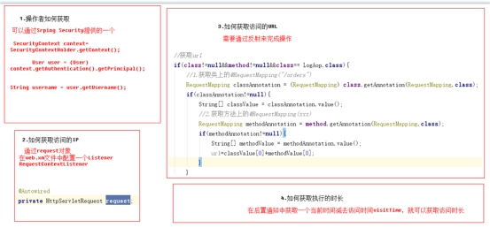
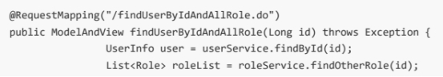

# SSMAOP日志

# 基于AOP日志处理 ：

访问之前：主要获取访问时间、访问的类、访问的方法（(JoinPoint jp：通过连接点的方法）

访问之后：主要获取日志中其它信息，时长、name、ip、url

name：SecurityContextHolder获取（上下文信息）

url：是类上的@RequestMapping的value+方法上的 @RequestMapping的value

ip：通过request.getRemoteAddr()方法获取到

封装进对象中存入数据库，点击访问日志就会显示日志信息（将日志信息查出来显示）

# Spring Security

安全包括两个主要操作。

“认证”，是为用户建立一个他所声明的主体。主体一般是指用户，设备或可以在你系 统中执行动作的其他系 统。 

“授权”指的是一个用户能否在你的应用中执行某个操作，在到达授权判断之前，身份的主题已经由 身份验证 过程建立了。 

 1.配置不过滤的资源（静态资源及登录相关）

 2.配置连接，表示任意路径都需要ROLE_USER权限

3.自定义登陆页面，login-page 自定义登陆页面 authentication-failure-url 用户权限校验失败之 后才会跳转到这个页面，如果数据库中没有这个用户则不会跳转到这个页面。 default-target-url 登陆成功后跳转的页面。 

4.登出， invalidate-session 是否删除session logout-url：登出处理链接 logout-successurl：登出成功页面     注：登出操作 只需要链接到 logout即可登出当前用户

## Spring Security使用数据库认证 

在Spring Security中如果想要使用数据进行认证操作，有很多种操作方式，这里我们介绍使用UserDetails、 UserDetailsService来完成操作。

UserDetails是一个接口，我们可以认为UserDetails作用是于封装当前进行认证的用户信息，但由于其是一个 接口，所以我们可以对其进行实现，也可以使用Spring Security提供的一个UserDetails的实现类User来完成 操作 

UserDetailsService

## 具体实现

Service：

去查数据库，能查到就返回用户信息登录成功

## 用户登出：

## 用户，角色，权限

数据库关系

用户操作

查询所有用户

添加用户

查询用户详情

2.角色操作

查询所有角色

插入角色

3.资源权限管理

查询所有

添加

4.用户与角色绑定：用户与角色之间是多对多关系，我们要建立它们之间的关系，只需要在中间表user_role插入数据即可。 

（1）查找要操作的用户及可以添加的角色

调用IUserService的findById方法获取要操作的User 

调用IRoleService的findOtherRole方法用于获取可以添加的角色信息

（2）添加关联

5.角色权限关联 ：角色与权限之间是多对多关系，我们要建立它们之间的关系，只需要在中间表role_permission插入数据即可。 

（1）查找要操作的角色及可以添加的权限，参数是要操作的角色id

调用IRoleService的findById方法获取要操作的Role 

调用IPermissionService的findOtherPermission方法用于获取可以添加的权限信息 

（2）添加关联

## 服务器端方法级权限控制

