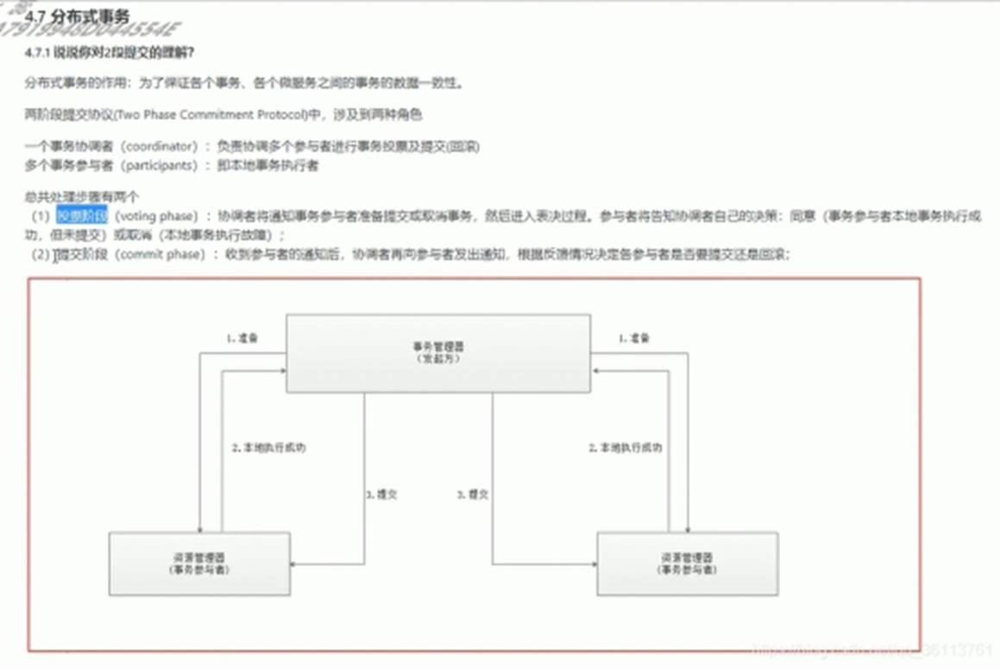
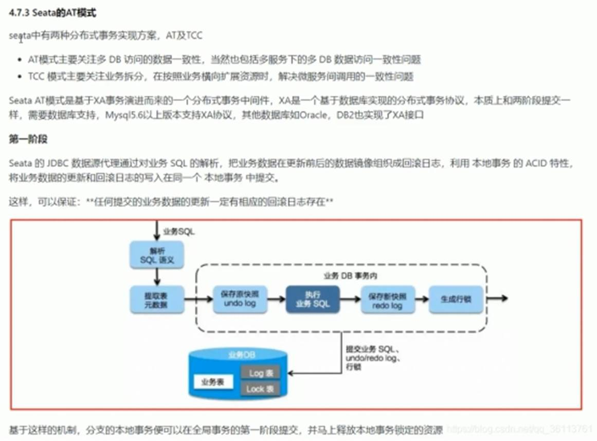
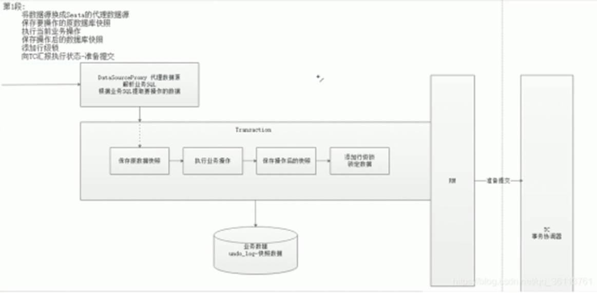
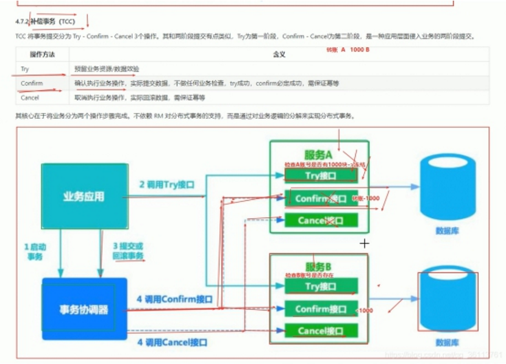

# 分布式事务

## 1.两阶段提交

两阶段的问题：

两阶段提交协议的问题在于数据库在提交请求阶段应答后对很多资源处于锁定状态，要等到事务管理器收集齐所有数据库的应答后，才能发commit或者rollback消息结束这种锁定。锁定时间的长度是由最慢的一个数据库制约，如果数据库一直没有应答，所有其他库也需要无休止的锁并等待。并且，如果事务管理器出现故障，被锁定的资源将长时间处于锁定状态。无论是任一数据库或者事务管理器故障，其他数据库都需要永久锁定或者至少长时间锁定。并且，分布式系统中节点越多，存在缓慢网络或者故障节点的概率也就越大，资源被长时间锁定的概率指数上升。

两阶段提交协议的另一个问题是只要有任意一个数据库不可用都会导致事务失败，这导致事务更倾向于失败。对于多个副本的备份系统，很多时候我们希望部分副本点失效时系统仍然可用，使用该协议则不能实现。并且，分布式系统中节点越多，存在故障节点的概率也就越大，系统的可用性指数下降。

另外，如果数据库在第一阶段应答后到第二阶段正式提交前的某个阶段网络故障或者节点故障，该协议无法提交或回滚，数据不一致不能绝对避免。

## 2.TCC

先是服务调用链路依次执行 Try 逻辑。

如果都正常的话，TCC 分布式事务框架推进执行 Confirm 逻辑，完成整个事务。

如果某个服务的 Try 逻辑有问题，TCC 分布式事务框架感知到之后就会推进执行各个服务的 Cancel 逻辑，撤销之前执行的各种操作。

https://www.cnblogs.com/jajian/p/10014145.html

## 3.本地消息表：

其基本的设计思想是将远程分布式事务拆分成一系列的本地事务。

举个经典的跨行转账的例子来描述：

第一步伪代码如下，扣款 1W，通过本地事务保证了凭证消息插入到消息表中。

第二步，通知对方银行账户上加 1W 了。那问题来了，如何通知到对方呢？

通常采用两种方式：

- 采用时效性高的 MQ，由对方订阅消息并监听，有消息时自动触发事件

- 采用定时轮询扫描的方式，去检查消息表的数据

两种方式其实各有利弊，仅仅依靠 MQ，可能会出现通知失败的问题。而过于频繁的定时轮询，效率也不是最佳的（90% 是无用功）。所以，我们一般会把两种方式结合起来使用。

万一这消息有重复被消费，往用户帐号上多加了钱，那岂不是后果很严重？在消息消费方，也通过一个“消费状态表”来记录消费状态。在执行“加款”操作之前，检测下该消息（提供标识）是否已经消费过，消费完成后，通过本地事务控制来更新这个“消费状态表”。这样子就避免重复消费的问题。

https://www.infoq.cn/article/solution-of-distributed-system-transaction-consistency/