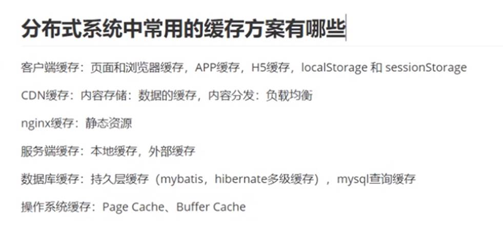
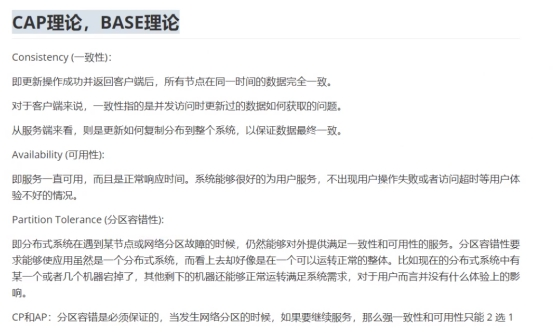
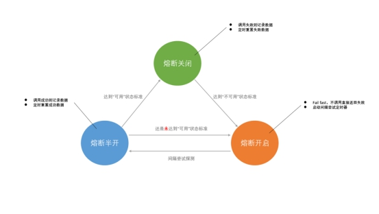
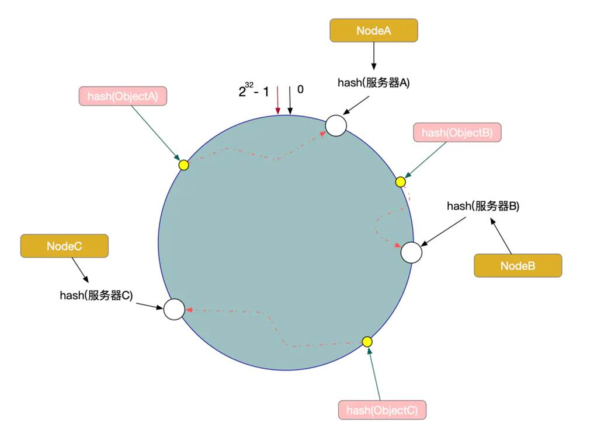
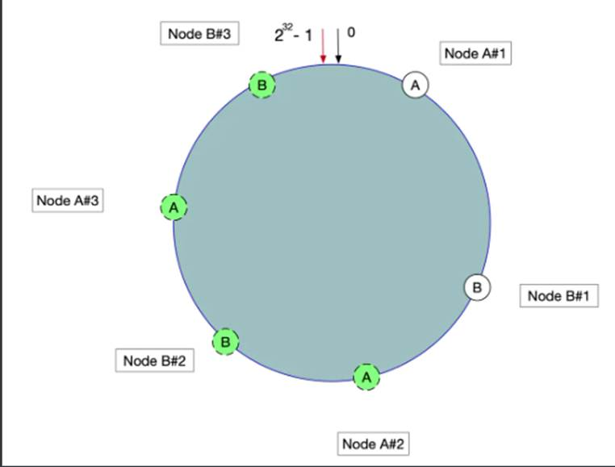
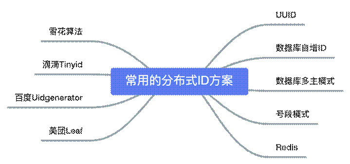
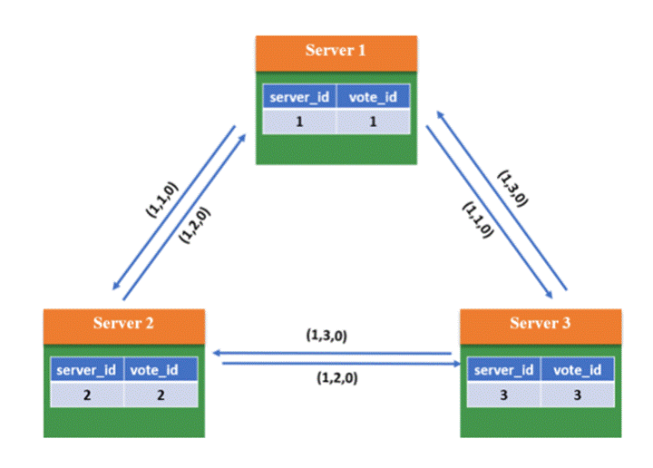

# 分布式系统的设计目标

无状态：比如说session存储在一台机器上，用户访问的时候若是第一台则显示登陆，若是第二台则显示不登录，这样是不行的

可管理：有一条调用链，A调用B，B调用C，哪一个服务出现了问题应该能快速发现问题所在

# 分布式系统中常用的缓存方案

nginx会存一些css，js

服务器端：本地缓存：map，list

外部缓存：redis

# CAP理论，BASE理论

 

# 服务熔断和降级

## 服务降级:系统有限的资源的合理协调

- 概念：服务降级一般是指在服务器压力剧增的时候，根据实际业务使用情况以及流量，对一些服务和页面有策略的不处理或者用一种简单的方式进行处理，从而释放服务器资源的资源以保证核心业务的正常高效运行。
- 原因： 服务器的资源是有限的，而请求是无限的。在用户使用即并发高峰期，会影响整体服务的性能，严重的话会导致宕机，以至于某些重要服务不可用。故高峰期为了保证核心功能服务的可用性，就需要对某些服务降级处理。可以理解为舍小保大
- 应用场景： 多用于微服务架构中，一般当整个微服务架构整体的负载超出了预设的上限阈值（和服务器的配置性能有关系），或者即将到来的流量预计会超过预设的阈值时（比如双11、6.18等活动或者秒杀活动）
- 服务降级是从整个系统的负荷情况出发和考虑的，对某些负荷会比较高的情况，为了预防某些功能（业务场景）出现负荷过载或者响应慢的情况，在其内部暂时舍弃对一些非核心的接口和数据的请求，而直接返回一个提前准备好的fallback（退路）错误处理信息。这样，虽然提供的是一个有损的服务，但却保证了整个系统的稳定性和可用性。
- 需要考虑的问题：

区分那些服务为核心？那些非核心

降级策略（处理方式，一般指如何给用户友好的提示或者操作）自动降级还是手动降

## 服务熔断：

应对雪崩效应的链路自我保护机制。可看作降级的特殊情况

- 概念：应对微服务雪崩效应的一种链路保护机制，类似股市、保险丝
- 原因： 微服务之间的数据交互是通过远程调用来完成的。服务A调用服务，服务B调用服务c，某一时间链路上对服务C的调用响应时间过长或者服务C不可用，随着时间的增长，对服务C的调用也越来越多，然后服务C崩溃了，但是链路调用还在，对服务B的调用也在持续增多，然后服务B崩溃，随之A也崩溃，导致雪崩效应
- 服务熔断是应对雪崩效应的一种微服务链路保护机制。例如在高压电路中，如果某个地方的电压过高，熔断器就会熔断，对电路进行保护。同样，在微服务架构中，熔断机制也是起着类似的作用。当调用链路的某个微服务不可用或者响应时间太长时，会进行服务熔断，不再有该节点微服务的调用，快速返回错误的响应信息。当检测到该节点微服务调用响应正常后，恢复调用链路。
- 服务熔断的作用类似于我们家用的保险丝，当某服务出现不可用或响应超时的情况时，为了防止整个系统出现雪崩，暂时停止对该服务的调用。
- 在Spring Cloud框架里，熔断机制通过Hystrix实现。Hystrix会监控微服务间调用的状况，当失败的调用到一定阈值，缺省是5秒内20次调用失败，就会启动熔断机制。
- 应用场景：微服务架构中，多个微服务相互调用出使用
- 需要考虑问题：

如何所依赖的服务对象不稳定

失败之后如何快速恢复依赖对象，如何探知依赖对象是否恢复

## 服务降级和服务熔断区别

- 触发原因不一样，服务熔断由链路上某个服务引起的，服务降级是从整体的负载考虑
- 管理目标层次不一样，服务熔断是一个框架层次的处理，服务降级是业务层次的处理
- 实现方式不一样，服务熔断一般是自我熔断恢复，服务降级相当于人工控制
- 触发原因不同 服务熔断一般是某个服务（下游服务）故障引起，而服务降级一般是从整体负荷考虑；

## 一句话：

- 服务熔断是应对系统服务雪崩的一种保险措施，给出的一种特殊降级措施。而服务降级则是更加宽泛的概念，主要是对系统整体资源的合理分配以应对压力。
- 服务熔断是服务降级的一种特殊情况，他是防止服务雪崩而采取的措施。系统发生异常或者延迟或者流量太大，都会触发该服务的服务熔断措施，链路熔断，返回兜底方法。这是对局部的一种保险措施。
- 服务降级是对系统整体资源的合理分配。区分核心服务和非核心服务。对某个服务的访问延迟时间、异常等情况做出预估并给出兜底方法。这是一种全局性的考量，对系统整体负荷进行管理。
- 限流：限制并发的请求访问量，超过阈值则拒绝；
- 降级：服务分优先级，牺牲非核心服务（不可用），保证核心服务稳定；从整体负荷考虑；
- 熔断：依赖的下游服务故障触发熔断，避免引发本系统崩溃；系统自动执行和恢复

https://zhuanlan.zhihu.com/p/341939685

https://www.infoq.cn/article/uhixhowebu_tyjewjwcl

# 限流策略

「两窗两桶」。两窗就是：固定窗口、滑动窗口，两桶就是：漏桶、令牌桶。

1.固定窗口

固定窗口就是定义一个“固定”的统计周期，比如 1 分钟或者 30 秒、10 秒这样。然后在每个周期统计当前周期中被接收到的请求数量，经过计数器累加后如果达到设定的阈值就触发「流量干预」。直到进入下一个周期后，计数器清零，流量接收恢复正常状态。

2.滑动窗口

滑动窗口其实就是对固定窗口做了进一步的细分，将原先的粒度切的更细，比如 1 分钟的固定窗口切分为 60 个 1 秒的滑动窗口。然后统计的时间范围随着时间的推移同步后移。

3.漏桶

漏桶模式的核心是固定“出口”的速率，不管进来多少量，出去的速率一直是这么多。如果涌入的量多到桶都装不下了，那么就进行「流量干预」。

4.令牌桶

令牌桶模式的核心是固定“进口”速率。先拿到令牌，再处理请求，拿不到令牌就被「流量干预」。因此，当大量的流量进入时，只要令牌的生成速度大于等于请求被处理的速度，那么此刻的程序处理能力就是极限。

https://www.infoq.cn/article/uhixhowebu_tyjewjwcl

# Eureka和Zookeeper的区别

1、Zookeeper当master挂了，会在30-120s进行leader选举，这点类似于redis的哨兵机制，在选举期间Zookeeper是不可用的，这么长时间不能进行服务注册，是无法忍受的，别说30s，5s都不能忍受。这时Zookeeper集群会瘫痪，这也是Zookeeper的CP，保持节点的一致性，牺牲了A/高可用。而Eureka不会，即使Eureka有部分挂掉，还有其他节点可以使用的，他们保持平级的关系，只不过信息有可能不一致，这就是AP，牺牲了C/一致性。

2、在之前的文章已经提到过Eureka有自我保护机制（15分钟内超过85%的服务节点没有心跳/down），这点我觉得确实要比Zookeeper好，即使服务不可用，也会保留当前失效的微服务，默认90秒，在这90秒Eureka不会注销微服务，在这90秒内仍然可以接受新的服务注册，只是不会同步到其他节点上。当坏掉的服务恢复的时候，会自动加入到节点上，也是高可用的一种。然后退出自我保护机制，这也是应对网络异常的一种机制

总结：Zookeeper出现网络等故障的时候导致整个服务注册瘫痪太要命了。Eureka能很好的应对网络故障导致失去节点的情况。

●Eureka：AP架构设计(高可用、分区容错性)，Zookeeper：CP架构设计（一致性、分区容错性）

那什么是AP、什么是CP，这个就是关于分布式的CAP理论（面试题）:

C - Consistent-一致性 A - Availability-可用性 P - Partition tolerance -分区容错性

分布式系统之所以叫分布式，是因为提供服务的各个节点分布在不同机器上，相互之间通过网络交互。那么必然存在网络故障断开的风险，这个网络断开的专业场景成为网络分区。网络分区多个分布式节点无法进行通信，我们对于一个节点无法操作到另外一个节点，数据的一致性没办法满足，因为多节点的数据不再保持一致。如果要保持一致，我们必然要牺牲高可用，也就是需要暂停一部分的服务，不提供对数据的操作(修改、更新等)功能，等到网络恢复的时候再对外服务。当然也可以保证高可用，牺牲数据一致性

关于CAP理论大概的结论:在网络分区时，不能同时保证高可用和一致性

目前任何分布式系统都没办法同时满足3个，只能3选其2，分布式系统之所以叫分布式，都是分散在不同的服务器，P是必须要满足的，所以只能选择A或者C了

在很多的公司以及业务场景，很多会选择保持数据的一致性，在京东/双十一这样的情况，只能保证AP，不能保证CP。但也有高可用的.比如某米公司，一次在进行手机抢购的时候，牺牲了数据的一致性，当添加到购物车，然后付款，却发现没有库存了，他保证了服务高可用，但牺牲了数据的一致性 

# 一致性Hash

对2的32次方取模

***\*******容错性：一台宕机了只用移动部分数据\******\****

***\*******可扩展性：增加一台只用移动部分数据\******\****

***\*******数据倾斜问题：虚拟节点机制\******\****

一致性Hash算法引入了虚拟节点机制，即对每一个服务器节点计算多个哈希，每个计算结果位置都放置一个此服务节点，称为虚拟节点。具体操作可以为服务器IP或主机名后加入编号来实现。

# 分布式ID

## **分布式ID方案总结**

ID是数据的唯一标识，传统的做法是利用UUID和数据库的自增ID，在互联网企业中，大部分公司使用的都是Mysql，并且因为需要事务支持，所以通常会使用Innodb存储引擎，UUID太长以及无序，所以并不适合在Innodb中来作为主键，自增ID比较合适，但是随着公司的业务发展，数据量将越来越大，需要对数据进行分表，而分表后，每个表中的数据都会按自己的节奏进行自增，很有可能出现ID冲突。这时就需要一个单独的机制来负责生成唯一ID，生成出来的ID也可以叫做**分布式ID**，或**全局ID**。下面来分析各个生成分布式ID的机制。

 

这篇文章并不会分析的特别详细，主要是做一些总结，以后再出一些详细某个方案的文章。

### **数据库自增ID**

第一种方案仍然还是基于数据库的自增ID，需要单独使用一个数据库实例，在这个实例中新建一个单独的表：

表结构如下：

CREATE DATABASE `SEQID`;

CREATE TABLE SEQID.SEQUENCE_ID (
     id bigint(20) unsigned NOT NULL auto_increment, 
     stub char(10) NOT NULL default '',
     PRIMARY KEY (id),
     UNIQUE KEY stub (stub)
 ) ENGINE=MyISAM;

可以使用下面的语句生成并获取到一个自增ID

begin;
 replace into SEQUENCE_ID (stub) VALUES ('anyword');
 select last_insert_id();
 commit;

stub字段在这里并没有什么特殊的意义，只是为了方便的去插入数据，只有能插入数据才能产生自增id。而对于插入我们用的是replace，replace会先看是否存在stub指定值一样的数据，如果存在则先delete再insert，如果不存在则直接insert。

这种生成分布式ID的机制，需要一个单独的Mysql实例，虽然可行，但是基于性能与可靠性来考虑的话都不够，**业务系统每次需要一个ID时，都需要请求数据库获取，性能低，并且如果此数据库实例下线了，那么将影响所有的业务系统。**

为了解决数据库可靠性问题，我们可以使用第二种分布式ID生成方案。

### **数据库多主模式**

如果我们两个数据库组成一个**主从模式**集群，正常情况下可以解决数据库可靠性问题，但是如果主库挂掉后，数据没有及时同步到从库，这个时候会出现ID重复的现象。我们可以使用**双主模式**集群，也就是两个Mysql实例都能单独的生产自增ID，这样能够提高效率，但是如果不经过其他改造的话，这两个Mysql实例很可能会生成同样的ID。需要单独给每个Mysql实例配置不同的起始值和自增步长。

第一台Mysql实例配置：

set @@auto_increment_offset = 1;   -- 起始值
 set @@auto_increment_increment = 2; -- 步长

第二台Mysql实例配置：

set @@auto_increment_offset = 2;   -- 起始值
 set @@auto_increment_increment = 2; -- 步长

经过上面的配置后，这两个Mysql实例生成的id序列如下：

mysql1,起始值为1,步长为2,ID生成的序列为：1,3,5,7,9,...

mysql2,起始值为2,步长为2,ID生成的序列为：2,4,6,8,10,...

对于这种生成分布式ID的方案，需要单独新增一个生成分布式ID应用，比如DistributIdService，该应用提供一个接口供业务应用获取ID，业务应用需要一个ID时，通过rpc的方式请求DistributIdService，DistributIdService随机去上面的两个Mysql实例中去获取ID。

实行这种方案后，就算其中某一台Mysql实例下线了，也不会影响DistributIdService，DistributIdService仍然可以利用另外一台Mysql来生成ID。

但是这种方案的扩展性不太好，如果两台Mysql实例不够用，需要新增Mysql实例来提高性能时，这时就会比较麻烦。

现在如果要新增一个实例mysql3，要怎么操作呢？

第一，mysql1、mysql2的步长肯定都要修改为3，而且只能是人工去修改，这是需要时间的。

第二，因为mysql1和mysql2是不停在自增的，对于mysql3的起始值我们可能要定得大一点，以给充分的时间去修改mysql1，mysql2的步长。

第三，在修改步长的时候很可能会出现重复ID，要解决这个问题，可能需要停机才行。

为了解决上面的问题，以及能够进一步提高DistributIdService的性能，如果使用第三种生成分布式ID机制。

### **号段模式**

我们可以使用号段的方式来获取自增ID，号段可以理解成批量获取，比如DistributIdService从数据库获取ID时，如果能批量获取多个ID并缓存在本地的话，那样将大大提供业务应用获取ID的效率。

比如DistributIdService每次从数据库获取ID时，就获取一个号段，比如(1,1000]，这个范围表示了1000个ID，业务应用在请求DistributIdService提供ID时，DistributIdService只需要在本地从1开始自增并返回即可，而不需要每次都请求数据库，一直到本地自增到1000时，也就是当前号段已经被用完时，才去数据库重新获取下一号段。

所以，我们需要对数据库表进行改动，如下：

CREATE TABLE id_generator (
  id int(10) NOT NULL,
  current_max_id bigint(20) NOT NULL COMMENT '当前最大id',
  increment_step int(10) NOT NULL COMMENT '号段的长度',
  PRIMARY KEY (`id`)
 ) ENGINE=InnoDB DEFAULT CHARSET=utf8;

这个数据库表用来记录自增步长以及当前自增ID的最大值（也就是当前已经被申请的号段的最后一个值），因为自增逻辑被移到DistributIdService中去了，所以数据库不需要这部分逻辑了。

这种方案不再强依赖数据库，就算数据库不可用，那么DistributIdService也能继续支撑一段时间。但是如果DistributIdService重启，会丢失一段ID，导致ID空洞。

为了提高DistributIdService的高可用，需要做一个集群，业务在请求DistributIdService集群获取ID时，会随机的选择某一个DistributIdService节点进行获取，对每一个DistributIdService节点来说，数据库连接的是同一个数据库，那么可能会产生多个DistributIdService节点同时请求数据库获取号段，那么这个时候需要利用乐观锁来进行控制，比如在数据库表中增加一个version字段，在获取号段时使用如下SQL：

update id_generator set current_max_id=#{newMaxId}, version=version+1 where version = #{version}

因为newMaxId是DistributIdService中根据oldMaxId+步长算出来的，只要上面的update更新成功了就表示号段获取成功了。

为了提供数据库层的高可用，需要对数据库使用多主模式进行部署，对于每个数据库来说要保证生成的号段不重复，这就需要利用最开始的思路，再在刚刚的数据库表中增加起始值和步长，比如如果现在是两台Mysql，那么

mysql1将生成号段（1,1001]，自增的时候序列为1，3，4，5，7....

mysql1将生成号段（2,1002]，自增的时候序列为2，4，6，8，10...

更详细的可以参考滴滴开源的TinyId： [https://github.com/didi/tinyid/wiki/tinyid%E5%8E%9F%E7%90%86%E4%BB%8B%E7%BB%8D](https://github.com/didi/tinyid/wiki/tinyid原理介绍)

在TinyId中还增加了一步来提高效率，在上面的实现中，ID自增的逻辑是在DistributIdService中实现的，而实际上可以把自增的逻辑转移到业务应用本地，这样对于业务应用来说只需要获取号段，每次自增时不再需要请求调用DistributIdService了。

### **雪花算法**

上面的三种方法总的来说是基于自增思想的，而接下来就介绍比较著名的雪花算法-snowflake。

我们可以换个角度来对分布式ID进行思考，只要能让负责生成分布式ID的每台机器在每毫秒内生成不一样的ID就行了。

snowflake是twitter开源的分布式ID生成算法，是一种算法，所以它和上面的三种生成分布式ID机制不太一样，它不依赖数据库。

 

核心思想是：分布式ID固定是一个long型的数字，一个long型占8个字节，也就是64个bit，原始snowflake算法中对于bit的分配如下图：

- - 第一个bit位是标识部分，在java中由于long的最高位是符号位，正数是0，负数是1，一般生成的ID为正数，所以固定为0。
  - 时间戳部分占41bit，这个是毫秒级的时间，一般实现上不会存储当前的时间戳，而是时间戳的差值（当前时间-固定的开始时间），这样可以使产生的ID从更小值开始；41位的时间戳可以使用69年，(1L << 41) / (1000L * 60 * 60 * 24 * 365) = 69年
  - 工作机器id占10bit，这里比较灵活，比如，可以使用前5位作为数据中心机房标识，后5位作为单机房机器标识，可以部署1024个节点。
  - 序列号部分占12bit，支持同一毫秒内同一个节点可以生成4096个ID

根据这个算法的逻辑，只需要将这个算法用Java语言实现出来，封装为一个工具方法，那么各个业务应用可以直接使用该工具方法来获取分布式ID，只需保证每个业务应用有自己的工作机器id即可，而不需要单独去搭建一个获取分布式ID的应用。

snowflake算法实现起来并不难，提供一个github上用java实现的： https://github.com/beyondfengyu/SnowFlake

在大厂里，其实并没有直接使用snowflake，而是进行了改造，因为snowflake算法中最难实践的就是工作机器id，原始的snowflake算法需要人工去为每台机器去指定一个机器id，并配置在某个地方从而让snowflake从此处获取机器id。

但是在大厂里，机器是很多的，人力成本太大且容易出错，所以大厂对snowflake进行了改造。

### **百度（uid-generator）**

github地址：[uid-generator](https://github.com/baidu/uid-generator)

uid-generator使用的就是snowflake，只是在生产机器id，也叫做workId时有所不同。

uid-generator中的workId是由uid-generator自动生成的，并且考虑到了应用部署在docker上的情况，在uid-generator中用户可以自己去定义workId的生成策略，默认提供的策略是：应用启动时由数据库分配。说的简单一点就是：应用在启动时会往数据库表(uid-generator需要新增一个WORKER_NODE表)中去插入一条数据，数据插入成功后返回的该数据对应的自增唯一id就是该机器的workId，而数据由host，port组成。

对于uid-generator中的workId，占用了22个bit位，时间占用了28个bit位，序列化占用了13个bit位，需要注意的是，和原始的snowflake不太一样，时间的单位是秒，而不是毫秒，workId也不一样，同一个应用每重启一次就会消费一个workId。

具体可参考 https://github.com/baidu/uid-generator/blob/master/README.zh_cn.md

### **美团（Leaf）**

github地址：[Leaf](https://github.com/Meituan-Dianping/Leaf)

美团的Leaf也是一个分布式ID生成框架。它非常全面，即支持号段模式，也支持snowflake模式。号段模式这里就不介绍了，和上面的分析类似。

Leaf中的snowflake模式和原始snowflake算法的不同点，也主要在workId的生成，Leaf中workId是基于ZooKeeper的顺序Id来生成的，每个应用在使用Leaf-snowflake时，在启动时都会都在Zookeeper中生成一个顺序Id，相当于一台机器对应一个顺序节点，也就是一个workId。

**总结**

总得来说，上面两种都是自动生成workId，以让系统更加稳定以及减少人工成功。

### **Redis**

这里额外再介绍一下使用Redis来生成分布式ID，其实和利用Mysql自增ID类似，可以利用Redis中的incr命令来实现原子性的自增与返回，比如：

127.0.0.1:6379> set seq_id 1   // 初始化自增ID为1
 OK
 127.0.0.1:6379> incr seq_id   // 增加1，并返回
 (integer) 2
 127.0.0.1:6379> incr seq_id   // 增加1，并返回
 (integer) 3

使用redis的效率是非常高的，但是要考虑持久化的问题。Redis支持RDB和AOF两种持久化的方式。

RDB持久化相当于定时打一个快照进行持久化，如果打完快照后，连续自增了几次，还没来得及做下一次快照持久化，这个时候Redis挂掉了，重启Redis后会出现ID重复。

AOF持久化相当于对每条写命令进行持久化，如果Redis挂掉了，不会出现ID重复的现象，但是会由于incr命令过得，导致重启恢复数据时间过长。

# 分布式选举

## **分布式选举**

主节点在一个分布式集群中负责对其他节点的协调和管理，也就是说其他节点都必须听从主节点的安排。主节点的存在就可以保证其他节点的有序运行，以及数据库集群中的写入数据在每个节点上的一致性。这里的一致性是指，数据在每个集群节点中都是一样的，不存在不同的情况。

当然，如果主故障了，集群就会天下大乱，就好比一个国家的皇帝驾崩了，国家大乱一样。比如，数据库集群中主节点故障后，可能导致每个节点上的数据会不一致。这，就应了那句话“国不可一日无君”，对应到分布式系统中就是“集群不可一刻无主”。总结来说，选举的作用就是选出一个主节点，由它来协调和管理其他节点，以保证集群有序运行和节点间数据的一致性。

那么，如何在集群中选出一个合适的主呢？这是一个技术活儿，目前常见的选主方法有基于序号选举的算法（ 比如，Bully 算法）、多数派算法（比如，Raft 算法、ZAB 算法）。

### **长者为大：**Bully算法

Bully 算法是一种霸道的集群选主算法，为什么说是霸道呢？因为它的选举原则是“长者”为大，即在所有活着的节点中，选取 ID 最大的节点作为主节点。在 Bully 算法中，节点的角色有两种：普通节点和主节点。初始化时，所有节点都是平等的，都是普通节点，并且都有成为主的权利。但是，当选主成功后，有且仅有一个节点成为主节点，其他所有节点都是普通节点。当且仅当主节点故障或与其他节点失去联系后，才会重新选主。Bully 算法在选举过程中，需要用到以下 3 种消息：

 Election 消息，用于发起选举；

 Alive 消息，对 Election 消息的应答；

 Victory 消息，竞选成功的主节点向其他节点发送的宣誓主权的消息。

Bully 算法选举的原则是“长者为大”，意味着它的假设条件是，集群中每个节点均知道其他节点的 ID。在此前提下，其具体的选举过程是：

 集群中每个节点判断自己的 ID 是否为当前活着的节点中 ID 最大的，如果是，则直接向其他节点发送 Victory 消息，宣誓自己的主权；

 如果自己不是当前活着的节点中 ID 最大的，则向比自己 ID 大的所有节点发送 Election 消息，并等待其他节点的回复；

 若在给定的时间范围内，本节点没有收到其他节点回复的 Alive 消息，则认为自己成为主节点，并向其他节点发送 Victory 消息，宣誓自己成为主节点；若接收到来自比自己 ID 大的节点的 Alive 消息，则等待其他节点发送 Victory 消息；

 若本节点收到比自己 ID 小的节点发送的 Election 消息，则回复一个 Alive 消息，告知其他节点，我比你大，重新选举。

目前已经有很多开源软件采用了 Bully 算法进行选主，比如 MongoDB 的副本集故障转移功能。MongoDB 的分布式选举中，采用节点的最后操作时间戳来表示 ID，时间戳最新的节点其 ID 最大，也就是说时间戳最新的、活着的节点是主节点。

小结一下。Bully 算法的选择特别霸道和简单，谁活着且谁的 ID 最大谁就是主节点，其他节点必须无条件服从。这种算法的优点是，选举速度快、算法复杂度低、简单易实现。但这种算法的缺点在于，需要每个节点有全局的节点信息，因此额外信息存储较多；其次，任意一个比当前主节点 ID 大的新节点或节点故障后恢复加入集群的时候，都可能会触发重新选举，成为新的主节点，如果该节点频繁退出、加入集群，就会导致频繁切主。

### **民主投票：**Raft **算法**

Raft 算法是典型的多数派投票选举算法，其选举机制与我们日常生活中的民主投票机制类似，核心思想是“少数服从多数”。也就是说，Raft 算法中，获得投票最多的节点成为主。采用 Raft 算法选举，集群节点的角色有 3 种：

 Leader，即主节点，同一时刻只有一个 Leader，负责协调和管理其他节点；

 Candidate，即候选者，每一个节点都可以成为 Candidate，节点在该角色下才可以被选为新的 Leader；

 Follower，Leader 的跟随者，不可以发起选举。

Raft 选举的流程，可以分为以下几步：

 初始化时，所有节点均为 Follower 状态。

 开始选主时，所有节点的状态由 Follower 转化为 Candidate，并向其他节点发送选举请求。

 其他节点根据接收到的选举请求的先后顺序，回复是否同意成为主。这里需要注意的是，在每一轮选举中，一个 节点只能投出一张票。

 若发起选举请求的节点获得超过一半的投票，则成为主节点，其状态转化为 Leader，其他节点的状态则由 Candidate 降为 Follower。Leader 节点与 Follower 节点之间会定期发送心跳包，以检测主节点是否活着。

 当 Leader 节点的任期到了，即发现其他服务器开始下一轮选主周期时，Leader 节点的状态由 Leader 降级为 Follower，进入新一轮选主。

节点的状态迁移如下所示（图中的 term 指的是选举周期）：

请注意，每一轮选举，每个节点只能投一次票。这种选举就类似人大代表选举，正常情况下每个人大代表都有一定的任期，任期到后会触发重新选举，且投票者只能将自己手里唯一的票投给其中一个候选者。对应到 Raft 算法中，选主是周期进行的，包括选主和任值两个时间段，选主阶段对应投票阶段，任值阶段对应节点成为主之后的任期。但也有例外的时候，如果主节点故障，会立马发起选举，重新选出一个主节点。

Google 开源的 Kubernetes，擅长容器管理与调度，为了保证可靠性，通常会部署 3 个节点用于数据备份。这 3 个节点中，有一个会被选为主，其他节点作为备。Kubernetes 的选主采用的是开源的 etcd 组件。而，etcd 的集群管理器 etcds，是一个高可用、强一致性的服务发现存储仓库，就是采用了 Raft 算法来实现选主和一致性的。

小结一下。Raft 算法具有选举速度快、算法复杂度低、易于实现的优点；缺点是，它要求系统内每个节点都可以相互通信，且需要获得过半的投票数才能选主成功，因此通信量大。该算法选举稳定性比 Bully 算法好，这是因为当有新节点加入或节点故障恢复后，会触发选主，但不一定会真正切主，除非新节点或故障后恢复的节点获得投票数过半，才会导致切主。

**具有优先级的民主投票：**ZAB**算法**

ZAB（ZooKeeper Atomic Broadcast）选举算法是为 ZooKeeper 实现分布式协调功能而设计的。相较于 Raft 算法的投票机制，ZAB 算法增加了通过节点 ID 和数据 ID 作为参考进行选主，节点 ID 和数据 ID 越大，表示数据越新，优先成为主。相比较于 Raft 算法，ZAB 算法尽可能保证数据的最新性。所以，ZAB 算法可以说是对 Raft 算法的改进。

使用 ZAB 算法选举时，集群中每个节点拥有 3 种角色： Leader，主节点； Follower，跟随者节点； Observer，观察者，无投票权。

选举过程中，集群中的节点拥有 4 个状态：

 Looking 状态，即选举状态。当节点处于该状态时，它会认为当前集群中没有 Leader，因此自己进入选举状态。

 Leading 状态，即领导者状态，表示已经选出主，且当前节点为 Leader。

 Following 状态，即跟随者状态，集群中已经选出主后，其他非主节点状态更新为 Following，表示对 Leader 的追随。

 Observing 状态，即观察者状态，表示当前节点为 Observer，持观望态度，没有投票权和选举权。

投票过程中，每个节点都有一个唯一的三元组 (server_id, server_zxID, epoch)，其中 server_id 表示本节点的唯一 ID；server_zxID 表示本节点存放的数据 ID，数据 ID 越大表示数据越新，选举权重越大；epoch 表示当前选取轮数，一般用逻辑时钟表示。

ZAB 选举算法的核心是“少数服从多数，ID 大的节点优先成为主”，因此选举过程中通过 (vote_id, vote_zxID) 来表明投票给哪个节点，其中 vote_id 表示被投票节点的 ID，vote_zxID 表示被投票节点的服务器 zxID。ZAB 算法选主的原则是：server_zxID 最大者成为 Leader；若 server_zxID 相同，则 server_id 最大者成为 Leader。接下来介绍 ZAB 选主的过程。

第一步：当系统刚启动时，3 个服务器当前投票均为第一轮投票，即 epoch=1，且 zxID 均为 0。此时每个服务器都推选自己，并将选票信息 <epoch, vote_id, vote_zxID> 广播出去。

第二步：根据判断规则，由于 3 个 Server 的 epoch、zxID 都相同，因此比较 server_id，较大者即为推选对象，因此 Server 1 和 Server 2 将 vote_id 改为 3，更新自己的投票箱并重新广播自己的投票。

https://blog.csdn.net/yezonggang/article/details/106343806

### 分布式评价维度

分布式的三围：性能（Performance）资源占用（Resource Usage）可用性（Availability）可扩展性（Scalability）

场景和取舍

按照业务的架构层次栈，自底向上按照资源、通信、数据与计算的维度，梳理出了 4 个技术层次：分布式资源池化、分布式通信、分布式数据存储与管理、分布式计算。这样的划分符合业务架构设计的一般规律，即“在一定资源上，进行一定通信，通过一定计算，完成一定数据的加工和处理，从而对外提供特定的服务”。另一方面，这样的划分也整合了零散的知识点，具有完备性。分布式技术的地图：

分布式的三围

首先，从分布式技术的起源可以看出，分布式系统的出现就是为了用廉价的、普通的机器解决单个计算机处理复杂、大规模数据和任务时存在的性能问题、资源瓶颈问题，以及可用性和可扩展性问题。换句话说，分布式的目的是用更多的机器，处理更多的数据和更复杂的任务。由此可以看出，性能、资源、可用性和可扩展性是分布式系统的重要指标。没错，它们就是分布式系统的“三围”。接下来，我们一起来看看这几个指标吧。

性能（Performance）

性能指标，主要用于衡量一个系统处理各种任务的能力。无论是分布式系统还是单机系统，都会对性能有所要求。不同的系统、服务要达成的目的不同，关注的性能自然也不尽相同，甚至是相互矛盾。常见的性能指标，包括吞吐量（Throughput）、响应时间（Response Time）和完成时间（Turnaround Time）。

吞吐量指的是，系统在一定时间内可以处理的任务数。这个指标可以非常直接地体现一个系统的性能，就好比在客户非常多的情况下，要评判一个银行柜台职员的办事效率，你可以统计一下他在 1 个小时内接待了多少客户。常见的吞吐量指标有 QPS（Queries Per Second）、TPS（Transactions Per Second）和 BPS（Bits Per Second）。

QPS，即查询数每秒，用于衡量一个系统每秒处理的查询数。这个指标通常用于读操作，越高说明对读操作的支持越好。所以，我们在设计一个分布式系统的时候，如果应用主要是读操作，那么需要重点考虑如何提高 QPS，来支持高频的读操作。

TPS，即事务数每秒，用于衡量一个系统每秒处理的事务数。这个指标通常对应于写操作，越高说明对写操作的支持越好。我们在设计一个分布式系统的时候，如果应用主要是写操作，那么需要重点考虑如何提高 TPS，来支持高频写操作。

BPS，即比特数每秒，用于衡量一个系统每秒处理的数据量。对于一些网络系统、数据管理系统，我们不能简单地按照请求数或事务数来衡量其性能。因为请求与请求、事务与事务之间也存在着很大的差异，比方说，有的事务大需要写入更多的数据。那么在这种情况下，BPS 更能客观地反应系统的吞吐量。

响应时间指的是，系统响应一个请求或输入需要花费的时间。响应时间直接影响到用户体验，对于时延敏感的业务非常重要。比如用户搜索导航，特别是用户边开车边搜索的时候，如果响应时间很长，就会直接导致用户走错路。

完成时间指的是，系统真正完成一个请求或处理需要花费的时间。任务并行（也叫作任务分布式）模式出现的其中一个目的，就是缩短整个任务的完成时间。特别是需要计算海量数据或处理大规模任务时，用户对完成时间的感受非常明显。

资源占用（Resource Usage）

资源占用指的是，一个系统提供正常能力需要占用的硬件资源，比如 CPU、内存、硬盘等。一个系统在没有任何负载时的资源占用，叫做空载资源占用，体现了这个系统自身的资源占用情况。比如，你在手机上安装一个 App，安装的时候通常会提示你有多少 KB，这就是该 App 的空载硬盘资源占用。对于同样的功能，空载资源占用越少，说明系统设计越优秀，越容易被用户接受。

一个系统满额负载时的资源占用，叫做满载资源占用，体现了这个系统全力运行时占用资源的情况，也体现了系统的处理能力。同样的硬件配置上，运行的业务越多，资源占用越少，说明这个系统设计得越好。

可用性（Availability）可扩展性（Scalability）

可用性，通常指的是系统在面对各种异常时可以正确提供服务的能力。可用性是分布式系统的一项重要指标，衡量了系统的鲁棒性，是系统容错能力的体现。系统的可用性可以用系统停止服务的时间与总的时间之比衡量。假设一个网站总的运行时间是 24 小时，在 24 小时内，如果网站故障导致不可用的时间是 4 个小时，那么系统的可用性就是 4/24=0.167，也就是 0.167 的比例不可用，或者说 0.833 的比例可用。

除此之外，系统的可用性还可以用某功能的失败次数与总的请求次数之比来衡量，比如对网站请求 1000 次，其中有 10 次请求失败，那么可用性就是 99%。你可能经常在一个系统的宣传语中见到或听到 3 个 9（或 3N，3 Nines）、5 个 9（或 9N，9 Nines）。这些宣传语中所说的 3 个 9、5 个 9，实际上就是系统厂商对可用性的一种标榜，表明该系统可以在 99.9% 或 99.999% 的时间里能对外无故障地提供服务。

可靠性通常用来表示一个系统完全不出故障的概率，更多地用在硬件领域。而可用性则更多的是指在允许部分组件失效的情况下，一个系统对外仍能正常提供服务的概率。

杰夫 · 迪恩（Jeff Dean）曾在 Google I/O 大会上透露：谷歌一个基于 1000 台通用计算机的集群，一年之内就有 1000+ 硬盘会出现故障。由于现在比较常见的分布式系统基本上都是基于通用计算机的，这就意味着在这些系统中无法实现真正的可靠，所以我们也会在一些场合见到可靠性和可用性交换使用的情况。

可扩展性，指的是分布式系统通过扩展集群机器规模提高系统性能 (吞吐、响应时间、 完成时间)、存储容量、计算能力的特性，是分布式系统的特有性质。分布式系统的设计初衷，就是利用集群多机的能力处理单机无法解决的问题。然而，完成某一具体任务所需要的机器数目，即集群规模，取决于单个机器的性能和任务的要求。任务的需求随着具体业务不断提高时，除了升级系统的性能做垂直 / 纵向扩展外，另一个做法就是通过增加机器的方式去水平 / 横向扩展系统规模。这里垂直 / 纵向扩展指的是，增加单机的硬件能力，比如 CPU 增强、内存增大等；水平 / 横向扩展指的就是，增加计算机数量。好的分布式系统总在追求“线性扩展性”，也就是说系统的某一指标可以随着集群中的机器数量呈线性增长。

衡量系统可扩展性的常见指标是加速比（Speedup），也就是一个系统进行扩展后相对扩展前的性能提升。如果你的扩展目标是为了提高系统吞吐量，则可以用扩展后和扩展前的系统吞吐量之比进行衡量。如果你的目标是为了缩短完成时间，则可以用扩展前和扩展后的完成时间之比进行衡量。

场景和取舍

我们都希望自己的分布式系统是高性能、高可用、高扩展和低资源占用的。但出于硬件成本、开发效率等因素的约束，我们无法在性能、可用性、可靠性和资源占用做到面面俱到。因此，在不同的业务场景中，设计者们需要有所取舍。典型的电商、IoT、电信、HPC（高性能计算）、大数据、云计算、区块链等业务或系统对不同指标的诉求；

电商系统。对于一个电商系统而言，系统设计者最看重的是吞吐量，为了处理更多的用户访问或订单业务，甚至不惜牺牲一些硬件成本。

IoT。对于一个 IoT 系统而言，设计者最看重的是资源占用指标，因为在一些功能极简的 IoT 设备上 RAM、ROM 的可用资源通常都是 KB 级的。

电信业务。对于电信业务而言，最重要的无疑是响应时间、完成时间，以及可用性。因为，你在打电话时不希望你的声音半天才被对方听到，也不希望半天才听到对方的回应，更不希望你的电话无法拨出。

HPC。HPC 系统最显著的特点是任务执行时间极长，一个天体物理任务的分析和计算通常耗时数周甚至数月。因此，通过水平扩展来提高系统的加速比，是 HPC 系统设计者需要关注的。

大数据。大数据任务的处理时间可能相对 HPC 系统来讲比较短，但常见的完成时间也达到了小时级，所以扩展性也是大数据系统首先要考虑的。

云计算。对于一个云计算系统而言，常见任务是虚拟主机或容器的创建、资源调整、销毁等操作，如何减少这些操作的完成时间，从而提升用户体验是设计者们要重点关注的。另外，云计算系统本质上卖的是资源，那么降低系统本身的资源开销，也是系统设计的重中之重。

区块链。区块链的吞吐量比较低，比特币的 TPS 只有 7 次每秒，单平均一次交易的确认就需要 10 分钟左右，因此吞吐量和完成时间通常是区块链系统设计者的首要目标。

按照不同维度，分布式系统的指标可以分为性能、资源占用、可用性、可扩展性这四大类。我们自然希望自己的系统，是高性能、高可用、高扩展和低资源占用的，但考虑到硬件成本、开发效率等因素，必须要在设计不同的系统、业务时有所取舍。

原文链接：https://blog.csdn.net/yezonggang/article/details/106339450