# 分布式锁

## **分布式锁**应用场景

将服务器从单机部署升级为多机部署后，则会发现Java提供的原生锁机制在多机部署下失效了。这是因为Java本身提供的锁，他们只对属于自己JVM里面的线程有效，对于其他JVM的线程是无效的。

## 场景示例

​    现在有一个电商系统，此时只通过一台机器进行部署，当用户下单时，首先会检查库存是否足够，只有当库存足够时，才会允许进行下单。

​    为了提高系统的并发性能，因此会首先将商品库存信息预热到redis中，当用户下单时，会更新redis中的库存信息。

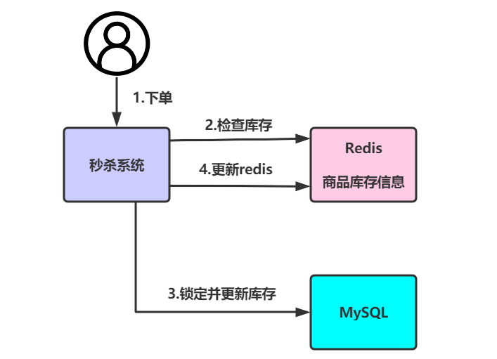

​    此时在单线程下执行是没有任何问题的，但是假设现在某一商品库存数量为1，且同时有两个线程同时对该商品执行下单操作，线程A和线程B查询库存结果都为1，此时线程A先执行第三步更新mysql将库存数量由1变为0。但是当线程B再来执行第三步更新mysql时，库存数量会变为-1，此时库存超卖出现。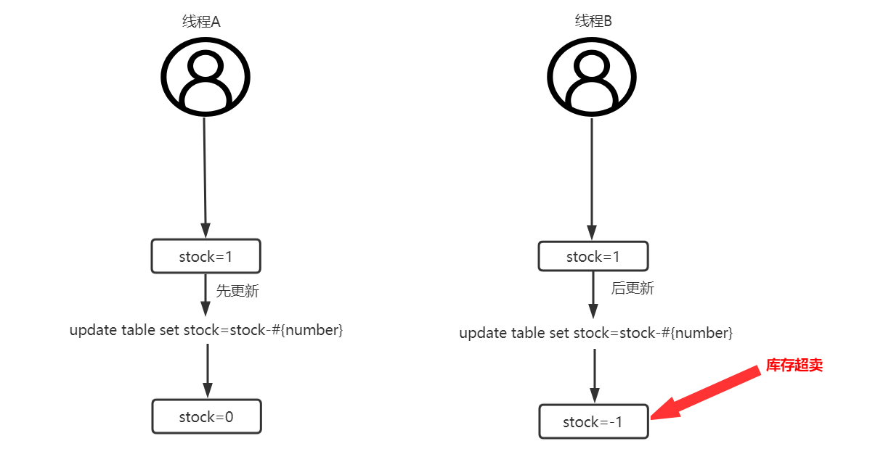

​    此时要想解决超卖问题，则可以进行加锁，将2，3，4步利用synchronized或者ReentrantLock进行加锁，从而让线程排队，避免超卖问题的出现。

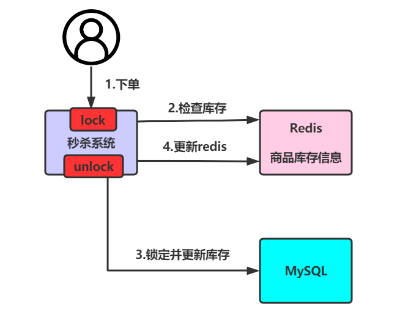

​    但是当随着并发量的增大，此时单机部署已经无法承受这么大的并发量了，则会将系统由单机变为多机部署。

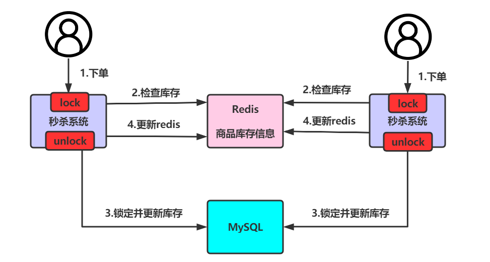

​    此时假设同时有两个用户进行下单，请求分别进入两台机器中，那么这两个请求是可以同时执行的，则仍然会出现超卖问题。

​    因为不管synchronized或者ReentrantLock都是只作用于自己机器的JVM中，对其他机器的JVM无效。相当于两台不同的机器使用的是不同的两把锁，导致锁失效。

​    解决该问题的思路则需要保证不同的机器使用的是相同的一把锁，则此时需要使用分布式锁。对于分布式锁的实现，可以基于Mysql、redis、zookeeper、consule等进行实现。

## 分布式锁具备的条件

\- **互斥性**：同一时刻只能有一个服务(或应用)访问资源。

\- **原子性**：一致性要求保证加锁和解锁的行为是原子性的。

\- **安全性**：锁只能被持有该锁的服务(或应用)释放。

\- **容错性**：在持有锁的服务崩溃时，锁仍能得到释放，避免死锁。

\- **高可用**：获取锁和释放锁 要高可用。

\- **高性能**：获取锁和释放锁的性能要好。

\- **持久性**：锁按业务需要自动续约/自动延期。

## 分布式锁的实现

- ### 基于数据库表实现

- ### zookeeper实现

- ### redis实现

- ### 基于数据库表实现

准备工作：创建tb_program表，用于记录当前哪个程序正在使用数据

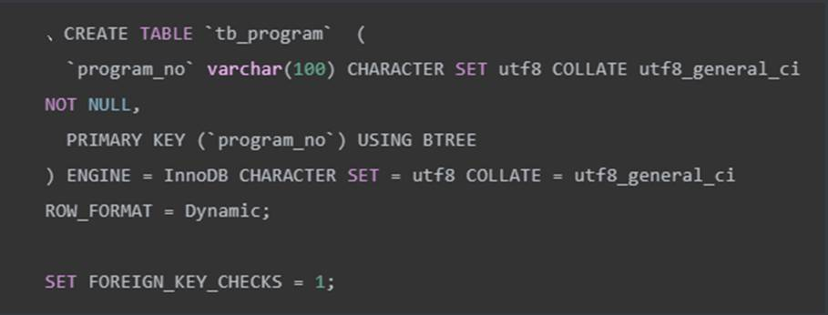

实现步骤：

1. 程序访问数据时，将程序的编号（insert）存入tb_program表。

2. 当insert成功，代表该程序获得了锁，即可执行逻辑。

3. 当program_no相同的其他程序进行insert时，由于主键冲突会导致insert失败，则代表获取锁失败。

4. 获取锁成功的程序在逻辑执行完以后，删除该数据,代表释放锁。

###  基于条件

​    对于分布式锁的实现，比较常见的一种就是基于MySQL乐观锁方式来完成，这种方式的思想就是利用MySQL的InnoDB引擎的**行锁**机制来完成。

​    对于乐观锁的实现，又分为两种，分别为**根据条件**和**根据版本号**。

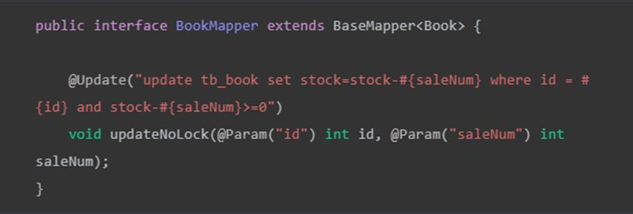

通过Jemeter进行并发测试，可以发现其已经可以保证库存不会被扣减超卖。

### 基于version版本号

​    有时我们并没有一些特定的条件让我们去进行判断。此时就会在数据表中新增一个字段版本字段version来进行数据并发控制。

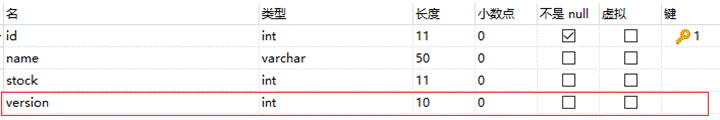

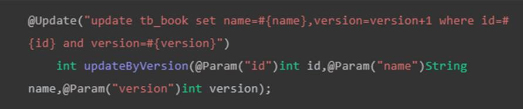

### zookeeer实现

对于分布式锁的实现，zookeeper天然携带的一些特性能够很完美的实现分布式锁。其内部主要是利用znode节点特性和watch机制完成。

znode节点

在zookeeper中节点会分为四类，分别是：

\- **持久节点：**一旦创建，则永久存在于zookeeper中，除非手动删除。

\- **持久有序节点：**一旦创建，则永久存在于zookeeper中，除非手动删除。同时每个节点都会默认存在节点序号，每个节点的序号都是有序递增的。如demo000001、demo000002.....demo00000N。

\- **临时节点：**当节点创建后，一旦服务器重启或宕机，则被自动删除。

\- **临时有序节点：**当节点创建后，一旦服务器重启或宕机，则被自动删除。同时每个节点都会默认存在节点序号，每个节点的序号都是有序递增的。如demo000001、demo000002.....demo00000N。

watch监听机制

​    watch监听机制主要用于**监听节点状态变更**，用于后续事件触发，假设当B节点监听A节点时，一旦A节点发生修改、删除、子节点列表发生变更等事件，B节点则会收到A节点改变的通知，接着完成其他额外事情。

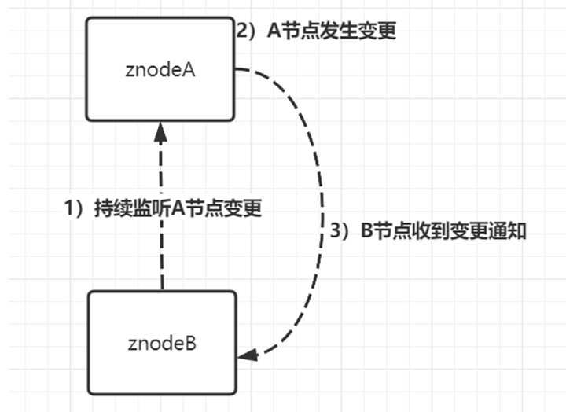

实现原理

其实现思想是当某个线程要对方法加锁时，首先会在zookeeper中创建一个与当前方法对应的父节点，接着每个要获取当前方法的锁的线程，都会在父节点下创建一个**临时有序节点**（临时：避免死锁，持久节点会一直占着锁，有序：获取锁的效率高），因为节点序号是递增的，所以后续要获取锁的线程在zookeeper中的序号也是逐次递增的。根据这个特性，当前序号最小的节点一定是首先要获取锁的线程，因此可以规定**序号最小的节点获得锁**。所以，每个线程再要获取锁时，可以判断自己的节点序号是否是最小的，如果是则获取到锁。当释放锁时，只需将自己的临时有序节点删除即可。

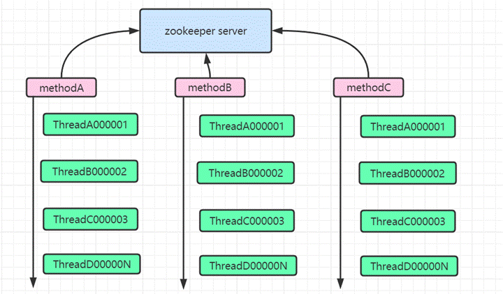

根据上图，在并发下，每个线程都会在对应方法节点下创建属于自己的临时节点，且每个节点都是临时且有序的。那么zookeeper又是如何有序的将锁分配给不同线程呢？ 这里就应用到了watch监听机制。每当添加一个新的临时节点时，其都会基于watcher机制监听着它本身的前一个节点等待前一个节点的通知，当前一个节点删除时，就轮到它来持有锁了。然后依次类推。判断是否获取锁，只要判断放弃那节点序号是否是最小的。

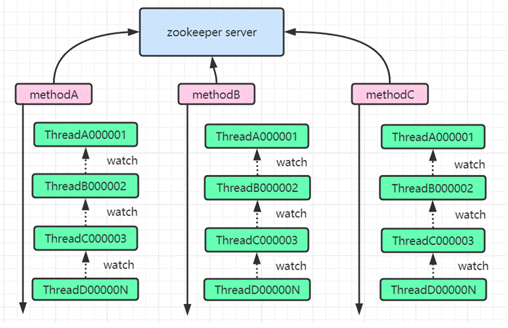

**低效锁思想&实现**

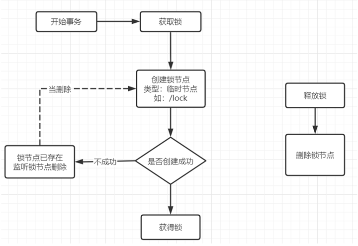

此种实现方式，只会存在一个锁节点。当创建锁节点时，如果锁节点不存在，则创建成功，代表当前线程获取到锁，如果创建锁节点失败，代表已经有其他线程获取到锁，则该

线程会监听锁节点的释放。当锁节点释放后，则继续尝试创建锁节点加锁。

测试运行可以发现：当一个线程获取到锁之后，其他线程则一起监听同一个节点，当线程将锁释放后，其他线程再来继续竞争这把锁。

这种方案的低效点就在于，只有一个锁节点，其他线程都会监听同一个锁节点，一旦锁节点释放后，其他线程都会收到通知，然后竞争获取锁节点。这种大量的通知操作会严重降低zookeeper性能，对于这种由于一个被watch的znode节点的变化，而造成大量的通知操作，叫做羊群效应。

**高效锁思想&实现** 

为了避免羊群效应的出现，业界内普遍的解决方案就是，让获取锁的线程产生排队，后一个监听前一个，依次排序。推荐使用这种方式实现分布式锁。

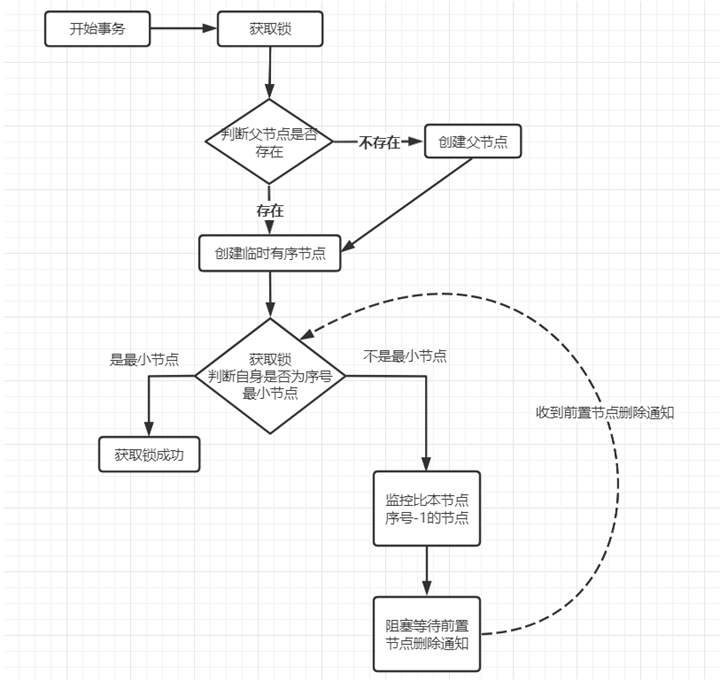

1）定义HighLock类

1. 判断父节点是否存在，父节点不存在，创建持久节点

2. 如果当前节点不存在，则在父节点下创建第一个临时有序节点

3. 如果当前节点存在，则获取父节点下的子节点列表

4. 对子节点列表进行排序

5. 判断当前节点是否为父节点下序号最小的节点

6. 是序号最小的节点，则加锁成功

7. 如果不是序号最小的节点，则对前置节点进行赋值

**锁失效问题**

![@Override  @Transactiona1  public void updatestock(int id, int saleNum) {  String methodName  [8] . getMethodName() ;  AbstractLock lock  lock. getLock();  Thread . current Thread ( ) . getStackTrace ( )  new High Lock(" /"+methodName);  Book book = bookmapper.se1ectById(id);  if (book.  bookmapper. updateNoLock(id , saleNum) ;  System. out. println( " " ) ;  }else {  System. out. println( " ) ;  lock. releaseLock(); ](分布式锁/clip_image086.jpg)

此时通过Jemeter测试，发现仍然出现了超卖。那么问题出现在哪里了呢？ 当前不管使用分布式锁还是JVM提供的锁都是控制不住超卖的(sync、redis、zookeeper)。

当把事务去掉，再通过jemeter进行测试，可以发现已经可以控制住超卖问题了。

其实原因就出现在@Transactional事务上。在业务层上，首先会开启事务，然后加锁、进行业务操作、释放锁，最后才会进行事务提交。 此时因为锁是先释放，那么其他线程就可以获取到锁再来执行该方法，但之前的事务还并未提交，那么后进来的事务当查询时，库存数量仍然满足条件。 因此最终出现超卖问题。这就业锁失效的问题。

对于该问题的解决，第一种方式：将自动事务更改为手动控制事务，在service改代码。 第二种：将锁操作上移到表现层。 开发中，常见的是使用第二种方式进行解决。

### Redis实现

**单节点Redis实现分布式锁**

**原理实现**

分布式锁的一个很重要的特性就是互斥性，同一时间内多个调用方加锁竞争，只能有一个调用方加锁成功。而redis是基于单线程模型的，可以利用这个特性让调用方的请求排队，对于并发请求，只会有一个请求能获取到锁。

redis实现分布式锁也很简单，基于客户端的几个API就可以完成，主要涉及三个核心API：

\- setNx()：向redis中存key-value，只有当key不存在时才会设置成功，否则返回0。用于体现互斥性。

\- expire()：设置key的过期时间，用于避免死锁出现。

 \- delete()：删除key，用于释放锁。

如果加锁失败，则自旋不断尝试获取锁，同时在一定时间内如果仍没有获取到锁，则退出自旋，不再尝试获取锁。

解锁时，要避免当前线程将别人的锁释放掉。假设线程A加锁成功，当过了一段时间线程A来解锁，但线程A的锁已经过期了，在这个时间节点，线程B也来加锁，因为线程A的锁已经过期，所以线程B时可以加锁成功的。此时，就会出现问题，线程A将线程B的锁给释放了。

对于这个问题，就需要使用到加锁时的requestId。当解锁时要判断当前锁键的value与传入的value是否相同，相同的话，则代表是同一个人，可以解锁。否则不能解锁。

但是对于这个操作，有非常多的人，会先查询做对比，接着相同则删除。虽然思路是对的，但是忽略了一个问题，**原子性**。判断与删除分成两步执行，则无法保证原子性，一样会出现问题。所以解锁时不仅要保证加锁和解锁是同一个人还要保证解锁的原子性。因此结合lua脚本完成查询&删除操作。

多线程会竞争同一把锁，且没有获取获取到锁的线程会自旋不断尝试去获取锁。每当一个线程将锁释放后，则会有另外一个线程持有锁。依次类推。

**单节点问题**

**锁续期**

当对业务进行加锁时，锁的过期时间，绝对不能想当然的设置一个值。假设线程A在执行某个业务时加锁成功并设置锁过期时间。但该业务执行时间过长，业务的执行时间超过了锁过期时间，那么在业务还没执行完时，锁就自动释放了。接着后续线程就可以获取到锁，又来执行该业务。就会造成线程A还没执行完，后续线程又来执行，导致同一个业务逻辑被重复执行。因此对于锁的超时时间，需要结合着业务执行时间来判断，让锁的过期时间大于业务执行时间。

上面的方案是一个基础解决方案，但是仍然是有问题的。

业务执行时间的影响因素太多了，无法确定一个准确值，只能是一个估值。无法百分百保证业务执行期间，锁只能被一个线程占有。

如想保证的话，可以在创建锁的同时创建一个守护线程，同时定义一个定时任务每隔一段时间去为未释放的锁增加过期时间。当业务执行完，释放锁后，再关闭守护线程。 这种实现思想可以用来解决锁续期。

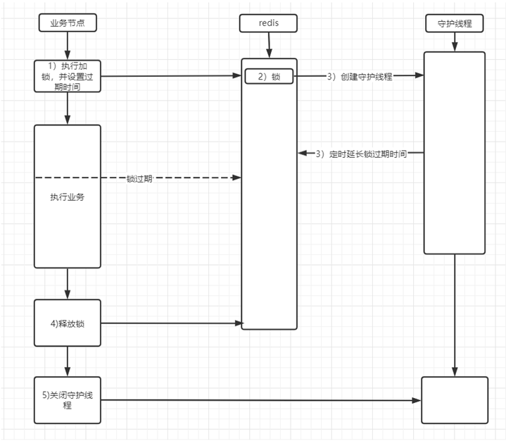

**服务单点&集群问题**

在单点redis虽然可以完成锁操作，可一旦redis服务节点挂掉了，则无法提供锁操作。

在生产环境下，为了保证redis高可用，会采用**异步复制**方法进行主从部署。当主节点写入数据成功，会异步的将数据复制给从节点，并且当主节点宕机，从节点会被提升为主节点继续工作。假设主节点写入数据成功，在没有将数据复制给从节点时，主节点宕机。则会造成提升为主节点的从节点中是没有锁信息的，其他线程则又可以继续加锁，导致互斥失效。

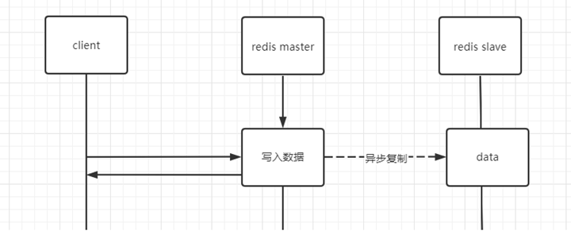

#  

### Redisson实现分布式锁

redisson是redis官网推荐实现分布式锁的一个第三方类库。其内部完成的功能非常强大，对各种锁都有实现，同时对于使用者来说非常简单，让使用者能够将更多的关注点放在业务逻辑上。此处重点利用Redisson解决单机Redis锁产生的两个问题。

基于redisson实现分布式锁很简单，直接基于lock()&unlock()方法操作即可。

多线程并发获取所时，当一个线程获取到锁，其他线程则获取不到，并且其内部会不断尝试获取锁，当持有锁的线程将锁释放后，其他线程则会继续去竞争锁。

 **看门狗**

lock()方法虽然可以设置过期时间，当到期后，锁就会自动释放，因此在业务执行中，通过lock()加锁会存在隐患。Redisson也考虑到了这点，所以提供了看门狗机制。

改造锁示例代码，让锁超时时间为1秒，但是业务执行时，需要耗时3秒，此时执行可以发现，多线程间在上一个锁没有释放的情况下，后续线程又获取到了锁。但是解锁的时候，出现异常，因为加锁时的唯一标识与解锁时的唯一标识发生了改变，造成死锁。

因为业务执行多久无法确定一个准确值，所以在看门狗的实现中，不需要对锁key设置过期时间，当过期时间为-1时，这时会启动一个定时任务，在业务释放锁之前，会一直不停的增加这个锁的有效时间，从而保证在业务执行完毕前，这把锁不会被提前释放掉。

要开启看门狗机制也很简单，只需要将加锁时使用**lock()**改为**tryLock()**即可。

**红锁**

当在单点redis中实现redis锁时，一旦redis服务器宕机，则无法进行锁操作。因此会考虑将redis配置为主从结构，但在主从结构中，数据复制是异步实现的。假设在主从结构中，master会异步将数据复制到slave中，一旦某个线程持有了锁，在还没有将数据复制到slave时，master宕机。则slave会被提升为master，但被提升为slave的master中并没有之前线程的锁信息，那么其他线程则又可以重新加锁。

redlock是一种**基于多节点redis实现分布式锁**的算法，可以有效解决redis单点故障的问题。官方建议搭建**五台redis**服务器对redlock算法进行实现。

整个实现过程分为五步：

1. 记录获取锁前的当前时间

2. 使用相同的key，value获取所有redis实例中的锁，并且设置获取锁的时间要远远小于锁自动释放的时间。假设锁自动释放时间是10秒，则获取时间应在5-50毫秒之间。通过这种方式避免客户端长时间等待一个已经关闭的实例，如果一个实例不可用了，则尝试获取下一个实例。

3. 客户端通过获取所有实例的锁后的时间减去第一步的时间，得到的差值要小于锁自动释放时间，避免拿到一个已经过期的锁。并且要有超过半数的redis实例成功获取到锁，才算最终获取锁成功。如果不是超过半数，有可能出现多个客户端重复获取到锁，导致锁失效。

4. 当已经获取到锁，那么它的真正失效时间应该为：过期时间-第三步的差值。

5. 如果客户端获取锁失败，则在所有redis实例中释放掉锁。为了保证更高效的获取锁，还可以设置重试策略，在一定时间后重新尝试获取锁，但不能是无休止的，要设置重试次数。

​    虽然通过redlock能够更加有效的防止redis单点问题，但是仍然是存在隐患的。假设redis没有开启持久化，clientA获取锁后，所有redis故障重启，则会导致clientA锁记录消失，clientB仍然能够获取到锁。这种情况虽然发生几率极低，但并不能保证肯定不会发生。保证的方案就是开始AOF持久化，但是要注意同步的策略，使用每秒同步，如果在一秒内重启，仍然数据丢失。使用always又会造成性能急剧下降。

​    官方推荐使用默认的AOF策略即每秒同步，且在redis停掉后，要在ttl时间后再重启。 缺点就是ttl时间内redis无法对外提供服务。

### Redis与zookeeper分布式锁对比

redis实现分布式锁优点在于其性能很高，能够支撑高并发的加锁与解锁操作。而其缺点也很明显，主要如下：

- 采用抢占式方式进行锁的获取，需要不断的在用户态进行CAS尝试获取锁，对CPU占用率高。

-  redis本身并不是CP模型，即便采用了redlock算法，但仍然无法保证百分百不会出现问题，如持久化问题。

- 对于redis分布式锁的使用，在企业中是非常常见的，绝大多数情况不会出现极端情况。

zookeeper实现分布式的优点在于其是强一致性的，采用排队监听的方式获取锁，不会像redis那样不断进行轮询尝试，对性能消耗较小。其缺点则是如果频繁的加锁和解锁，对zk服务器压力较大。

当进行技术选型时，应该对其优缺点结合公司当前情况进行考虑。 如果公司有条件使用zk集群，更推荐使用zk的分布式锁，因为redis实现分布式锁有可能出现数据不正确的情况，但如果公司没有zk集群，使用redis集群完成分布式锁也无可厚非。
