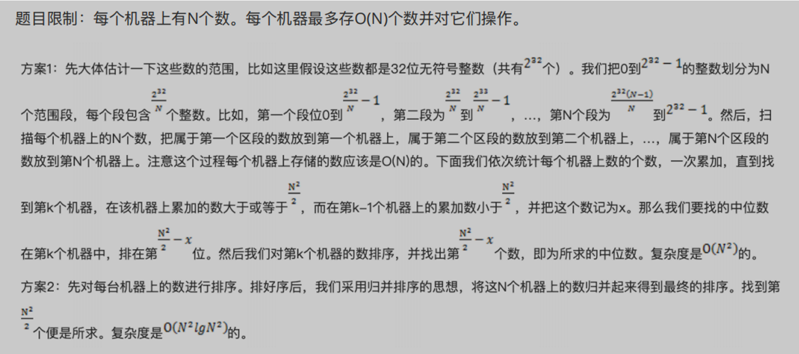
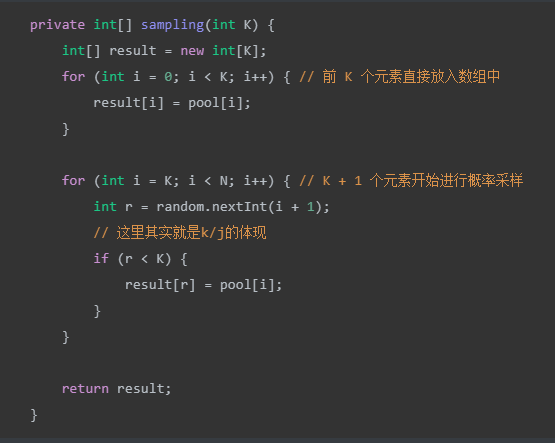
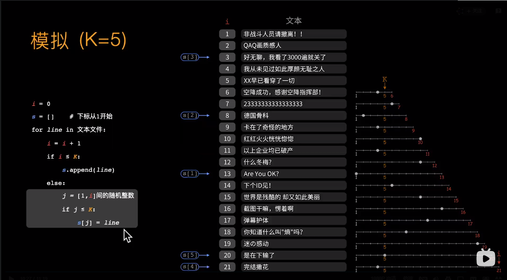

## 1.TopK问题

### 1.1一类问题

1. 1亿个浮点数，如果找出最⼤的10000个
2. 有⼀个**1G**⽂件，内存限制⼤⼩是**1M**。返回频数最⾼**100**
3. 100w个数中找出最⼤的100个数
4. 海量数据分布在**100**台电脑中，想个办法⾼校统计出这批数据的**TOP10**
5. 海量⽇志数据，提取出某⽇访问百度次数最多的那个**IP**
6. ⼀个亿级⽂本⽂件，找出前**10**个经常出现的词，⽆法⼀次读⼊内存，问最优解
7. 怎么在海量数据中找出重复次数最多的⼀个
8. 上千万或上亿数据（有重复），统计其中出现次数最多的前N个数据。

解法：hash+分治+⼩顶堆+hashmap统计次数+快速排序思想+插入排序思想

1. hash去重：

   如果这1亿个书⾥⾯有很多重复的数，先通过Hash法，把这1亿个数字去重复，这样如果重复率很⾼的话，会减少很⼤的内存⽤量，从⽽缩⼩运算空间，然后通过分治法或最⼩堆法查找最⼤的10000个数

2. 划分文件：

   ⽐如模1000，把整个⼤⽂件映射为1000个⼩⽂件，并且相同的数一定在一个文件中

3. 分治：

   顺序读⽂件中，对于每个词x，取 ，然后按照该值存到5000个⼩⽂件（记为）中。这样每个⽂件⼤概是200k左右。如果其中的有的⽂件超过了1M⼤⼩，还可以按照类似的⽅法继续往下分，直到分解得到的⼩⽂件的⼤⼩都不超过1M

4. ⼩顶堆：

   ⾸先读⼊前10000个数来创建⼤⼩为10000的最⼩堆，建堆的时间复杂度为O（mlogm）（m为数组的⼤⼩即为10000），然后遍历后续的数字，并于堆顶（最⼩）数字进⾏⽐较。如果⽐最⼩的数⼩，则继续读取后续数字；如果⽐堆顶数字⼤，则替换堆顶元素并重新调整堆为最⼩堆。整个过程直⾄1亿个数全部遍历完为⽌。然后按照中序遍历的⽅式输出当前堆中的所有10000个数字。该算法的时间复杂度为O（nmlogm），空间复杂度是10000（常数）

5. 快速排序思想：

   100万个数据⾥⾯查找最⼤的10000个数据的⽅法如下：⽤快速排序的⽅法，将数据分为2堆，如果⼤的那堆个数N⼤于10000个，继续对⼤堆快速排序⼀次分成2堆，如果⼤的那堆个数N⼤于10000个，继续对⼤堆快速排序⼀次分成2堆，如果⼤堆个数N⼩于10000个，就在⼩的那堆⾥⾯快速排序⼀次，找第10000-n⼤的数字；递归以上过程，就可以找到第1w⼤的数。参考上⾯的找出第1w⼤数字，就可以类似的⽅法找到前10000⼤数字了。此种⽅法需要每次的内存空间为10^6*4=4MB，⼀共需要101次这样的⽐较。

6. 插入排序思想：

   采⽤局部淘汰法。选取前100个元素，并排序，记为序列L。然后⼀次扫描剩余的元素x，与排好序的100个元素中最⼩的元素⽐，如果⽐这个最⼩的要⼤，那么把这个最⼩的元素删除，并把x利⽤插⼊排序的思想，插⼊到序列L中。依次循环，直到扫描了所有的元素。复杂度为O(100w*100)。 这个⽅法就是插⼊排序。

### 1.2万级文本文件，每行一个词，统计出其中最频繁出现的前10个词

这题是考虑时间效率。<u>用trie树统计每个词出现的次数</u>，时间复杂度是O(n*le)（le表示单词的平准长度）。然后是找出出现最频繁的前10个词，可以用堆来实现，前面的题中已经讲到了，时间复杂度是O(n*lg10)。所以总的时间复杂度，是O(n*le)与O(n*lg10)中较大的哪一个。

### 1.3最热门的10个查询串

搜索引擎会通过日志文件把用户每次检索使用的所有检索串都记录下来，每个查询串的长度为1-255字节。假设目前有一千万个记录，这些查询串的重复读比较高，虽然总数是1千万，但是如果去除重复和，不超过3百万个。一个查询串的重复度越高，说明查询它的用户越多，也就越热门。

请你统计最热门的10个查询串，要求使用的内存不能超过1G。

(1) 请描述你解决这个问题的思路；

(2) 请给出主要的处理流程，算法，以及算法的复杂度。

方案1：采用trie树，关键字域存该查询串出现的次数，没有出现为0。最后用10个元素的最小推来对出现频率进行排序。

方案2：可以采用hash分块，然后统计各个块中的最热门的10个查询，然后用堆排序，时间复杂度=N+n*m +nlog10 +m*10log10.此可以用来处理超过内存容量的情况 

### 1.4找出出现次数最多的IP

可以考虑采用“分而治之”的思想，按照IP地址的Hash(IP)%1024值，把海量IP日志分别存储到1024个小文件中。

## 2.重复问题

### 2.1⽂件包含电话号码，统计不同号码的个数

对于本题，8 位电话号码可以表示的号码个数为 10^8 个，即 1 亿个。我们每个号码用一个 bit 来表示，则总共需要 1 亿个 bit，内存占用约 100M。

思路如下：

申请一个位图数组，长度为 1 亿，初始化为 0。然后遍历所有电话号码，把号码对应的位图中的位置置为 1。遍历完成后，如果 bit 为 1，则表示这个电话号码在文件中存在，否则不存在。bit 值为 1 的数量即为 不同电话号码的个数。

### 2.2在2.5亿个整数中找出不重复的整数，内存不⾜以容纳这2.5亿个整数。

方案1：采用2-Bitmap（每个数分配2bit，00表示不存在，01表示出现一次，10表示多次，11无意义）进行，共需内存内存（整数占4B，32位），还可以接受。然后扫描这2.5亿个整数，查看Bitmap中相对应位，如果是00变01，01变10，10保持不变。所描完事后，查看bitmap，把对应位是01的整数输出即可。

方案2：也可采用上题类似的方法，进行划分小文件的方法。然后在小文件中找出不重复的整数（用hashset和hashmap，trie树对hashmap的优势是，在大量重复的单词中，trie树需要的内存会低一些，hashmap的优势是查找快一些。），并排序。然后再进行归并，注意去除重复的元素。也可像鸽巢原理，整数个数为2^32,也就是，我们可以将这2^32个数，划分为2^8个区域(比如用单个文件代表一个区域)，然后将数据分离到不同的区域，然后不同的区域在利用bitmap就可以直接解决了。也就是说只要有足够的磁盘空间，就可以很方便的解决。

### 2.31000万字符串，去重

这题⽤trie树⽐较合适，hash_map也应该能⾏。

## 3.排序问题

### 3.1一个文件中有9亿条不重复的9位整数,对这个文件中数字进行排序;

解决思路：

（❌）将所有数据**导入到内存**中,然后使用常规的排序方法,例如插入排序,快速排序,归并排序等各种排序方法对数据进行排序,最后将排序好的数据存入文件.但这些方法在此并不适用,由于数据量巨大,对32位机器而言,很难将这么多数据一次载入到内存,更不用说进行排序了.所以此种方法一般不可行,需要考虑其他方法.     ————————————————

1. 方法一：数据库排序法.
    		将文本文件导入到数据库中,让文本文件导入到数据库中,让数据库进行索引排序操作后提取数据到文件.该种方法虽然操作简单,方便,但是运算速度较慢,而且对数据库设备要求比较高.
2. 方法二：分治法.
             通过Hash法将9亿条数据分为20段,每一段大约5000万条,大约需要占用500万*4B = 200MB空间,在文件中依次搜索0~5000万,50000001~1亿  ,,将排序的结果存入文件,该方法要装满9位整数,一共需要20次,所以一共要进行20次排序,需要对文件进行20次读操作.该方法虽然缩小了每次使用的内存空间大小,但是编码复杂,速度也慢.
3. 方法三：位图法.
              考虑到最大的9位整数为999999999,由于9亿条数据是不重复的,可以把这些数据组成一个队列或者数组,让它有0~999999999(一共10亿个数)元素数组下标表示数值,结点中用0表示没有这个数,1表示存在这个数,判断0或1只用一个bit存储就够了,
             而声明一个可以包含9位整数的bit数组,一共需要10亿/8,大约120MB内存,把内存中的数组全部初始化为0,读取文件中的数据,并将数据放入内存.比如读到一个数据为314332897这个数据,那就先在内存中找到314332897这个bit,并将bit值置为1,遍历整个bit数组,将bit为1的数组下标存入文件,最终得到排序的内容.

外排序：

外部排序算法由两个阶段构成：

1. 按照内存大小，将大文件分成若干长度为     l 的子文件（l     应小于内存的可使用容量），然后将各个子文件依次读入内存，使用适当的内部排序算法对其进行排序（排好序的子文件统称为“归并段”或者“顺段”），将排好序的归并段重新写入外存，为下一个子文件排序腾出内存空间；
2. 对得到的顺段进行合并，直至得到整个有序的文件为止。

注意：在实际归并的过程中，由于内存容量的限制不能满足同时将 2 个归并段全部完整的读入内存进行归并，只能不断地取 2 个归并段中的每一小部分进行归并，通过不断地读数据和向外存写数据，直至 2 个归并段完成归并变为 1 个大的有序文件。

http://data.biancheng.net/view/76.html

### 3.2频度排序

**题目： 有10个文件，每个文件1G，每个文件的每一行存放的都是用户的query，每个文件的query都可能重复。要求你按照query的频度排序**

方案1：

 \- 顺序读取10个文件，按照hash(query)%10的结果将query写入到另外10个文件中。这样新生成的文件每个的大小大约也1G（假设hash函数是随机的）。

 \-找一台内存在2G左右的机器，依次对用hash_map(query, query_count)来统计每个query出现的次数。利用快速/堆/归并排序按照出现次数进行排序。将排序好的query和对应的query_cout输出到文件中。这样得到了10个排好序的文件。

  \-对这10个文件进行归并排序（内排序与外排序相结合）。

方案2：

一般query的总量是有限的，只是重复的次数比较多而已，可能对于所有的query，一次性就可以加入到内存了。这样，我们就可以采用trie树/hash_map等直接来统计每个query出现的次数，然后按出现次数做快速/堆/归并排序就可以了。

方案3：

与方案1类似，但在做完hash，分成多个文件后，可以交给多个文件来处理，采用分布式的架构来处理（比如MapReduce），最后再进行合并。（与1相比就是处理构架不同）

## 4相等问题

### 4.1两文件，如何从 100 亿 URL 中找出相同的 URL？

**Eg： 给定 a、b 两个文件，各存放 50 亿个 URL，每个 URL 各占 64B，内存限制是 4G。请找出 a、b 两个文件共同的 URL。**

每个 URL 占 64B，那么 50 亿个 URL 占用的空间大小约为 320GB。由于内存大小只有 4G，因此，我们不可能一次性把所有 URL 加载到内存中处理。

1. 分治：把一个文件中的 URL 按照某个特征划分为多个小文件，使得每个小文件大小不超过 4G，这样就可以把这个小文件读到内存中进行处理了。

   首先遍历文件 a，对遍历到的 URL 求 hash(URL) % 1000 ，根据计算结果把遍历到的 URL 存储到 a0, a1, a2, ..., a999，这样每个大小约为 300MB。使用同样的方法遍历文件 b，把文件 b 中的 URL 分别存储到文件 b0, b1, b2, ..., b999 中。这样处理过后，所有可能相同的 URL 都在对应的小文件中，即 a0 对应 b0, ..., a999 对应 b999，不对应的小文件不可能有相同的 URL。那么接下来，我们只需要求出这 1000 对小文件中相同的 URL 就好了。

2. hash: 对每个子文件做hashset统计

   接着遍历 ai( i∈[0,999] )，把 URL 存储到一个 HashSet 集合中。然后遍历 bi 中每个 URL，看在 HashSet 集合中是否存在，若存在，说明这就是共同的 URL，可以把这个 URL 保存到一个单独的文件中。

3. Bloom filter

  如果允许有一定的错误率，可以使用Bloom filter，4G内存大概可以表示340亿bit。将其中一个文件中的url使用Bloom filter映射为这340亿bit，然后挨个读取另外一个文件的url，检查是否与Bloom filter，如果是，那么该url应该是共同的url（注意会有一定的错误率）。

## 5.中位数问题

### 5.1查找中位数

方法一：

分治法的思想是把一个大的问题逐渐转换为规模较小的问题来求解。

对于这道题，顺序读取这 5 亿个数字，对于读取到的数字 num，如果它对应的二进制中最高位为 1，则把这个数字写到 f1 中，否则写入 f0 中。通过这一步，可以把这 5 亿个数划分为两部分，而且 f0 中的数都大于 f1 中的数（最高位是符号位）。

划分之后，可以非常容易地知道中位数是在 f0 还是 f1 中。假设 f1 中有 1 亿个数，那么中位数一定在 f0 中，且是在 f0 中，从小到大排列的第 1.5 亿个数与它后面的一个数的平均值。

提示，5 亿数的中位数是第 2.5 亿与右边相邻一个数求平均值。若 f1 有一亿个数，那么中位数就是 f0 中从第 1.5 亿个数开始的两个数求得的平均值。

对于 f0 可以用次高位的二进制继续将文件一分为二，如此划分下去，直到划分后的文件可以被加载到内存中，把数据加载到内存中以后直接排序，找出中位数。

注意，当数据总数为偶数，如果划分后两个文件中的数据有相同个数，那么中位数就是数据较小的文件中的最大值与数据较大的文件中的最小值的平均值。

方法二：

排序后找。

https://zhuanlan.zhihu.com/p/75397875方法更多，更详细

### 5.2N个机器，如何找到中位数

题目限制：每个机器上有N个数。每个机器最多存O(N)个数并对它们操作。 

## 6.随机选择K个数---蓄水池采样 

问题：

给出一个数据流，这个数据流的长度很大或者未知。并且对该数据流中数据只能访问一次。请写出一个随机选择算法，使得数据流中所有数据被选中的概率相等。

解法：

**蓄水池采样（Reservoir Sampling）算法。**

介绍该算法之前，我们首先从最简单的例子出发（只在数据流中取一个数据）：假设数据流只有一个数据。我们接收数据，发现数据流结束了，直接返回该数据，该数据返回的概率为1。看来很简单，那么我们试试难一点的情况：假设数据流里有两个数据。

我们读到了第一个数据，这次我们不能直接返回该数据，因为数据流没有结束。我们继续读取第二个数据，发现数据流结束了。因此我们只要保证以相同的概率返回第一个或者第二个数据就可以满足题目要求。因此我们生成一个0到1的随机数R，如果R小于0.5，我们就返回第一个数据，如果R大于0.5，返回第二个数据。

接着我们继续分析有三个数据的数据流的情况。为了方便，我们按顺序给流中的数据命名为1、2、3。我们陆续收到了数据1、2。和前面的例子一样，我们只能保存一个数据，所以必须淘汰1和2中的一个。应该如何淘汰呢？不妨和上面例子一样，我们按照二分之一的概率淘汰一个，例如我们淘汰了2。继续读取流中的数据3，发现数据流结束了，我们知道在长度为3的数据流中，如果返回数据3的概率为1/3，那么才有可能保证选择的正确性。也就是说，目前我们手里有1、3两个数据，我们通过一次随机选择，以1/3的概率留下数据3，以2/3的概率留下数据1。那么数据1被最终留下的概率是多少呢？

数据1被留下概率：（1/2）* (2/3) = 1/3

数据2被留下概率：（1/2）*(2/3) = 1/3

数据3被留下概率：1/3

这个方法可以满足题目要求，所有数据被留下返回的概率一样。

因此，循着这个思路，我们可以总结算法的过程：

假设需要采样的数量为K。

1. 首先构建一个可容纳 K 个元素的数组，将序列的前 K 个元素放入数组中。

2. 对于第 i>=k+1，我们以 k/i 概率决定是否要把它换入蓄水池，换入时随机的选取一个作为替换项，这样一直做下去，对于任意的样本空间n，对每个数的选取概率都为k/n。也就是说对每个数选取概率相等。 当遍历完所有元素之后，数组中剩下的元素即为所需采取的样本。

代码如下：

