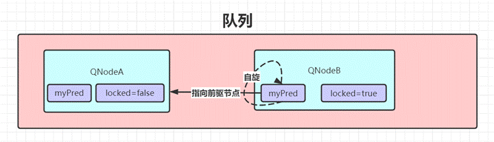
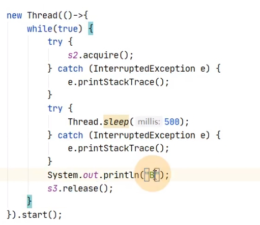

# 并发编程核心概念

1. 原子性

​    所谓原子性即：一个或者多个操作，要么全部执行并且执行的过程不会被任何因素打断，要么就都不执行。

​    在整个操作过程中不会被线程调度器打断，如a=1就是一个原子操作，但a++则不是一个原子操作，因为其内部会额外产生一个新的Integer对象。

​    举个例子，假设对一个32位的变量赋值，操作分为两步：低16位赋值、高16位赋值。当线程A对低16位数据写入成功后，线程A被中断。而此时另外的线程B去读取a的值，那么读取到的就是错误的数据。

​    在Java中的原子性操作包括：

- 基本类型的读取和赋值操作，且赋值必须是数字赋值给变量，变量之间的相互赋值不是原子性操作。
- 所有引用的赋值操作。
- java.concurrent.Atomic.*     包中所有原子操作类的一切操作。

1. 可见性

   ​    所谓可见性：即当多个线程访问同一个共享变量时，一个线程修改了该共享变量的值后，其他线程能够立即查看到修改后的值。

   ​     而如果要做到可见，Java中的volatile、synchronized、Lock都能保证可见性。如一个变量被volatile修饰后，表示当一个线程修改共享变量后，其会立即被更新到主内存中，其他线程读取共享变量时，会直接从主内存中读取。而synchronized和Lock能保证同一时刻只有一个线程获取锁然后执行同步代码，并且在释放锁之前会将对变量的修改刷新到主存当中。因此可以保证可见性。

2. 有序性

   ​     所谓有序性：即程序执行的顺序会按照代码的先后顺序执行。其可以理解为**在本线程内，所有的操作都是有序的。而如果在A线程中观察B线程，所有的操作都是无序的**。在JMM中为了提升程序的执行效率，允许编译器和处理器对**指令重排序**。对于单线程来说，指令重排并不会产生问题，而在多线程下则不可以。

   在Java中可以通过synchronized和Lock来保证有序性，synchronized和Lock保证每个时刻是有一个线程执行同步代码，相当于是让线程顺序执行同步代码，自然就保证了有序性。

   另外还可以通过volatile来保证一定的有序性。最著名的例子就是单例模式的DCL（双重检查锁）。

# 进程、线程

## 基本概念

- 什么是进程

  进程可以理解为就是应用程序的启动实例。如微信、Idea、Navicat等，当打开它们后，就相当于开启了一个进程。每个进程都会在操作系统中拥有独立的内存空间、地址、文件资源、数据资源等。**进程是资源分配和管理的最小单位**

  线程从属于进程，是程序的实际执行者，一个进程中可以包含若干个线程，并且也可以把线程称为轻量级进程。每个线程都会拥有自己的计数器、堆栈、局部变量等属性，并且能够访问共享的内存变量。**线程是操作系统（CPU）调度和执行的最小单位。CPU会在这些线程上来回切换，让使用者感觉线程是在同时执行的。

**线程使用带来的问题**

​    有很多人都会存在一个误区，在代码中使用多线程，一定会为系统带来性能提升，这个观点是错误的。并发编程的目的是为了让程序运行的更快，但是，绝对不是说启动的线程越多，性能提升的就越大，其会受到很多因素的影响，如锁问题、线程状态切换问题、线程上下文切换问题，还会受到硬件资源的影响，如CPU核数。

**线程上下文切换**

​    不管是在多核甚至单核处理器中，都是能够以多线程形式执行代码的，CPU通过给每个线程分配CPU时间片来实现线程执行间的快速切换。 所谓的时间片就是CPU分配给每个线程的执行时间，当某个线程获取到CPU时间片后，就会在一定时间内执行，当时间片到期，则该线程会进入到挂起等待状态。时间片一般为几十毫秒，通过在CPU的高速切换，让使用者感觉是在同时执行。

​    同时还要保证线程在切换的过程中，要记录线程被挂起时，已经执行了哪些指令、变量值是多少，那这点则是通过每个线程内部的程序计数器来保证。

​    简单来说：线程从挂起到再加载的过程，就是一次上下文切换。其是比较耗费资源的。

引起上下文切换的几种情况：

- 时间片用完，CPU正常调度下一个任务。
- 被其他优先级更高的任务抢占。
- 执行任务碰到IO阻塞，调度器挂起当前任务，切换执行下一个任务。
- 用户代码主动挂起当前任务让出CPU时间。
- 多任务抢占资源，由于没有抢到被挂起。
- 硬件中断。

**CPU**时间片轮转机制优化

​    之前已经提到了线程的执行，是依赖于CPU给每个线程分配的时间来进行。在CPU时间片轮转机制中，如果一个线程的时间片到期，则CPU会挂起该线程并给另一个线程分配一定的时间分片。如果进程在时间片结束前阻塞或结束，则 CPU 会立即进行切换。

​     时间片太短会导致频繁的进程切换，降低了 CPU 效率: 而太长又可能引起对短的交

互请求的响应变差。时间片为 **100ms** 通常是一个比较合理的折衷。

**并行与并发的理解**

并发即让多个任务能够**交替**执行，一般都会附带一个时间单位，也就是所谓的在单

位时间内的并发量有多少。

并行即让多个任务能够同时执行。比如说：你可以一遍上厕所，一遍吃饭。

**多线程的创建方式**

线程的实现方式有两种：继承Thread类、实现Runnable接口。但是有一些书籍或者文章会说有三种方式，即实现Callable接口。但通过该接口定义线程并不是Java标准的定义方式，而是基于Future思想来完成。

Thread是对一个线程的抽象，而Runnable是对业务逻辑的抽象，并且Thread 可以接受任意一个 Runnable 的实例并执行。

优化：启动线程前，最好为这个线程设置特定的线程名称，这样在出现问题时，给开发人员一些提示，快速定位到问题线程。

**线程中止**

线程在正常下当run执行完，或出现异常都会让该线程中止。

**理解suspend()、resume()、stop()**

这三个方法对应的是暂停、恢复和中止。但是三个已经在Java源码中被标注为过期方法。当调用suspend()时，线程不会将当前持有的资源释放(如锁)，而是占有者资源进入到暂停状态，这样的话，容易造成死锁问题的出现。

当调用stop()时，会**立即停止run()中剩余的操作**。因此可能会导致一些的工作得不到完成，如文件流，数据库等关闭。并且**会立即释放该线程所持有的所有的锁**，导致数据得不到同步的处理，出现数据不一致的问题。线程中止的安全且优雅姿势

Java对于线程安全中止设计了一个**中断属性**，其可以理解是线程的一个标识位属性。它用于表示一个运行中的线程是否被其他线程进行了中断操作。好比其他线程对这个线程打了一个招呼，告诉它你该中断了。通过**interrupt()**实现。添加该方法后，会出现一个异常，但是可以发现并不会线程的继续执行。

线程通过检查自身是否被中断来进行响应，可以通过**isInterrupted()**进行判断，如果返回值为true，代表添加了中断标识，返回false，代表没有添加中断标识。通过它可以对线程进行中断操作。

对线程中断属性的判断，可以利用其进行线程执行的中断操作。

线程也可以通过静态方法**Thread.interrupted()**查询线程是否被中断，并对中断标识进行复位，如果该线程已经被添加了中断标识，当使用了该方法后，会将线程的中断标识由true改为false。同时要注意：**处于死锁下的线程，无法被中断**

 

## 进程和线程的区别

进程是执行着的应用程序，而线程是进程内部的一个执行序列。一个进程可以有多个线程。线程又叫做轻量级进程。

a.地址空间和其它资源：进程间拥有独立内存，进程是资源分配的基本单位；线程隶属于某一进程，且同一进程的各线程间共享内存（资源），线程是cpu调度的基本单位。 进程间相互独立，同一进程的各线程间共享。某进程内的线程在其它进程不可见。

b.通信：进程间相互独立，通信困难，常用的方法有：管道，信号，套接字，共享内存，消息队列等；线程间可以直接读写进程数据段（如全局变量）来进行通信——需要进程同步和互斥手段的辅助，以保证数据的一致性。 

c.调度和切换：线程上下文切换比进程上下文切换要快。进程间切换要保存上下文，加载另一个进程；而线程则共享了进程的上下文环境，切换更快。


 

## 线程创建方式

实现Thread类


实现Runnbale接口


 

**实现**Callable接口


**为什么要有Runnable接口的出现？**

1. 通过继承Thread类的方式，可以完成多线程的建立。但是这种方式有一个局限性，如果一个类已经有了自己的父类，就不可以继承Thread类，因为java单继承的局限性。 可是该类中的还有部分代码需要被多个线程同时执行。这时怎么办呢？ 只有对该类进行额外的功能扩展，java就提供了一个接口Runnable。这个接口中定义了run方法，其实run方法的定义就是为了存储多线程要运行的代码。所以，通常创建线程都用第二种方式。 因为实现Runnable接口可以避免单继承的局限性。

2. 其实是将不同类中需要被多线程执行的代码进行抽取。将多线程要运行的代码的位置单独定义到接口中。为其他类进行功能扩展提供了前提。 所以Thread类在描述线程时，内部定义的run方法，也来自于Runnable接口。 实现Runnable接口可以避免单继承的局限性。而且，继承Thread，是可以对Thread类中的方法，进行子类复写的。但是不需要做这个复写动作的话，只为定义线程代码存放位置，实现Runnable接口更方便一些。所以Runnable接口将线程要执行的任务封装成了对象。

**Thread和Runnable的联系与区别**

1. Thread和Runnable都可以实现多线程

2. Thread是类，而Runnable是接口，这就是类和接口区别，类只能继承一次，而接口可以实现多个接口。 

3. Thread实现Runnable接口，这个可以查看Thread的源代码。 

4. 最重要的分享资源功能，一般我们使用多线程就是快速解决资源问题。Runnable可以实现资源分享，类实现Runnable并不具备线程功能，必须通过new Thread(runabble子类)调用start()启动线程，所以我们通常new一个runnable的子类，启动多个线程解决资源问题。Thread是类所以我们每次new一个对象时候资源已经实例化了，不能资源共享，Thread类要实现资源共享，可以声明变量为static，类共享的可以解决。

5. 通过以上建议最好实现Runnable接口 实现多线程。

## 线程操作常见方法

1. run()&start()

   当线程执行了 start()方法后，才真正意义上的启动线程，其会让一个线程进入就绪状态等待分配CPU时间片，分到时间片后才会调用run()。注意，同一个线程的start()不能被重复调用，否则会出现异常，因为重复调用了，start方法，线程的state就不是new了，那么threadStatus就不等于0了。 

   而run()则仅仅是一个普通方法，与类中的成员方法意义相同。在该方法中可以实现线程执行的业务逻辑。但并不会以异步的方式将线程启动，换句话说就是并不会去开启一个新的线程。其可以单独执行，也可以重复执行。

2. wait()、notify()

   wait()、notify()、notifyAll()是三个定义在Object类里的方法，可以用来控制线程的状态。

   注意：一定要在线程同步中使用,并且是同一个锁的资源


1. WaitThread首先获取对象锁。
2. WaitThread调用对象的wait()方法，放弃锁并进入对象的等待队列WaitQueue，进行等待状态。

3. 由于WaitThread释放了对象锁，NotifyThread随机获取对象锁。

4. NotifyThread获取对象锁成功后，调用notify()或notifyAll()，将WaitThread从等待队列，WaitQueue移到同步队列SynchronizedQueue，此时WaitThread为**阻塞状态**。

5. NotifyThread释放锁后，WaitThread再次获取锁并从wait()方法继续执行。

**等待通知范式**

等待方：

- ​	获取对象锁。
- ​	如果条件不满足，那么调用对象的wait方法，被通知后仍要检查条件。
- ​	条件满足则执行对应逻辑。


​	通知方：

- ​	获取对象锁。

- ​	改变条件。

- ​	通知等待在该对象上的线程。


**wait与sleep区别**

对于sleep()方法，首先要知道该方法是属于Thread类中的。而wait()方法，则是属于Object类中的。sleep()方法导致了程序暂停执行指定的时间，让出cpu调度其他线程，但是他的监控状态依然保持者，当指定的时间到了又会自动恢复运行状态。

 wait()是把控制权交出去，然后进入等待此对象的等待锁定池处于等待状态，只有针对此对象调用notify()方法后本线程才进入对象锁定池准备获取对象锁进入运行状态。

 在调用sleep()方法的过程中，线程不会释放锁。而当调用wait()方法的时候，线程会释放锁。

**理解yield()**

​    当某个线程调用了这个方法后，该线程立即释放自己持有的时间片。线程会进入到就绪状态，同时CPU会重新选择一个线程赋予时间分片，但注意，调用了这个方法的线程，也有可能被CPU再次选中赋予执行。而且该方法不会释放锁。 如需释放锁的话，可以在调用该方法前自己手动释放。

**理解join()**

该方法的使用，在实际开发中，应用的是比较少的。但在面试中，常常伴随着产生一个问题，如何保证线程的执行顺序？ 就可以通过该方法来设置。

使用:当线程调用了该方法后，线程状态会从就绪状态进入到运行状态。

每一个线程实现都持有前一个线程的引用。

当前线程需要等待previousThread线程终止之后才从thread.join返回。可以理解为，线程会在join处等待。

Thread.join其实底层是通过wait/notifyall来实现线程的通信达到线程阻塞的目的；当线程执行结束以后，会触发两个事情，第一个是设置native线程对象为null、第二个是通过notifyall方法，让等待在previousThread对象锁上的wait方法被唤醒。

## 线程优先级

线程优先级的**范围是****1~10**。一个线程的**默认优先级是****5**，可以在构建线程时，通过**setPriority()**修改该线程的优先级。优先级高的线程分配时间片的数量会高于优先级低的线程。

 一般来说对于频繁阻塞的线程需要设置优先级高点，而偏重计算的线程优先级会设置低些，确保处理器不会被独占。

但**注意，线程优先级不能作为线程执行正确性的依赖，因为不同的操作系统可能会忽略优先级的设置。**

## 守护线程

守护线程是一种支持型的线程，我们之前创建的线程都可以称之为用户线程。通过守护线程可以完成一些支持性的工作，如GC、分布式锁续期。守护线程会伴随着用户线程的结束而结束。

对于守护线程的创建，可以通过setDaemon()设置。

当线程实例没有被设置为守护线程时，该线程并不会随着主线程的结束而结束。但是当被设置为守护线程后，当主线程结束，该线程也会伴随着结束。同时守护线程不一定会执行finally代码块。所以当线程被设定为守护线程后，无法确保清理资源等操作一定会被执行。

## 线程状态


## 线程安全活跃态问题以及竞态条件


# **synchronized**

## synchronized锁住的是什么

- 静态方法：clss对象

- 普通方法：this对象

- 静态代码块：根据锁住的内容有所不同


对于synchronized，可以把其加在方法上或者类上，或者添加同步代码块。


这种操作方式也可以叫做对象锁。

对于synchronized，也可以加载类上进行使用。此时可以把它称为**类锁**。此时加锁的就是一个class对象了。


在使用synchronized时，建议锁定的范围，越小越好。否则的话，容易造成大量资源被锁定。

## synchronized是可重入锁吗

synchronized底层是利用计算机系统mutex Lock实现的。每一个可重入锁都会关联一个线程ID和一个锁状态status。

当一个线程请求方法时，会去检查锁状态。

- 1. 如果锁状态是0，代表该锁没有被占用，使用CAS操作获取锁，将线程ID替换成自己的线程ID。
  2. 如果锁状态不是0，代表有线程在访问该方法。此时，如果线程ID是自己的线程ID，如果是可重入锁，会将status自增1，然后获取到该锁，进而执行相应的方法；如果是非重入锁，就会进入阻塞队列等待。

在释放锁时，

- 1. 如果是可重入锁的，每一次退出方法，就会将status减1，直至status的值为0，最后释放该锁。
  2. 如果非可重入锁的，线程退出方法，直接就会释放该锁。

https://zhuanlan.zhihu.com/p/358828529

## 实现原理

在解释原理之前，首先需要知道什么是monitor。

我们可以把它理解为一个同步工具，也可以描述为一种同步机制，它通常被描述为一个对象。每一个Java对象都有成为Monitor的潜质，因为在Java的设计中 ，每一个Java对象自打娘胎里出来就带了一把看不见的锁，它叫做内部锁或者Monitor锁。Monitor 是线程私有的数据结构，每一个线程都有一个可用monitor record列表，同时还有一个全局的可用列表。每一个被锁住的对象都会和一个monitor关联，同时monitor中有一个Owner字段存放拥有该锁的线程的唯一标志，表示该锁被这个线程占用。

**代码块：**monitorenter指令插入到同步代码块的开始位置，monitorexit指令插入到同步代码块的结束位置，JVM需要保证每一个monitorenter都有一个monitorexit与之相对应。任何对象都有一个monitor与之相关联，当且一个monitor被持有之后，他将处于锁定状态。线程执行到monitorenter指令时，将会尝试获取对象所对应的monitor所有权。正常执行或者发生异常时会执行monitorexit指令，释放monitor所有权。

**方法：**一个同步方法会在运行时常量池中的method_info结构体中存放ACC_SYNCHRONIZED标志符。当一个线程访问方法时，会去检查是否存在ACC_SYNCHRONIZED标志，如果存在，则先要获得对应的monitor锁，然后执行方法。当方法执行结束(不管是正常return还是抛出异常)都会释放对应的monitor锁。如果此时有其他线程也想要访问这个方法时，会因得不到monitor锁而阻塞。

https://www.jianshu.com/p/5c4f441bf142

## 锁对象

synchronized用的锁会保存在**Java对象头**中。那什么是Java对象头呢？

一个Java对象在内存中是由三部分组成的：

\- 对象头

\- 实例数据

\- 对齐填充字节

​    如果对象不是数组类型，则JVM用2字宽存储对象头。如果是数组类型，则用3字宽存储对象头。在32位虚拟机中，1字宽等于4字节，即32bit。在64位虚拟机中，1字宽相当于8字节，即64bit。


而对象头也是由三部分组成：

\- MarkWord

\- 类型指针

\- 数组长度（只有数组对象有）

​    Mark Word用于存储对象自身的运行时数据，如哈希码（HashCode）、GC分代年龄、锁状态标志、线程持有的锁、偏向线程 ID、偏向时间戳等等。Java对象头一般占有两个机器码（在32位虚拟机中，1个机器码等于4字节，也就是32bit）。 


类型指针，是对象指向它的类元数据的指针，虚拟机通过这个指针来确定这个对象是哪个类的实例。

**实例数据**

如果对象有属性字段，则这里会有数据信息。如果对象无属性字段，则这里就不会有数据。根据字段类型的不同占不同的字节，例如boolean类型占1个字节，int类型占4个字节等等

**对齐数据**

对象可以有对齐数据也可以没有。默认情况下，Java虚拟机堆中对象的起始地址需要对齐至8的倍数。如果一个对象用不到8N个字节则需要对其填充，以此来补齐对象头和实例数据占用内存之后剩余的空间大小。如果对象头和实例数据已经占满了JVM所分配的内存空间，那么就不用再进行对齐填充了。

所有的对象分配的字节总SIZE需要是8的倍数，如果前面的对象头和实例数据占用的总SIZE不满足要求，则通过对齐数据来填满。

为什么要对齐数据？字段内存对齐的其中一个原因，是让字段只出现在同一CPU的缓存行中。如果字段不是对齐的，那么就有可能出现跨缓存行的字段。也就是说，该字段的读取可能需要替换两个缓存行，而该字段的存储也会同时污染两个缓存行。这两种情况对程序的执行效率而言都是不利的。其实对其填充的最终目的是为了计算机高效寻址。

JVM中大家是否还记得对象在Suvivor中每熬过一次MinorGC，年龄就增加1，当它的年龄增加到一定程度后就会被晋升到老年代中，这个次数默认是15岁，有想过为什么是15吗？在Mark Word中可以发现标记对象分代年龄的分配的空间是4bit，而4bit能表示的最大数就是2^4-1 = 15。

https://www.cnblogs.com/jajian/p/13681781.html

**Object o = new Object()占多少个字节？**

第一种解释：

object实例对象，占16个字节。

第二种解释：

Object o：普通对象指针（ordinary object pointer），占4个字节。

new Object()：object实例对象，占16个字节。

所以一共占：4+16=20个字节。 

## Synchronized锁优化

- 自旋锁

线程的阻塞和唤醒需要CPU从用户态转为内核态，频繁的阻塞和唤醒对CPU来说是一件负担很重的工作，势必会给系统的并发性能带来很大的压力。同时我们发现在许多应用上面，对象锁的锁状态只会持续很短一段时间，为了这一段很短的时间频繁地阻塞和唤醒线程是非常不值得的。所以引入**自旋锁**（其实就是无意义的循环）。

所谓自旋锁，就是让该线程等待一段时间，不会被立即挂起，看持有锁的线程是否会很快释放锁。执行一段无意义的循环即可（自旋）。

如果持有锁的线程很快就释放了锁，那么自旋的效率就非常好，反之，自旋的线程就会白白消耗掉处理的资源，自旋等待的时间（自旋的次数）必须要有一个限度。

如果通过参数**-XX:preBlockSpin**来调整自旋锁的自旋次数，会带来诸多不便。假如我将参数调整为10，但是系统很多线程都是等你刚刚退出的时候就释放了锁（假如你多自旋一两次就可以获取锁），你是不是很尴尬。

- 自适应自旋锁

线程如果自旋成功了，那么下次自旋的次数会更加多，因为虚拟机认为既然上次成功了，那么此次自旋也很有可能会再次成功，那么它就会允许自旋等待持续的次数更多。反之，如果对于某个锁，很少有自旋能够成功的，那么在以后要或者这个锁的时候自旋的次数会减少甚至省略掉自旋过程，以免浪费处理器资源。

- 锁消除

锁消除发生在编译阶段，通过对运行上下文的扫描，去除不可能存在共享资源竞争的锁，通过锁消除，可以节省毫无意义的请求锁时间。


当前getString()中的StringBuffer是作为方法内部的局部变量，因此它不可能被多个线程同时访问，也就没有资源竞争，但是StringBuffer的append操作却需要执行同步操作:


那么此时的同步锁相当于就是白白浪费系统资源。因此在编译时一旦JVM发现此种情况就会通过锁消除方式来优化性能。在JDK1.8中锁消除是自动开启的。

## 锁升级过程

 偏向锁

1）加锁

1. 当线程初次执行到synchronized代码块（主要是线程ID）时，会通过自旋方式修改MarkWord的锁标志，代表锁对象为偏向锁。
2. 执行完同步代码块后，线程并不会主动释放偏向锁。
3. 当第二次执行同步代码块时，首先会判断MarkWord中的线程ID是否为当前线程。
4. 如果是，则正常往下执行同步代码块。由于之前没有释放锁，这里也就不需要重新加锁。如果自始至终使用锁的线程只有一个，很明显偏向锁几乎没有额外开销，性能极高。
5. 如果线程ID并未指向当前线程，则通过CAS操作替换MarkWork中的线程ID。如果替换成功，则执行同步代码块；如果替换失败，执行步骤6。
6. 如果CAS替换失败，则表示有竞争。当到达全局安全点（safepoint）（当前程序什么都不干的时候）时获得偏向锁的线程被挂起，偏向锁升级为轻量级锁，然后被阻塞在安全点的线程继续往下执行同步代码。（撤销偏向锁的时候会导致stop the world即什么都不干）

2）撤销

​    偏向锁的撤销在上述第六步中有提到。偏向锁只有遇到其他线程尝试竞争偏向锁时，持有偏向锁的线程才会释放锁，线程不会主动去释放偏向锁。偏向锁的撤销，需要等待全局安全点（在这个时间点上没有字节码正在执行），它会首先暂停拥有偏向锁的线程，判断锁对象是否处于被锁定状态，撤销偏向锁后恢复到未锁定（标志位为“01”）或轻量级锁（标志位为“00”）的状态。


3）使用场景

​    始终只有一个线程在执行同步块，在它没有执行完释放锁之前，没有其它线程去执行同步块，在锁无竞争的情况下使用，一旦有了竞争就升级为轻量级锁，升级为轻量级锁的时候需要撤销偏向锁，撤销偏向锁的时候会导致stop the world操作； 

​    在有锁竞争时，偏向锁会多做很多额外操作，尤其是撤销偏向所的时候会导致进入安全点，安全点会导致stw，导致性能下降；

**轻量级锁**

​    轻量级锁是由偏向锁升级来的，偏向锁运行在一个线程进入同步块的情况下，当第二个线程加入锁争用的时候，偏向锁就会升级为轻量级锁；

1）加锁

1. 在进入同步代码块前，JVM会在当前线程的栈帧中创建用于存储锁记录的空间，并将对象头中的MarkWord复制到锁记录中。

2. 然后线程尝试使用自旋将对象头中的MarkWord替换为指向锁记录的指针。

3. 如果成功，当前线程获得轻量级锁，执行同步代码块。 如果失败，表示其他线程竞争锁，当前线程便尝试使用自旋来获取锁。当自旋次数达到一定次数时，锁就会升级为重量级锁，并阻塞线程。

2）解锁

​    解锁时，会使用自旋操作将锁记录替换回到对象头，相当于做一个对比。如果成功，表示没有竞争发生；如果失败，表示当前锁存在竞争，锁已经被升级为重量级锁，会释放锁并唤醒等待的线程。


**重量级锁**

​    重量级锁通过对象内部的监视器（monitor）实现，其中monitor的本质是依赖于底层操作系统的Mutex Lock实现，操作系统实现线程之间的切换需要从用户态到内核态的切换，切换成本非常高。

​    切换成本高的原因在于，当系统检查到是重量级锁之后，会把等待想要获取锁的线程阻塞，被阻塞的线程不会消耗CPU，但是阻塞或者唤醒一个线程，都需要通过操作系统来实现，也就是相当于从用户态转化到内核态，而转化状态是需要消耗时间的 。

​    简单来说就是：竞争失败后，线程阻塞，释放锁后，唤醒阻塞的线程，不使用自旋锁，不会那么消耗CPU，所以重量级锁适合用在同步块执行时间长的情况下。

**锁的优缺点对比**

| **锁**   | **优点**                                                     | **缺点**                                                     | **使用场景**                                     |
| -------- | ------------------------------------------------------------ | ------------------------------------------------------------ | ------------------------------------------------ |
| 偏向锁   | 加锁和解锁会存在CAS，没有额外的性能消耗，和执行非同步方法相比，仅存在纳秒级的差距 | 如果线程间存在锁竞争，会带来额外的锁撤销的消耗               | 只有一个线程访问同步块或者同步方法的场景         |
| 轻量级锁 | 竞争的线程不会阻塞，提高程序响应速度                         | 若线程长时间抢不到锁，自旋会消耗CPU性能                      | 追求响应时间。同步代码块执行非常快               |
| 重量级锁 | 线程竞争不使用自旋，不消耗CPU                                | 线程阻塞，响应时间缓慢,在多线程下,频繁的获取释放锁，会带来巨大的性能消耗 | 追求吞吐量，同步块或者同步方法执行时间较长的场景 |

小结

**偏向锁**：在不存在多线程竞争情况下，默认会开启偏向锁。

**偏向锁升级轻量级锁**：当一个对象持有偏向锁，一旦第二个线程访问这个对象，如果产生竞争，偏向锁升级为轻量级锁。

**轻量级锁升级重量级锁**：一般两个线程对于同一个锁的操作都会错开，或者说稍微等待一下（自旋），另一个线程就会释放锁。但是当自旋超过一定的次数，或者一个线程在持有锁，一个在自旋，又有第三个来访时，轻量级锁膨胀为重量级锁，重量级锁使除了拥有锁的线程以外的线程都阻塞，防止CPU空转。

# 死锁

造成死锁的原因

- 当前线程**拥有其他线程需要的**资源
- 当前线程**等待其他线程已拥有**的资源
- **都不放弃**自己拥有的资源

死锁演示


t2.start();

#  死锁排查

1. 通过JDK工具jps+jstack

      jps是jdk提供的一个工具，可以查看到正在运行的java进程

      jstack也是jdk提供的工具，可以查看java进程中线程堆栈信息。

     从输出的堆栈信息中可以发现：Found one Java-level deadLock。表示在这个程序中发现了死锁，后面的详细描述中已经指出了在22行和39行出现死锁。 那就可以根据这些信息快速定位到问题点进行优化处理。

2. 通过JDK工具jconsole

   ​    jconsole是JDK提供的一款可视化工具，可以更加方便的排查程序问题，如：内存溢出、死锁。

3. 通过JDK工具VisualVM

   ​    其也是JDK提供的一款非常强大的程序问题检测工具，可以监控程序性能、查看JVM配置信息、堆栈信息。避免死锁的常见方法

   1）避免一个线程同时获取多个锁。

   2）避免一个线程在锁内同时占用多个资源，尽量保证每个锁只占用一个资源。

   3）尝试使用定时锁，使用lock.tryLock(timeout)来替代使用内部锁机制。

   4）synchorized加锁

# Volatile

- 不能保证共享变量的原子性

  volatile并不能保证原子性，因此在多线程下操作时，一个线程可能会读取到另外一个线程并未修改的数据。

- 能够保证共享变量的可见性

  通过volatile修饰的变量，JMM并不会将其放入线程的本地内存，而是放入主内存中。从而该变量对于其他线程都是立即可见的。

- 能够保证共享变量的有序性

  volatile能够禁止指令重排，因此能够在一定程度上保证有序性。当对volatile变量操作时，其前面的操作肯定全部已经执行完毕，其后面的操作肯定还没有执行。


使用场景

对其的使用必须同时满足下面两个条件才能保证在并发环境的线程安全：

- - \- 对变量的写操作不依赖于当前值（比如 i++），或者说是单纯的变量赋值（boolean flag = true）
  - \- 该变量没有包含在具有其他变量的不变式中，也就是说，不同的      volatile 变量之间，不能互相依赖。只有在状态真正独立于程序内其他内容时才能使用      volatile。

​    同时volatile更适用于读多写少的场景。如有N个线程在读值，而只有一个线程在写值，则该值可以通过volatile修饰，即可保证多线程下的可见性，也可以保证变量的原子性。

**volatile一定能保证线程安全吗**

先说结论吧，volatile不能一定能保证线程安全。

可见性不能保证操作的原子性，前面说过了count++不是原子性操作，会当做三步，先读取count的值，然后+1，最后赋值回去count变量。需要保证线程安全的话，需要使用synchronized关键字或者lock锁，给count++这段代码上锁：

**as-if-serial语义**

不管怎么重排序，（单线程）程序的执行结果不能被改变。

**什么是happen-before**

   JMM可以通过happens-before关系向程序员提供跨线程的内存可见性保证（如果A线程的写操作a与B线程的读操作b之间存在happens-before关系，尽管a操作和b操作在不同的线程中执行，但JMM向程序员保证a操作将对b操作可见）。

具体的定义为：

1. 如果一个操作happens-before另一个操作，那么第一个操作的执行结果将对第二个操作可见，而且第一个操作的执行顺序排在第二个操作之前。

2. 两个操作之间存在happens-before关系，并不意味着Java平台的具体实现必须要按照happens-before关系指定的顺序来执行。如果重排序之后的执行结果，与按happens-before关系来执行的结果一致，那么这种重排序并不非法（也就是说，JMM允许这种重排序）。

**volatile禁止指令重排序的原理是什么**

首先要讲一下内存屏障，内存屏障可以分为以下几类：

- LoadLoad 屏障：对于这样的语句Load1，LoadLoad，Load2。在Load2及后续读取操作要读取的数据被访问前，保证Load1要读取的数据被读取完毕。

- StoreStore屏障：对于这样的语句Store1， StoreStore， Store2，在Store2及后续写入操作执行前，保证Store1的写入操作对其它处理器可见。

- LoadStore 屏障：对于这样的语句Load1， LoadStore，Store2，在Store2及后续写入操作被刷出前，保证Load1要读取的数据被读取完毕。

- StoreLoad 屏障：对于这样的语句Store1， StoreLoad，Load2，在Load2及后续所有读取操作执行前，保证Store1的写入对所有处理器可见。


- - 

在每个volatile读操作后插入LoadLoad屏障，在读操作后插入LoadStore屏障。


# CAS

1. CAS概念

   CAS（Compare and Swap），即比较并替换，是用于实现多线程同步的原子操作。

   所谓原子操作是指不会被线程调度机制打断的操作。这种操作一旦开始，就一直运行到结束，中间不会有任何context switch（切换到另一个线程）。

   ​    实现原子操作可以使用锁，锁机制对于满足基本的原子需求是没问题的，但**synchronized**是基于阻塞的锁机制，也就是当一个线程拥有锁时，访问同一资源的其他线程需要等待，直到该线程释放锁。

​    同时基于**synchronized**实现原子操作也会出现很多问题。

- - 优先级低的线程抢到锁，被阻塞的线程优先级很高很重要怎么办？
  - 获得锁的线程一直不释放锁怎么办？
  - 有大量的线程来竞争资源，则CPU会花费大量时间和资源来处理这些竞争。
  - 死锁问题处理。

​    其实锁机制是一种较为粗糙，粒度比较大的机制，对于一些简单的需求，如计数器显得有点过于笨重。

2. CAS实现原理 

   ​    现代处理器基本都支持CAS指令，每一个CAS操作过程都包含三个运算符：**内部地址V**、**期望值A**、**新值B**。操作时如果这个**内存地址上**存放的值等于期望值A，则将内存地址上的值修改为新值B，否则不做任何操作。常见的CAS循环其实就是在一个循环里不断的做CAS操作，直到成功为止。

   ​    CAS对于线程安全的实现，其是语言层面无任何处理，我们将其交CPU和内存完成，利用多核CPU的处理能力，实现硬件层面的阻塞，再加上volatile关键字的特性即可实现基于原子操作的线程安全。


3. 悲观锁、乐观锁

- 悲观锁

  悲观锁总是假设会出现最坏的情况，每次去获取数据时，都会认为别人会修改，所以每次在获取数据时都会上锁。这样别人想拿到这个数据就会阻塞，直到它获取到锁。在关系型数据库中就大量应用了这种锁机制，如行锁、表锁、读锁、写锁。都是在操作前先上锁。Java中**synchronized**就是很直观的体现。

- 乐观锁

  乐观锁总是假设一直都是最好的情况。每次获取时都认为别人不会修改，所以不会上锁，但是在更新时会判断在此期间别人有没有更新这个数据，可以使用版本号实现。乐观锁适用于**读多写少**的场景。这样可以提升系统吞吐量，而CAS就是一种乐观锁的实现。

4. CAS的典型问题

- - ABA

    一个线程a将数值改成了b，接着又改成了a，此时CAS认为是没有变化，其实是已经变化过了，这种过程就叫ABA问题。对于ABA问题的解决，常见的解决方式就是通过添加数据版本号实现

  - 循环时间长开销大

    CAS会基于CPU进行自旋操作，如果CAS失效，就会一直进行尝试，如果自旋时间过长，会给CPU带来巨大性能开销。在高并发下，compareAndSet会很大概率失败，因此导致了CPU不断自旋，造成CPU性能浪费。

  - 只能保证一个共享变量的原子操作

    当对一个变量执行操作时，可以使用CAS循环方式保证原子操作，但对多个变量操作时，CAS则无法保证操作的原子性。因为对于一个内存地址来说，其内部只会存储一个变量。如果要对多个变量操作的话，则需要使用到锁或者进行合并(i=2,j=3 -> 合并ij为一个变量 -> 包装为一个引用类型 -> 进行原子操作)。

# atomic原子操作类

## **原子更新基本类型**

AtomicInteger、AtomicBoolean、AtomicLong

1）**int addAndGet(i)**：以原子的方式将输入的数字与AtomicInteger里的值相加，并返回结果。

2）boolean compareAndSet(int expect, int update)：如果输入的数值等于预期值，则以原子方式将该值设置为输入的值

3）**int incrementAndGet()**：对原值+1，并返回操作后的值。类似与redis中的increment命令。相反的还有**decrementAndGet()**

4）int getAndAdd(int delta)：原值加上指定值，并返回修改前的值。

5）int getAndSet(int newValue)：将原值修改为新值，并返回修改前的值。

6）**int getAndIncrement()**：原值加1，返回修改前的值。对应的还有getAndDecrement()

## 原子更新数组

**AtomicIntegerArray**、**AtomicLongArray**、**AtomicReferenceArray**。

//执行加法，第一个参数为数组的下标，第二个参数为增加的数量，返回增加后的结果

int addAndGet(int i, int delta)

//对比修改，参1数组下标，参2原始值，参3修改目标值，成功返回true否则false

boolean compareAndSet(int i, int expect, int update)

//参数为数组下标，将数组对应数字减少1，返回减少后的数据

int decrementAndGet(int i)

// 参数为数组下标，将数组对应数字增加1，返回增加后的数据

int incrementAndGet(int i)

//和addAndGet类似，区别是返回值是变化前的数据

int getAndAdd(int i, int delta)

//和decrementAndGet类似，区别是返回变化前的数据

int getAndDecrement(int i)

//和incrementAndGet类似，区别是返回变化前的数据

int getAndIncrement(int i)

// 将对应下标的数字设置为指定值，第一个参数数组下标，第二个参数为设置的值，返回是变化前的数据 

getAndSet(int i, int newValue)


此时可以看到从AtomicIntegerArray获取的值与原传入数组的值不同。这是因为数组是通过构造方法传递，然后AtomicIntegerArray会将当前传入数组复制一份。因此当AtomicIntegerArray对内部数组元素进行修改时，不会影响原数组。

## 原子更新引用类型

通过CAS只能保证一个共享变量的原子操作，当多个的话，就需要使用到锁。如果要更新多个变量，就需要使用Atomic包中的三个类，分别为：

- **AtomicReference**(用于原子更新引用类型)、
- **AtomicMarkableReference**(用于原子更新带有标记位的引用类型)、**AtomicStampedReference**(用于原子更新带有版本号的引用类型)。
- **AtomicMarkableReference**可以用于解决CAS中的ABA的问题。

- **AtomicStampedReference**会基于版本号思想解决ABA问题，根据源码可知，其内部维护了一个Pair对象，**Pair**对象记录了对象引用和时间戳信息，实际使用的时候，要保证时间戳唯一，如果时间戳如果重复，还会出现**ABA**的问题。

- AtomicStampedReference中的每一个引用变量都带上了pair.stamp这个时间戳，这样就可以解决CAS中的ABA的问题。


## 原子更新字段类

当需要原子更新某个类里的某个字段时，就需要使用原子更新字段类。Atomic包下提供了3个类

**AtomicIntegerFieldUpdater**(原子更新整型字段)、**AtomicLongFieldUpdater**(原子更新长整型字段)、**AtomicReferenceFieldUpdater**(原子更新引用类型字段)

原子更新字段类都是抽象类，每次使用都时候必须使用静态方法newUpdater创建一个更新器。原子更新类的字段的必须使用public volatile修饰符。

 

## JDK1.8新增原子类

- LongAdder：长整型原子类

- DoubleAdder：双浮点型原子类

- LongAccumulator：类似LongAdder，但要更加灵活(要传入一个函数式接口)

- DoubleAccumulator：类似DoubleAdder，但要更加灵活(要传入一个函数式接口)

- 以LongAdder为例，其内部提供的API基本上可以替换原先的AtomicLong

  LongAdder类似于AtomicLong是原子性递增或者递减类，AtomicLong已经通过CAS提供了非阻塞的原子性操作，相比使用阻塞算法的同步器来说性能已经很好了，但是JDK开发组并不满足，因为在非常高的并发请求下AtomicLong的性能不能让他们接受，虽然AtomicLong使用CAS但是CAS失败后还是通过无限循环的自旋锁不断尝试。

  在高并发下N多线程同时去操作一个变量会造成大量线程CAS失败然后处于自旋状态，这大大浪费了cpu资源，降低了并发性。那么既然AtomicLong性能由于过多线程同时去竞争一个变量的更新而降低的，那么如果把一个变量分解为多个变量，让同样多的线程去竞争多个资源那么性能问题不就解决了？是的，JDK8提供的LongAdder就是这个思路。

  在并发比较低的时候，LongAdder和AtomicLong的效果非常接近。但是当并发较高时，两者的差距会越来越大。

# 示锁(Lock)

## 基础介绍

在程序中可以通过synchronized实现锁功能，对于它可以称为内置锁，是由Java语言层面直接为我们提供使用的。可以在程序中隐式的获取锁。但是对于它的使用方式是固化的，只能先获取再释放。而且在使用的过程中，当一个线程获取到某个资源的锁后，其他线程再要获取该资源则必须要进行等待。synchronized并没有提供中断或超时获取的操作。

为了解决这些问题，所以才出现了显示锁。在显示锁中其提供了三个很常见方法：lock()、unLock()、tryLock()。


 

在 finally 块中释放锁，目的是保证在获取到锁之后，最终能够被释放。不要将获取锁的过程写在try块中，因为如果在获取锁（自定义锁的实现）时发生了异常，异常抛出的同时，也会导致锁无故释放。（因为一旦发生异常，就会走finally语句，如果这个异常（可能是用户自定义异常，用户可以自己处理）需要线程1来处理，但是接着执行了lock.unlock()语句导致了锁的释放。那么其他线程就可以操作共享资源。有可能破坏程序的执行结果）。

**何时选择用synchronized还是Lock**

如果在锁的使用过程中，不需要考虑尝试取锁或锁中断的这些特性的话。尽量使用synchronized。因为synchronized在现在的JDK中对于synchronized的优化是很多的。如锁优化升级。

同时synchronized要比显示锁的内存消耗要少。为什么呢？ 因为synchronized是一个语言层面的内容，而lock是一个接口，在使用Lock时需要获取其对象实例后才能进行操作。特别在锁很多的情况下，如没特殊需求，建议使用synchronized。

synchronized的使用要么作用在方法，要么作用在语句块。当出现异常后，代表脱离了执行的代码块，锁自然就会被释放。而显示锁本身是一个对象的实例，如果加锁后，没有进行释放的话，那么锁就会一直存在。

## ReentrantLock

### 可重入

1. ReentrantLock可重入

   ReentrantLock一般会把它称之为**可重入锁**，其是一种递归无阻塞的同步机制。它可以等同于synchronized的使用，但是ReentrantLock提供了比synchronized更强大、灵活的锁机制，可以减少死锁发生的概率。

   简单来说就是：**同一个线程对于已经获取的锁，可以多次继续申请到该锁的使用权**。而 synchronized 关键字隐式的支持重进入，比如一个 synchronized修饰的递归方法，在方法执行时，执行线程在获取了锁之后仍能连续多次地获得该锁。ReentrantLock 在调用 lock()方法时，已经获取到锁的线程，能够再次调用lock()方法获取锁而不被阻塞。

   ​    其内部实现流程为：

   1. 每个锁关联一个线程持有者和计数器，当计数器为0时表示该锁没有被任何线程持有，那么线程都会可能获得该锁而调用对应方法。
   2. 当某个线程请求成功后，JVM会记录锁的持有线程，并将计数器置为1，此时其他线程请求获取锁，则必须等待。
   3. 当持有锁的线程如果再次请求这个锁，就可以再次拿到这个锁，同时计数器递增。
   4. 当持有锁的线程退出同步代码块时，计数器递减，如果计数器为0，则释放该锁。

2. synchronized可重入

   当同一个线程调用多个同步方法时，当其第一次获取锁成功时，接着调用其他同步方法时，仍然可以继续向下调用，不会发生阻塞。实现了锁的可重入。

### 公平锁与非公平锁

在多线程并发执行中，当有多个线程同时来获取同一把锁，如果是按照谁等待时间最长，谁先获取锁，则代表这是一把公平锁。反之如果是随机获取的话，CPU时间片轮询到哪个线程，哪个线程就获取锁，则代表这是一把非公平锁。

那么公平锁和非公平锁哪个性能最好呢？ 答案是非公平锁的性能更好，因为其充分利用了CPU，减少了线程唤醒的上下文切换的时间。


在ReentrantLock和synchronized中，默认都为非公平锁。ReentrantLock可以通过参数将其开启使用公平锁。


参数：True 公平

不传参 非公平

### ReentrantLock与synchronized的比较


**相似点：**

​    都是以阻塞性方式进行加锁同步，也就是说如果当一个线程获得了对象锁，执行同步代码块，则其他线程要访问都要阻塞等待，直到获取锁的线程释放锁才能继续获取锁。

**不同点：**

- 对于Synchronized来说，它是java语言的关键字，是原生语法层面的互斥，需要jvm实现。而ReentrantLock它是JDK 1.5之后提供的API层面的互斥锁，需要lock()和unlock()方法配合try/finally语句块来完成。
- Synchronized的使用比较方便简洁，并且由编译器去保证锁的加锁和释放，而ReenTrantLock需要手工声明来加锁和释放锁，为了避免忘记手工释放锁造成死锁，所以最好在finally中声明释放锁。
- ReenTrantLock的锁粒度和灵活度要优于Synchronized。 

1. synchronized和lock的用法区别

   synchronized：在需要同步的对象中加入此控制，synchronized可以加在方法上，也可以加在特定代码块中，括号中表示需要锁的对象。 

   lock：需要显示指定起始位置和终止位置。一般使用ReentrantLock类做为锁，多个线程中必须要使用一个ReentrantLock类做为对象才能保证锁的生效。且在加锁和解锁处需要通过lock()和unlock()显示指出。所以一般会在finally块中写unlock()以防死锁。 

2. synchronized和lock性能区别 

   synchronized是托管给JVM执行的，而lock是java写的控制锁的代码。在Java1.5中，synchronize是性能低效的。因为这是一个重量级操作，需要调用操作接口，导致有可能加锁消耗的系统时间比加锁以外的操作还多。相比之下使用Java提供的Lock对象，性能更高一些。但是到了Java1.6，发生了变化。synchronize在语义上很清晰，可以进行很多优化，有适应自旋，锁消除，锁粗化，轻量级锁，偏向锁等等。导致在Java1.6上synchronize的性能并不比Lock差。

   据我所知，synchronized原始采用的是CPU悲观锁机制，即线程获得的是独占锁。独占锁意味着其他线程只能依靠阻塞来等待线程释放锁。而在CPU转换线程阻塞时会引起线程上下文切换，当有很多线程竞争锁的时候，会引起CPU频繁的上下文切换导致效率很低。 而Lock用的是乐观锁方式。所谓乐观锁就是，每次不加锁而是假设没有冲突而去完成某项操作，如果因为冲突失败就重试，直到成功为止。乐观锁实现的机制就是CAS操作（Compare and Swap）。我们可以进一步研究ReentrantLock的源代码，会发现其中比较重要的获得锁的一个方法是compareAndSetState。这里其实就是调用的CPU提供的特殊指令。现代的CPU提供了指令，可以自动更新共享数据，而且能够检测到其他线程的干扰，而 compareAndSet() 就用这些代替了锁定。这个算法称作非阻塞算法，意思是一个线程的失败或者挂起不应该影响其他线程的失败或挂起的算法。

   https://blog.csdn.net/natian306/article/details/18504111

### tryLock和lock的区别


## ReentrantReadWriteLock

ReentrantLock或synchronized都可以称之为**独占锁、排他锁**，可以理解为是悲观锁，这些锁在同一时刻只允许一个线程进行访问。但是对于互联网应用来说，绝大多数的场景都是读多写少，比例大概在10：1。按照数据库的场景来说，对于读多写少的处理，就会进行读写分离。

在读多写少的场景下，对于业务代码的处理，此时也可以考虑进行读写分别加锁的操作，此时就可以使用ReentrantReadWriteLock。其对ReadWriteLock接口进行实现，内部会维护一对锁，分别为读锁、写锁。


**读写锁特性**

1. 读操作不互斥，写操作互斥，读和写互斥。
2. 公平性：支持公平性和非公平性。
3. 重入性：支持锁重入。
4. 锁降级：写锁能够降级成为读锁，遵循获取写锁、获取读锁在释放写锁的次序。读锁不能升级为写锁。


**读写锁实现原理**

ReentrantReadWriteLock实现接口ReadWriteLock，该接口维护了一对相关的锁，一个用于读操作，另一个用于写入操作。

ReadWriteLock定义了两个方法。readLock()返回用于读操作的锁，writeLock()返回用于写操作的锁。


**锁降级**

​    读写锁是支持锁降级的，但不支持锁升级。写锁可以被降级为读锁，但读锁不能被升级写锁。什么意思呢？简单来说就是**获取到了写锁的线程能够再次获取到同一把锁的读锁**，因为支持提到过ReentrantReadWriteLock这把锁内部是维护了两个锁的。 而**获取到了读锁的线程不能再次获取同一把锁的写锁**。

##  StamptedLock

StampedLock类是在JDK8引入的一把新锁，其是对原有ReentrantReadWriteLock读写锁的增强，增加了一个乐观读模式，内部提供了相关API不仅优化了读锁、写锁的访问，也可以让读锁与写锁间可以互相转换，从而更细粒度的控制并发。

## ReentrantReadWriteLock存在的问题

在使用读写锁时，还容易出现写线程饥饿的问题。主要是因为读锁和写锁互斥。比方说：当线程 A 持有读锁读取数据时，线程 B 要获取写锁修改数据就只能到队列里排队。此时又来了线程 C 读取数据，那么线程 C 就可以获取到读锁，而要执行写操作线程 B 就要等线程 C 释放读锁。由于该场景下读操作远远大于写的操作，此时可能会有很多线程来读取数据而获取到读锁，那么要获取写锁的线程 B 就只能一直等待下去，最终导致饥饿。

对于写线程饥饿问题，可以通过公平锁进行一定程度的解决，但是它是以牺牲系统吞吐量为代价的。

**StampedLock特点**

- 1）获取锁的方法，会返回一个票据（stamp），当该值为0代表获取锁失败，其他值都代表成功。

- 2）释放锁的方法，都需要传递获取锁时返回的票据，从而控制是同一把锁。

- 3）StampedLock是**不可重入的**，如果一个线程已经持有了写锁，再去获取写锁就会造成死锁。

- 4）StampedLock提供了三种模式控制读写操作：写锁、悲观读锁、乐观读锁

1. 写锁：

   使用类似于ReentrantReadWriteLock，是一把独占锁，当一个线程获取该锁后，其他请求线程会阻塞等待。 对于一条数据没有线程持有写锁或悲观读锁时，才可以获取到写锁，获取成功后会返回一个票据，当释放写锁时，需要传递获取锁时得到的票据。

2. 悲观读锁：

   使用类似于ReentrantReadWriteLock，是一把共享锁，多个线程可以同时持有该锁。当一个数据没有线程获取写锁的情况下，多个线程可以同时获取到悲观读锁，当获取到后会返回一个票据，并且阻塞线程获取写锁。当释放锁时，需要传递获取锁时得到的票据。

3. 乐观读锁：

   这把锁是StampedLock新增加的。可以把它理解为是一个悲观锁的弱化版。当没有线程持有写锁时，可以获取乐观读锁，并且返回一个票据。值得注意的是，它认为在获取到乐观读锁后，数据不会发生修改，获取到乐观读锁后，其并不会阻塞写入的操作。

   那这样的话，它是如何保证数据一致性的呢？ 乐观读锁在获取票据时，会将需要的数据拷贝一份，在真正读取数据时，会调用StampedLock中的API，验证票据是否有效。如果在获取到票据到使用数据这期间，有线程获取到了写锁并修改数据的话，则票据就会失效。 如果验证票据有效性时，当返回true，代表票据仍有效，数据没有被修改过，则直接读取原有数据。当返回flase，代表票据失效，数据被修改过，则重新拷贝最新数据使用。

   乐观读锁适用于一些很短的只读代码，它可以降低线程之间的锁竞争，从而提高系统吞吐量。但对于读锁获取数据结果必须要进行校验。

   在StampedLock中读锁和写锁可以相互转换，而在ReentrantReadWriteLock中，写锁可以降级为读锁，而读锁不能升级为写锁。

# AQS

AQS(AbstractQueuedSynchronizer），即队列同步器。它是构建锁或者其他同步组件的基础框架（如ReentrantLock、ReentrantReadWriteLock、Semaphore等）

 

## **CLH**队列锁

CLH队列锁即Craig, Landin, and Hagersten (CLH) locks。这是三个人的名字。 同时它也是现在PC机内部对于锁的实现机制。**Java中的AQS就是基于CLH队列锁的一种变体实现。**

CLH 队列锁也是一种基于**单向链表**的可扩展、公平的**自旋锁**，申请线程仅仅在本地变量上自旋，它不断轮询前驱的状态，假设发现前驱释放了锁就结束自旋。

​    1）现在有一个队列，队列中的每一个QNode对应一个请求获取锁的线程，Qnode中包含两个属性，分别为myPred（前驱节点的引用）、locked（是否需要获取锁）

 


​    2）当多个线程要请求获取锁时，则会按照请求顺序放入队列中。同时将myPred指向前驱节点的引用。


​    3）线程会对自己的myPred进行不断自旋查询，查看前驱节点是否释放锁。一旦发现前驱节点释放锁（locked属性变为false），则其会马上进行锁的获取。



​    4）当后续节点获取到锁后，则将原有的前驱节点从队列中移除。


## AQS的实现


AQS本身是一个抽象类，其主要使用方式是继承，子类通过继承AQS并实现其内部定义的抽象方法。


ReentrantLock、ReentrantReadWriteLock其内部其实都是基于AQS实现的。


他们两个并没有直接继承AQS，而是在其内部扩展了静态内部类来继承AQS。 这么做的原因，其思想就是通过区分使用者和实现者，来让使用者可以更加方便的完成对于锁的操作。

锁是面向使用者的，它定义了锁与使用者的交互实现方式，同时隐藏了实现细节。而AQS面向的是锁的实现者，其内部完成了锁的实现方式。从而通过区分锁和同步器让使用者和实现者能够更好的关注各自的领域。

AQS的设计模式使用的是**模版设计模式**。通过源码可以看到，在AQS中其并没有对方法进行具体实现，这些方法都是需要开发者自行来实现的。

模版设计模式在开发中涉及的非常多，简单来说就是：在一个方法中定义一个流程的骨架，对于流程的具体实现让其在子类中完成。以Spring为例，其内部就大量应用到了模版设计模式，如JDBCTemplate、RedisTemplate、RabbitTemplate等等。

**AQS中的模版模式**

其内部的模版方法大致可以分为三类：

- xxSharedxx：共享式获取与释放，如读锁。(共享锁就是多个事务对于同一数据可以共享一把锁，都能访问到数据，但是只能读不能修改。)
- acquire：独占式获取与释放，如写锁。(排他锁就是不能与其他所并存，如一个事务获取了一个数据行的排他锁，其他事务就不能再获取该行的其他锁)
- 查询同步队列中等待线程情况。

**AQS的同步状态**

​    AQS对于锁的操作是通过同步状态切换来完成的，其有一个变量state，用于表示线程获取锁的状态。当state>0时表示当前已有线程获取到了资源，当state = 0时表示释放了资源。


​    在多线程下，一定会有多个线程来同时修改state变量，所以在AQS中也提供了一些方法能够安全的对state值进行修改。分别为：


###  **AQS实现原理**

**Node节点**

​    之前提到过AQS是基于CLH队列锁的思想来实现的，其内部不同于CLH单向链表，而是使用的是**双向链表**。那么对于一个队列来说，其内部一定会通过一个节点来保存线程信息，如：前驱节点、后继节点、当前线程节点、线程状态这些信息。

​    根据源码可知，AQS内部定义一个Node对象用于存储这些信息。


**两种线程等待模式：**

- SHARED：表示线程以**共享模式等待锁**，如读锁。
- EXCLUSIVE：表示线程以**独占模式等待锁**，如写锁。

**五种线程状态：**

- 初始Node对象时，默认值为0。
- CANCELLED：表现线程获取锁的请求已经取消，值为1。
- SINNAL：表现线程已经准备就绪，等待锁空闲给我，值为-1。
- CONDITION：表示线程等待某一个条件被满足，值为-2。
- PROPAGETE：当线程处于SHARED模式时，该状态才会生效，用于表示线程可以被共享传播，值为-3。

**五个成员变量：**

- waitStatus：表示线程在队列中的状态，值对应上述五种线程状态。
- prev：表示当前线程的前驱节点。
- next：表示当前线程的后继节点。
- thread：表示当前线程。
- nextWaiter：表示等待condition条件的节点。
- 同时在AQS中还存在两个成员变量，head和tail，分别代表队首节点和队尾节点。


**节点在同步队列的操作**

​    在多线程并发争抢同步状态（锁）时，按照队列的FIFO原则，AQS会将获取锁失败的线程包装为一个Node放入队列尾部中。


​    对于加入队列的过程需要保证线程安全，AQS提供了一个基于CAS设置尾节点的方法`compareAndSetTail(Node expect,Node update)`。其需要传递当前期望的尾节点和当前节点，当返回true，当前节点才与队列中之前的尾节点建立连接。


​    此时可以现头结点一定是获取锁成功的节点，头节点在释放锁时，会唤醒其后继节点。当后继节点获取锁成功后，则头节点的指针会指向该后继节点作为当前队列的头节点，接着将原先的头结点从队列中移除。

​    对于该流程来说，只有一个线程能够获取到同步状态，因此不需要CAS进行保证。

​	只需要重新移动头部指针并断开原有引用连接即可。


示例：

A线程进来了，当前窗口没有人，就会占用窗口（Thread = ThreadA），并且state = 1；

B线程进来的，不能占用窗口，队列为空，构建哨兵节点


构建完哨兵节点，在将B线程放入队列


c线程也是一样的操作，放到队列中


B还是会去抢占锁，还是失败后，就会调用park，真正去阻塞（真正在队列中等待）

c也一样


线程A调用unlock（）释放资源


这时候就会唤醒头节点的下一个节点（也就是B线程），B占用资源之后，就会将链表中的B节点编程哨兵节点，原哨兵会jc掉


这是原来的哨兵节点就是完全孤立的一个节点，此时 nodeB 作为新的哨兵节点


# Fork/Join分解合并框架

同时其按照**分而治之**的思想，可以把一个大任务分割成若干个小任务，最终汇总每个小任务结果后得到大任务结果的框架。

对于Fork/Join框架的理解可以认为其由两部分组成，Fork就是把一个大任务切分为若干个子任务并行执行。Join就是合并这些子任务的执行结果，最后得到这个大任务的结果。

### 工作窃取算法

即当前线程的 Task 已经全被执行完毕，则自动取到其他线程的 Task 池中取出 Task 继续执行。ForkJoinPool 中维护着多个线程（一般为 CPU 核数）在不断地执行 Task，每个线程除了执行自己任务列表内的 Task 之外，还会根据自己工作线程的闲置情况去获取其他繁忙的工作线程的 Task，如此一来就能能够减少线程阻塞或是闲置的时间，提高 CPU 利用率。

### Fork/Join的使用

基本概念

​    要使用Fork/Join的话，首先需要有一个Pool。通过它可以来执行任务。 而每一个任务叫做ForkJoinTask，其内部提供了fork和join的操作机制。通常情况下开发者不需要直接继承ForkJoinTask，而是继承它的子类。分别为：

\- **RecursiveAction**：返回没有结果的任务。

\- **RecursiveTask<T>**：返回有结果的任务。


- 1）新建ForkJoinPool；

- 2）新建ForkJoinTask(RecursiveAction || RecursiveTask);

- 3）在任务中的compute方法，会根据自定义条件进行任务拆分，如果条件满足则执行任务，如果条件不满足则继续拆分任务。当所有任务都执行完，进行最终结果的汇总。

- 4）最终通过get或join获取数据结果。

  (同步意味着以某种方式 “连接” 或 “依赖”。换句话说，两个同步任务必须彼此了解，并且一个任务必须以某种方式执行，这取决于另一个任务，例如等待启动直到另一个任务完成。 异步意味着它们是完全独立的，无论是在启动还是执行中，都不能以任何方式考虑对方。)

#  并发工具类

CountDownLatch、CyclicBarrier、Semaphore、Exchanger。通过他们可以在不同场景下完成一些特定的功能。

可完成异步转同步

## CountDownLatch闭锁

CountDownLatch一般会把它称之为**闭锁**，其**允许一个或多个线程等待其他线程完成操作**。


CountDownLatch内部是通过计数器实现，当执行到某个节点后，就会开始等待其他任务执行。每完成一个任务，计数器就会减一，当计数器等于0时，代表任务已全部完成，则恢复之前的等待线程继续向下运行。

**使用场景**

根据其工作的特性，使用的场景也是比较多的。假设现在要解析一个Excel文件，其内部会存在多个sheet (sheet就是excle中的一个工作表。)，则设定每个线程解析一个sheet，等到解析完所有sheet后。再进行后续操作。这就是一个很常见的场景。


## CycliBarrier同步屏障

CycliBarrier翻译过来叫做**可循环的屏障**。其可以实现当一组线程执行时，当到达某个屏障（同步点）被阻塞，直到最后一个线程到达屏障后，才会让这一组线程继续向下执行。 其内部也是基于计数器思想实现。


对于CycliBarrier来说，其在基本流程的基础上，也进行了一个扩展。查看源码可知，其构造函数不仅可以传入需要等待的线程数，同时还可以传入一个Runnable。对于这个runnable可以作为一个扩展任务来使用。


子线程与主线程间首先会进行相互等待，只有等到其他线程都执行完毕后，才能继续向下执行。因为主线程和子线程是由CPU来进行调度，所以顺序不可控。

此时如果将线程数由3改为4则会永久等待，因为没有第四个线程执行await()方法，即没有第四个线程到达屏障，所以之前到达屏障的三个线程都不会继续向下执行。

**扩展实现**

​    CyclicBarrier还提供了一个更高级的构造函数，不仅可以设置等待线程数量，同时还能够设置一个优先执行的Runnable，方便处理更为复杂的业务场景。


与CountDownLatch的区别

- CountDownLatch.await 一般阻塞工作线程，所有的进行预备工作的线程执行countDown，而 CyclicBarrier 通过工作线程调用 await 从而自行阻塞，直到所有工作线程达到指定屏障，再大家一起往下走。
- 在控制多个线程同时运行上，CountDownLatch 可以不限线程数量，而CyclicBarrier 是固定线程数。

## Semaphore信号量

其可以用于做流量控制，通过控制同时访问资源的线程数量，从而保证资源能够被更加合理的使用，如连接资源。假设现在要获取几万个文件资源，那么现在可以开启若干线程进行并发读取。但是读取后还要把这些数据写入到数据库。而数据库连接现在只有100个，此时就需要人为干预，控制只有100个线程同时获取数据库连接资源保存数据。


##  Exchanger交换器

Exchanger是一个线程协作工具类，可以进行线程间的数据交换，但是只局限于两个线程间协作。它提供了一个同步点，在这个同步点，两个线程可以交换彼此的数据。


## CountDownLatch和Semaphore的区别


 

## 让ABC三个进程同时，依次，交错进行


Semaphore


同时：


依次：


有序交错：





 

## 如何对一个字符串进行快速排序


# ThreadLocal

##  概述

ThreadLocal是多线程中对于解决线程安全的一个操作类，它会为每个线程都分配一个独立的线程副本**从而解决了变量并发访问冲突的问题。ThreadLocal比直接使用synchronized同步机制解决线程安全问题更简单，更方便，且结果程序拥有更高的并发性。

一个经典的例子，使用JDBC操作数据库时，会将每一个线程的Connection放入各自的ThreadLocal中，从而保证每个线程都在各自的 Connection 上进行数据库的操作，避免A线程关闭了B线程的连接。

**ThreadLocal与Synchonized区别**

ThreadLocal和Synchonized都用于解决多线程并发访问。Synchronized用于线程间的数据共享，而ThreadLocal则用于线程间的数据隔离。Synchronized通过锁机制使得变量在同一时刻只能被一个线程访问，而ThreadLocal为每一个线程提供一个变量副本，使得每个线程都只能对自己线程内部数据进行维护，从而实现共享数据的线程隔离。

## 原理

在ThreadLocal内部维护了一个内部类ThreadLocalMap。而且在ThreadLocalMap中又维护了一个Entry内部类和一个Entry数组。实际上，在ThreadLocal内部的维护了一个ThreadLocalMap，**每个线程持有一个ThreadLocalMap对象**，在ThreadLocalMap中为每一个线程都维护了一个数组table，而这个数组中会通过**下标**来确定存储数据的位置。


- 对于同一线程的不同ThreadLocal来讲，这些ThreadLocal实例共享一个table数组，然后每个ThreadLocal实例在数组中的下标值i是不同的。
- **对于某一个ThreadLocal来讲，他的下标值i是确定的，在不同线程之间访问时访问的是不同的table数组的同一位置即都为table[i]，只不过这个不同线程之间的**table是独立的。


## 应用场景

Spring采用Threadlocal来保证单个线程中的数据库操作使用的是同一个数据库连接，同时，采用这种方式可以使业务层使用事务时不需要感知并管理connection对象，通过传播级别管理多个事务配置之间的切换，挂起和恢复。在Spring内部中存在一个类**TransactionSynchronizationManager**，该类实现了事务管理与数据访问服务的解耦，同时也保证了多线程环境下connection的线程安全问题。

ThreadLocal：Spring中@Transaction注解，Mybitis中分页的处理

1. 线上日期错误

   开发中经常会使用到SimpleDataFormat进行日期格式化，当调用SimpleDataFormat的parse方法进行日期解析时，会先调用SimpleDataFormat内部的Calendar.clear()，然后调用Calendar.add()，如果一个线程先调用了add()然后另一个线程又调用了clear()，这时候parse方法解析的时间就不对了，最终导致部分用户的日期不对。

   解决方案：对于这个问题的解决思路，就是让每个线程都拥有一个自己的SimpleDataFormat，可是直接new的方式性能并不好，此时就可以通过ThreadLocal进行解决，使用线程池加上ThreadLocal包装 SimpleDataFormat ，让每个线程有一个 SimpleDataFormat 的副本，从而解决了线程安全的问题，也提高了性能。

2. 跨服务方法传参

   在项目开发中，有可能存在一个线程横跨若干服务若干方法调用，经常需要传递一些状态性的信息，如用户认证信息等。如果要想完成这件事，其中一种方式可以通过Context上下文对象进行传参，但是通过上下文传参的话，有可能导致参数传不进去，所以通过ThreadLocal进行改造，当set完数据后，只要保证是在同一个线程中，则其他地方还需要get就可以了。

 **ThreadLocal经典问题-内存泄露**

内存泄露：不会再被使用的对象或变量占用的内存不能被回收。

 **Java对象的四种引用类型**

- 强引用：最为普通的引用方式，表示一个对象处于有用且必须的状态，如果一个对象具有强引用，则GC并不会回收它。即便堆中内存不足了，宁可出现OOM，也不会对其进行回收

- 软引用：表示一个对象处于有用且非必须状态，如果一个对象处于软引用，在内存空间足够的情况下，GC机制并不会回收它，而在内存空间不足时，则会在OOM异常出现之间对其进行回收。但值得注意的是，因为GC线程优先级较低，软引用并不会立即被回收。（用于缓存）

- 弱引用：表示一个对象处于可能有用且非必须的状态。在GC线程扫描内存区域时，一旦发现弱引用，就会回收到弱引用相关联的对象。对于弱引用的回收，无关内存区域是否足够，一旦发现则会被回收。同样的，因为GC线程优先级较低，所以弱引用也并不是会被立刻回收。（防止一些map的内存泄露，ThreadLocal防内存泄露）

- 虚引用：表示一个对象处于无用的状态。在任何时候都有可能被垃圾回收。虚引用的使用必须和引用队列Reference Queue联合使用（专门用来管理堆外内存的，回收的时候给个信号，JVM里用来管理直接内存）


**内存泄露原因分析**

ThreadLocalMap中的Entry对象继承了WeakReference,其中key为使用弱引用的

ThreadLocal实例，value为线程变量的副本。

那么为什么要把key定义为使用弱引用的ThreadLocal呢？假设将key定义为强引用，回收ThreadLocal时，因为ThreadLocalMap还持有ThreadLocal的强引用，如果没有手动删除，ThreadLocal不会被回收，最终导致Entry内存泄漏。

为了避免该问题，则将key定义为弱引用，但是当GC时，则会造成因为key是弱引用，因此会被回收掉，但是value是强引用，仍然会存在，最终造成value的内存泄露。

如要避免ThreadLocal内存泄露的出现，也非常的简单。对于ThreadLocal的使用，务必记得要在最后一步执行remove即可。


# ThreadPoolExecutor线程池

 

## 线程池的优点和应用场景

- - 降低资源消耗。通过重复利用已创建的线程降低线程创建和销毁造成的消耗。
  - 提高响应速度。当任务到达时，任务可以不需要等到线程创建就能立即执行。
  - 提高线程的可管理性。线程是稀缺资源，要合理利用分配，通过线程池可以进行统一分配、调优和监控。

**一、线程池使用场景**

- 单个任务处理时间短

- 将需处理的任务数量大


**二、使用**Java线程池好处

**1**、使用new Thread()创建线程的弊端：

- •每次通过new Thread()创建对象性能不佳。

- •线程缺乏统一管理，可能无限制新建线程，相互之间竞争，及可能占用过多系统资源导致死机或oom。

- •缺乏更多功能，如定时执行、定期执行、线程[中断](https://so.csdn.net/so/search?q=中断&spm=1001.2101.3001.7020)。


2、使用Java线程池的好处：

- •重用存在的线程，减少对象创建、消亡的开销，提升性能。

- •可有效控制最大并发线程数，提高系统资源的使用率，同时避免过多资源竞争，避免堵塞。

- •提供定时执行、定期执行、单线程、并发数控制等功能。


**线程池的作用：**

线程池作用就是限制系统中执行线程的数量。

根据系统的环境情况，可以自动或手动设置线程数量，达到运行的最佳效果；少了浪费了系统资源，多了造成系统拥挤效率不高。用线程池控制线程数量，其他线程排 队等候。一个任务执行完毕，再从队列的中取最前面的任务开始执行。若队列中没有等待进程，线程池的这一资源处于等待。当一个新任务需要运行时，如果线程池 中有等待的工作线程，就可以开始运行了；否则进入等待队列。

**为什么要用线程池:**

1. 减少了创建和销毁线程的次数，每个工作线程都可以被重复利用，可执行多个任务。

2. 可以根据系统的承受能力，调整线程池中工作线线程的数目，防止因为消耗过多的内存，而把服务器累趴下(每个线程需要大约1MB内存，线程开的越多，消耗的内存也就越大，最后死机)。

 

##  线程池状态

- 线程池存在五种状态：RUNNING、 SHUTDOWN,、STOP、TIDYING、TERMINATED。

- RUNNING：处于RUNNING状态的线程池能够接受新任务，以及对新添加的任务进行处理。

- SHUTDOWN：处于SHUTDOWN状态的线程池不可以接受新任务，但是可以对已添加的任务进行处理。

- STOP：处于STOP状态的线程池不接收新任务，不处理已添加的任务，并且会中断正在处理的任务。

- TIDYING：（tidying使整洁）当所有的任务已终止，线程池会变为TIDYING状态。当线程池变为TIDYING状态时，会执行钩子函数terminated()。terminated()在ThreadPoolExecutor类中是空的，若用户想在线程池变为TIDYING时，进行相应的处理；可以通过重载terminated()函数来实现。

- TERMINATED：（terminated停止）线程池彻底终止的状态。


## **线程池创建的各个参数含义**


- **corePoolSize**：

  核心线程数(线程池基本大小)，在没有任务需要执行的时候的线程池大小。当提交一个任务时，线程池创建一个新线程执行任务，直到线程数等于该参数。 如果当前线程数为该参数，后续提交的任务被保存到阻塞队列中，等待被执行。

- **maximumPoolSize**：

  线程池中允许的最大线程数，线程池中的当前线程数目不会超过该值。如果当前阻塞队列满了，且继续提交任务，如果当前的线程数小于maximumPoolSize，则会新建线程来执行任务。

- **keepAliveTime**：

  多余的线程没有任务执行之后，线程在线程池中最多待多久的时间才销毁，直到只剩下corePoolSize个线程为止。默认情况下，该参数只在线程数大于corePoolSize时才有用。

- **TimeUnit**：

  参数keepAliveTime的时间单位，一共7种取值：天，小时，分钟，秒，毫秒，微妙，纳秒

- **workQueue**：

  其必须是BolckingQueue有界阻塞队列，用于实现线程池的阻塞功能。当线程池中的线程数超过它的corePoolSize时，线程会进入阻塞队列进行阻塞等待。

- **threadFactory**：

  用于设置创建线程的工厂。ThreadFactory的作用就是提供创建线程的功能的线程工厂。他是通过newThread()方法提供创建线程的功能，newThread()方法创建的线程都是“非守护线程”而且“线程优先级都是默认优先级”。（用户线程即运行在前台的线程,而守护线程是运行在后台的线程。）

- **handler**：

   线程池拒绝策略。当阻塞队列满了，且没有空闲的工作线程，如果继续提交任务，则必须采取一种策略处理该任务。

  AbortPolicy：默认策略，直接抛出异常。

  CallerRunsPolicy：用调用者所在的线程执行任务。

  DiscardOldestPolicy：丢去阻塞队列的头部任务，并执行当前任务。

  DiscardPolicy：直接丢弃任务。

## 线程池工作机制

- 1. 如果当前运行的线程少于corePoolSize，则创建新线程来执行任务（执行这一步前，需要获取全局锁）。
  2. 如果运行的线程等于或多于corePoolSize，则将任务加入BlockingQueue。
  3. 如果无法将任务加入BlockingQueue，则创建新线程处理任务。
  4. 如果创建的新线程使当前运行的线程超出maximumPoolSize，任务将被拒绝。

 

## 五种预定义线程池

1. FixedThreadPool

   创建使用固定线程数的线程池。适用于为了满足资源管理而需要限制当前线程数量的场景。同时也适用于负载较重的服务器。其定义如下：


- **nThreads**：

  FixedThreadPool 的 corePoolSize 和 maximumPoolSize 都被设置为创建FixedThreadPool 时指定的参数 nThreads。

- **keepAliveTime**：

  此处设置为了0L，代表多于的空闲线程会被立即终止。

- **LinkedBlockingQueue**：

  FixedThreadPool 使用有界队列 LinkedBlockingQueue 作为线程池的工作队列（队列的容量为 Integer.MAX_VALUE）。


2. SingleThreadExecutor

   只会使用单个工作线程来执行一个无边界的队列。适用于保证顺序地执行各个人物，并且在任意时间点，不会有多个线程存在活动的应用场景。

   corePoolSize 和 maximumPoolSize 被设置为 1。其他参数与 FixedThreadPool相同。SingleThreadExecutor 使用有界队列 LinkedBlockingQueue 作为线程池的工作队列（队列的容量为 Integer.MAX_VALUE）。

3. CachedThreadPool

   其是一个大小无界的线程池，会根据需要创建新线程。适用于执行很多的短期异步任务的小程序或者是负载较轻的服务器。

   corePoolSize 被设置为 0，即 corePool 为空；maximumPoolSize 被设置为Integer.MAX_VALUE。这里把 keepAliveTime 设置为 60L，意味着 CachedThreadPool中的空闲线程等待新任务的最长时间为60秒，空闲线程超过60秒后将会被终止。

   FixedThreadPool 和 SingleThreadExecutor 使用有界队列 LinkedBlockingQueue作为线程池的工作队列。CachedThreadPool 使用没有容量的 SynchronousQueue作为线程池的工作队列，但 CachedThreadPool 的 maximumPool 是无界的。这意味着，如果主线程提交任务的速度高于 maximumPool 中线程处理任务的速度时，

   CachedThreadPool 会不断创建新线程。极端情况下，CachedThreadPool 会因为创建过多线程而耗尽 CPU 和内存资源。

4. ScheduledThreadPoolExecutor

   ScheduledThreadPoolExecutor，继承ThreadPoolExecutor且实现了ScheduledExecutorService接口，它就相当于提供了“延迟”和“周期执行”功能的ThreadPoolExecutor。它可另行安排在给定的延迟后运行命令，或者定期执行命令。它适用于为了满足资源管理的需求而需要限制后台线程数量的场景同时可以保证多任务的顺序执行。

   在ScheduledThreadPoolExecutor的构造函数中，我们发现它都是利用ThreadLocalExecutor来构造的，唯一变动的地方就在于它所使用的阻塞队列变成了DelayedWorkQueue。

   DelayedWorkQueue为ScheduledThreadPoolExecutor中的内部类，类似于延时队列和优先级队列。在执行定时任务的时候，每个任务的执行时间都不同，所以DelayedWorkQueue的工作就是按照执行时间的升序来排列，执行时间距离当前时间越近的任务在队列的前面（执行时间短的在前面），这样就可以保证每次出队的任务都是当前队列中执行时间最靠前的。

5. WorkStealingPool

   其是JDK1.8中新增的线程池，利用所有运行的CPU来创建一个工作窃取的线程池，是对ForkJoinPool的扩展，适用于非常耗时的操作。

## 阻塞队列


- 1. ArrayBlockingQueue： 基于数组结构的**有界阻塞队列** ，按**FIFO****（先进先出）原则** 对任务进行排序。使用该队列，线程池中能创建的最大线程数为maximumPoolSize。
  2. LinkedBlockingQueue： 基于链表结构的**无界阻塞队列** ，按**FIFO****（先进先出）原则** 对任务进行排序，吞吐量高于ArrayBlockingQueue。使用该队列，线程池中能创建的最大线程数为corePoolSize。**静态工厂方法** Executor.newFixedThreadPool()使用了这个队列。
  3. SynchronousQueue： 一个**不存储元素** 的阻塞队列。添加任务的操作必须等到另一个线程的移除操作，否则添加操作一直处于阻塞状态。**静态工厂方法** Executor.newCachedThreadPool()使用了这个队列。
  4. PriorityBlokingQueue： 一个**支持优先级** 的**无界阻塞队列** 。使用该队列，线程池中能创建的最大线程数为corePoolSize。
  5. 

## 线程池的submit和execute的区别

1. execute提交的方式

   execute提交的方式只能提交一个Runnable的对象，且该方法的返回值是void，也即是提交后如果线程运行后，和主线程就脱离了关系了，当然可以设置一些变量来获取到线程的运行结果。并且当线程的执行过程中抛出了异常通常来说主线程也无法获取到异常的信息的，只有通过ThreadFactory主动设置线程的异常处理类才能感知到提交的线程中的异常信息。 

2. submit提交的方式

   Future submit(Callable task);

   这种提交的方式是提交一个实现了Callable接口的对象，Callable接口的定义如下

```java
public interface Callable {

  /**

   \* Computes a result, or throws an exception if unable to do so.

   *

   \* @return computed result

   \* @throws Exception if unable to compute a result

   */

  V call() throws Exception;

}
```

可以看到Callable接口和Runnable接口的定义很类似，只不过Runnable接口中是一个没有返回值的run方法，而Callable接口中是一个有返回值的call方法。

这种提交的方式会返回一个Future对象，这个Future对象代表这线程的执行结果，

当主线程调用Future的get方法的时候会获取到从线程中返回的结果数据。

如果在线程的执行过程中发生了异常，get会获取到异常的信息。 

Future.get方法是一个阻塞方法，当submit提交多个任务时，只有所有任务都完成后，才能使用get按照任务的提交顺序得到返回结果，所以一般需要使用future.isDone先判断任务是否全部执行完成，完成后再使用future.get得到结果。（也可以用get (long timeout, TimeUnit unit)方法可以设置超时时间，防止无限时间的等待） 

## 提交任务，线程池队列已满，会发生什么


 

## 线程池中线程复用原理


 

## 线程池调优

**①** **线程池的调优（线程池的合理配置）**

- - 先从以下几个角度分析任务的特性：

- - **任务的性质：** CPU 密集型任务、IO 密集型任务和混合型任务。
  - **任务的优先级：** 高、中、低。
  - **任务的执行时间：** 长、中、短。
  - **任务的依赖性：** 是否依赖其他系统资源，如数据库连接。

- - **任务性质不同的任务可以用不同规模的线程池分开处理。** 可以通过 Runtime.getRuntime().availableProcessors() 方法获得当前设备的 CPU 个数。

- - **CPU** **密集型任务** 配置尽可能小的线程，如配置 N c p u + 1 N_{cpu}+1*N**c** p**u*+1 个线程的线程池。
  - **IO** **密集型任务** 则由于线程并不是一直在执行任务，则配置尽可能多的线程，如2 ∗ N c p u 2*N_{cpu}2∗*N**c** p**u*。
  - **混合型任务** ，如果可以拆分，则将其拆分成一个 CPU 密集型任务和一个 IO 密集型任务。只要这两个任务执行的时间相差不是太大，那么分解后执行的吞吐率要高于串行执行的吞吐率；如果这两个任务执行时间相差太大，则没必要进行分解。

- - **优先级不同的任务** 可以使用优先级队列 PriorityBlockingQueue 来处理，它可以让优先级高的任务先得到执行。但是，如果一直有高优先级的任务加入到阻塞队列中，那么低优先级的任务可能永远不能执行。
  - **执行时间不同的任务** 可以交给不同规模的线程池来处理，或者也可以使用优先级队列，让执行时间短的任务先执行。
  - **依赖数据库连接池的任务** ，因为线程提交 SQL 后需要等待数据库返回结果，线程数应该设置得较大，这样才能更好的利用 CPU。
  - **建议使用有界队列** ，有界队列能增加系统的稳定性和预警能力。可以根据需要设大一点，比如几千。使用无界队列，线程池的队列就会越来越大，**有可能会撑满内存，导致整个系统不可用** 。

**②** **线程池的监控**

- - 可以通过线程池提供的参数读线程池进行监控，有以下属性可以使用：

- - taskCount：线程池需要执行的任务数量，包括已经执行完的、未执行的和正在执行的。
  - completedTaskCount：线程池在运行过程中**已完成的任务数量** ，completedTaskCount <=      taskCount。
  - largestPoolSize：线程池**曾经创建过的最大线程数量** ，通过这个数据可以知道线程池是否满过。**如等于线程池的最大大小** ，则表示线程池曾经满了。
  - getPoolSize: 线程池的线程数量。如果线程池不销毁的话，池里的线程不会自动销毁，所以**线程池的线程数量只增不减** 。
  - getActiveCount：获取**活动的** 线程数。

- - 通过**继承线程池** 并**重写** 线程池的 beforeExecute，afterExecute 和 terminated 方法，我们可以在任务执行前，执行后和线程池关闭前干一些事情。
  - 如监控任务的平均执行时间，最大执行时间和最小执行时间等。**这几个方法在线程池里是空方法** ，

# java的内存模型（JMM）

## 概念

JMM就是Java内存模型(java memory model)。因为在不同的硬件生产商和不同的操作系统下，内存的访问有一定的差异，所以会造成相同的代码运行在不同的系统上会出现各种问题。所以**java内存模型(JMM)屏蔽掉各种硬件和操作系统的内存访问差异，以实现让java程序在各种平台下都能达到一致的并发效果。**

Java内存模型规定**所有的变量都存储在主内存**中，包括实例变量，静态变量，但是不包括局部变量和方法参数。每个线程都有自己的工作内存，**线程的工作内存保存了该线程用到的变量和主内存的副本拷贝，线程对变量的操作都在工作内存中进行**。**线程不能直接读写主内存中的变量**。

不同的线程之间也无法访问对方工作内存中的变量。线程之间变量值的传递均需要通过主内存来完成。


每个线程的工作内存都是独立的，线程操作数据只能在工作内存中进行，然后刷回到主存。这是 Java 内存模型定义的线程基本工作方式。

https://zhuanlan.zhihu.com/p/258393139（针对于面试官的问题）（里面还有关于volatile关键字的一些问题，都很好）

https://zhuanlan.zhihu.com/p/29881777（更详细，针对于底层）

**volatile内存屏障**


## 那JMM定义了什么

这个简单，整个Java内存模型实际上是围绕着三个特征建立起来的。分别是：原子性，可见性，有序性。这三个特征可谓是整个Java并发的基础。

1. 原子性

   原子性指的是一个操作是不可分割，不可中断的，一个线程在执行时不会被其他线程干扰。

   面试官拿笔写了段代码，下面这几句代码能保证原子性吗？

   ```java
   int i = 2;
   int j = i;
   i++;
   i = i + 1;
   ```

   第一句是基本类型赋值操作，必定是原子性操作。

   第二句先读取i的值，再赋值到j，两步操作，不能保证原子性。

   第三和第四句其实是等效的，先读取i的值，再+1，最后赋值到i，三步操作了，不能保证原子性。

   JMM只能保证基本的原子性，如果要保证一个代码块的原子性，提供了monitorenter 和 moniterexit 两个字节码指令，也就是 synchronized 关键字。因此在 synchronized 块之间的操作都是原子性的。

2. 可见性

   可见性指当一个线程修改共享变量的值，其他线程能够立即知道被修改了。Java是利用volatile关键字来提供可见性的。 当变量被volatile修饰时，这个变量被修改后会立刻刷新到主内存，当其它线程需要读取该变量时，会去主内存中读取新值。而普通变量则不能保证这一点。

   除了volatile关键字之外，final和synchronized也能实现可见性。

   synchronized的原理是，在执行完，进入unlock之前，必须将共享变量同步到主内存中。

   final修饰的字段，一旦初始化完成，如果没有对象逸出（指对象为初始化完成就可以被别的线程使用），那么对于其他线程都是可见的。

3. 有序性

   在Java中，可以使用synchronized或者volatile保证多线程之间操作的有序性。实现原理有些区别：

   volatile关键字是使用内存屏障达到禁止指令重排序，以保证有序性。

   synchronized的原理是，一个线程lock之后，必须unlock后，其他线程才可以重新lock，使得被synchronized包住的代码块在多线程之间是串行执行的。

## 八种内存交互操作


- - lock(锁定)，作用于主内存中的变量，把变量标识为线程独占的状态。
  - read(读取)，作用于主内存的变量，把变量的值从主内存传输到线程的工作内存中，以便下一步的load操作使用。
  - load(加载)，作用于工作内存的变量，把read操作主存的变量放入到工作内存的变量副本中。
  - use(使用)，作用于工作内存的变量，把工作内存中的变量传输到执行引擎，每当虚拟机遇到一个需要使用到变量的值的字节码指令时将会执行这个操作。
  - assign(赋值)，作用于工作内存的变量，它把一个从执行引擎中接受到的值赋值给工作内存的变量副本中，每当虚拟机遇到一个给变量赋值的字节码指令时将会执行这个操作。
  - store(存储)，作用于工作内存的变量，它把一个从工作内存中一个变量的值传送到主内存中，以便后续的write使用。
  - write(写入)：作用于主内存中的变量，它把store操作从工作内存中得到的变量的值放入主内存的变量中。
  - unlock(解锁)：作用于主内存的变量，它把一个处于锁定状态的变量释放出来，释放后的变量才可以被其他线程锁定。

JMM对8种内存交互操作制定的规则吧：

- - 不允许read、load、store、write操作之一单独出现，也就是read操作后必须load，store操作后必须write。
  - 不允许线程丢弃他最近的assign操作，即工作内存中的变量数据改变了之后，必须告知主存。
  - 不允许线程将没有assign的数据从工作内存同步到主内存。
  - 一个新的变量必须在主内存中诞生，不允许工作内存直接使用一个未被初始化的变量。就是对变量实施use、store操作之前，必须经过load和assign操作。
  - 一个变量同一时间只能有一个线程对其进行lock操作。多次lock之后，必须执行相同次数unlock才可以解锁。
  - 如果对一个变量进行lock操作，会清空所有工作内存中此变量的值。在执行引擎使用这个变量前，必须重新load或assign操作初始化变量的值。
  - 如果一个变量没有被lock，就不能对其进行unlock操作。也不能unlock一个被其他线程锁住的变量。
  - 一个线程对一个变量进行unlock操作之前，必须先把此变量同步回主内存。

# JUC包

## CopyOnWriteArrayList

实现原理

我们都知道，集合框架中的ArrayList是非线程安全的，Vector虽是线程安全的，但由于简单粗暴的锁同步机制，性能较差。而CopyOnWriteArrayList则提供了另一种不同的并发处理策略。针对*读多写少*的并发场景，CopyOnWriteArrayList允许线程并发访问读操作，这个时候是没有加锁限制的，性能较高。而写操作的时候，则首先将容器复制一份，然后在新的副本上执行写操作，这个时候写操作是上锁的。结束之后再将原容器的引用指向新容器。注意，在上锁执行写操作的过程中，如果有需要读操作，会作用在原容器上。因此上锁的写操作不会影响到并发访问的读操作。

了解了实现原理，我们也能很容易总结出容器的优缺点。优点是读操作性能很高，无需任何同步措施，适用于读多写少的并发场景。缺点一是需要额外内存占用，毕竟每次写操作需要复制一份，数据量大时会对内存压力较大，可能会引起频繁的GC。二是无法保证强一致性，毕竟在复制写操作过程中，读和写分别作用在新老不同容器上。读操作虽然不会阻塞，但在这段时间内读取的还是老容器的数据

# 异步转为同步的方式

