# 项目难题

price=price.replaceAll("元","").replaceAll("以上",""); //条件搜索时 price.replaceAll("元","") //如果不用对象接收，price还是原来的字符串
请求头中一个键值可以对应多个value值，请求头中若已经有了AUTHORIZE_TOKEN值，那么在添加就没有了意义

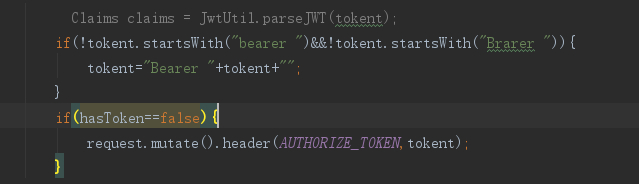

(3)测试

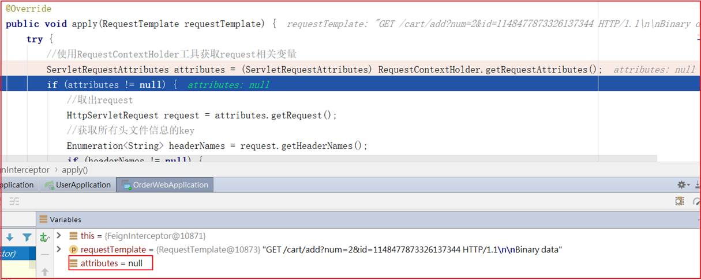

订单微服务feign调用拦截器：我们发现这块的ServletRequestAttributes始终为空，RequestContextHolder.getRequestAttributes()该方法是从ThreadLocal变量里面取得相应信息的，当hystrix断路器的隔离策略为THREAD时，是无法取得ThreadLocal中的值。 解决方案：hystrix隔离策略换为SEMAPHORE（信号量）

# Hystrix隔离策略 

Hystrix的资源隔离策略分为两种：线程池和信号量。说到资源隔离，我们就要明白为什么需要资源隔离。

在一个分布式系统中，服务之间都是相互调用的，如下图所示：

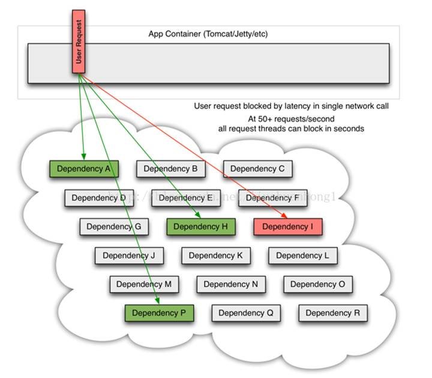
 例如，我们容器(Tomcat)配置的线程个数为1000，从服务A到服务R，其中服务I的并发量非常的大，需要500个线程来执行，此时，服务I又挂了，那么这500个线程很可能就夯死了，那么剩下的服务，总共可用的线程为500个，随着并发量的增大，剩余服务挂掉的风险就会越来越大，最后导致整个系统的所有服务都不可用，直到系统宕机。这就是服务的雪崩效应。Hystrix就是用来做资源隔离的，比如说，当客户端向服务端发送请求时，给服务I分配了10个线程，只要超过了这个并发量就走降级服务，就算服务I挂了，最多也就导致服务I不可用，容器的10个线程不可用了，但是不会影响系统中的其他服务。下面，我们就来具体说下这两种隔离策略：

## **1**、线程池

线程池隔离的示意图如下：

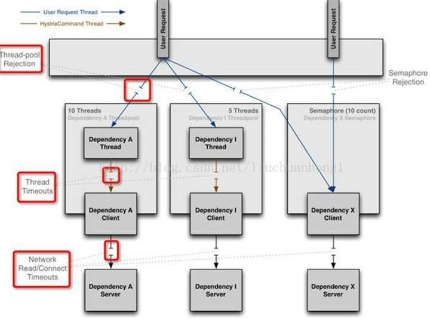

 上图的左边2/3是线程池资源隔离示意图，右边的1/3是信号量资源隔离示意图，我们先来看左边的示意图。

当用户请求服务A和服务I的时候，tomcat的线程(图中蓝色箭头标注)会将请求的任务交给服务A和服务I的内部线程池里面的线程(图中橘色箭头标注)来执行，tomcat的线程就可以去干别的事情去了，当服务A和服务I自己线程池里面的线程执行完任务之后，就会将调用的结果返回给tomcat的线程，从而实现资源的隔离，当有大量并发的时候，服务内部的线程池的数量就决定了整个服务的并发度，例如服务A的线程池大小为10个，当同时有12请求时，只会允许10个任务在执行，其他的任务被放在线程池队列中，或者是直接走降级服务，此时，如果服务A挂了，就不会造成大量的tomcat线程被服务A拖死，服务I依然能够提供服务。整个系统不会受太大的影响。

## **2**、信号量

信号量的资源隔离只是起到一个开关的作用，例如，服务X的信号量大小为10，那么同时只允许10个tomcat的线程(此处是tomcat的线程，而不是服务X的独立线程池里面的线程)来访问服务X，其他的请求就会被拒绝，从而达到限流保护的作用。

## **3**、二者的比较

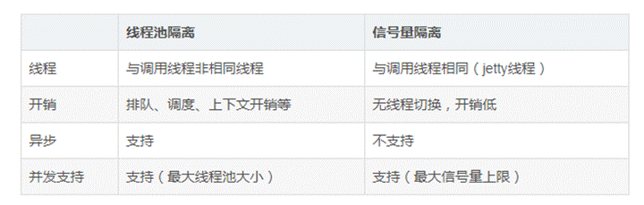

## **4**、总结

 **当请求的服务网络开销比较大的时候，或者是请求比较耗时的时候，我们最好是使用线程隔离策略，这样的话，可以保证大量的容器(tomcat)线程可用，不会由于服务原因，一直处于阻塞或等待状态，快速失败返回。而当我们请求缓存这些服务的时候，我们可以使用信号量隔离策略，因为这类服务的返回通常会非常的快，不会占用容器线程太长时间，而且也减少了线程切换的一些开销，提高了缓存服务的效率。**

# **restful**接口设计

## 什么是RESTful架构：

（1）每一个URI代表一种资源；

（2）客户端和服务器之间，传递这种资源的某种表现层；

（3）客户端通过四个HTTP动词，对服务器端资源进行操作，实现"表现层状态转化"。

## **1**、动作

GET （SELECT）：从服务器检索特定资源，或资源列表。

POST （CREATE）：在服务器上创建一个新的资源。

PUT （UPDATE）：更新服务器上的资源，提供整个资源。

PATCH （UPDATE）：更新服务器上的资源，仅提供更改的属性。

DELETE （DELETE）：从服务器删除资源。

## **2**、路径（接口命名）

路径又称"终点"（endpoint），表示API的具体网址。

在RESTful架构中，每个网址代表一种资源（resource），所以网址中不能有动词，只能有名词，而且所用的名词往往与数据库的表格名对应。一般来说，数据库中的表都是同种记录的"集合"（collection），所以API中的名词也应该使用复数。

举例来说，有一个API提供动物园（zoo）的信息，还包括各种动物和雇员的信息，则它的路径应该设计成下面这样。

接口尽量使用名词，禁止使用动词，下面是一些例子。

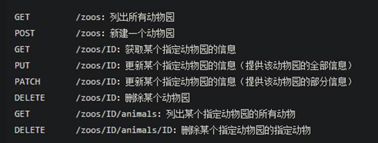

## **3**、版本（Versioning）

应该将API的版本号放入URL。如：https://api.example.com/v1/

## **4**、过滤信息（Filtering）

如果记录数量很多，服务器不可能都将它们返回给用户。API应该提供参数，过滤返回结果。下面是一些常见的参数。

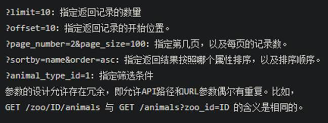

## **5**、状态码（Status Codes）

状态码范围

1xx 信息，请求收到，继续处理。范围保留用于底层HTTP的东西，你很可能永远也用不到。
 2xx 成功，行为被成功地接受、理解和采纳
 3xx 重定向，为了完成请求，必须进一步执行的动作
 4xx 客户端错误，请求包含语法错误或者请求无法实现。范围保留用于响应客户端做出的错误，例如。他们提供不良数据或要求不存在的东西。这些请求应该是幂等的，而不是更改服务器的状态。
 5xx 范围的状态码是保留给服务器端错误用的。这些错误常常是从底层的函数抛出来的，甚至
 开发人员也通常没法处理，发送这类状态码的目的以确保客户端获得某种响应。
 当收到5xx响应时，客户端不可能知道服务器的状态，所以这类状态码是要尽可能的避免。

来源：https://juejin.cn/post/6844903902375051278

# session存不下怎么办

session存不下怎么办？ 势必会有多服务器的共享Session问题，这时候Session信息就应该保存在redis中，所有的服务器写入或获取Session都从redis中进行。

# HTTP和RPC的区别

 HTTP的本质是什么？

就是客户端和服务端约定好的一种通信格式。

HTTP 就规定了请求头，请求行，请求体

获取哪些资源，时间，内容，格式，长度

RPC 则是远程调用，各个微服务之间相互调用，必然需要网络通信，用的协议可以使http也可是tcp

https://zhuanlan.zhihu.com/p/110424162

# 压测中为什么TPS上不去的原因

下面就说说压测中为什么TPS上不去的原因：

**1**、网络带宽

在压力测试中，有时候要模拟大量的用户请求，如果单位时间内传递的数据包过大，超过了带宽的传输能力，那么就会造成网络资源竞争，间接导致服务端接收到的请求数达不到服务端的处理能力上限。

**2**、连接池

可用的连接数太少，造成请求等待。连接池一般分为服务器连接池（比如Tomcat）和数据库连接池（或者理解为最大允许连接数也行）。

（关于连接池的具体内容，可参考之前的博客：[性能测试：连接池和线程](http://www.cnblogs.com/imyalost/p/7189455.html)）

**3**、垃圾回收机制

从常见的应用服务器来说，比如Tomcat，因为java的的堆栈内存是动态分配，具体的回收机制是基于算法，如果新生代的Eden和Survivor区频繁的进行Minor GC，老年代的full GC也回收较频繁，那么对TPS也是有一定影响的，因为垃圾回收其本身就会占用一定的资源。

**4**、数据库配置

高并发情况下，如果请求数据需要写入数据库，且需要写入多个表的时候，如果数据库的最大连接数不够，或者写入数据的SQL没有索引没有绑定变量，抑或没有主从分离、读写分离等，

就会导致数据库事务处理过慢，影响到TPS。

**5**、通信连接机制

串行、并行、长连接、管道连接等，不同的连接情况，也间接的会对TPS造成影响。

（关于协议的连接，可参考之前的博客：[HTTP协议进阶：连接管理](http://www.cnblogs.com/imyalost/p/7887667.html)）

**6**、硬件资源

包括CPU（配置、使用率等）、内存（占用率等）、磁盘（I/O、页交换等）。

**7**、压力机

比如jmeter，单机负载能力有限，如果需要模拟的用户请求数超过其负载极限，也会间接影响TPS（这个时候就需要进行分布式压测来解决其单机负载的问题）。

**8**、压测脚本

还是以jemter举个例子，之前工作中同事遇到的，进行阶梯式加压测试，最大的模拟请求数超过了设置的线程数，导致线程不足。

提到这个原因，想表达意思是：有时候测试脚本参数配置等原因，也会影响测试结果。

**9**、业务逻辑

业务解耦度较低，较为复杂，整个事务处理线被拉长导致的问题。

**10**、系统架构

比如是否有缓存服务，缓存服务器配置，缓存命中率、缓存穿透以及缓存过期等，都会影响到测试结果。

 

# 网络较慢的排查

1. traceroute

前面提到的traceroute不仅可以查看路由的正确性，还可以查看网络中每一跳的延时，从而定位延时最高的网络区段。

2. iftop

iftop命令类似于top命令，查看哪些网络连接占用的带宽较多

3. tcpdump

当一切排查手段都无济于事时仍然不能找到网络速度慢、丢包严重等原因时，往往祭出杀手锏——抓包。抓包的最佳手段是在通信的双方同时抓取，这样可以同时检验发出的数据包和收到的数据包，tcpdump是常用的抓包工具。

# 系统运行过程中出现fullGC，怎么排查，什么情况出现fullGC

top -- jstate -- map工具

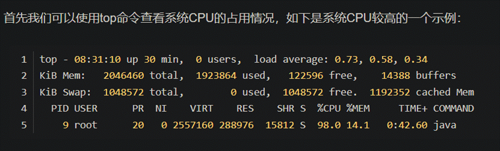

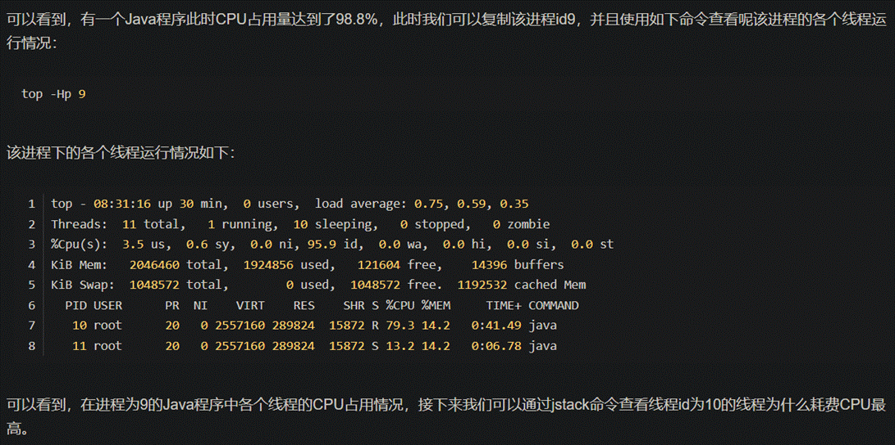

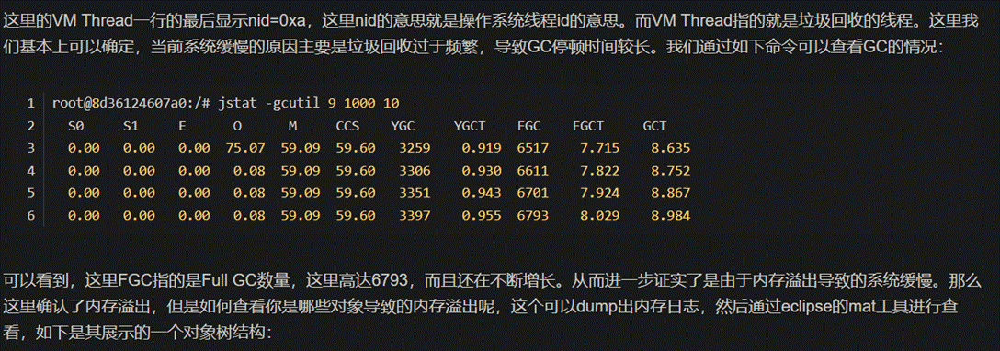

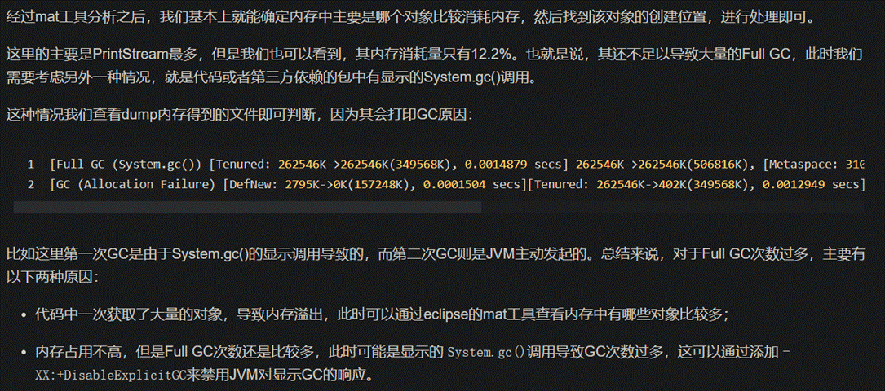

https://blog.csdn.net/xiaoxiaole0313/article/details/104285018/

# 当用户反馈网站反应慢，怎么处理

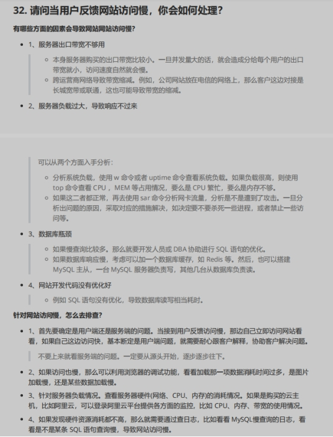

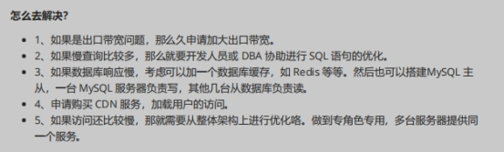

# 高内聚和低耦合

是判断软件设计好坏的标准，主要用于程序的

[面向对象](https://baike.baidu.com/item/面向对象/2262089?fromModule=lemma_inlink)的设计，主要看类的内聚性是否高，

[耦合度](https://baike.baidu.com/item/耦合度/2603938?fromModule=lemma_inlink)是否低。目的是使程序模块的可重用性、移植性大大增强。通常程序结构中各模块的内聚程度越高，模块间的耦合程度就越低。内聚是从功能角度来度量模块内的联系，一个好的内聚模块应当恰好做一件事，它描述的是模块内的功能联系；耦合是软件结构中各模块之间相互连接的一种

[度量](https://baike.baidu.com/item/度量/34036?fromModule=lemma_inlink)，耦合强弱取决于模块间接口的复杂程度、进入或访问一个模块的点以及通过接口的数据

划分模块的一个准则是高内聚低耦合。从模块粒度来看，高内聚：尽可能类的每个成员方法只完成一件事（最大限度的聚合）； 低耦合：减少类内部，一个成员方法调用另一个成员方法。从类角度来看， 高内聚低耦合：减少类内部，对其他类的调用；从功能块来看 高内聚低耦合：减少模块之间的交互复杂度（接口数量，参数数据）即横向：类与类之间、模块与模块之间；纵向：层次之间；尽可能，内容内聚，数据耦合。

**降低耦合度的方法**

1、少使用类的继承，多用接口隐藏实现的细节。 Java面向对象编程引入接口除了支持多态外， 隐藏实现细节也是其中一个目的。

2、模块的功能化分尽可能的单一，道理也很简单，功能单一的模块供其它模块调用的机会就少。（其实这是高内聚的一种说法，高内聚低耦合一般同时出现）。

3、遵循一个定义只在一个地方出现。

4、少使用全局变量。

5、类属性和方法的声明少用public，多用private关键字。

6、多用设计模式，比如采用MVC的设计模式就可以降低界面与业务逻辑的耦合度。

7、尽量不用“硬编码”的方式写程序，同时也尽量避免直接用SQL语句操作数据库。

8、最后当然就是避免直接操作或调用其它模块或类（内容耦合）；如果模块间必须存在耦合，原则上尽量使用数据耦合，少用控制耦合，限制公共耦合的范围，避免使用内容耦合。

**增强内聚度方法**

1、模块只对外暴露最小限度的接口，形成最低的依赖关系。

2、只要对外接口不变，模块内部的修改，就不得影响其他模块。

3、删除一个模块，应当只影响有依赖关系的其他模块，而不应该影响其他无关部分。

#  数字证书

数字证书是一个经证书授权中心

[数字签名](https://baike.so.com/doc/2871106-3029793.html)的包含

[公开密钥](https://baike.so.com/doc/296087-313468.html)拥有者信息以及公开密钥的文件。最简单的证书包含一个公开密钥、名称以及证书授权中心的数字签名。数字证书还有一个重要的特征就是只在特定的时间段内有效

它以数字证书为核心的

[加密技术](https://baike.so.com/doc/6539431-6753170.html)(加密传输、数字签名、数字信封等安全技术)可以对网络上传输的信息进行加密和解密、数字签名和签名验证，确保网上传递信息的机密性、完整性及交易的不可抵赖性。使用了数字证书，即使您发送的信息在网上被他人截获，甚至您丢失了个人的账户、密码等信息，仍可以保证您的账户、资金安全。

 数字证书绑定了[公钥](https://baike.so.com/doc/6626282-6840081.html)及其持有者的真实身份，它类似于现实生活中的居民身份证，所不同的是数字证书不再是纸质的证照，而是一段含有证书持有者身份信息并经过

[认证中心](https://baike.so.com/doc/6254560-6467973.html)审核签发的电子数据，可以更加方便灵活地运用在电子商务和电子政务中。

 