# 用户态和内核态

在CPU的所有指令中，有一些指令是非常危险的，如果错用，将导致整个系统崩溃。比如：清内存、设置时钟等。如果所有的程序都能使用这些指令，那么你的系统一天死机n回就不足为奇了。所以，CPU将指令分为特权指令和非特权指令，对于那些危险的指令，只允许操作系统及其相关模块使用。

从用户空间到内核空间有两种触发手段：

1.用户空间的应用程序，通过系统调用，进入内核空间。这个时候用户空间的进程要传递很多变量、参数的值给内核，内核态运行的时候也要保存用户进程的一些寄存器值、变量等。所谓的“进程上下文”，可以看作是用户进程传递给内核的这些参数以及内核要保存的那一整套的变量和寄存器值和当时的环境等。

2.硬件通过触发信号，导致内核调用中断处理程序，进入内核空间。这个过程中，硬件的一些变量和参数也要传递给内核，内核通过这些参数进行中断处理。所谓的“中断上下文”，其实也可以看作就是硬件传递过来的这些参数和内核需要保存的一些其他环境（主要是当前被打断执行的进程环境）。

# 进程和线程

## 基本概念

- 什么是进程

进程可以理解为就是应用程序的启动实例。如微信、Idea、Navicat等，当打开它们后，就相当于开启了一个进程。每个进程都会在操作系统中拥有独立的内存空间、地址、文件资源、数据资源等。**进程是资源分配和管理的最小单位**

线程从属于进程，是程序的实际执行者，一个进程中可以包含若干个线程，并且也可以把线程称为轻量级进程。每个线程都会拥有自己的计数器、堆栈、局部变量等属性，并且能够访问共享的内存变量。**线程是操作系统（CPU）调度和执行的最小单位。CPU会在这些线程上来回切换，让使用者感觉线程是在同时执行的。

**线程使用带来的问题**

​    有很多人都会存在一个误区，在代码中使用多线程，一定会为系统带来性能提升，这个观点是错误的。并发编程的目的是为了让程序运行的更快，但是，绝对不是说启动的线程越多，性能提升的就越大，其会受到很多因素的影响，如锁问题、线程状态切换问题、线程上下文切换问题，还会受到硬件资源的影响，如CPU核数。

什么叫做线程上下文切换

​    不管是在多核甚至单核处理器中，都是能够以多线程形式执行代码的，CPU通过给每个线程分配CPU时间片来实现线程执行间的快速切换。 所谓的时间片就是CPU分配给每个线程的执行时间，当某个线程获取到CPU时间片后，就会在一定时间内执行，当时间片到期，则该线程会进入到挂起等待状态。时间片一般为几十毫秒，通过在CPU的高速切换，让使用者感觉是在同时执行。

​    同时还要保证线程在切换的过程中，要记录线程被挂起时，已经执行了哪些指令、变量值是多少，那这点则是通过每个线程内部的程序计数器来保证。

​    简单来说：线程从挂起到再加载的过程，就是一次上下文切换。其是比较耗费资源的。

引起上下文切换的几种情况：

- 时间片用完，CPU正常调度下一个任务。
- 被其他优先级更高的任务抢占。
- 执行任务碰到IO阻塞，调度器挂起当前任务，切换执行下一个任务。
- 用户代码主动挂起当前任务让出CPU时间。
- 多任务抢占资源，由于没有抢到被挂起。
- 硬件中断。

**CPU时间片轮转机制&优化**

​    之前已经提到了线程的执行，是依赖于CPU给每个线程分配的时间来进行。在CPU时间片轮转机制中，如果一个线程的时间片到期，则CPU会挂起该线程并给另一个线程分配一定的时间分片。如果进程在时间片结束前阻塞或结束，则 CPU 会立即进行切换。

​     时间片太短会导致频繁的进程切换，降低了 CPU 效率: 而太长又可能引起对短的交互请求的响应变差。时间片为 **100ms** 通常是一个比较合理的折衷。

并行与并发的理解

并发即让多个任务能够**交替**执行，一般都会附带一个时间单位，也就是所谓的在单

位时间内的并发量有多少。

并行即让多个任务能够同时执行。比如说：你可以一遍上厕所，一遍吃饭。

线程的实现方式有两种：继承Thread类、实现Runnable接口。但是有一些书籍或者文章会说有三种方式，即实现Callable接口。但通过该接口定义线程并不是Java标准的定义方式，而是基于

Future思想来完成。

Thread是对一个线程的抽象，而Runnable是对业务逻辑的抽象，并且Thread 可以接受任意一个 Runnable 的实例并执行。

优化：启动线程前，最好为这个线程设置特定的线程名称，这样在出现问题时，给开发人员一些提示，快速定位到问题线程。

线程中止

线程在正常下当run执行完，或出现异常都会让该线程中止。

理解suspend()、resume()、stop()

这三个方法对应的是暂停、恢复和中止。

但是三个已经在Java源码中被标注为过期方法。

当调用suspend()时，线程不会将当前持有的资源释放(如锁)，而是占有者资源进入到暂停状

态，这样的话，容易造成死锁问题的出现。

当调用stop()时，会**立即停止run()中剩余的操作**。因此可能会导致一些的工作得不到完成，如文件流，数据库等关闭。并且**会立即释放该线程所持有的所有的锁**，导致数据得

不到同步的处理，出现数据不一致的问题。

线程中止的安全且优雅姿势

​    Java对于线程安全中止设计了一个**中断属性**，其可以理解是线程的一个标识位属性。它用于表示一个运行中的线程是否被其他线程进行了中断操作。好比其他线程对这个线程打了一个招呼，告诉它你该中断了。通过**interrupt()**实现。

添加该方法后，会出现一个异常，但是可以发现并不会线程的继续执行。

​    线程通过检查自身是否被中断来进行响应，可以通过**isInterrupted()**进行判断，如果返回值为true，代表添加了中断标识，返回false，代表没有添加中断标识。通过它可以对线程进行中断操作。

对线程中断属性的判断，可以利用其进行线程执行的中断操作。线程也可以通过静态方法**Thread.interrupted()**查询线程是否被中断，并对中断标识进行复位，如果该线程已经被添加了中断标识，当使用了该方法后，会将线程的中断标识由true改为false。

同时要注意：**处于死锁下的线程，无法被中断**

## 进程和线程的区别

进程是执行着的应用程序，而线程是进程内部的一个执行序列。一个进程可以有多个线程。线程又叫做轻量级进程。

**a.****地址空间和其它资源**：进程间拥有独立内存，进程是资源分配的基本单位；线程隶属于某一进程，且同一进程的各线程间共享内存（资源），线程是cpu调度的基本单位。 进程间相互独立，同一进程的各线程间共享。某进程内的线程在其它进程不可见。

**b.****通信：**进程间相互独立，通信困难，常用的方法有：管道，信号，套接字，共享内存，消息队列等；线程间可以直接读写进程数据段（如全局变量）来进行通信——需要进程同步和互斥手段的辅助，以保证数据的一致性。 

**c.****调度和切换**：线程上下文切换比进程上下文切换要快。进程间切换要保存上下文，加载另一个进程；而线程则共享了进程的上下文环境，切换更快。

## 线程间通信方式

共享存储：基于数据结构：eg.在共享空间放数组

基于存储区：在内存区中画出一片共享存储区，数据的形式和存放位置由进程决定

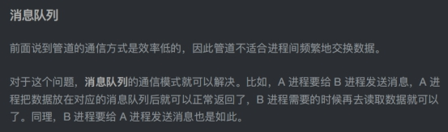

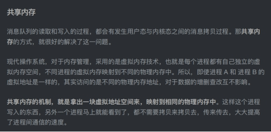

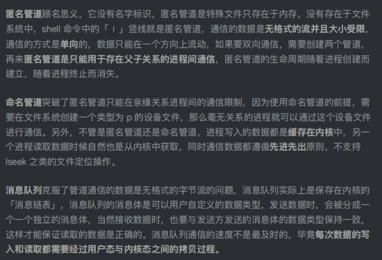

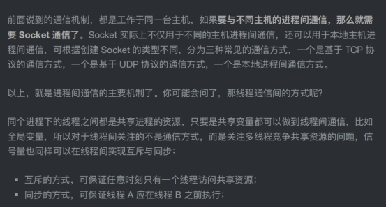

## 死锁

死锁的定义

一组进程中，**每个进程都无限等待被该组进程中另一进程所占有的资源**，因而永远无法得到的资源，这种现象称为进程死锁，这一组进程就称为死锁进程。

产生死锁的必要条件

(1)互斥使用(资源独占)：一个资源每次只能给一个进程使用

(2)占有且等待(请求和保持，部分分配)：进程在申请新的资源的同时保持对原有资源的占有

(3)不可剥夺：资源申请者不能强行的从资源占有者手中夺取资源，资源只能由占有者自愿释放

(4)循环等待：存在一个进程等待队列 {P1 , P2 , … , Pn}，其中P1等待P2占有的资源，P2等待P3占有的资源，…，Pn等待P1占有的资源，形成一个进程等待环路。

以哲学家进餐问题为例，我占着筷子，你们不能抢我的，我还想要另一只筷子，形成一个圈。            (互斥)   (不可剥夺)   (请求和保持)    (循环等待)

 什么情况会发生死锁

死锁预防

 死锁避免

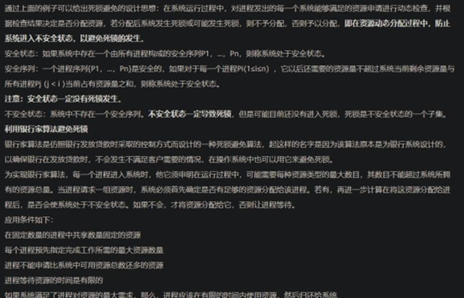

 死锁检测与消除

https://www.huaweicloud.com/articles/9fa2f8ad06587f13ca7f11ec4d9a5077.html

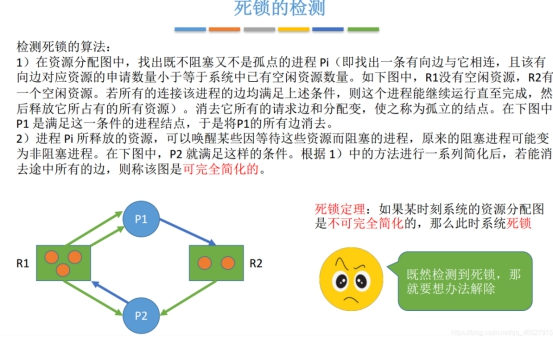

https://blog.csdn.net/qq_46527915/category_10424299.html

线程之间同步的方式

1、 临界区（CCriticalSection）

当多个线程访问一个独占性共享资源时，可以使用临界区对象（有正在访问临界区资源标志）。拥有临界区的线程可以访问被保护起来的资源或代码段，其他线程若想访问，则被挂起，直到拥有临界区的线程放弃临界区为止。

2、互斥对象：互斥对象和临界区很像，采用互斥对象机制，只有拥有互斥对象的线程才有访问公共资源的权限。因为互斥对象只有一个，所以能保证公共资源不会同时被多个线程同时访问。当前拥有互斥对象的线程处理完任务后必须将线程交出，以便其他线程访问该资源

3、信号量：信号量也是内核对象。它允许多个线程在同一时刻访问同一资源，但是需要限制在同一时刻访问此资源的最大线程数目

在用CreateSemaphore()创建信号量时即要同时指出允许的最大资源计数和当前可用资源计数。一般是将当前可用资源计数设置为最大资源计数，每增加一个线程对共享资源的访问，当前可用资源计数就会减1 ，只要当前可用资源计数是大于0 的，就可以发出信号量信号。但是当前可用计数减小到0时则说明当前占用资源的线程数已经达到了所允许的最大数目，不能在允许其他线程的进入，此时的信号量信号将无法发出。线程在处理完共享资源后，应在离开的同时通过ReleaseSemaphore （）函数将当前可用资源计数加1 。在任何时候当前可用资源计数决不可能大于最大资源计数。

4、 事件（CEvent）

事件机制，则允许一个线程在处理完一个任务后，主动唤醒另外一个线程执行任务。比如在某些网络应用程序中，一个线程如A负责侦听通信端口，另外一个线程B负责更新用户数据，利用事件机制，则线程A可以通知线程B何时更新用户数据。

## 进程调度

## 线程优先级

线程优先级的**范围是****1~10**。一个线程的**默认优先级是****5**，可以在构建线程时，通过**setPriority()**修改该线程的优先级。优先级高的线程分配时间片的数量会高于优先级低的线程。

​    一般来说对于频繁阻塞的线程需要设置优先级高点，而偏重计算的线程优先级会设置低些，确保处理器不会被独占。

​    但**注意，线程优先级不能作为线程执行正确性的依赖，因为不同的操作系统可能会忽略优先级的设置。**

## 守护线程

守护线程是一种支持型的线程，我们之前创建的线程都可以称之为用户线程。通过守护线程可以完成一些支持性的工作，如GC、分布式锁续期。守护线程会伴随着用户线程的结束而结束。

对于守护线程的创建，可以通过setDaemon()设置。

当线程实例没有被设置为守护线程时，该线程并不会随着主线程的结束而结束。但是当被设置为守护线程后，当主线程结束，该线程也会伴随着结束。同时守护线程不一定会执行finally代码块。所以当线程被设定为守护线程后，无法确保清理资源等操作一定会被执行。

## 线程状态

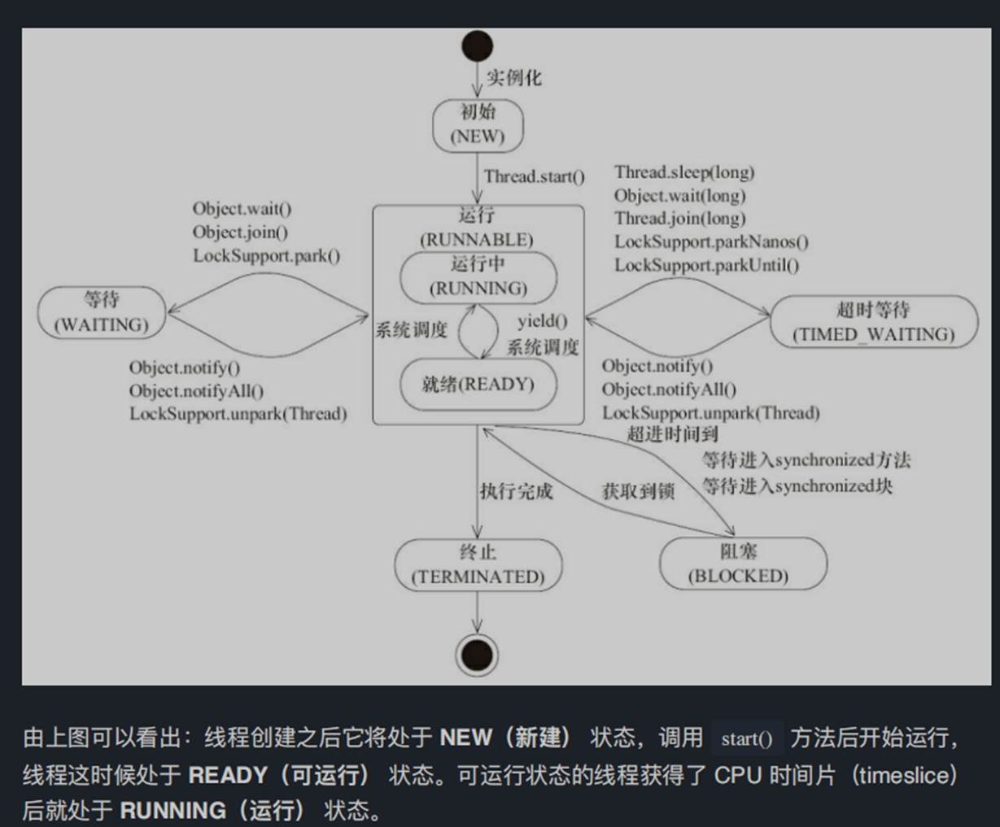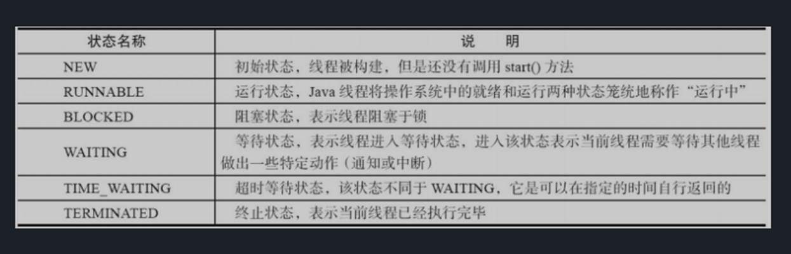

## 线程安全活跃态问题以及竞态条件

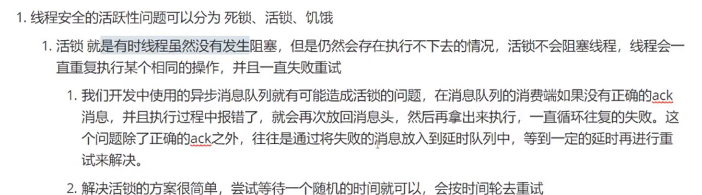

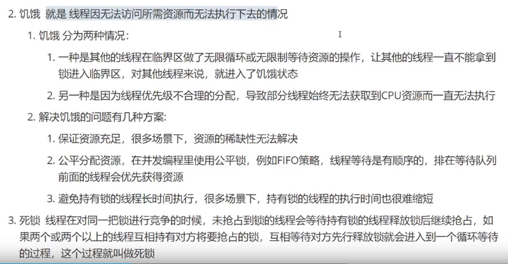

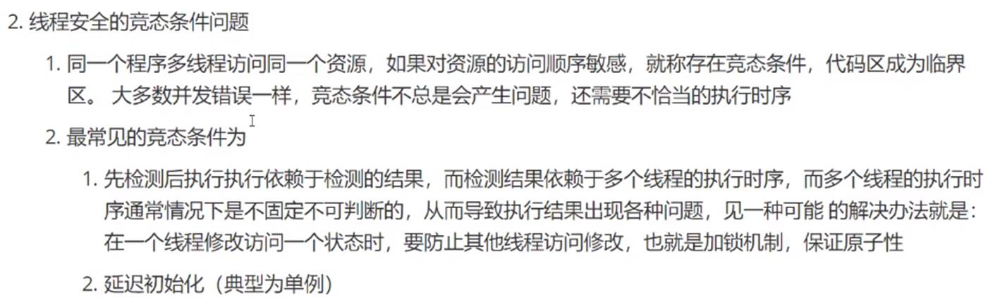

## 多级反馈队列调度算法

## 孤儿进程，僵尸进程

**孤儿进程：一个父进程退出，而它的一个或多个子进程还在运行，那么那些子进程将成为孤儿进程。孤儿进程将被init进程(进程号为1)所收养，并由init进程对它们完成状态收集工作。**

**僵尸进程：一个进程使用fork创建子进程，如果子进程退出，而父进程并没有调用wait或waitpid获取子进程的状态信息，那么子进程的进程描述符仍然保存在系统中。这种进程称之为僵死进程。**

https://www.cnblogs.com/Anker/p/3271773.html

# 内存

## 逻辑地址和物理地址

- - 逻辑地址
  - 指由程序产生的段内偏移。有时候直接把逻辑地址当做虚拟地址。

- - 物理地址
  - 指CPU外部地址总线上寻址物理内存的地址信号，是地址变换的最终结果。

- - 虚拟地址
  - 指由程序产生的由段选择符和段内偏移地址组成的地址。      

- - 线性地址
  - 指虚拟地址到物理地址变换的中间层，是处理器可寻址的内存空间中的地址。程序代码会产生逻辑地址，也就是段中的偏移地址，加上相应的段基址就成了线性地址。如果开启了分页机制，那么线性地址需要再经过变换，转为为物理地址。如果无分页机制，那么线性地址就是物理地址。      

## 内存管理

[内存分段](onenote:#内存管理&section-id={7168EEEF-275B-413A-9384-A420806C9C4F}&page-id={9B7BA1DC-0CC3-41C0-A8E0-09388B487078}&object-id={2FB06EC1-4084-4E60-9B5D-D762ABB54D5D}&2B&base-path=https://d.docs.live.net/73ef43393996c94e/文档/java/操作系统.one)

[内存分页](onenote:#内存管理&section-id={7168EEEF-275B-413A-9384-A420806C9C4F}&page-id={9B7BA1DC-0CC3-41C0-A8E0-09388B487078}&object-id={2FB06EC1-4084-4E60-9B5D-D762ABB54D5D}&82&base-path=https://d.docs.live.net/73ef43393996c94e/文档/java/操作系统.one)

[多级页表](onenote:#内存管理&section-id={7168EEEF-275B-413A-9384-A420806C9C4F}&page-id={9B7BA1DC-0CC3-41C0-A8E0-09388B487078}&object-id={2FB06EC1-4084-4E60-9B5D-D762ABB54D5D}&89&base-path=https://d.docs.live.net/73ef43393996c94e/文档/java/操作系统.one)

[段页式内存管理](onenote:#内存管理&section-id={7168EEEF-275B-413A-9384-A420806C9C4F}&page-id={9B7BA1DC-0CC3-41C0-A8E0-09388B487078}&object-id={2FB06EC1-4084-4E60-9B5D-D762ABB54D5D}&C4&base-path=https://d.docs.live.net/73ef43393996c94e/文档/java/操作系统.one)

[总结](onenote:#内存管理&section-id={7168EEEF-275B-413A-9384-A420806C9C4F}&page-id={9B7BA1DC-0CC3-41C0-A8E0-09388B487078}&object-id={2FB06EC1-4084-4E60-9B5D-D762ABB54D5D}&DD&base-path=https://d.docs.live.net/73ef43393996c94e/文档/java/操作系统.one)

 内存分段

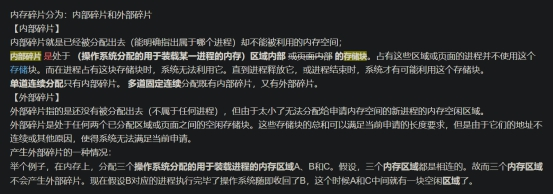

内存分页

多级页表

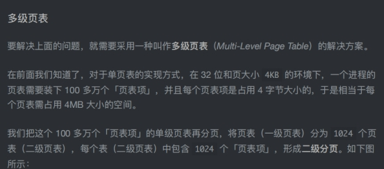

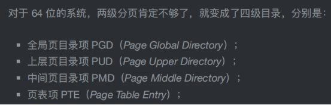

 段页式内存管理

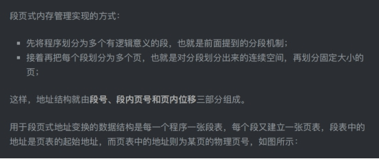

总结

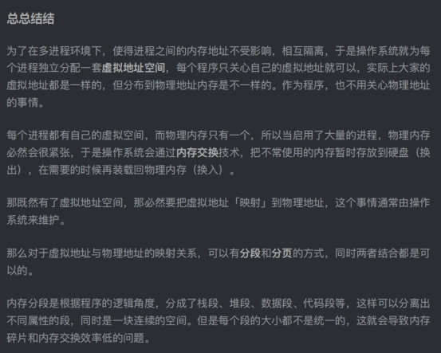

## 快表和多级页表

## 虚拟内存

局部性原理

在CPU访问寄存器时，无论是存取数据抑或存取指令，都趋于聚集在一片连续的区域中，这就被称为局部性原理。 

时间局部性（temporal locality）  

时间局部性指的是：被引用过一次的存储器位置在未来会被多次引用（通常在循环中）。 

空间局部性（spatial locality）  

如果一个存储器的位置被引用，那么将来他附近的位置也会被引用。

基于局部性原理，在程序装入时，可以将程序的一部分装入内存，而将其余部分留在外存，就可以启动程序执行。在程序执行过程中，当所访问的信息不在内存时，由操作系统将所需要的部分调入内存,然后继续执行程序。另一方面，操作系统将内存中暂时不使用的内容换出到外存上，从而腾出空间存放将要调入内存的信息。这样，系统好像为用户提供了一个比实际内存大得多的存储器，称为虚拟存储器。

之所以将其称为虚拟存储器，是因为这种存储器实际上并不存在，只是由于（对用户完全透明），给用户的感觉是好像存在一个比实际物理内存大得多的存储器。虚拟存储器的大小由计算机的地址结构决定，并非是内存和外存的简单相加。 

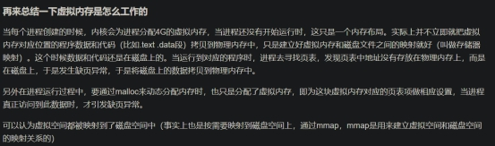

 

https://blog.csdn.net/lvyibin890/article/details/82217193

## 页错误

https://blog.csdn.net/lqy971966/article/details/106910442

## 时钟置换算法

## LRU算法

LRU 存储是基于双向链表实现的，下面的图演示了它的原理。其中 h 代表双向链表的表头，t 代表尾部。首先预先设置 LRU 的容量，如果存储满了，可以通过 O(1) 的时间淘汰掉双向链表的尾部，每次新增和访问数据，都可以通过 O(1)的效率把新的节点增加到对头，或者把已经存在的节点移动到队头。

1.save(key, value)，首先在 HashMap 找到 Key 对应的节点，如果节点存在，更新节点的值，并把这个节点移动队头。如果不存在，需要构造新的节点，并且尝试把节点塞到队头，如果LRU空间不足，则通过 tail 淘汰掉队尾的节点，同时在 HashMap 中移除 Key。

2.get(key)，通过 HashMap 找到 LRU 链表节点，把节点插入到队头，返回缓存的值。 

# IO模型

阻塞IO，非阻塞IO，IO多路复用，事件响应IO，异步IO

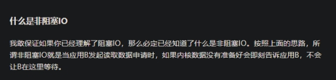

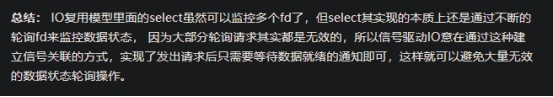

https://zhuanlan.zhihu.com/p/115912936

# 中断

