# 项目架构


## SPU与SKU

### SPU与SKU概念

1. **SPU = Standard Product Unit  （标准产品单位）**

   概念 : SPU 是商品信息聚合的最小单位，是一组可复用、易检索的标准化信息的集合，该集合描述了一个产品的特性。

   通俗点讲，属性值、特性相同的货品就可以称为一个 SPU

   ==同款商品的公共属性抽取==

   例如：**华为P30 就是一个 SPU**

2. **SKU=stock keeping unit( 库存量单位)**

   SKU 即库存进出计量的单位， 可以是以件、盒、托盘等为单位。

   SKU 是物理上不可分割的最小存货单元。在使用时要根据不同业态，不同管理模式来处理。

   在服装、鞋类商品中使用最多最普遍。

   例如：**华为P30 红色 64G 就是一个 SKU**

   ==某个库存单位的商品独有属性(某个商品的独有属性)==


 


## 秒杀：

### 防止超卖：

- 下单时：为每个商品个数创建队列，里面存商品id（某商品有100个，存100个次此商品id），每次下单从里面取一个，如果有说明有商品，相反则删除排队信息。在我们对Redis进行操作的时候，很多时候，都是先将数据查询出来，在内存中修改，然后存入到Redis，在并发场景，会出现数据错乱问题，为了控制数量准确，我们单独将商品数量整一个自增键，自增键是线程安全的，所以不担心并发场景的问题。
- 支付成功后修改库存：将商品查出来减少库存在放入数据库中，多线程购买的时候会引起超卖现象，利用数据库的行级锁可防止此情况。

### 防止用户重复排队：

- 用户每次抢单的时候，一旦排队，我们设置一个自增值，让该值的初始值为1，每次进入抢单的时候，对它进行递增，如果值>1，则表明已经排队,不允许重复排队,如果重复排队，则对外抛出异常，并抛出异常信息100表示已经正在排队。

### 并发削峰：

- 抢购商品时，使用redis排队抢单，并多线程抢单，排队抢单：队列中记录订单的状态SeckillStatus ：用户ID和商品ID（商品ID，商品抢购时间段，用户登录名）
- 削峰还可以提一下nginx和分布式微服务中的[限流策略](onenote:分布式微服务.one#限流策略&section-id={6BA1F89F-1441-4B70-9972-A327827F7CF9}&page-id={CC2EC0F0-E52F-44AC-8A3D-82130A4EBFEC}&object-id={A4CB52A9-9549-438C-807D-8A55F9A57771}&10&base-path=https://d.docs.live.net/73ef43393996c94e/文档/java)

### 超时订单回滚：

- 通过rabbitmq延时队列实现

### 多个用户请求的时候怎样保证redis中的数据是准确的：

- 对于一些可能产生并发问题的操作进行加锁操作

- 获取队列判断有无商品的时候


### 分布式锁红锁5个机器键和值是一样的吗：

- 是一样的


### redis中获取队列有线程安全的问题吗：

- redis本身一个键值同一时刻只能一个进程操作，但是操作不能保证原子性，所以也会造成问题

- 我们正常理解的线程安全问题是指单进程多线程模型内部多个线程操作进程内共享内存导致的数据资源充突。而 Redis 的线程安全问题的产生，并不是来自于 Redis 服务器内部。

- Redis 作为数据服务器，就相当于多个客户端的共享内存，多个客户端就相当于同一进程下的多个线程，如果多个客户端之间没有良好的数据同步策略，就会产生类似线程安全的问题。


典型场景是：

Redis 内存储了一个用户的状态： user5277=idle；

客户端连接 A 读取了用户状态，获取到用户的空闲状态 status = get("user5277")；

客户端连接 B 也同样读取了用户状态；

客户端连接 A 给用户安排了一个任务，并将 Redis 内用户状态置为忙碌 set("user5277", "busy")；

客户端连接 B 同样设置用户为忙碌状态。

可是此时用户却被同时分配了两个任务。

导致这个问题的原因就是虽然 Redis 是单线程的，能保证命令的序列化，但由于其执行效率很高，多个客户端的命令之间不做好请求同步，同样会造成命令的顺序错乱。

当然这个问题也很好解决，给用户状态加锁就行了，使同一时间内只能有一个客户端操作用户状态。不过加锁我们就需要考虑锁粒度、死锁等问题了，无疑添加了程序的复杂性，不利于维护。

效率问题：获取两次键值就是两次请求，慢，导致这种问题的原因就是 Redis 的普通命令没有服务端计算的能力，无法在服务器进行复合命令操作，虽然有 Redis 也提供了 pipeline 的特性，但它需要多个命令的请求和响应之间没有依赖关系。想简化多个相互依赖的命令就只能将数据拉回客户端，由客户端处理后再请求 Redis。

**Lua脚本的执行。**

https://segmentfault.com/a/1190000040160105

 

### 多个用户请求的时候怎样保证redis中的数据是准确的

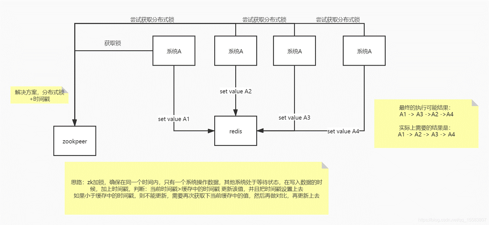

### 并发量大加锁的话用户来了并发就会很慢怎么解决：

- 预估机器资源，每个机器最大访问量多少，保证请求响应时间短，不要加特定的锁，成功就成功，失败就失败，多线程下单


购物车提交订单时要做价格校验，一定以数据库为准

**支付系统**

- 用户通过网关路由到订单系统进行下单，下单之后订单系统会将订单号发送给支付系统，支付系统会访问微信服务器。

多线程抢单之后，更新排队信息，这时可以查询订单状态，若已抢单，则进入支付，若未抢单，则隔几秒查询一次

**加盐加密**

- 就是人为的通过一组随机字符与用户原密码的组合形成一个新的字符

**服务器端怎样认证令牌正确性**

- 服务端拿到令牌后，使用base64之后的头部的信息和载荷的信息与使用自身的秘钥（私钥）做加盐，在用头部声明的算法加密，与令牌的签名部分做对比，若相同，则说明认证成功

这一步是直接让队列中的元素出来，并发是没有问题的，因为redis是单线程，不需要用分布式锁来互斥的获取

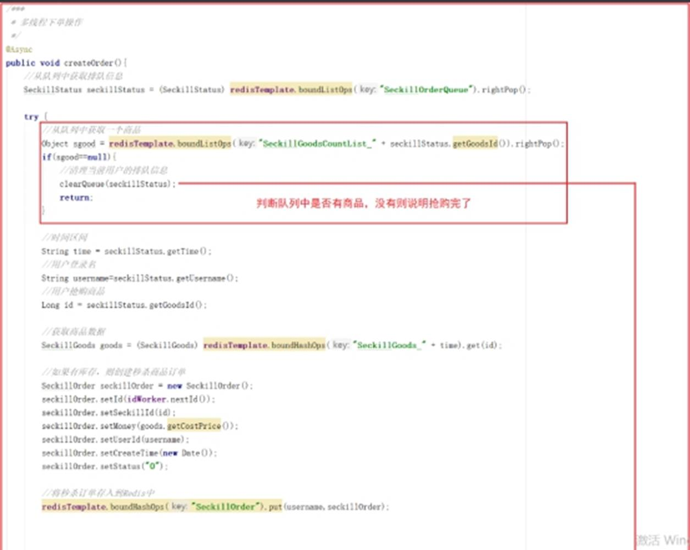


没有库存的话直接同步到redis中

**redis中数据和mysql的数据怎么保持一致，redis中没有数据了，但是mysql中有，到底以哪为准，最终的信息以数据库中为准吗**

- 不能保证强一致性，只能是最终一致性，要保证一致性可以使用延时双删或者是先删数据库在删redis，为了确保能删掉，可以将消息发送到mq([如何保证Redis和数据库的数据一致](onenote:redis.one#如何保证Redis和数据库的数据一致&section-id={D84E434C-802C-4920-94C4-EEBB2F80F9EC}&page-id={AE05E194-ADFA-4690-81F5-8E9AE85A4DFF}&object-id={864C5691-4462-44C1-8FF5-7971AD421BC8}&3B&base-path=https://d.docs.live.net/73ef43393996c94e/文档/java))。最终数据以mysql中为准


**可以说最终的信息由mysql决定，那redis做了哪些操作呢**

- 主要是缓存的作用，把大量的并发放到redis中解决，后台可以慢慢放到数据库中，可以说下[Redis为什么性能非常高](onenote:redis.one#Redis为什么性能非常高&section-id={D84E434C-802C-4920-94C4-EEBB2F80F9EC}&page-id={7883F82C-D021-464E-B062-B14525EB644D}&object-id={109DE118-1D4A-4432-BAEA-7068718A759B}&46&base-path=https://d.docs.live.net/73ef43393996c94e/文档/java)


### rabbitmq的作用

- 死信队列


**用户支付失败了，消息队列中的数据怎么删除**

- 没有办法消除


**怎么实现秒杀功能，比如说多并发去抢商品，怎样保证商品还有：**

- 我说的是创建队列去把同等数量的id放到redis队列中，但是多个线程去都去先get队列，还是会遇到问题（其实是不会遇到问题的，因为redis是单线程，获取队列后，直接将元素取出来，这个元素就不在队列了，其他线程在取其实就没用了），这时就要用到分布式锁 ，减到负的怎么办，就清空redis中该商品的数据，减到负的就不减了


**在一个事务中，锁超时了怎么办，还要去获取锁，续命策略有哪些**

- 看门狗机制：加锁的时间是30秒.如果加锁的业务没有执行完,那么到 30-10 = 20秒的时候,就会进行一次续期,把锁重置成30秒.那这个时候可能又有同学问了,那业务的机器万一宕机了呢?宕机了定时任务跑不了,就续不了期,那自然30秒之后锁就解开了呗.


**分布式锁出现死锁怎么办：**

- 设置过期时间，或者就是看门狗设置特定的过期时间

- 删除键值


**A调用B，A中失败了，但是消息已经发出去了，B如果已经消费了消息怎么办：**

- 分布式事务-两阶段提交 


**线程池如何使用?为什么这样设置：**

- 线程池调优


**如果秒杀开始后，商家想改库存，但是redis已经减了， 如何保证库存-致性**

- canal可以用来监控数据库数据的变化，从而获得新增数据，或者修改的数据。

  Canal工作原理：

  1. canal模拟mysql slave的交互协议，伪装自己为mysql slave，向mysql master发

  送dump协议

  2. mysql master收到dump请求，开始推送binary log给slave(也就是canal)

  3. canal解析binary log对象(原始为byte流)

如果并发量增大了，你会如何改进你的架构?

限制单体并发量提高的瓶颈是什么?

缓存该如何使用?除了使用Redis 之外，还有什么解决方案吗?

Redis 的ZSet是怎么实现的?

热点数据如何缓存，你提到了本地缓存,你项目的进程使用什么方式与本地缓存的进程进行通信?

如果秒杀开始后，商家想改库存，但是redis已经减了， 如何保证库存-致性

分布式锁能解决什么问题，几种实现

spring拦截 器限流如何实现

验证码从0到1

## 表结构说明

### 秒杀商品信息表

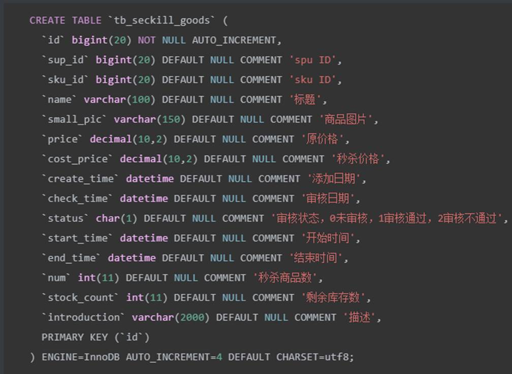

### 秒杀订单表

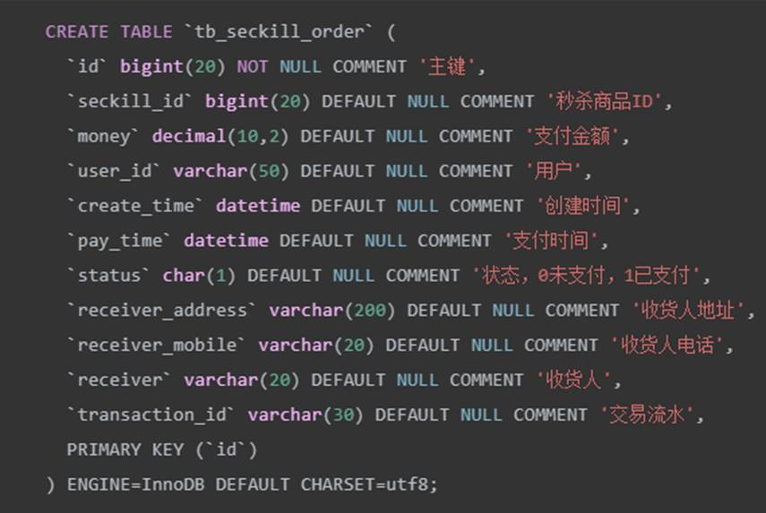

## 秒杀流程

秒杀技术实现核心思想是运用缓存减少数据库瞬间的访问压力！读取商品详细信息时运用缓存，当用户点击抢购时减少缓存中的库存数量，当库存数为0时或活动期结束时，同步到数据库。 产生的秒杀预订单也不会立刻写到数据库中，而是先写到缓存，当用户付款成功后再写入数据库。


 

### 秒杀商品压入缓存实现

秒杀商品列表和秒杀商品详情都是从Redis中取出来的，所以我们首先要将符合参与秒杀的商品定时查询出来，并将数据存入到Redis缓存中。

数据存储类型我们可以选择Hash类型。

秒杀分页列表这里可以通过获取redisTemplate.boundHashOps(key).values()获取结果数据。

秒杀商品详情，可以通过redisTemplate.boundHashOps(key).get(key)获取详情。

// namespace = SeckillGoods_20195712

redisTemplate.boundHashOps("SeckillGoods_"+extName).put(seckillGood.getId(),seckillGood);

Redis数据如下：

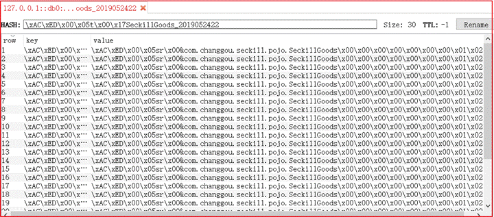

SeckillGoodsCount---在我们对Redis进行操作的时候，很多时候，都是先将数据查询出来，在内存中修改，然后存入到Redis，在并发场景，会出现数据错乱问题，为了控制数量准确，我们单独将商品数量整一个自增键，自增键是线程安全的，所以不担心并发场景的问题。

SeckillGoodsCountList---防止超卖放id的


将秒杀商品从数据库中查询出来，并存入到Redis缓存

查询活动没结束的所有秒杀商品

​	1)计算秒杀时间段

​	2)状态必须为审核通过 status=1

​	3)商品库存个数>0

​	4)活动没有结束 endTime>=now()

​	5)在Redis中没有该商品的缓存

​	6)执行查询获取对应的结果集

将活动没有结束的秒杀商品入库


### 秒杀详情页

秒杀详情页需要根据商品ID查询商品详情，我们可以在频道页点击秒杀抢

购的时候将时间和ID一起传到后台，然后根据ID去Redis中查询详情信息。

### 用户排队下单

首先要判断用户是否重复排队：

用户每次抢单的时候，一旦排队，我们设置一个自增值，让该值的初始值为1，每次进入抢单的时候，对它进行递增，如果值>1，则表明已经排队,不允许重复排队,如果重复排队，则对外抛出异常，并抛出

异常信息100表示已经正在排队。


若没有则进行排队，我们可以采用Redis的队列实现。 排队信息中需要有用户抢单的商品信息，主要包含商品ID，商品抢购时间段，用户登录名。

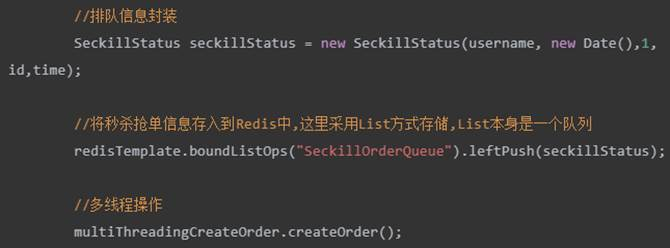

### 多线程下单操作

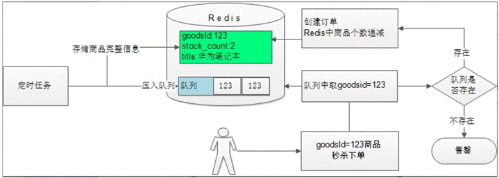

### 防止超卖

可以利用Redis队列实现，给每件商品创建一个独立的商品个数队列

每次给用户下单的时候，先从队列中取数据，如果能取到数据，则表明有库存，如果取不到，则表明没有库存。

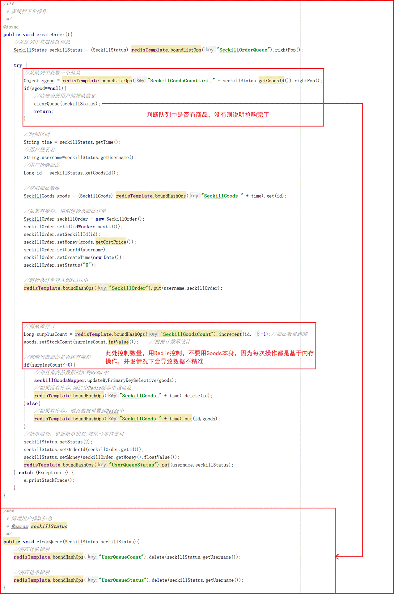

### goods.setStockCount(surplusCount.intValue()) 只是为了下面将数据重置到redis

清理用户排队信息：UserQueueCount是为了防止用户重复抢单建立的

UserQueueStatus是为了查询用户订单状态建立的

### 下单状态查询

虽然可以实现用户下单异步操作，但是并不能确定下单是否成功，所以我们需要做一个页面判断，每过1秒钟查询一次下单状态,多线程下单的时候，需要修改抢单状态，支付的时候，清理抢单状态。

排队信息不仅放到list集合中供抢单使用，也会放到一个hash中，供查询状态


多线程抢单后更新状态：

0是排队，2是等待支付


### 后台可根据用户名查询抢单状态


### 订单支付

**创建支付二维码**

下单成功后，会跳转到支付选择页面，在支付选择页面要显示订单编号和订单金额，所以我们需要在下单的时候，将订单金额以及订单编号信息存储到用户查询对象中。

选择微信支付后，会跳转到微信支付页面，微信支付页面会根据用户名查看用户秒杀订单，并根据用户秒杀订单的ID和钱数创建预支付信息并获取二维码信息，展示给用户看,此时页面每3秒查询一次支付状态，如果支付成功，需要修改订单状态信息。

**支付流程**


1. 用户抢单，经过秒杀系统实现抢单，下单后会将向MQ发送一个延时队列消息，包含抢单信息，延时半小时后才能监听到

2. 秒杀系统同时启用延时消息监听，一旦监听到订单抢单信息，判断Redis缓存中是否存在订单信息，如果存在（就说明用户没有支付），则回滚

3. 秒杀系统还启动支付回调信息监听，如果支付完成，则将订单吃句话到MySQL，如果没完成，清理排队信息回滚库存

4. 每次秒杀下单后调用支付系统，创建二维码，如果用户支付成功了，微信系统会将支付信息发送给支付系统指定的回调地址，支付系统收到信息后，将信息发送给MQ，第3个步骤就可以监听到消息了。

 

**支付回调队列指定**

1. 创建支付二维码需要指定队列

2. 回调地址回调的时候，获取支付二维码指定的队列，将支付信息发送到指定队列中支付微服务的参数携带

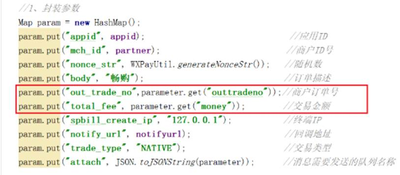

 

**支付状态监听**

支付状态通过回调地址发送给MQ之后，我们需要在秒杀系统中监听支付信息（支付成功的状态码，success还是fail）

如果用户支付成功，则修改订单信息（为了将订单信息放入mysql，先将"SeckillOrder"从redis中查出来，修改成已支付：1），并将订单入库，删除用户排队信息（"UserQueueCount"），清空redis中缓存（"SeckillOrder"），删除抢购状态信息("UserQueueStatus")


如果用户支付失败，则关闭订单，删除订单信息，回滚库存，删除用户排队信息。

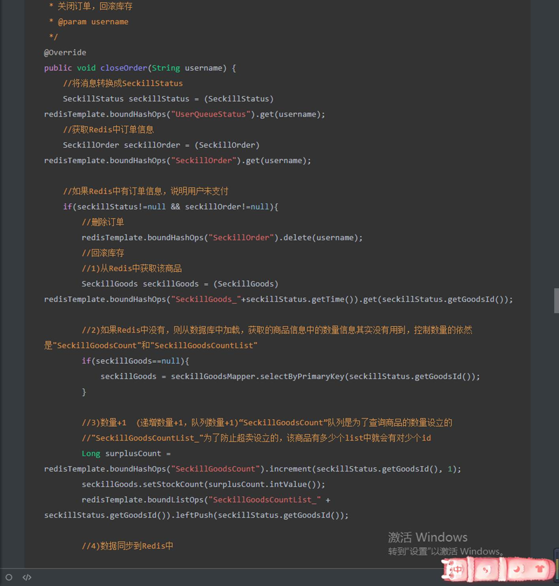


### 用户超时半小时未支付关闭订单回滚库存

1. 创建一个过期队列 Queue1

2. 接收消息的队列  Queue2

3. 中转交换机

4. 监听Queue2

   1)SeckillStatus->检查Redis中是否有订单信息

   2)如果有订单信息，调用删除订单回滚库存->[需要先关闭微信支付]

   3)如果关闭订单时，用户已支付，修改订单状态即可

   4)如果关闭订单时，发生了别的错误，记录日志，人工处理

## 秒杀系统的设计思考 

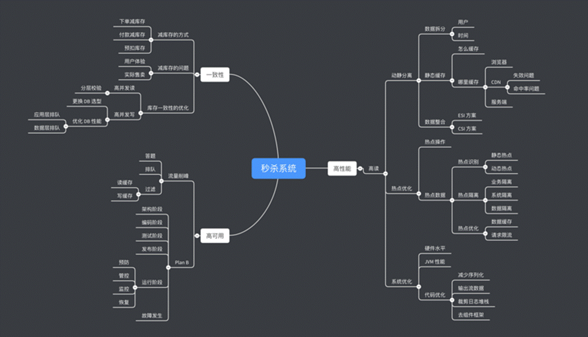


## 高性能

### 1 动静分离

**数据拆分**

1. 用户。用户身份信息包括登录状态以及登录画像等；与之相关的广平推荐，如用户偏好、地域偏好等，同样可以通过异步方式进行加载
2. 时间。秒杀时间是由服务端统一管控的，可以通过动态请求进行获取

**静态缓存**

三种方式：1.浏览器；2.服务端 ；3.CDN

1. 浏览器当然是第一选择，但用户的浏览器是不可控的，主要体现在如果用户不主动刷新，系统很难主动地把消息推送给用户，如此可能会导致用户端在很长一段时间内看到的信息都是错误的。对于秒杀系统，保证缓存可以在秒级时间内失效是不可或缺的。

2. 服务端主要进行动态逻辑计算及加载，本身并不擅长处理大量连接，每个连接消耗内存较多，同时 Servlet 容器解析 HTTP 较慢，容易侵占逻辑计算资源；另外，静态数据下沉至此也会拉长请求路径。

3. CDN本身更擅长处理大并发的静态文件请求，既可以做到主动失效，又离用户尽可能近。

失效问题:任何一个缓存都应该是有时效的

命中率问题:高命中是缓存系统最为核心的性能要求

 

选择若干 CDN 节点进行静态化改造，节点的选取通常需要满足以下几个条件：

1. 临近访问量集中的地区
2. 距离主站较远的地区
3. 节点与主站间网络质量良好的地区

数据整合

分离出动静态数据之后，前端如何组织数据页就是一个新的问题，主要在于动态数据的加载处理，通常有两种方案：ESI（Edge Side Includes）方案和 CSI（Client Side Include）方案。

1. ESI 方案：Web 代理服务器上请求动态数据，并将动态数据插入到静态页面中，用户看到页面时已经是一个完整的页面。这种方式对服务端性能要求高，但用户体验较好
2. CSI 方案：Web 代理服务器上只返回静态页面，前端单独发起一个异步 JS 请求动态数据。这种方式对服务端性能友好，但用户体验稍差

### 2 热点优化

热点操作

- 零点刷新、零点下单、零点添加购物车等都属于热点操作。热点操作是用户的行为，不好改变，但可以做一些限制保护，比如用户频繁刷新页面时进行提示阻断。


热点数据

*热点识别*

1. 静态热点：能够提前预测的热点数据。大促前夕，可以根据大促的行业特点、活动商家等纬度信息分析出热点商品，或者通过卖家报名的方式提前筛选；另外，还可以通过技术手段提前预测，例如对买家每天访问的商品进行大数据计算，然后统计出 TOP N 的商品，即可视为热点商品
2. 动态热点：无法提前预测的热点数据。冷热数据往往是随实际业务场景发生交替变化的，尤其是如今直播卖货模式的兴起——带货商临时做一个广告，就有可能导致一件商品在短时间内被大量购买。由于此类商品日常访问较少，即使在缓存系统中一段时间后也会被逐出或过期掉，甚至在db中也是冷数据。瞬时流量的涌入，往往导致缓存被击穿，请求直接到达DB，引发DB压力过大

秒杀系统需要实现热点数据的动态发现能力，一个常见的实现思路是：

1. 异步采集交易链路各个环节的热点 Key 信息，如 Nginx采集访问URL或 Agent 采集热点日志（一些中间件本身已具备热点发现能力），提前识别潜在的热点数据
2. 聚合分析热点数据，达到一定规则的热点数据，通过订阅分发推送到链路系统，各系统根据自身需求决定如何处理热点数据，或限流或缓存，从而实现热点保护

热点隔离

​	将热点数据隔离出来，不要让 1% 影响到另外的 99%。

1. 业务隔离。秒杀作为一种营销活动，卖家需要单独报名，从技术上来说，系统可以提前对已知热点做缓存预热
2. 系统隔离。系统隔离是运行时隔离，通过分组部署和另外 99% 进行分离，另外秒杀也可以申请单独的域名，入口层就让请求落到不同的集群中
3. 数据隔离。秒杀数据作为热点数据，可以启用单独的缓存集群或者DB服务组，从而更好的实现横向或纵向能力扩展

热点优化

1. 缓存：热点缓存是最为有效的办法。如果热点数据做了动静分离，那么可以长期缓存静态数据
2. 限流：流量限制更多是一种保护机制。需要注意的是，各服务要时刻关注请求是否触发限流并及时进行review

### 3 系统优化

如提升硬件水平、调优JVM 性能

1. 减少序列化：减少 Java 中的序列化操作可以很好的提升系统性能。序列化大部分是在 RPC 阶段发生，因此应该尽量减少 RPC 调用，一种可行的方案是将多个关联性较强的应用进行 “合并部署”，从而减少不同应用之间的 RPC 调用（微服务设计规范）
2. 直接输出流数据：只要涉及字符串的I/O操作，无论是磁盘 I/O 还是网络 I/O，都比较耗费 CPU 资源，因为字符需要转换成字节，而这个转换又必须查表编码。所以对于常用数据，比如静态字符串，推荐提前编码成字节并缓存，具体到代码层面就是通过 OutputStream() 类函数从而减少数据的编码转换；另外，热点方法toString()不要直接调用ReflectionToString实现，推荐直接硬编码，并且只打印DO的基础要素和核心要素
3. 裁剪日志异常堆栈：无论是外部系统异常还是应用本身异常，都会有堆栈打出，超大流量下，频繁的输出完整堆栈，只会加剧系统当前负载。可以通过日志配置文件控制异常堆栈输出的深度
4. 去组件框架：极致优化要求下，可以去掉一些组件框架，比如去掉传统的 MVC 框架，直接使用 Servlet 处理请求。这样可以绕过一大堆复杂且用处不大的处理逻辑，节省毫秒级的时间，当然，需要合理评估你对框架的依赖程度

 

## 一致性

### 1 减库存的方式

1. 下单减库存。买家下单后，扣减商品库存。下单减库存是最简单的减库存方式，也是控制最为精确的一种
2. 付款减库存。买家下单后，并不立即扣减库存，而是等到付款后才真正扣减库存。但因为付款时才减库存，如果并发比较高，可能出现买家下单后付不了款的情况，因为商品已经被其他人买走了
3. 预扣库存。这种方式相对复杂一些，买家下单后，库存为其保留一定的时间（如 15 分钟），超过这段时间，库存自动释放，释放后其他买家可以购买

### 2 减库存的问题

下单减库存:

- 优势：用户体验最好。下单减库存是最简单的减库存方式，也是控制最精确的一种。下单时可以直接通过数据库事务机制控制商品库存，所以一定不会出现已下单却付不了款的情况。
- 劣势：可能卖不出去。正常情况下，买家下单后付款概率很高，所以不会有太大问题。但有一种场景例外，就是当卖家参加某个促销活动时，竞争对手通过恶意下单的方式将该商品全部下单，导致库存清零，那么这就不能正常售卖了——要知道，恶意下单的人是不会真正付款的，这正是 “下单减库存” 的不足之处。

付款减库存

- 优势：一定实际售卖。“下单减库存” 可能导致恶意下单，从而影响卖家的商品销售， “付款减库存” 由于需要付出真金白银，可以有效避免。
- 劣势：用户体验较差。用户下单后，不一定会实际付款，假设有 100 件商品，就可能出现 200 人下单成功的情况，因为下单时不会减库存，所以也就可能出现下单成功数远远超过真正库存数的情况，这尤其会发生在大促的热门商品上。如此一来就会导致很多买家下单成功后却付不了款，购物体验自然是比较差的。

预扣库存

- 优势：缓解了以上两种方式的问题。预扣库存实际就是“下单减库存”和 “付款减库存”两种方式的结合，将两次操作进行了前后关联，下单时预扣库存，付款时释放库存。
- 劣势：并没有彻底解决以上问题。比如针对恶意下单的场景，虽然可以把有效付款时间设置为 10 分钟，但恶意买家完全可以在 10 分钟之后再次下单。

### 3 实际如何减库存

业界最为常见的是预扣库存。无论是外卖点餐还是电商购物，下单后一般都有个 “有效付款时间”，超过该时间订单自动释放，这就是典型的预扣库存方案。但如上所述，预扣库存还需要解决恶意下单的问题，保证商品卖的出去；另一方面，如何避免超卖，也是一个痛点。

1. 卖的出去：恶意下单的解决方案主要还是结合安全和反作弊措施来制止。比如，识别频繁下单不付款的买家并进行打标，这样可以在打标买家下单时不减库存；再比如为大促商品设置单人最大购买件数，一人最多只能买 N 件商品；又或者对重复下单不付款的行为进行次数限制阻断等
2. 避免超卖：库存超卖的情况实际分为两种。对于普通商品，秒杀只是一种大促手段，即使库存超卖，商家也可以通过补货来解决；而对于一些商品，秒杀作为一种营销手段，完全不允许库存为负，也就是在数据一致性上，需要保证大并发请求时数据库中的库存字段值不能为负，一般有多种方案：一是在通过事务来判断，即保证减后库存不能为负，否则就回滚；二是直接设置数据库字段类型为无符号整数，这样一旦库存为负就会在执行 SQL 时报错；三是使用 CASE WHEN 判断语句——

```mysql
UPDATE item SET inventory = CASE WHEN inventory >= xxx THEN inventory-xxx ELSE inventory END
```

业务手段保证商品卖的出去，技术手段保证商品不会超卖，库存问题从来就不是简单的技术难题，解决问题的视角是多种多样的。

### 4 一致性性能的优化

4.1 高并发读

秒杀场景解决高并发读问题，关键词是“分层校验”。即在读链路时，只进行不影响性能的检查操作，如用户是否具有秒杀资格、商品状态是否正常、用户答题是否正确、秒杀是否已经结束、是否非法请求等，而不做一致性校验等容易引发瓶颈的检查操作；直到写链路时，才对库存做一致性检查，在数据层保证最终准确性。

因此，在分层校验设定下，系统可以采用分布式缓存甚至LocalCache来抵抗高并发读。即允许读场景下一定的脏数据，这样只会导致少量原本无库存的下单请求被误认为是有库存的，等到真正写数据时再保证最终一致性，由此做到高可用和一致性之间的平衡。

实际上，分层校验的核心思想是：不同层次尽可能过滤掉无效请求，只在“漏斗” 最末端进行有效处理，从而缩短系统瓶颈的影响路径。

4.2 高并发写

*更换**DB**选型*

秒杀商品和普通商品的减库存是有差异的，核心区别在数据量级小、交易时间短，把秒杀减库存直接放到缓存系统中实现，也就是直接在一个带有持久化功能的缓存中进行减库存操作，比如 Redis.

如果减库存逻辑非常单一的话，比如没有复杂的 SKU 库存和总库存这种联动关系的话，是完全可以的。但如果有比较复杂的减库存逻辑，或者需要使用到事务，那就必须在数据库中完成减库存操作。

*优化**DB**性能*

库存数据落地到数据库实现其实是一行存储（MySQL），因此会有大量线程来竞争 InnoDB 行锁。但并发越高，等待线程就会越多，TPS 下降，RT 上升，吞吐量会受到严重影响

1. 应用层排队。通过缓存加入集群分布式锁，从而控制集群对数据库同一行记录进行操作的并发度，同时也能控制单个商品占用数据库连接的数量，防止热点商品占用过多的数据库连接
2. 数据层排队。应用层排队是有损性能的，数据层排队是最为理想的。业界中，阿里的数据库团队开发了针对InnoDB 层上的补丁程序（patch），可以基于DB层对单行记录做并发排队，从而实现秒杀场景下的定制优化——注意，排队和锁竞争是有区别的，如果熟悉 MySQL 的话，就会知道 InnoDB 内部的死锁检测，以及 MySQL Server 和 InnoDB 的切换都是比较消耗性能的。

### 高可用

秒杀请求高度集中于某一特定的时间点。造成一个特别高的零点峰值，而对资源的消耗也几乎是瞬时的。所以秒杀系统的可用性保护是不可或缺的。

1 流量削峰

能够抢到商品的人数是固定的，无论 100 人和 10000 人参加结果都是一样的，即有效请求额度是有限的。并发度越高，无效请求也就越多。但秒杀作为一种商业营销手段，活动开始之前是希望有更多的人来刷页面，只是真正开始后，秒杀请求不是越多越好。因此系统可以设计一些规则，人为的延缓秒杀请求，甚至可以过滤掉一些无效请求。

1.1 答题

1. 防止作弊。早期秒杀器比较猖獗，存在恶意买家或竞争对手使用秒杀器扫货的情况，商家没有达到营销的目的，所以增加答题来进行限制
2. 延缓请求。零点流量的起效时间是毫秒级的，答题可以人为拉长峰值下单的时长，由之前的 <1s 延长到 <10s。这个时间对于服务端非常重要，会大大减轻高峰期并发压力；另外，由于请求具有先后顺序，答题后置的请求到来时可能已经没有库存了，因此根本无法下单，此阶段落到数据层真正的写也就非常有限了

答题除了做正确性验证，还需要对提交时间做验证，比如<1s 人为操作的可能性就很小，可以进一步防止机器答题的情况。

1.2 排队

最为常见的削峰方案是使用消息队列，通过把同步的直接调用转换成异步的间接推送缓冲瞬时流量。除了消息队列，类似的排队方案还有很多，例如：

1. 线程池加锁等待
2. 本地内存蓄洪等待
3. 本地文件序列化写，再顺序读

排队方式的弊端也是显而易见的，主要有两点：

1. 请求积压。流量高峰如果长时间持续，达到了队列的水位上限，队列同样会被压垮，这样虽然保护了下游系统，但是和请求直接丢弃也没多大区别
2. 用户体验。异步推送的实时性和有序性自然是比不上同步调用的，由此可能出现请求先发后至的情况，影响部分敏感用户的购物体验

排队本质是在业务层将一步操作转变成两步操作，从而起到缓冲的作用，但鉴于此种方式的弊端，最终还是要基于业务量级和秒杀场景做出妥协和平衡。

1.3 过滤

过滤的核心结构在于分层，通过在不同层次过滤掉无效请求，达到数据读写的精准触发。常见的过滤主要有以下几层：

1、读限流：对读请求做限流保护，将超出系统承载能力的请求过滤掉

2、读缓存：对读请求做数据缓存，将重复的请求过滤掉

3、写限流：对写请求做限流保护，将超出系统承载能力的请求过滤掉

4、写校验：对写请求做一致性校验，只保留最终的有效数据


2 Plan B

在秒杀这一场景下，为了保证系统的高可用，必须设计一个 Plan B 方案来进行兜底。

高可用建设，其实是一个系统工程，贯穿在系统建设的整个生命周期。

 


具体来说，系统的高可用建设涉及架构阶段、编码阶段、测试阶段、发布阶段、运行阶段，以及故障发生时，逐一进行分析：

1. 架构阶段：考虑系统的可扩展性和容错性，避免出现单点问题。例如多地单元化部署，即使某个IDC甚至地市出现故障，仍不会影响系统运转
2. 编码阶段：保证代码的健壮性，例如RPC调用时，设置合理的超时退出机制，防止被其他系统拖垮，同时也要对无法预料的返回错误进行默认的处理
3. 测试阶段：保证CI的覆盖度以及Sonar的容错率，对基础质量进行二次校验，并定期产出整体质量的趋势报告
4. 发布阶段：系统部署最容易暴露错误，因此要有前置的checklist模版、中置的上下游周知机制以及后置的回滚机制
5. 运行阶段：系统多数时间处于运行态，最重要的是运行时的实时监控，及时发现问题、准确报警并能提供详细数据，以便排查问题
6. 故障发生：首要目标是及时止损，防止影响面扩大，然后定位原因、解决问题，最后恢复服务

日常运维而言

1. 预防：建立常态压测体系，定期对服务进行单点压测以及全链路压测，摸排水位
2. 管控：做好线上运行的降级、限流和熔断保护。需要注意的是，无论是限流、降级还是熔断，对业务都是有损的，所以在进行操作前，一定要和上下游业务确认好再进行。就拿限流来说，哪些业务可以限、什么情况下限、限流时间多长、什么情况下进行恢复，都要和业务方反复确认
3. 监控：建立性能基线，记录性能的变化趋势；建立报警体系，发现问题及时预警
4. 恢复：遇到故障能够及时止损，并提供快速的数据订正工具，不一定要好，但一定要有