# 7层模型

应⽤层 

应⽤层(application-layer）的任务是通过应⽤进程间的交互来完成特定⽹络应⽤。应⽤层协议定义的是应⽤进程（进程：主机中正在运⾏的程序）间的通信和交互的规则。对于不同的⽹络应⽤需要不同的应⽤层协议。在互联⽹中应⽤层协议很多，如域名系统DNS，⽀持万维⽹应⽤的**HTTP协议，⽀持电⼦邮件的** **SMTP协议等等。我们把应⽤层交互的据单元称为报⽂。** 

运输层 

运输层**(transport layer)**的主要任务就是负责向两台主机进程之间的通信提供通⽤的数据传输服务。应⽤进程利⽤该服务传送应⽤层报⽂。“通⽤的”是指并不针对某⼀个特定的⽹络应⽤，⽽是 多种应⽤可以使⽤同⼀个运输层服务。由于⼀台主机可同时运⾏多个线程，因此运输层有复⽤和 分⽤的功能。所谓复⽤就是指多个应⽤层进程可同时使⽤下⾯运输层的服务，分⽤和复⽤相反， 是运输层把收到的信息分别交付上⾯应⽤层中的相应进程。 

运输层主要使⽤以下两种协议**:**

1. 传输控制协议 **TCP**（Transmission Control Protocol）--提供⾯向连接的，可靠的数据传输 服务。 

2. ⽤户数据协议 **UDP**（User Datagram Protocol）--提供⽆连接的，尽最⼤努⼒的数据传输服 务（不保证数据传输的可靠性）

⽹络层 

在计算机⽹络中进⾏通信的两个计算机之间可能会经过很多个数据链路，也可能还要经过很多通信⼦⽹。⽹络层的任务就是选择合适的⽹间路由和交换结点， 确保数据及时传送。在发送数据时，⽹络层把运输层产⽣的报⽂段或⽤户数据报封装成分组和包进⾏传送。

数据链路层 

数据链路层**(data link layer)**通常简称为链路层。两台主机之间的数据传输，总是在⼀段

⼀段的链 路上传送的，这就需要使⽤专⻔的链路层的协议。 在两个相邻节点之间传送数据时，数据链路层 将⽹络层交下来的 **IP** 数据报组装成帧，在两个相邻节点间的链路上传送帧。每⼀帧包括数据和必要的控制信息（如同步信息，地址信息，差错控制等）。

⽹络并不是⼀个整体，⼀旦数据需要跨⽹络传输，就需要有⼀个设备同时在两个⽹络当中，这个设备⼀般是路由器，路由器可以通过路由 表计算出下⼀个要去的 IP 地址。 

那问题来了，路由器怎么知道这个 IP 地址是哪个设备的呢？ 

于是，就需要有⼀个专⻔的层来标识⽹络中的设备，让数据在⼀个链路中传输，这就是数据链路层（*Data Link Layer*），它主要为⽹络层提供链路级别传的服务。

物理层 

在物理层上所传送的数据单位是⽐特。 

物理层**(physical layer)**的作⽤是实现相邻计算机节点之间⽐特流的透明传送，尽可能屏蔽掉具体传输介质和物理设备的差异。

# HTTP

## HTTP 是什么？描述⼀下

HTTP 是超⽂本传输协议，也就是Hyper TextTransfer Protocol。

HTTP的名字「超⽂本协议传输」，它可以拆成三个部分：超⽂本传输，协议

​	超⽂本：现在「⽂本」的涵义已经可以扩展为图⽚、视频、压缩包等，在 HTTP 眼⾥这些都算作「⽂本」。最关键有超链接，能从⼀个超⽂本跳转到另外⼀个超⽂本。HTML 就是最常⻅的超⽂本了，它本身只是纯⽂字⽂件，但内部⽤很多标签定义了图⽚、视频等的链接，再经过浏览器的解释，呈现给我们的就是⼀个⽂字、有画⾯的⽹⻚了。

​    传输：计算机世界⾥专⻔⽤来在两点之间传输数据的约定和规范，我们在上⽹冲浪时，浏览器是请求⽅ A ，百度⽹站就是应答⽅ B。双⽅约定⽤ HTTP 协议来通信，于是浏览器把请求数据发送给⽹站，⽹站再把⼀些数据返回给浏览器，最后由浏览器渲染在屏幕，就可以看到图⽚、视频了。

​    协议：计算机之间交流通信的规范（两个以上的参与者），以及相关的各种控制和错误处理⽅式（⾏为约定和规范）。数据虽然是在 A 和 B 之间传输，但允许中间有中转或接⼒。HTTP ⾥，需要中间⼈遵从 HTTP 协议，只要不打扰基本的数据传输，就可以添加任意额外的东⻄。

## HTTP 是⽤于从互联⽹服务器传输超⽂本到本地浏览器的协议 ，这种说法正确吗？

不正确的。因为也可以是「服务器< -->服务器」，所以采⽤两点之间的描述会更准确

## HTTP 常⻅的状态码

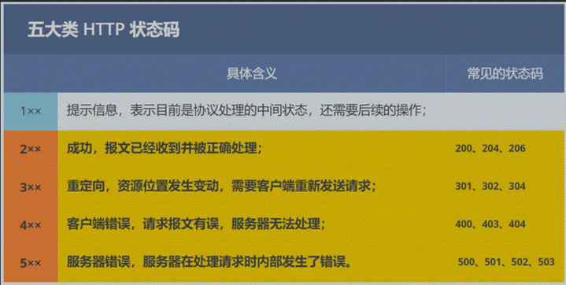

*1xx*

​    属于提示信息，是协议处理中的⼀种中间状态，实际⽤到的⽐较少。

*2xx*

​    表示服务器成功处理了客户端的请求

​    「**200 OK**」是最常⻅的成功状态码，表示⼀切正常。如果是⾮ HEAD 请求，服务器返回的响应头都会有 body 数据。（HEAD：HEAD和GET本质是一样的，区别在于HEAD不含有呈现数据，而仅仅是HTTP头信息。有的人可能觉得这个方法没什么用，其实不是这样的。想象一个业务情景：欲判断某个资源是否存在，我们通常使用GET，但这里用HEAD则意义更加明确。）

​    「**204 No Content**」也是常⻅的成功状态码，与 200 OK 基本相同，但响应头没

有 body 数据。

​    「**206 Partial Content**」是应⽤于 HTTP 分块下载或断点续传，表示响应返回的

 body 数据并不是资源的全部，⽽是其中的⼀部分，也是服务器处理成功的状态。

*3xx*

​    表示客户端请求的资源发送了变动，需要客户端⽤新的 URL 重新发送请求获取资源，也就是重定向。

​    「**301 Moved Permanently**」表示永久重定向，说明请求的资源已经不存在了，

需改⽤新的 URL 再次访问。

​    「**302 Found**」表示临时重定向，说明请求的资源还在，但暂时需要⽤另⼀个 URL 来访问。301 和 302 都会在响应头⾥使⽤字段 Location ，指明后续要跳转的 URL，浏览

器会⾃动重定向新的 URL。

​    「**304 Not Modified**」不具有跳转的含义，表示资源未修改，重定向已存在的

缓冲⽂件，也称缓存重定向，⽤于缓存控制。

*4xx*

​    表示客户端发送的报⽂有误，服务器⽆法处理，也就是错误码的含义。

​    「**400 Bad Request**」表示客户端请求的报⽂有错误，但只是个笼统的错误。

​    「**403 Forbidden**」表示服务器禁⽌访问资源，并不是客户端的请求出错。

​    「**404 Not Found**」表示请求的资源在服务器上不存在或未找到，所以⽆法提

供给客户端。

*5xx*

​    表示客户端请求报⽂正确，但是服务器处理时内部发⽣了错误，属于服务器端的错

误码。

​    「**500 Internal Server Error**」与 400 类型，是个笼统通⽤的错误码，服务器发⽣

了什么错误，我们并不知道。

「**501 Not Implemented**」表示客户端请求的功能还不⽀持，类似“即将开业，敬请期待”的意思。

「**502 Bad Gateway**」通常是服务器作为⽹关或代理时返回的错误码，表示服务器⾃身⼯作正常，访问后端服务器发⽣了错误。

「**503 Service Unavailable**」表示服务器当前很忙，暂时⽆法响应服务器，类似“⽹络服务正忙，请稍后重试”的意思。

## http 常⻅字段有哪些

1. *Host* 字段：客户端发送请求时，⽤来指定服务器的域名。

​          Host: [www.A.com](http://www.A.com)    可以将请求发往「同⼀台」服务器上的不同⽹站。

2. *Content*-*Length* 字段：服务器在返回数据时，会有 Content-Length 字段，表明本次回应的数据⻓度。

​      Content-Length: 1000    是告诉浏览器，本次服务器回应的数据⻓度是 1000 个字节，后⾯的字节就属于下⼀个回应了。

3. *Connection* 字段：常⽤于客户端要求服务器使⽤ TCP 持久连接，以便其他请求复⽤。

​       Connection: keep-alive    持久连接，但为了兼容⽼版本的 HTTP，需要指定 Connection ⾸部字段的值为Keep-Alive 。

4. *Content*-*Type* 字段：于服务器回应时，告诉客户端，本次数据是什么格式。

​       Content-Type: text/html; charset=utf-8上⾯的类型表明，发送的是⽹⻚，⽽且编码是UTF-8。

​          客户端请求的时候，可以使⽤ Accept 字段声明⾃⼰可以接受哪些数据格式。

​          Accept: **/**上⾯代码中，客户端声明⾃⼰可以接受任何格式的数据。

5. *Content*-*Encoding* 字段：说明数据的压缩⽅法。表示服务器返回的数据使⽤了什么压缩格式

​        Content-Encoding: gzip    服务器返回的数据采⽤了 gzip ⽅式压缩，告知客户端需要⽤此⽅式解压。

​        Accept-Encoding: gzip, deflate：说明⾃⼰可以接受哪些压缩⽅法。

​	6. User Agent也简称UA。 它是一个特殊字符串头，是一种向访问网站提供你所使用的浏览器类型及版本、操作系统及版本、浏览器内核、等信息的标识。

## 说⼀下 GET 和 POST 的区别

Get ⽅法的含义是请求从服务器获取资源，这个资源可以是静态的⽂本、⻚⾯、图⽚视频等。

POST ⽅法则是相反操作，它向 URI 指定的资源提交数据，数据就放在报⽂的 body ⾥。

功能区别：get获取数据，post提交数据

url：get携带数据，post不携带，在请求体中

url长度限制

get数据包一个，post两个

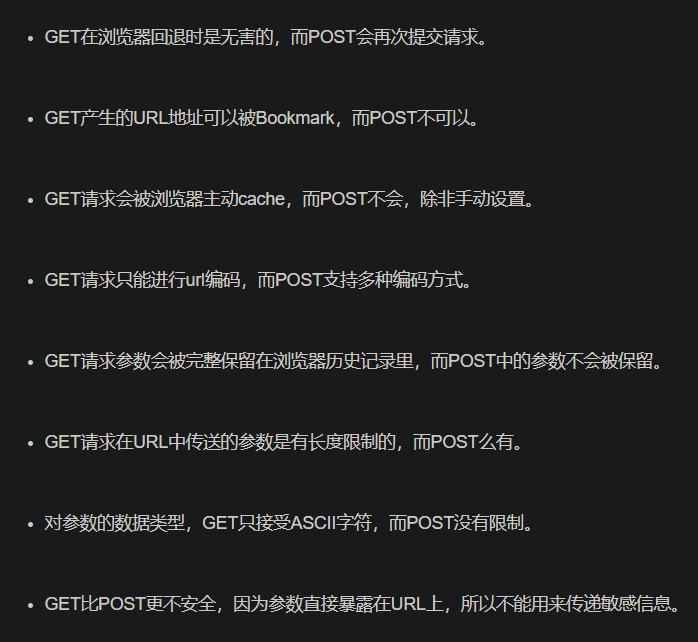

## GET 和 POST ⽅法都是安全和幂等的吗

「安全」是指请求⽅法不会「破坏」服务器上的资源。

「幂等」，意思是多次执⾏相同的操作，结果都是「相同」的。

​        **GET** ⽅法就是安全且幂等的，因为它是「只读」操作，⽆论操作多少次，服务器上的数据都是安全的，且每次的结果都是相同的。

​        **POST** 因为是「新增或提交数据」的操作，会修改服务器上的资源，所以是不安全的，且多次提交数据就会创建多个资源，所以不是幂等的。

## HTTP 的优点有哪些

HTTP 最凸出的优点是「简单、灵活和易于扩展、应⽤⼴泛和跨平台」。

\* 1.* 简单：HTTP 基本的报⽂格式就是 header + body ，头部信息也是 key-value 简单⽂本的形式。

 *2.* 灵活和易于扩展：HTTP协议⾥的各类请求⽅法、URI/URL、状态码、头字段等每个组成要求都没有被固定死，都允许开发⼈员⾃定义和扩充。同时 HTTP 由于是⼯作在应⽤层（ OSI 第七层），则它下层可以随意变化。HTTPS 也就是在 HTTP 与 TCP 层之间增加了 SSL/TLS 安全传输层，HTTP/3 甚⾄把 TCP 层换成了基于 UDP 的QUIC。

 *3.* 应⽤⼴泛和跨平台：从台式机的浏览器到⼿机上的各种 APP，同时天然具有跨平台的优越性。

## **HTTP** **的缺点有哪些**

「⽆状态、明⽂传输」「不安全」

​    *1.* ⽆状态双刃剑

​    ⽆状态的好处，因为服务器不会去记忆 HTTP 的状态，所以不需要额外的资源来记录状态信息，这能减轻服务器的负担，能够把更多的 CPU 和内存⽤来对外提供服务。

​    ⽆状态的坏处，既然服务器没有记忆能⼒，它在完成有关联性的操作时会⾮常麻烦。例如登录-添加购物⻋-下单\-结算-⽀付，这系列操作都要知道⽤户的身份才⾏。但服务器不知道这些请求是有关联的，每次都要问⼀遍身份信息。

​    解法⽅案：Cookie 通过在请求和响应报⽂中写⼊ Cookie 信息来控制客户端的状态。

​    2. 明⽂传输双刃剑

​    ⽅便阅读的，通过浏览器的 F12 控制台或 Wireshark 抓包都可以直接⾁眼查看，为调试⼯作带了极⼤的便利性。

​    信息的内容都毫⽆隐私可⾔，很容易就能被窃取，如果⾥⾯有你的账号密码信息，那你号没了。

​    3.不安全

​    通信使⽤明⽂（不加密），内容可能会被窃听。⽐如，账号信息容易泄漏，那你号没了。

​    不验证通信⽅的身份，因此有可能遭遇伪装。⽐如，访问假的淘宝、拼多多，那你钱没了。

​    ⽆法证明报⽂的完整性，所以有可能已遭篡改。⽐如，⽹⻚上植⼊垃圾⼴告，视觉污染，眼没了。

​    HTTP 的安全问题，可以⽤ HTTPS 的⽅式解决，通过引⼊ SSL/TLS 层。

## HTTP/1.1 的性能如何？

HTTP 协议是基于 **TCP/IP**，并且使⽤了「请求 -应答」的通信模式，所以性能的关键就在这两点⾥。

​    *1.* ⻓连接

​    早期 HTTP/1.0 性能上的⼀个很⼤的问题，那就是每发起⼀个请求，都要新建⼀次 TCP 连接（三次握⼿），⽽且是串⾏请求，做了⽆谓的 TCP 连接建⽴和断开，增加了通信开销。

​    HTTP/1.1 提出了⻓连接的通信⽅式，持久连接的特点是，只要任意⼀端没有明确提出断开连接，则保持 TCP 连接状态。

​    *2.* 管道⽹络传输

​    即可在同⼀个 TCP 连接⾥⾯，客户端可以发起多个请求，只要第⼀个请求发出去了，不必等其回来，就可以发第⼆个请求出去，可以减少整体的响应时间。举例来说，客户端需要请求两个资源。以前的做法是，在同⼀个TCP连接⾥⾯，先发送 A 请求，然后等待服务器做出回应，收到后再发出 B 请求。管道机制则是允许浏览器同时发出 A 请求和 B 请求。

​    3.队头阻塞        

​    但是服务器还是按照顺序，先回应 A 请求，完成后再回应 B 请求。要是前⾯的回应特别慢，后⾯就会有许多请求排队等着。这称为「队头堵塞」。

#  **HTTPS**

## HTTP 与 HTTPS 有哪些区别？

1. HTTP 是超⽂本传输协议，信息是明⽂传输，存在安全⻛险的问题。HTTPS 则解决 HTTP 不安全的缺陷，在 TCP 和 HTTP ⽹络层之间加⼊了 SSL/TLS 安全协议，使得报⽂能够加密传输。

2. HTTP 连接建⽴相对简单， TCP 三次握⼿之后便可进⾏ HTTP 的报⽂传输。⽽ HTTPS 在 TCP 三次握⼿之 后，还需进⾏ SSL/TLS 的握⼿过程，才可进⼊加密报⽂传输。 

3. HTTP 的端⼝号是 80，HTTPS 的端⼝号是 443。 

4. HTTPS 协议需要向 CA（证书权威机构）申请数字证书，来保证服务器的身份是可信的。

## HTTP和HTTPS请求的整个过程详解

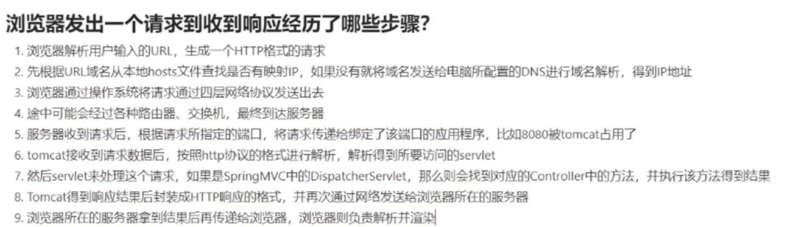

HTTP请求的过程**

1.浏览器根据域名解析IP地址

2.浏览器与WEB服务器建立一个TCP连接

TCP的3次握手过程。

3.浏览器给WEB服务器发送一个HTTP请求

4.服务器端响应HTTP请求，浏览器得到HTML代码

5.浏览器解析HTML代码，并请求HTML代码中的资源

https://blog.fundebug.com/2019/02/28/what-happens-from-url-to-webpage/

**HTTPS请求的过程**

- - 1.客户端向服务器发起HTTPS的请求，连接到服务器的443端口；
  - 2.服务器将非对称加密的公钥传递给客户端，以证书的形式回传到客户端；
  - 3.客户端接受到该公钥进行验证，如果有问题，则HTTPS请求无法继续；如果没有问题，客户端这个时  候随机生成一个私钥，称为client key,用于对称加密数据的。使用前面的公钥对client      key进行非对称加密；客户端发起二次HTTP请求，将加密之后的client key传递给服务器；
  - 4.服务器使用私钥进行解密，得到client key,使用client key对数据进行对称加密；
  - 5.将对称加密的数据传递给客户端，客户端使用对称解密，得到服务器发送的数据，完成第二次HTTP请求。

https://blog.csdn.net/GavinBC/article/details/107001255

## HTTPS 解决了 HTTP 的哪些问题？

HTTP 由于是明⽂传输，所以安全上存在以下三个⻛险： 

窃听⻛险，⽐如通信链路上可以获取通信内容，⽤户号容易没。 

篡改⻛险，⽐如强制植⼊垃圾⼴告，视觉污染，⽤户眼容易瞎。 

冒充⻛险，⽐如冒充淘宝⽹站，⽤钱容易没。

HTTP**S** 在 HTTP 与 TCP 层之间加⼊了 SSL/TLS 协议，可以很好的解决了上述的⻛险： 

信息加密：交互信息⽆法被窃取，但你的号会因为「⾃身忘记」账号⽽没。 

校验机制：⽆法篡改通信内容，篡改了就不能正常显示，但百度「竞价排名」依然可以搜索垃圾⼴告。 

身份证书：证明淘宝是真的淘宝⽹，但你的钱还是会因为「剁⼿」没。

HTTPS 是如何解决上⾯的三个⻛险的？ 

混合加密的⽅式实现信息的机密性，解决了窃听的⻛险。

摘要算法的⽅式来实现完整性，它能够为数据⽣成独⼀⽆⼆的「指纹」，指纹⽤于校验数据的完整性，解决了 篡改的⻛险。

将服务器公钥放⼊到数字证书中，解决了冒的⻛险。

*1.* 混合加密

在通信建⽴前采⽤⾮对称加密的⽅式交换「会话秘钥」，后续就不再使⽤⾮对称加密。

在通信过程中全部使⽤对称加密的「会话秘钥」的⽅式加密明⽂数据。

采⽤「混合加密」的⽅式的原因： 

对称加密只使⽤⼀个密钥，运算速度快，密钥必须保密，⽆法做到安全的密钥交换。 

⾮对称加密使⽤两个密钥：公钥和私钥，公钥可以任意分发⽽私钥保密，解决了密钥交换问题但速度。

*2.* 摘要算法 

摘要算法⽤来实现完整性，能够为数据⽣成独⼀⽆⼆的「指纹」，⽤于校验数据的完整性，解决了篡改的⻛险

客户端在发送明⽂之前会通过摘要算法算出明⽂的「指纹」，发送的时候把「指纹 + 明⽂」⼀同加密成密⽂后，发送给服务器，服务器解密后，⽤相同的摘要算法算出发送过来的明⽂，通过⽐较客户端携带的「指纹」和当前算出的「指纹」做⽐较，若「指纹」相同，说明数据是完整的。

*3.* 数字证书 

客户端先向服务器端索要公钥，然后⽤公钥加密信息，服务器收到密⽂后，⽤⾃⼰的私钥解密。 

这就存在些问题，如何保证公钥不被篡改和信任度？ 

所以这⾥就需要借助第三⽅权威机构 CA （数字证书认证机构），将服务器公钥放在数字证书（由数字证书认证机构颁发）中，只要证书是可信的，公钥就是可信的。

## HTTPS 是如何建⽴连接的？

SSL/TLS 协议基本流程： 

客户端向服务器索要并验证服务器的公钥。 

双⽅协商⽣产「会话秘钥」。

双⽅采⽤「会话秘钥」进⾏加密通信。

SSL/TLS 协议建⽴的详细流程： 

*1. ClientHello* 

⾸先，由客户端向服务器发起加密通信请求，也就是 ClientHello 请求。 在这⼀步，客户端主要向服务器发送以下信息：

（1）客户端⽀持的 SSL/TLS 协议版本，如 TLS 1.2 版本。 

（2）客户端⽣产的随机数（ Client Random ），后⾯⽤于⽣产「会话秘钥」。 

（3）客户端⽀持的密码套件列表，如 RSA 加密算法。 

*2. SeverHello* 

服务器收到客户端请求后，向客户端发出响应，也就是 SeverHello 。服务器回应的内容有如下内容： 

（1）确认 SSL/ TLS 协议版本，如果浏览器不⽀持，则关闭加密通信。 

（2）服务器⽣产的随机数（ Server Random ），后⾯⽤于⽣产「会话秘钥」。 

（3）确认的密码套件列表，如 RSA 加密算法。 

（4）服务器的数字证书。 

*3.*客户端回应 

客户端收到服务器的回应之后，⾸先通过浏览器或者操作系统中的 CA 公钥，确认服务器的数字证书的真实性。

如果证书没有问题，客户端会从数字证书中取出服务器的公钥，然后使⽤它加密报⽂，向服务器发送如下信息： 

（1）⼀个随机数（ pre-master key ）。该随机数会被服务器公钥加密。 

（2）加密通信算法改变通知，表示随后的信息都将⽤「会话秘钥」加密通信。 

（3）客户端握⼿结束通知，表示客户端的握⼿阶段已经结束。这⼀项同时把之前所有内容的发⽣的数据做个摘 要，⽤来供服务端校验。上⾯第⼀项的随机数是整个握⼿阶段的第三个随机数，这样服务器和客户端就同时有三个随机数，接着就⽤双⽅协 商的加密算法，各⾃⽣成本次通信的「会话秘钥」。

*4.* 服务器的最后回应 

服务器收到客户端的第三个随机数（ pre-master key ）之后，通过协商的加密算法，计算出本次通信的「会话秘 钥」。然后，向客户端发⽣最后的信息： 

（1）加密通信算法改变通知，表示随后的信息都将⽤「会话秘钥」加密通信。 

（2）服务器握⼿结束通知，表示服务器的握⼿阶段已经结束。这⼀项同时把之前所有内容的发⽣的数据做个摘 要，⽤来供客户端校验。 

⾄此，整个 SSL/TLS 的握⼿阶段全部结束。接下来，客户端与服务器进⼊加密通信，就完全是使⽤普通的 HTTP 

# **HTTP/1.1**、**HTTP/2**、**HTTP/3** 演变

## HTTP/1.1 相⽐ HTTP/1.0 提⾼了什么性能？

HTTP/1.1 相⽐ HTTP/1.0 性能上的改进： 

使⽤ TCP ⻓连接的⽅式改善了 HTTP/1.0 短连接造成的性能开销。 

⽀持管道（pipeline）⽹络传输，只要第⼀个请求发出去了，不必等其回来，就可以发第⼆个请求出去，可以 减少整体的响应时间。

但 HTTP/1.1 还是有性能瓶颈： 

请求 / 响应头部（Header）未经压缩就发送，⾸部信息越多延迟越⼤。只能压缩 Body 的部分； 

发送冗⻓的⾸部。每次互相发送相同的⾸部造成的浪费较多； 

服务器是按请求的顺序响应的，如果服务器响应慢，会招致客户端⼀直请求不到数据，也就是队头阻塞； 

没有请求优先级控制；

请求只能从客户端开始，服务器只被动响应。

## HTTP/2

*1.* 头部压缩HTTP/2 会压缩头（Header）如果你同时发出多个请求，他们的头是⼀

样的或是相似的，那么，协议会帮你消除重 复的部分。 这就是所谓的 HPACK 算法：在客户端和服务器同时维护⼀张头信息表，所有字段都会存⼊这个表，⽣成⼀个索引号，以后就不发送同样字段了，只发送索引号，这样就提⾼速度了。 

*2.* ⼆进制格式 

HTTP/2 不再像 HTTP/1.1 ⾥的纯⽂本形式的报⽂，⽽是全⾯采⽤了⼆进制格式，头信息和数据体都是⼆进制，并 且统称为帧（frame）：头信息帧和数据帧。但是对计算机⾮常友好，因为计算机只懂⼆进制，那么收到报⽂后，⽆需再将明⽂的报⽂转成⼆进制，⽽是直接解析⼆进制报⽂，这增加了数据传输效率。

*3.* 数据流 

HTTP/2 的数据包不是按顺序发送的，同⼀个连接⾥⾯连续的数据包，可能属于不同的回应。因此，必须要对数据 包做标记，指出它属于哪个回应。

每个请求或回应的所有数据包，称为⼀个数据流（ Stream ）。每个数据流都标记着⼀个独⼀⽆⼆的编号，其中规 定客户端发出的数据流编号为奇数， 服务器发出的数据流编号为偶数，

客户端还可以指定数据流的优先级。优先级⾼的请求，服务器就先响应该请求。

*4.* 多路复⽤ 

HTTP/2 是可以在⼀个连接中并发多个请求或回应，⽽不⽤按照顺序⼀⼀对应。 

移除了 HTTP/1.1 中的串⾏请求，不需要排队等待，也就不会再出现「队头阻塞」问题，降低了延迟，⼤幅度提⾼ 了连接的利⽤率。 

举例来说，在⼀个 TCP 连接⾥，服务器收到了客户端 A 和 B 的两个请求，如果发现 A 处理过程⾮常耗时，于是就 回应 A 请求已经处理好的部分，接着回应 B 请求，完成后，再回应 A 请求剩的部分。

*5.* 服务器推送 

HTTP/2 还在⼀定程度上改善了传统的「请求 - 应答」⼯作模式，服务不再是被动地响应，也可以主动向客户端发 送消息。 

举例来说，在浏览器刚请求 HTML 的时候，就提前把可能会⽤到的 JS、CSS ⽂件等静态资源主动发给客户端，减 少延时的等待，也就是服务器推送（Server Push，也叫 Cache Push）。 

## HTTP/3

HTTP/2 主要的问题在于，多个 HTTP 请求在复⽤⼀个 TCP 连接，下层的 TCP 协议是不知道有多少个 HTTP 请求 的。所以⼀旦发⽣了丢包现象，就会触发 TCP 的᯿传机制，这样在⼀个 TCP 连接中的所有的 **HTTP** 请求都必须等 待这个丢了的包被重传回来。 

HTTP/1.1 中的管道（ pipeline）传输中如果有⼀个请求阻塞了，那么队列后请求也统统被阻塞住了 HTTP/2 多个请求复⽤⼀个TCP连接，⼀旦发⽣丢包，就会阻塞住所有的 HTTP 请求。 

这都是基于 TCP 传输层的问题，所以 **HTTP/3** 把 **HTTP** 下层的 **TCP** 协议改成了 **UDP**！

UDP 发⽣是不管顺序，也不管丢包的，所以不会出现 HTTP/1.1 的队头阻塞 和 HTTP/2 的

⼀个丢包全部重传问题。

 UDP 是不可靠传输的，但基于 UDP 的 **QUIC** 协议 可以实现类似 TCP 的可靠性传输。 

QUIC 有⾃⼰的⼀套机制可以保证传输的可靠性的。当某个流发⽣丢包时，只会阻塞这个流，其他流不会受到 影响。 

TLS3 升级成了最新的 1.3 版本，头部压缩算法也升级成了 QPack 。 

HTTPS 要建⽴⼀个连接，要花费 6 次交互，先是建⽴三次握⼿，然后是 TLS/1.3 的三次握⼿。QUIC 直接把 以往的 TCP 和 TLS/1.3 的 6 次交互合并成了 **3** 次，减少了交互次数。

QUIC 是⼀个在 UDP 之上的伪 TCP + TLS + HTTP/2 的多路复⽤的协议。 

QUIC 是新协议，对于很多⽹络设备，根本不知道什么是 QUIC，只会当做 UDP，这样会出现新的问题。所以HTTP/3 现在普及的进度⾮常的缓慢，不知道未来 UDP 是否能够逆袭 TCP。

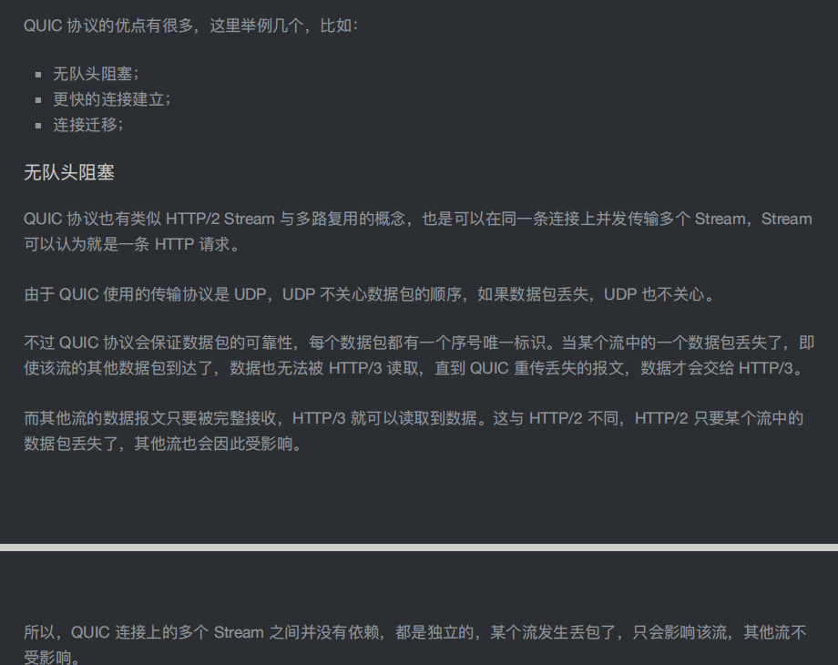

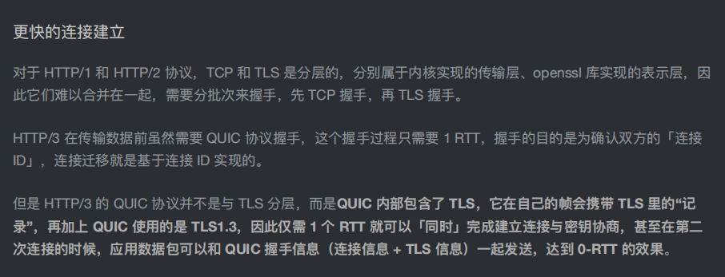

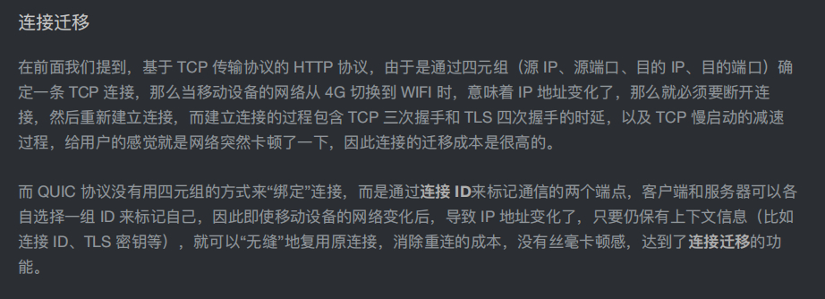

# TCP与UDP

## 基本认识

### TCP 头格式

- 1. 序列号：在建⽴连接时由计算机⽣成的随机数作为其初始值，通过      SYN 包传给接收端主机，每发送⼀次数据，就「累加」⼀次该「数据字节数」的⼤⼩。⽤来解决⽹络包乱序问题。
  2. 确认应答号：指下⼀次「期望」收到的数据的序列号，发送端收到这个确认应答以后可以认为在这个序号以前的数据都已经被正常接收。⽤来解决不丢包的问题。
  3. 控制位：

- - *ACK*：该位为      1 时，「确认应答」的字段变为有效，TCP 规定除了最初建⽴连接时的 SYN 包之外该位必须设置为 1 。
  - *RST*：该位为      1 时，表示 TCP 连接中出现异常必须强制断开连接。
  - *SYN*：该位为      1 时，表示希望建⽴连接，并在其「序列号」的字段进⾏序列号初始值的设定。
  - *FIN*：该位为      1 时，表示今后不会再有数据发送，希望断开连接。当通信结束希望断开连接时，通信双⽅的主机之间就可以相互交换 FIN 位为 1 的 TCP 段。

### **为什么需要** **TCP** **协议？** **TCP** **⼯作在哪⼀层？**

IP 层是「不可靠」的，它不保证⽹络包的交付、不保证⽹络包的按序交付、也不保证⽹络包中的数据的完整性。

如果需要保障⽹络数据包的可靠性，那么就需要由上层（传输层）的 TCP 协议来负责。

因为 TCP 是⼀个⼯作在**传输层**的可靠数据传输的服务，它能确保接收端接收的⽹络包是⽆损坏、⽆间隔、⾮冗余和按序的。

### **什么是** **TCP** **？**

TCP 是⾯向连接的、可靠的、基于字节流的传输层通信协议。

⾯向连接：⼀定是「⼀对⼀」才能连接，不能像 UDP 协议可以⼀个主机同时向多个主机发送消息，也就是⼀对多是⽆法做到的；

可靠的：⽆论的⽹络链路中出现了怎样的链路变化，TCP 都可以保证⼀个报⽂⼀定能够到达接收端；

字节流：消息是「没有边界」的，所以⽆论我们消息有多⼤都可以进⾏传输。并且消息是「有序的」，当「前⼀个」消息没有收到的时候，即使它先收到了后⾯的字节，那么也不能扔给应⽤层去处理，同时对「重复」的报⽂会⾃动丢弃。

### **什么是** **TCP** **连接？**

⽤于保证可靠性和流量控制维护的某些状态信息，这些信息的组合，包括**Socket**、序列号和窗⼝⼤⼩称为连接。

建⽴⼀个 TCP 连接是需要客户端与服务器端达成上述三个信息的共识。

\- Socket：由 IP 地址和端⼝号组成

\- 序列号：⽤来解决乱序问题等

\- 窗⼝⼤⼩：⽤来做流量控制

### 如何唯⼀确定⼀个 TCP 连接呢？

TCP 四元组可以唯⼀的确定⼀个连接，四元组包括如下：

\- 源地址

\- 源端⼝

\- ⽬的地址

\- ⽬的端⼝

 源地址和⽬的地址的字段（32位）是在 IP 头部中，作⽤是通过 IP 协议发送报⽂给对⽅主机。

 源端⼝和⽬的端⼝的字段（16位）是在 TCP 头部中，作⽤是告诉 TCP 协议应该把报⽂发给哪个进程。

### 有⼀个 IP 的服务器监听了⼀个端⼝，它的 TCP 的最⼤连接数是多少？

服务器通常固定在某个本地端⼝上监听，等待客户端的连接请求。

因此，客户端 IP 和 端⼝是可变的，其理论值计算公式如下: 

对 IPv4，客户端的 IP 数最多为 2 的 32 次⽅，客户端的端⼝数最多为 2 的 16 次⽅，也就是服务端单机最⼤TCP 连接数，约为 2 的 48 次⽅。

当然，服务端最⼤并发 TCP 连接数远不能达到理论上限。

\- ⾸先主要是⽂件描述符限制，Socket 都是⽂件，所以⾸先要通过 ulimit 配置⽂件描述符的数⽬；

\- 另⼀个是内存限制，每个 TCP 连接都要占⽤⼀定内存，操作系统的内存是有限的。

### **UDP** **和** **TCP** **有什么区别呢？**

UDP概念

UDP 不提供复杂的控制机制，利⽤ IP 提供⾯向「⽆连接」的通信服务。

UDP 协议真的⾮常简单，头部只有 8 个字节（ 64 位），UDP 的头部格式如下：

\- ⽬标和源端⼝：主要是告诉 UDP 协议应该把报⽂发给哪个进程。

\- 包⻓度：该字段保存了 UDP ⾸部的⻓度跟数据的⻓度之和。

\- 校验和：校验和是为了提供可靠的 UDP ⾸部和数据⽽设计。

TCP和 UDP 区别：

*1.* 连接

TCP 是⾯向连接的传输层协议，传输数据前先要建⽴连接。

UDP 是不需要连接，即刻传输数据。

*2.* 服务对象

TCP 是⼀对⼀的两点服务，即⼀条连接只有两个端点。

UDP ⽀持⼀对⼀、⼀对多、多对多的交互通信

*3.* 可靠性

TCP 是可靠交付数据的，数据可以⽆差错、不丢失、不重复、按需到达。

UDP 是尽最⼤努⼒交付，不保证可靠交付数据。

*4.* 拥塞控制、流量控制

TCP 有拥塞控制和流量控制机制，保证数据传输的安全性。

UDP 则没有，即使⽹络⾮常拥堵了，也不会影响 UDP 的发送速率。

*5.* ⾸部开销

TCP ⾸部⻓度较⻓，会有⼀定的开销，⾸部在没有使⽤「选项」字段时是 20 个字节，如果使⽤了「选项」字段则会变⻓的。

UDP ⾸部只有 8 个字节，并且是固定不变的，开销较⼩。

*6.* 传输⽅式

TCP 是流式传输，没有边界，但保证顺序和可靠。

UDP 是⼀个包⼀个包的发送，是有边界的，但可能会丢包和乱序。

*7.* 分⽚不同

TCP 的数据⼤⼩如果⼤于 MSS ⼤⼩，则会在传输层进⾏分⽚，⽬标主机收到后，也同样在传输层组装 TCP数据包，如果中途丢失了⼀个分⽚，只需要传输丢失的这个分⽚。

UDP 的数据⼤⼩如果⼤于 MTU ⼤⼩，则会在 IP 层进⾏分⽚，⽬标主机收到后，在 IP 层组装完数据，接着再传给传输层，但是如果中途丢了⼀个分⽚，在实现可靠传输的 UDP 时则

就需要重传所有的数据包，这样传输效率⾮常差，所以通常 UDP 的报⽂应该⼩于 MTU。

### TCP 和 UDP 应⽤场景：

由于 TCP 是⾯向连接，能保证数据的可靠性交付，因此经常⽤于：

\- FTP ⽂件传输

\- HTTP / HTTPS

由于 UDP ⾯向⽆连接，它可以随时发送数据，再加上UDP本身的处理既简单⼜⾼效，因此经常⽤于：

\- 包总量较少的通信，如 DNS 、 SNMP 等

\- 视频、⾳频等多媒体通信

\- ⼴播通信

### 为什么 UDP 头部没有「⾸部⻓度」字段，⽽ TCP 头部有「⾸部⻓度」字段呢?

 TCP 有可变⻓的「选项」字段，⽽ UDP 头部⻓度则是不会变化的，⽆需多⼀个字段去记录

 UDP 的⾸部⻓度。

### 为什么 UDP 头部有「包⻓度」字段，⽽ TCP 头部则没有「包⻓度」字段呢？

其中 IP 总⻓度 和 IP ⾸部⻓度，在 IP ⾸部格式是已知的。TCP ⾸部⻓度，则是在 TCP ⾸部格式已知的，所以就可以求得 TCP 数据的⻓度。

 UDP 也是基于 IP 层的呀，那 UDP 的数据⻓度也可以通过这个公式计算呀，为何还要有

「包⻓度」呢？”这么⼀问，确实感觉 UDP 「包⻓度」是冗余的。

因为为了⽹络设备硬件设计和处理⽅便，⾸部⻓度需要是 44 字节的整数倍。

如果去掉 UDP 「包⻓度」字段，那 UDP ⾸部⻓度就不是 4 字节的整数倍了，所以⼩林觉得这可能是为了补全

UDP ⾸部⻓度是 4 字节的整数倍，才补充了「包⻓度」字段。

## TCP 连接建⽴

### 三次握手

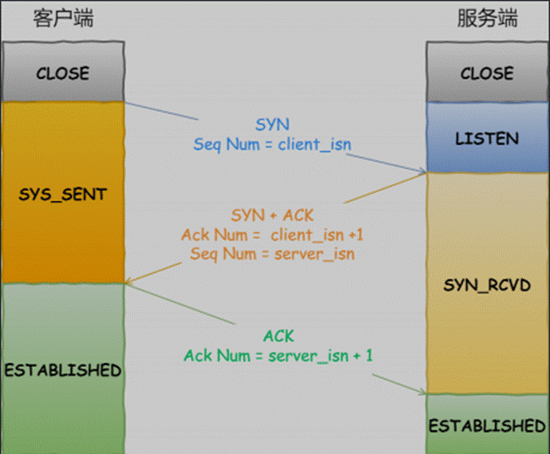

\- ⼀开始，客户端和服务端都处于 CLOSED 状态。先是服务端主动监听某个端⼝，处于 LISTEN 状态

\- 客户端会随机初始化序号（ client_isn ），将此序号置于 TCP ⾸部的「序号」字段中，同时把 SYN 标志位置为 1 ，表示 SYN 报⽂。接着把第⼀个 SYN 报⽂发送给服务端，表示向服务端发起连接，该报⽂不包含应⽤层数据，之后客户端处于 SYN-SENT 状态。

\- 服务端收到客户端的 SYN 报⽂后，⾸先服务端也随机初始化⾃⼰的序号（ server_isn ），将此序号填⼊TCP ⾸部的「序号」字段中，其次把 TCP ⾸部的「确认应答号」字段填⼊ client_isn + 1 , 接着把 SYN 和ACK 标志位置为 1 。最后把该报⽂发给客户端，该报⽂也不包含应⽤层数据，之后服务端处于 SYN-RCVD状态。

\- 客户端收到服务端报⽂后，还要向服务端回应最后⼀个应答报⽂，⾸先该应答报⽂ TCP ⾸部 ACK 标志位置为1 ，其次「确认应答号」字段填⼊ server_isn + 1 ，最后把报⽂发送给服务端，这次报⽂可以携带客户到服务器的数据，之后客户端处于 ESTABLISHED 状态。

\- 服务器收到客户端的应答报⽂后，也进⼊ ESTABLISHED 状态。

第三次握⼿是可以携带数据的，前两次握⼿是不可以携带数据的，这也是⾯试常问的题

https://zhuanlan.zhihu.com/p/53374516

### 为什么是三次握⼿？不是两次、四次？

\- 三次握⼿才可以阻⽌重复历史连接的初始化（主要原因）

\- 三次握⼿才可以同步双⽅的初始序列号

\- 三次握⼿才可以避免资源浪费

1. 阻⽌重复历史连接

客户端连续发送多次 SYN 建⽴连接的报⽂，在⽹络拥堵情况下：⼀个「旧 SYN 报⽂」⽐「最新的 SYN 」 报⽂早到达了服务端；那么此时服务端就会回⼀个 SYN + ACK 报⽂给客户端；客户端收到后可以根据⾃身的上下⽂，判断这是⼀个历史连接（序列号过期或超时），那么客户端就会发送RST 报⽂给服务端，表示中⽌这⼀次连接。

如果是两次握⼿连接，就不能判断当前连接是否是历史连接，三次握⼿则可以在客户端（发送⽅）准备发送第三次报⽂时，客户端因有⾜够的上下⽂来判断当前连接是否是历史连接：

如果是历史连接（序列号过期或超时），则第三次握⼿发送的报⽂是 RST 报⽂，以此中⽌历史连接；如果不是历史连接，则第三次发送的报⽂是 ACK 报⽂，通信双⽅就会成功建⽴连接；

2. 同步双⽅的初始序列号

TCP 协议的通信双⽅， 都必须维护⼀个「序列号」， 序列号是可靠传输的⼀个关键因素，它的作⽤：

\- 接收⽅可以去除重复的数据；

\- 接收⽅可以根据数据包的序列号按序接收；

\- 可以标识发送出去的数据包中， 哪些是已经被对⽅收到的；

四次握⼿其实也能够可靠的同步双⽅的初始化序号，但由于第⼆步和第三步可以优化成⼀

步，所以就成了「三次握⼿」。⽽两次握⼿只保证了⼀⽅的初始序列号能被对⽅成功接收，没办法保证双⽅的初始序列号都能被确认接收。

3. 三次握⼿才可以避免资源浪费

如果客户端的 SYN 阻塞了，重复发送多次 SYN 报⽂，那么服务器在收到请求后就会建⽴多个冗余的⽆效链接，造成不必要的资源浪费。

### 3次握手序列号的作用

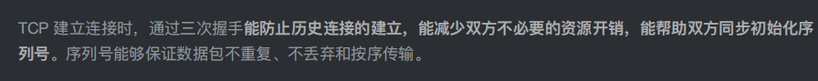

 

## **TCP** **连接断开**

### 四次挥手

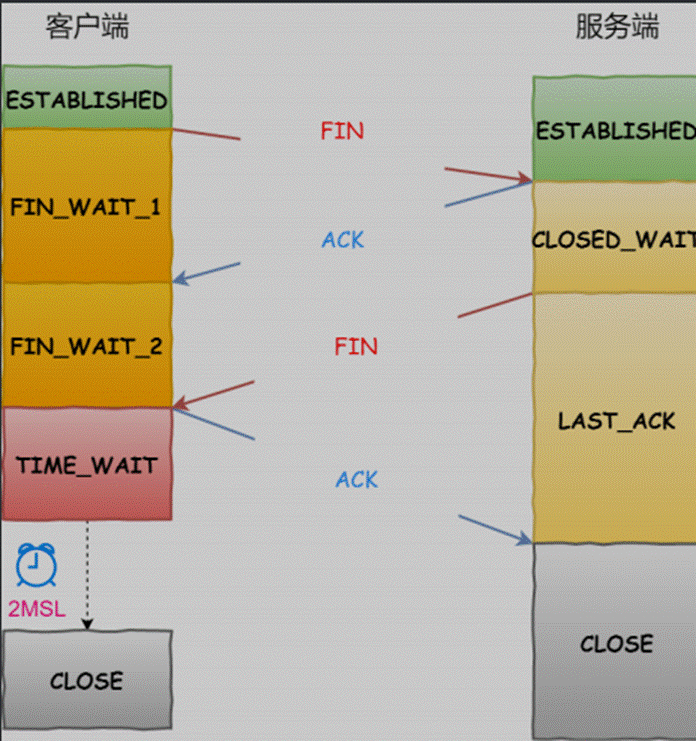

\- 客户端打算关闭连接，此时会发送⼀个 TCP ⾸部 FIN 标志位被置为 1 的报⽂，也即 FIN 报⽂，之后客户端进⼊ FIN_WAIT_1 状态。

\- 服务端收到该报⽂后，就向客户端发送 ACK 应答报⽂，接着服务端进⼊ CLOSED_WAIT 状态。

\- 客户端收到服务端的 ACK 应答报⽂后，之后进⼊ FIN_WAIT_2 状态。

\- 等待服务端处理完数据后，也向客户端发送 FIN 报⽂，之后服务端进⼊ LAST_ACK 状态。

\- 客户端收到服务端的 FIN 报⽂后，回⼀个 ACK 应答报⽂，之后进⼊ TIME_WAIT 状态

\- 服务器收到了 ACK 应答报⽂后，就进⼊了 CLOSED 状态，⾄此服务端已经完成连接的关闭。

\- 客户端在经过 2MSL ⼀段时间后，⾃动进⼊ CLOSED 状态，⾄此客户端也完成连接的关闭。

主动关闭连接的，才有 **TIME_WAIT** 状态。

### 为什么挥⼿需要四次？

\- 关闭连接时，客户端向服务端发送 FIN 时，仅仅表示客户端不再发送数据了但是还能接收数据。

\- 服务器收到客户端的 FIN 报⽂时，先回⼀个 ACK 应答报⽂，⽽服务端可能还有数据需要处理和发送，等服务端不再发送数据时，才发送 FIN 报⽂给客户端来表示同意现在关闭连接。

服务端通常需要等待完成数据的发送和处理，所以服务端的 ACK 和 FIN ⼀般都会分开发送，从⽽⽐三次握⼿导致多了⼀次。

### **为什么** **TIME_WAIT** **等待的时间是** **2MSL？**

MSL 是 Maximum Segment Lifetime，报⽂最⼤⽣存时间，它是任何报⽂在⽹络上存在的最⻓时间，超过这个时间报⽂将被丢弃。

TIME_WAIT 等待 2 倍的 MSL，⽐较合理的解释是： ⽹络中可能存在来⾃发送⽅的数据包，当这些发送⽅的数据包，被接收⽅处理后⼜会向对⽅发送响应，所以⼀来⼀回需要等待 **2** 倍的时间。

如果被动关闭⽅没有收到断开连接的最后的 ACK 报⽂，就会触发超时重发 Fin 报⽂，另⼀⽅接收到 FIN 后，会重发 ACK 给被动关闭⽅， ⼀来⼀去正好 2 个 MSL。

2MSL 的时间是从客户端接收到 **FIN** 后发送 **ACK** 开始计时的。如果在 TIME-WAIT 时间内，因为客户端的 ACK 没有传输到服务端，客户端⼜接收到了服务端重发的 FIN 报⽂，那么 **2MSL** 时间将重新计时。

### **为什么需要** **TIME_WAIT** **状态？**

\- 防⽌具有相同「四元组」的「旧」数据包被收到；

\- 保证「被动关闭连接」的⼀⽅能被正确的关闭，即保证最后的 ACK 能让被动关闭⽅接收，从⽽帮助其正常关闭；

 防止旧数据包引起错乱：

 假设 TIME_WAIT 没有等待时间或时间过短,服务端在关闭连接之前发送的 SEQ = 301 报⽂，被⽹络延迟了。这时有相同端⼝的 TCP 连接被复⽤后，被延迟的 SEQ = 301 抵达了客户端，那么客户端是有可能正常接收这个过期的报⽂，这就会产⽣数据错乱等严乱的问题。

 TCP 就设计出了这么⼀个机制，经过 2MSL 这个时间，⾜以让两个⽅向上的数据包都被丢弃，使得原来连接的数据包在⽹络中都⾃然消失，再出现的数据包⼀定都是新建⽴连接所产⽣的。

 保证连接正确关闭：

 TIME-WAIT 作⽤是等待⾜够的时间以确保最后的 **ACK** 能让被动关闭⽅接收，从⽽帮助其正常关闭。

 客户端四次挥⼿的最后⼀个 ACK 报⽂如果在⽹络中被丢失了，此时如果客户端 TIME\-

 WAIT过短或没有，则就直接进⼊了 CLOSED 状态了，那么服务端则会⼀直处在 LASE_ACK 状态。当客户端发起建⽴连接的 SYN 请求报⽂后，服务端会发送 RST 报⽂给客户端，连接建⽴的过程就会被终⽌。

## **TCP** **如何保证可靠性传输**

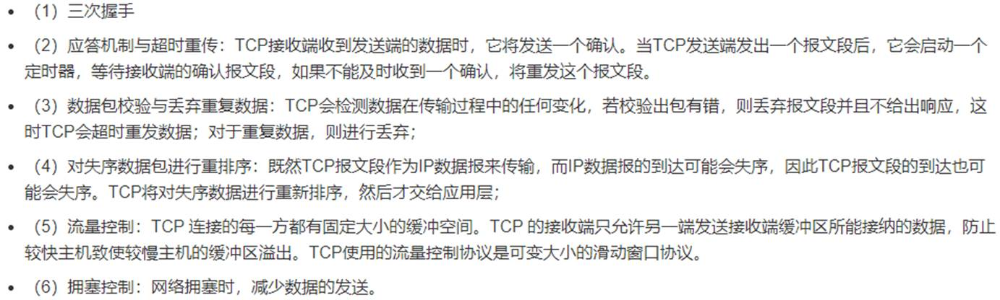

## 发送窗口的作用

可靠传输，流量控制

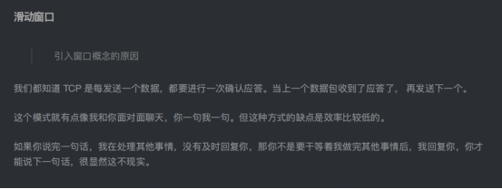

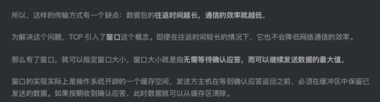

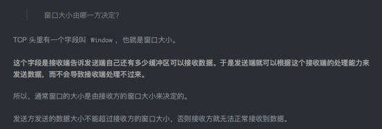

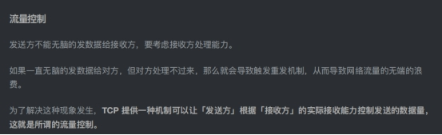

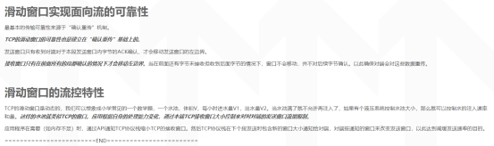

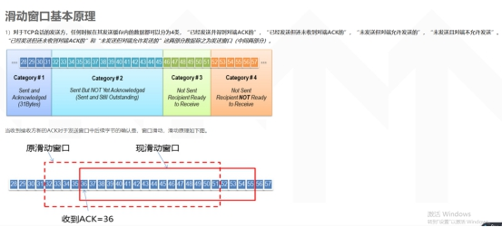

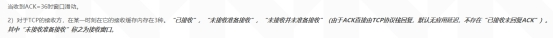

 

https://www.cnblogs.com/lisuyun/articles/5803583.html

## **TCP的流量控制**

所谓流量控制就是让发送方的发送速率不要太快，让接收方来得及接收。因为如果发送方把数据发送得过快，接收方可能会来不及接收，这就会造成数据的丢失。TCP的流量控制是通过大小可变的滑动窗口来实现的。接收端将自己可以接收的缓冲区大小放入TCP首部中的“窗口大小”字段，通过ACK报文来通知发送端，滑动窗口是接收端用来控制发送端发送数据的大小，从而达到流量控制。

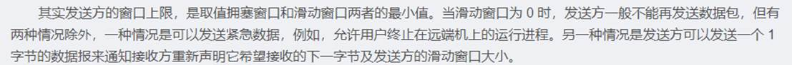

设A向B发送数据。在连接建立时，B告诉了A：“我的接收窗口是 rwnd = 400 ”(这里的 rwnd 表示 receiver window) 。因此，发送方的发送窗口不能超过接收方给出的接收窗口的数值。假设每一个报文段为100字节长，而数据报文段序号的初始值设为1。

从图中可以看出，B进行了三次流量控制。第一次把窗口减少到 rwnd = 300 ，第二次又减到了 rwnd = 100 ，最后减到 rwnd = 0 ，即不允许发送方再发送数据了。这种使发送方暂停发送的状态将持续到主机B重新发出一个新的窗口值为止。B向A发送的三个报文段都设置了 ACK = 1 ，只有在 ACK=1 时确认号字段才有意义。

## **TCP的拥塞控制**

**TCP的拥塞控制：**

拥塞控制就是防止过多的数据注入网络中，使网络中的路由器或链路不致过载。发送方维持一个拥塞窗口cwnd 的状态变量。拥塞窗口的大小动态变化，取决于网络的拥塞程度，发送方让自己的发送窗口等于拥塞窗口。只要网络没有出现拥塞，拥塞窗口就再增大一些，以便把更多的分组发送出去。但只要网络出现拥塞，拥塞窗口就减小一些，以减少注入到网络中的分组数。 拥塞控制的方法主要有以下几种：慢启动、拥塞避免、快重传和快恢复。

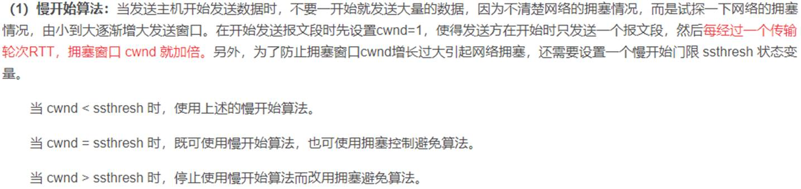

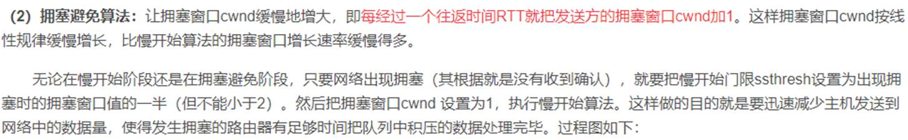

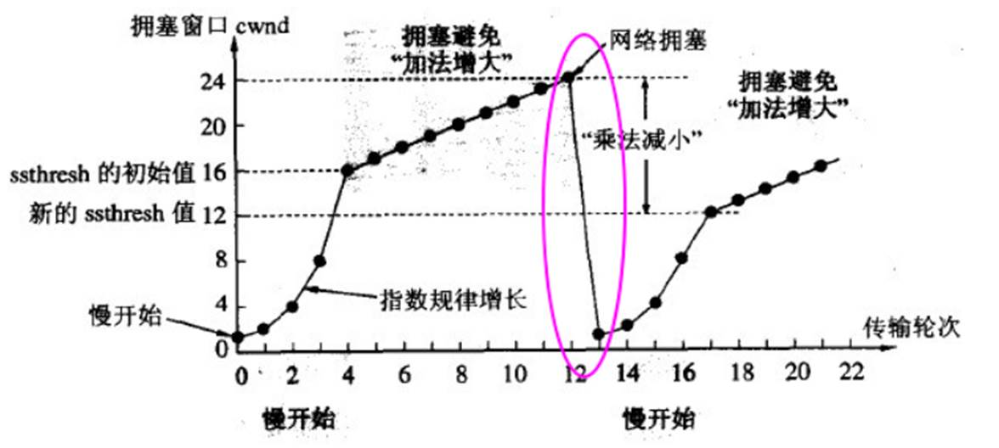

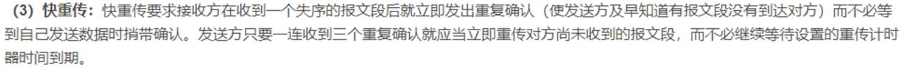

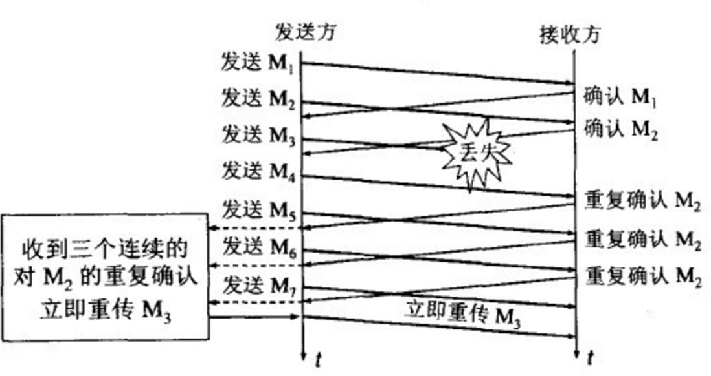

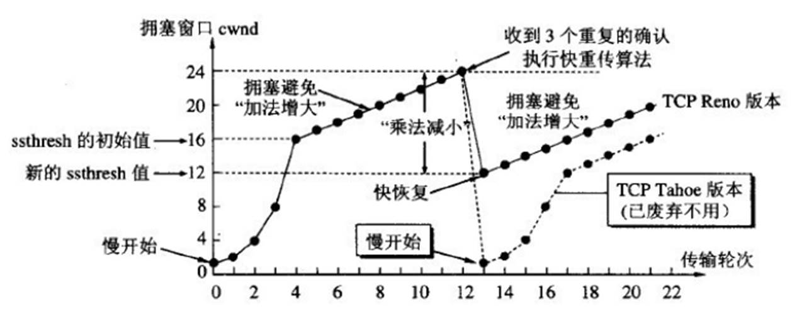

**4、拥塞控制和流量控制的差别：**

## **拥塞控制和流量控制的差别**

**拥塞控制和流量控制的差别：**

## 半连接和全连接队列

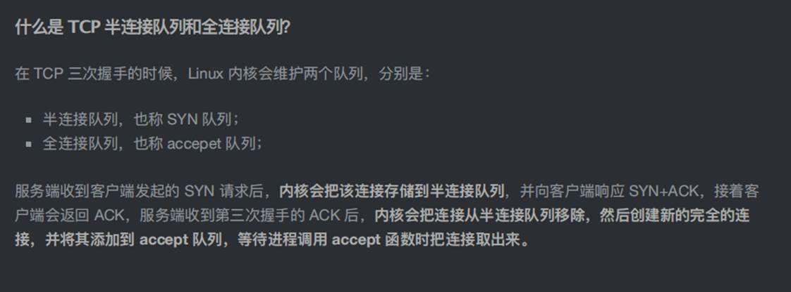

半连接队列 max_qlen_log 的最⼤值为 256：

## SYN洪泛

SYN 洪泛是指利用 TCP 需要三次握手的特性，攻击者伪造 SYN 报文向服务器发起连接，服务器在收到报文后用 ACK 应答，但之后攻击者不再对该响应进行应答，造成一个半连接。假设攻击者发送大量这样的报文，那么被攻击主机就会造成大量的半连接，耗尽其资源，导致正常的 SYN 请求因为队列满而被丢弃，使得正常用户无法访问。

如何防御 SYN 攻击？ 

这⾥给出⼏种防御 SYN 攻击的⽅法：增⼤半连接队列；

开启 tcp_syncookies 功能 

减少 SYN+ACK 重传次数

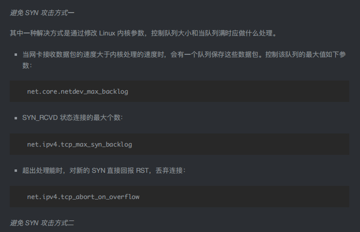

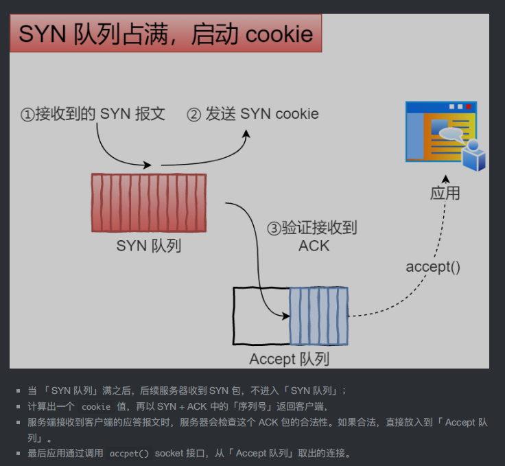

## TCP的粘包和拆包

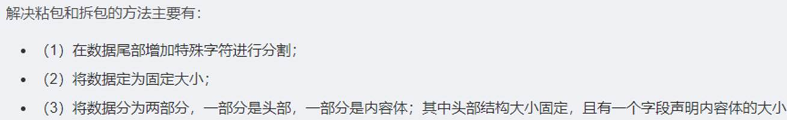

# cookie和session的区别

1. session 在服务器端，cookie 在客户端（浏览器）
2. cookie不是很安全
3. 单个cookie保存的数据不能超过4K，很多浏览器都限制一个站点最多保存20个cookie。(Session对象没有对存储的数据量的限制，其中可以保存更为复杂的数据类型)
4. session 可以放在 文件、数据库、或内存中都可以。
5. session 的运行依赖 session id，而     session id 是存在 cookie 中的，也就是说，如果浏览器禁用了 cookie ，同时 session 也会失效（但是可以通过其它方式实现，比如在 url 中传递 session_id） 
6. 用户验证这种场合一般会用 session

https://note.youdao.com/web/#/file/WEBdf61c6d9c265f941ef73b769d6b154e1/note/WEB0b3584b248ac60abe3a432744701e3f1/

# DNS域名解析过程

缓存 本地的hosts文件 本地DNS解析器缓存 本地DNS服务器 根据设置的转发器

**DNS解析过程：**

场景：用户在浏览器输入网址：clondant.blog.51cto.com，其解析过程如下：

**第1步：**浏览器将会检查缓存中有没有这个域名对应的解析过的IP地址，如果有该解析过程将会结束。

**第2步：**如果用户的浏览器中缓存中没有，操作系统会先检查自己本地的hosts文件是否有这个网址映射关系，如果有，就先调用这个IP地址映射关系，完成域名解析。

**第3步：**如果hosts里没有这个域名的映射，则查找本地DNS解析器缓存，是否有这个网址映射关系或缓存信息，如果有，直接返回给浏览器，完成域名解析。

**第4步：**如果hosts与本地DNS解析器缓存都没有相应的网址映射关系，则会首先找本地DNS服务器，一般是公司内部的DNS服务器，此服务器收到查询，如果此本地DNS服务器查询到相对应的IP地址映射或者缓存信息，则返回解析结果给客户机，完成域名解析，此解析具有权威性。

**第5步：**如果本地DNS服务器无法查询到，则根据本地DNS服务器设置的转发器进行查询；

**未用转发模式：**本地DNS就把请求发至根DNS进行**（迭代）查询**，根DNS服务器收到请求后会判断这个域名(.com)是谁来授权管理，并会返回一个负责该顶级域名服务器的一个IP。本地DNS服务器收 到IP信息后，将会联系负责.com域的这台服务器。这台负责.com域的服务器收到请求后，如果自己无法解析，它就会找一个管理.com域的下一级 DNS服务器地址给本地DNS服务器。当本地DNS服务器收到这个地址后，就会找域名域服务器，重复上面的动作，进行查询，直至找到域名对应的主机。

**使用转发模式：**此DNS服务器就会把请求转发至上一级DNS服务器，由上一级服务器进行解析，上一级服务器如果不能解析，或找根DNS或把转请求转至 上上级，以此循环。不管是本地DNS服务器用是是转发，还是根提示，最后都是把结果返回给本地DNS服务器，由此DNS服务器再返回给客户机。

搭建基本的DNS服务

https://www.huaweicloud.com/articles/a05aa2b2e729535533c20925cabb07b4.html

# **ARQ协议**

**ARQ协议:**

# 一些专业词汇

 MSS

最大报文段长度是TCP协议的一个选项，用于在TCP连接建立时，收发双方协商通信时每一个报文段所能承载的最大数据长度

MTU

*mtu*一般指最大传输单元。最大传输单元（Maximum Transmission Unit，*MTU*）用来通知对方所能接受数据服务单元的最大尺寸，说明发送方能够接受的有效载荷大小

MSL 

是 Maximum Segment Lifetime，报⽂最⼤⽣存时间，

SYN：同步序列编号（Synchronize Sequence Numbers）。是TCP/IP建立连接时使用的握手信号。

ACK (Acknowledge character）即是确认字符，在数据通信中，接收站发给发送站的一种传输类[控制字符](https://baike.baidu.com/item/控制字符/6913704)。表示发来的数据已确认接收无误

FIFO先进先出队列

线程挂起的方法,就是park,对应唤醒就是unpark。

OSPF(Open Shortest Path First开放式最短路径优先）是一个内部网关协议(Interior Gateway Protocol）

SSL 的英文全称是 “Secure Sockets Layer” ，中文名为 “ 安全套接层协议层 

安全传输层协议（TLS）用于在两个通信应用程序之间提供保密性和数据完整性。

# 非对称加密的应用

1用于身份认证

一条加密信息若能用A 的公钥能解开，则该信息一定是用A 的私钥加密的，该能确定该用户是A。

 

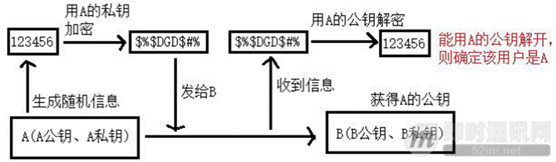

2用于陌生人通信

A 和B 两个人互不认识，A 把自己的公钥发给B，B 也把自己的公钥发给A，则双方可以通过对方的公钥加密信息通信。C 虽然也能得到A、B 的公钥，但是他解不开密文。

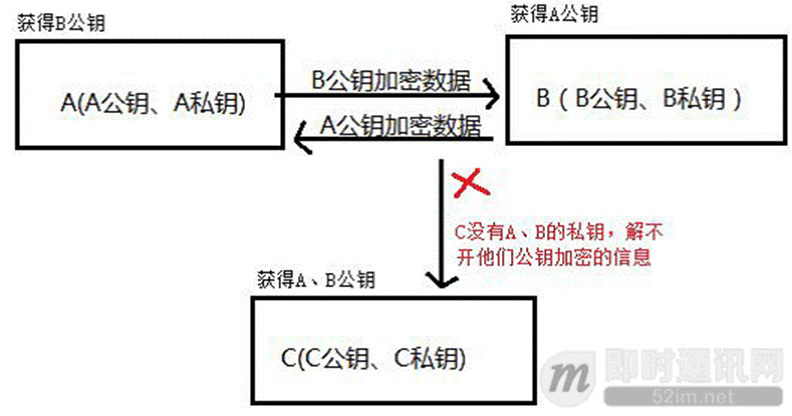

3用于敏感的秘钥交换场景下

A 先得到B 的公钥，然后A 生成一个随机秘钥，例如13245768，之后A 用B 的公钥加密该秘钥，得到加密后的秘钥，例如dxs#fd@dk，之后将该密文发给B，B 用自己的私钥解密得到123456，之后双方使用13245768 作为对称加密的秘钥通信。C 就算截获加密后的秘钥dxs#fd@dk，自己也解不开，这样A、B 二人能通过对称加密进行通信。

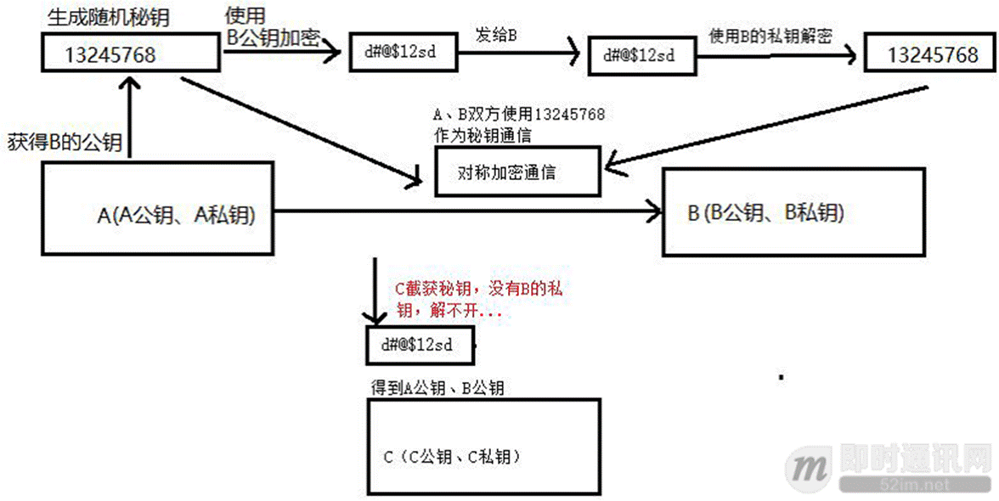

**本文小结**

非对称加密一般不会单独拿来使用，他并不是为了取代对称加密而出现的，非对称加密速度比对称加密慢很多，极端情况下会慢1000 倍，所以一般不会用来加密大量数据，通常我们经常会将对称加密和非对称加密两种技术联合起来使用，例如用非对称加密来给称加密里的秘钥进行加密（即秘钥交换）。

# 跨域

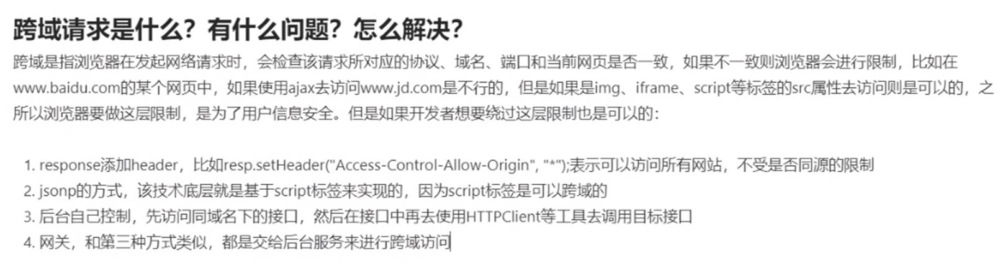

 