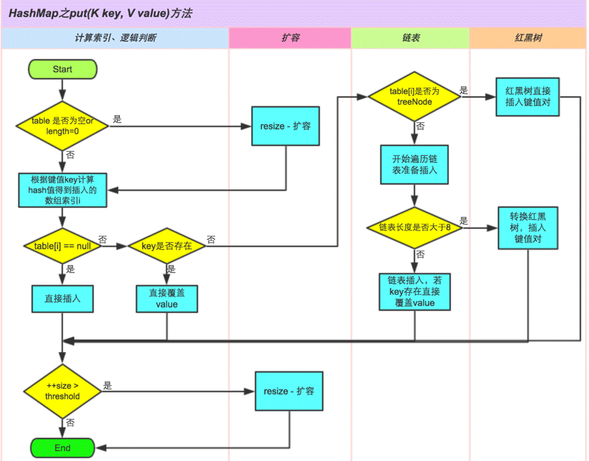

# 数据结构

## 常用的数据结构

详细见 链接  https://blog.csdn.net/QLeelq/article/details/113694455

## HashMap

### JDK7HashMap

在JDK7中其底层是由**数组+链表**构成，数组被分成一个个桶(bucket)，通过哈希值决定了键值对在这个数组中的位置。哈希值相同的键值对，会以链表形式进行存储。每一个键值对会以一个Entry实例进行封装，内部存在四个属性：key，value，hash值，和用于单向链表的next。

当对HashMap初始化时，其构造函数中需要传入两个参数：**initialCapacity**、**loadFactor**

hashMap中还有一个变量：**threshold**（扩容阈值。计算公式：**capacity \* load factor**）

添加数据过程（put）

1. 在第一个元素插入HashMap时做一次数组的初始化，先确定初始的数组大小，并计算数组扩容的阈值。（创建hashmap的时候数组并没有被初始化，put的时候才初始化的）
2. 使用key进行Hash值计算，**然后通过** **(n - 1) & hash** **判断当前元素存放的位置（这里的** **n** **指的是数组的长度）**，用于确定当前键值对要放入哪个Bucket中。（为什么采取与运算：1.采用模运算会造成大量的哈希冲突，导致哈希散列不均匀，某一桶中链表长度过长，造成查询效率大幅下降。2.与运算本身性能要比模运算高）
3. 找到Bucket后，**如果当前位置存在元素的话，就判断该元素与要存入的元素的** **hash** **值以及** **key** **是否相同**；如果没有重复，则将此Entry放入链表的**头部**。如果键相同值不相同的话，直接更新。（进行比较key值是否相同，若是不同则向后遍历，直到找到相同的为止。找到后进行元素的替换，若是找不到就新生成一个Entry，entry对象的next指向上面获取的位置i，头插）
4. 在插入新值时，如果当前Buckets数组大小达到了阈值，则触发扩容。扩容后，为原大小的两倍。**扩容时会产生一个新的数组替换原来的数组，并将原来数组中的值迁移到新数组中**。

 JDK7的HashMap扩容流程

1）当调用HashMap的put方法时，其内部会调用addEntry方法添加元素。

2）在addEntry中，如果条件满足则调用resize方法进行扩容。扩展为原大小的两倍。

3）在resize方法中，会调用transfer方法根据新的容量去创建新的Entry数组，命名

为newTable。

4）在transfer方法中会轮询原table中的每一个Entry重新计算其在新Table上的位置，并以链表形式连接

5）当全部轮询完毕，则在resize方法中将原table替换为新table。

 JDK7hashMap死循环解析

当进行rehash时，会造成hashMap出现死循环，原因就在于其内部会形成一个循环链表。 该问题在JDK8之后得以解决，但是仍然不推荐在多线程环境下直接使用HashMap，因为有可能会造成数据丢失，建议使用ConcurrentHashMap。

###  JDK8HashMap

Hashmap结构

由**数组+链表+红黑树**组成。这么做的原因是因为：之前查找元素需要遍历链表，时间复杂度取决于链表的长度。

为了优化这部分的开销，在JDK中，如果链表中元素大于等于8个，则将链表转换为红黑树（前提是桶的大小达到64，否则会先对桶进行扩容）；当红黑树中元素小于等于6个，则将红黑树转为链表。从而降低查询与添加的时间复杂度。

put流程

即使不会出现死循环，但是通过源码看到put/get方法都没有加同步锁，多线程情况最容易出现的就是：无法保证上一秒put的值，下一秒get的时候还是原值，所以线程安全还是无法保证。

1、put的时候导致的多线程数据不一致。

这个问题比较好想象，比如有两个线程A和B，首先A希望插入一个key-value对到HashMap中，首先计算记录所要落到的桶的索引坐标，然后获取到该桶里面的链表头结点，此时线程A的时间片用完了，而此时线程B被调度得以执行，和线程A一样执行，只不过线程B成功将记录插到了桶里面，假设线程A插入的记录计算出来的桶索引和线程B要插入的记录计算出来的桶索引是一样的，那么当线程B成功插入之后，线程A再次被调度运行时，它依然持有过期的链表头但是它对此一无所知，以至于它认为它应该这样做，如此一来就覆盖了线程B插入的记录，这样线程B插入的记录就凭空消失了，造成了数据不一致的行为。

### 扩展知识点

[jdk 7 与 jdk 8 中关于HashMap的对比 ](onenote:#扩展知识点&section-id={D17A0EA0-97AB-4A0A-AACE-F95D62D7DAFC}&page-id={BC978001-A2DC-40EE-89CB-914759A07A3C}&object-id={F678C236-2E0C-4EE5-8AC0-12C26A1DF70D}&E&base-path=https://d.docs.live.net/73ef43393996c94e/文档/java/集合数据结构.one)

[HashMap 的buckets长度为什么永远是 2 的幂次方](onenote:#扩展知识点&section-id={D17A0EA0-97AB-4A0A-AACE-F95D62D7DAFC}&page-id={BC978001-A2DC-40EE-89CB-914759A07A3C}&object-id={55423992-526C-4784-8BBA-FD5DB4809446}&24&base-path=https://d.docs.live.net/73ef43393996c94e/文档/java/集合数据结构.one)

[HashMap负载因子为什么是0.75](onenote:#扩展知识点&section-id={D17A0EA0-97AB-4A0A-AACE-F95D62D7DAFC}&page-id={BC978001-A2DC-40EE-89CB-914759A07A3C}&object-id={55423992-526C-4784-8BBA-FD5DB4809446}&37&base-path=https://d.docs.live.net/73ef43393996c94e/文档/java/集合数据结构.one)

[为什么JDK8采用红黑树，而不采用平衡二叉树](onenote:#扩展知识点&section-id={D17A0EA0-97AB-4A0A-AACE-F95D62D7DAFC}&page-id={BC978001-A2DC-40EE-89CB-914759A07A3C}&object-id={55423992-526C-4784-8BBA-FD5DB4809446}&4F&base-path=https://d.docs.live.net/73ef43393996c94e/文档/java/集合数据结构.one)

[为什么链表转红黑树的阈值是8](onenote:#扩展知识点&section-id={D17A0EA0-97AB-4A0A-AACE-F95D62D7DAFC}&page-id={BC978001-A2DC-40EE-89CB-914759A07A3C}&object-id={55423992-526C-4784-8BBA-FD5DB4809446}&58&base-path=https://d.docs.live.net/73ef43393996c94e/文档/java/集合数据结构.one)

[为什么要用链地址法解决冲突_1](onenote:#扩展知识点&section-id={D17A0EA0-97AB-4A0A-AACE-F95D62D7DAFC}&page-id={BC978001-A2DC-40EE-89CB-914759A07A3C}&object-id={A6C72C1B-17D8-4C69-AFF1-58FCC6E79936}&12&base-path=https://d.docs.live.net/73ef43393996c94e/文档/java/集合数据结构.one)

jdk 7 与 jdk 8 中关于HashMap的对比

- 8时红黑树+链表+数组的形式，当桶内元素大于8时，便会树化
- 1.7 table在创建hashmap时分配空间，而1.8在put的时候分配，如果table为空，则为table分配空间。
- 在发生冲突，插入链中时，7是头插法，8是尾插法。

HashMap 的buckets长度为什么永远是 2 的幂次方

​    为了能让存储更加高效，尽量的避免key冲突，让数据尽量均匀的进行分布，因此采用了hash值计算的方式，hash值的范围为-2147483648 到 2147483647。在这40亿的空间中，总的来说一般很难出现碰撞。但是这么大的空间，不可能一次性全部装入内存中，所以不能直接使用这块空间。因此才会对数组长度进行取模运算，根据余数用来对应数组的下标，来确定当前用于存放数据的位置。计算公式就是`(n-1)&hash`。所以buckets的长度才永远为2的幂次方。（其实就是按位“与”的时候，每一位都能 &1 ，也就是和1111……1111111进行与运算）

​    取模运算不用`hash%length`，而使用`(length-1)&hash`，是因为`&`采用二进制进行操作，比 `%` 的运算效率高。

 “当容量一定是2^n时，h & (length - 1) == h % length” . 按位运算特别快 

对于length = 16, 对应二进制”1 0000”, length-1=”0 1111” 

假设此时h = 17 . 

(1) 使用”h % length”, 也就是”17 % 16”, 结果是1 . 

(2) 使用”h & (length - 1)”, 也就是 “1 0001 & 0 1111”, 结果也是1 . 

我们会发现, 因为”0 1111”低位都是”1”, 进行”&”操作, 就能成功保留”1 0001”对应的低位, 将高位的都丢弃, 低位是多少, 最后结果就是多少 . 

刚好低位的范围是”0~15”, 刚好是长度为length=16的所有索引 . 

 HashMap负载因子为什么是0.75

负载因子是和扩容机制有关的。扩容公式为：数组容量*负载因子=扩容阈值。 当buckets数组达到阈值时，则会进行扩容操作。那么为什么在hashMap中不管是JDK7还是JDK8对于扩容因子都定义为0.75呢？

​    HashMap总的来说就是一个数据结构，那数据结构就是为了节省空间和时间。那负载因子的作用就是为了节省空间和时间的。

​    **假设负载因子的值为1.0**。那么结合扩容公式可知，当buckets桶数组全部用完之后才会进行扩容。因为在扩容时，hash冲突是无法避免的。因此当负载因子为1.0时，在进行扩容时，会出现更多的hash冲突，可能导致链表长度或红黑树高度会变得更长或更高，导致查询效率的降低。因此负载因子过大，虽然保证了空间，但牺牲了时间。

​    **假设负载的值为0.5**。那么结合扩容公式可知，当buckets数组使用一半时，就会触发扩容。因为数组中的元素少，所以出现hash冲突的几率也会变少，所以链表长度或者是红黑树的高度就会降低，从而提升了查询效率。但是这样的话，空间利用率又降低了。原本只要1M就能存储的数据，现在则需要2M。所以负载因子太小，虽然时间效率提升了，但是空间利用率降低了。

 为什么JDK8采用红黑树，而不采用平衡二叉树

因为平衡二叉树条件太苛刻了，需要一直进行整棵树的平衡进行左旋或右旋的操作，红黑树相对来讲调整的少点，只要达到黑平衡即可。并且红黑树对于节点的增删和查找效率都是较为中肯的。

为什么链表转红黑树的阈值是8

因为红黑树的平均查找长度是log(n)，长度为8的时候，平均查找长度为3，如果继续使用链表，平均查找长度为8/2=4，这才有转换为树的必要。链表长度如果是小于等于6，6/2=3，虽然速度也很快的，但是转化为树结构和生成树的时间并不会太短。因此8是一个较为合理的值。

为什么要用链地址法解决冲突

开放地址法:当冲突发生的时候，通过查找数组的一个空位，将数据插入进去，而不再用hash函数计算获取数的下标，这个方法就叫做开发地址法；

缺点：数据的长度是有限的，但我们可能会往数组里面添加很多数据进去，数组总有被填满的时候，那样开发地址法也不管用了

链地址法：第一次定位数组中的位置，第二次去到链表中，调用链表的查找方法进行查找

## ConcurrentHashMap

ConcurrentHashMap是一个线程安全且高效的HashMap。在并发下，推荐使用其替换HashMap。对于它的使用也非常的简单，除了提供了线程安全的get和put之外，它还提供了一个非常有用的方法**putIfAbsent**，如果传入的键值对已经存在，则返回存在的value，不进行替换； 如果不存在，则添加键值对，返回null。

### JDK7的ConcurrentHashMap

基础结构

一个ConcurrentHashMap里包含一个Segment数组，结构与HashMap类似（数组+链表）。一个Segment中包含一个HashEntry数组，每个HashEntry就是链表的元素。

​    Segment是ConcurrentHashMap实现的很核心的存在，Segment翻译过来就是一段，一般把它称之为**分段锁**。它继承了ReentrantLock，在ConcurrentHashMap中相当于锁的角色，在多线程下，不同的线程操作不同的segment。只要锁住一个 segment，其他剩余的Segment依然可以操作。这样只要保证每个 Segment 是线程安全的，我们就实现了全局的线程安全。

构造方法和初始化

​    根据其构造函数可知，map的容量默认为16，负载因子为0.75。这两个都与原HashMap相同，但不同的在于，其多个参数**concurrencyLevel(****并发级别****)**，通过该参数可以用来确定Segment数组的长度并且不允许扩容，默认为16。

​    并发度设置过小会带来严重的锁竞争问题；如果过大，原本位于一个segment内的访问会扩散到不同的segment中，导致查询命中率降低，引起性能下降。

get()

1）根据key计算出对应的segment

2）获取segment下的HashEntry数组

3）遍历获取每一个HashEntry进行比对。

注意：整个get过程没有加锁，而是通过volatile保证可以拿到最新值。

put()

初始化segment，因为ConcurrentHashMap初始化时只会初始化segment[0]，对于其他的segment，在插入第一个值的时候再进行初始化。经过计算后，将对应的segment完成初始

化。

向下调用ensureSegment方法，其内部可以通过cas保证线程安全（初始化的时候保证初始化线程安全），让多线程下只有一个线程可以成功。

在put方法中当初始化完Segment后，会调用一个put的重载方法进行键值对存放。首先会调用tryLock()尝试获取锁，node为null进入到后续流程进行键值对存放；如果没有获取到锁，则调用scanAndLockForPut()自旋等待获得锁。

在scanAndLockForPut()方法中首先会根据链表进行遍历，如果遍历完毕仍然找不到与key相同的HashEntry，则提前创建一个HashEntry。当tryLock一定次数后仍然无法获得锁，则主动通过lock申请锁。

在获得锁后，segment对链表进行遍历，如果某个 HashEntry 节点具有相同的 key，则更新该 HashEntry 的 value 值，否则新建一个节点将其插入链表头部。

如果节点总数超过阈值，则调用rehash()进行扩容。

###  JDK8的ConcurrentHashMap

与JDK7的区别

​    在JDK1.8中对于ConcurrentHashMap也进行了升级，主要优化点如下：

1）JDK7中使用CAS+Reentrant（CAS用于初始化segment时，Reentrant用于锁定segment）保证并发更新的安全，而在JDK8是通过CAS+synchronized保证。因为synchronized拥有了优化，在低粒度加锁下，synchronized并不比Reentrant差；在大量数据操作下，对于JVM的内存压力，基于API的ReentrantLock会开销更多的内存。

2）JDK7的底层使用segment+数组+链表组成。而在JDK8中抛弃了segment，转而使用数组+链表+红黑树的形式实现，从而让锁的粒度能够更细，进一步减少并发冲突的概率；同时也提高的数据查询效率。

3）在JDK7中的HashEntry在JDK8中变为Node，当转化为红黑树后，变为TreeNode。转换的规则与hashMap相同，当链表长度大于等于8则转换为红黑树，当红黑树的深度小于等于6则转换为链表。

核心属性

Node类：用于存储键值对。其与JDK7中的HashEntry属性基本相同。

TreeNode类：树节点类，当链表长度大于等于8，则转换为TreeNode。与hashMap不同的地方在于，它并不是直接转换为红黑树，而是把这些节点放在TreeBin对象中，由TreeBin完成红黑树的包装。

TreeBin类：负责TreeNode节点包装，它代替了TreeNode的根节点，也就是说在实际的数组中存放的是TreeBin对象，而不是TreeNode对象。

sizeCtl属性：用于控制table的初始化和扩容。-1表示正在初始化，-N表示由N-1个线程正在进行扩容，0为默认值表示table还没被初始化，正数表示初始化大小或Map中的元素达到这个数量时，则需要扩容了。

get()

put()

如果table为空，初始化table

如果table不为空，但是没有元素，通过CAS向Node数组中存值

若扩容操作，当前线程协助扩容

如果table不为空，且有元素，基于synchronized锁住数组中的元素

与hashTable的区别

​    Hashtable的任何操作都会把整个表锁住，是阻塞的。好处是总能获取最实时的更新，比如说线程A调用putAll写入大量数据，期间线程B调用get，线程B就会被阻塞，直到线程A完成putAll，因此线程B肯定能获取到线程A写入的完整数据。坏处是所有调用都要排队，竞争越激烈效率越低。 更注重安全。

​    ConcurrentHashMap 是设计为非阻塞的。在更新时会局部锁住某部分数据，但不会把整个表都锁住。同步读取操作则是完全非阻塞的。好处是在保证合理的同步前提下，效率很高。坏处 是严格来说读取操作不能保证反映最近的更新。例如线程A调用putAll写入大量数据，期间线程B调用get，则只能get到目前为止已经顺利插入的部分数据。更注重性能。

## ArrayList

ArrayList概述

1）ArrayList是可以动态增长和缩减的索引序列，它**是基于数组实现**的List类。

2）该类封装了一个动态再分配的Object[]数组，每一个类对象都有一个capacity属性，表示

它们所封装的Object[]数组的长度，当向ArrayList中添加元素时，该属性值会自动增加。

3）ArrayList的用法和Vector向类似，但是Vector是一个较老的集合，具有很多缺点，不建

议使用。

另外，ArrayList和Vector的区别是：ArrayList是线程不安全的，当多条线程访问同一个ArrayList集合时，程序需要手动保证该集合的同步性，而Vector则是线程安全的。

4）ArrayList和Collection的关系：

 

数据结构

底层的数据结构就是数组，数组元素类型为Object类型，即可以存放所有类型数据。我们对ArrayList类的实例的所有的操作底层都是基于数组的。

常用方法：

get方法

由于底层是数组实现的，先检查下索引是否越界，然后直接返回对应索引位置的元素即可。

set方法

校验索引是否越界

根据index获取指定位置的元素

用传入的element替换index位置的元素

返回index位置原来的元素

add(E e)：

调用ensureCapacityInternal方法（下文有详解），如果数组还没初始化，则进行初始化；如果已经初始化了，则将modCount+1（统计计算了多少次），并校验添加元素后是否需要扩容。

在elementData数组尾部添加元素即可（size位置）。

add(int index, E element)：

检查索引是否越界，再调用ensureCapacityInternal方法，将modCount+1，并校验添加元素后是否需要扩容。

将index位置及之后的所有元素向右移动一个位置（为要添加的元素腾出1个位置）。

将index位置设置为element元素，并将size+1。

remove(int index)：

检查索引是否越界，将modCount+1，拿到索引位置index的原元素。

计算需要移动的元素个数。

如果需要移动，将index+1位置及之后的所有元素，向左移动一个位置。

将size-1位置的元素赋值为空（因为上面将元素左移了，所以size-1位置的元素为重复的，将其移除）。

remove(Object o)：

如果入参元素为空，则遍历数组查找是否存在元素为空，如果存在则调用fastRemove将该元素移除，并返回true表示移除成功。

如果入参元素不为空，则遍历数组查找是否存在元素与入参元素使用equals比较返回true，如果存在则调用fastRemove将该元素移除，并返回true表示移除成功。

否则，不存在目标元素，则返回false。

fastRemove(int index)：跟remove(int index)类似

将modCount+1，并计算需要移动的元素个数。

如果需要移动，将index+1位置及之后的所有元素，向左移动一个位置。

将size-1位置的元素赋值为空（因为上面将元素左移了，所以size-1位置的元素为重复的，将其移除）

clear方法

遍历数组将所有元素清空即可。

ArrayList动态扩容的全过程。

如果通过无参构造的话，初始数组容量为0，当真正对数组进行添加时，才真正分配容量。每次按照1.5倍（位运算）的比率通过copeOf的方式扩容。 在JKD1.6中实现是，如果通过无参构造的话，初始数组容量为10，每次通过copeOf的方式扩容后容量为原来的1.5倍

例如：数组长度为10，有20个数据要添加，在第10个添加完之后，添加第11个数

时，数组扩容为15（101.5），当添加第16个数时，数组扩容为22（151.5）

（原数组长度为0，则扩容后为10，minCapacity为10）

有参构造直接就是容量，传进5，创建容量为5的数组

（原数组长度为1，则扩容后为2，minCapacity为2）

（原数组长度为4，则扩容后为6，minCapacity为5）

补充：

Arrays.copyOf()方法返回的数组是新的数组对象，原数组对象仍是原数组对象，不变，该拷贝不会影响原来的数组。copyOf()的第二个自变量指定要建立的新数组长度，如果新数组的长度超过原数组的长度，则保留数组默认值.

## LinkedList

链表和数组对比

|              | **数组**                             | **链表**                     |
| ------------ | ------------------------------------ | ---------------------------- |
| 内存地址     | 连续的内存空间                       | 非连续的内存空间             |
| 数据长度     | 长度固定，一般不可动态扩容           | 长度可动态变化               |
| 增删效率     | 低，需要移动被修改元素之后的所有元素 | 高，只需要修改指针指向       |
| 查询效率     | 高，可用过数组名和下标直接访问       | 低，只能通过遍历节点依次查询 |
| 数据访问方式 | 随机访问                             | 顺序访问                     |

数据结构

LinkedList底层使用的双向链表结构，有一个头结点和一个尾结点，双向链表意味着我们可以从头开始正向遍历，或者是从尾开始逆向遍历，并且可以针对头部和尾部进行相应的操作。

特性

　1）异步，也就是非线程安全

　2）双向链表。由于实现了list和Deque接口，能够当作队列来使用。

　　链表：查询效率不高，但是插入和删除这种操作性能好。

　3）是顺序存取结构

类的属性

LinkedList：一个头结点、一个尾结点、一个表示链表中实际元素个数的变量。

构造方法

1）空参构造函数

2）有参构造函数

内部类（Node）

说明：内部类Node就是实际的结点，用于存放实际元素的地方。　

 核心方法

1 add函数用于向LinkedList中添加一个元素，并且添加到链表尾部。具体添加到尾部的逻辑是由linkLast函数完成的。

LinkLast()：判断是不是一开始链表中就什么都没有，如果没有，则newNode就成为了第一个节点，first和last都要指向它。正常的在最后一个节点后追加，那么原先的最后一个节点的next就要指向现在真正的最后一个节点，原先的最后一个节点就变成了倒数第二个节点。

2 remove(Object o)：我们可以知道，如果我们要移除的值在链表中存在多个一样的值，那么我们会移除index最小的那个，也就是最先找到的那个值，如果不存在这个值，那么什么也不做

3 get(index)：这里查询使用的是先从中间分一半查找：判断index在前半部分还是后半部分，若在前半部分，则遍历前半部分即可

4 indexOf(Object o)：遍历查找

总结

1）linkedList本质上是一个双向链表，通过一个Node内部类实现的这种链表结构。

2）能存储null值 

3）跟arrayList相比较，就真正的知道了，LinkedList在删除和增加等操作上性能好，而ArrayList在查询的性能上好

 4）从源码中看，它不存在容量不足的情况

 5）linkedList不光能够向前迭代，还能像后迭代，并且在迭代的过程中，可以修改值、添加值、还能移除值。 

6）linkedList不光能当链表，还能当队列使用，这个就是因为实现了Deque接口。

## Stack

Stack是栈。它的特性是：先进后出(FILO, First In Last Out)。java工具包中的Stack是继承于Vector(矢量队列)的，由于Vector是通过数组实现的，这就意味着，Stack也是通过数组实现的，而非链表。当然，我们也可以将LinkedList当作栈来使用。

Push()

pop()

peek()

empty()

search(Object o)：查找“元素o”在栈中的位置：由栈底向栈顶方向数

## 队列_优先队列

队列是一种先进先出的数据结构。

优先队列（Priority Queue）

优先队列与普通队列的区别：普通队列遵循先进先出的原则；优先队列的出队顺序与入队顺序无关，与优先级相关。

优先队列可以使用队列的接口，只是在实现接口时，与普通队列有两处区别，一处在于优先队列出队的元素应该是优先级最高的元素，另一处在于队首元素也是优先级最高的元素。

## 树

二叉树、二叉搜索树、平衡二叉树、红黑树、B树、B+树

平衡二叉树：左右子树的高度相差不超过1的树。

平衡因子：某节点的左子树与右子树的高度(深度)差即为该节点的平衡因子（BF,Balance Factor），平衡二叉树中不存在平衡因子大于1的节点。在一棵平衡二叉树中，节点的平衡

因子只能取-1、1或者0。

红黑树：

是树的数据结构中最为重要的一种。Java的容器TreeSet、TreeMap均使用红黑树实现。JDK1.8中HashMap中也加入了红黑树。每个节点都带有颜色属性，颜色为**红色**或**黑色**。除了二叉查找树一般要求以外，对于任何有效的红黑树还增加了如下的额外要求:

1）节点要么是黑色要么是红色。

2）根结点一定是黑色的。

3）每个叶子节点都带有两个空(NIL)的黑色节点。

4）每个红色节点的两个子节点一定是黑色，因此不会存在两个连续的红色节点，红色节

点的父节点一定是黑色节点。

5）从任一节点到它所能到达的叶子节点的所有路径都包含相同数目的黑色节点。从而达到黑色平衡。（平衡二叉树是一个完美平衡的树，红黑树是非完美平衡树，但是一个完美

的黑色平衡二叉查找树）。实现了【树的层数最大也只会有两倍的差距】

B树：

意义：数据量是远大于内存大小的，那我们在查找数据时并不能将全部数据同时加载至内存。既然不能全部加载至内存中就只能逐步的去加载磁盘中某个页，简而言之就是逐一的去加载磁盘，加数据分块的加载至内存进行查找与比较。

通过查找过程可以看出，磁盘IO次数与树的高度相关，在最坏情况下，磁盘IO次数等于树的高度。由于磁盘IO过程是相对耗时效率较低的，因此，在设计数据存储结构时需要降低树的高度，即将一棵“瘦高”的树变得“矮胖”。     当数据数目相同，在保持有序前提下，降低树高度，只需将节点中存储的key值增加，即二叉搜索树中每个节点只有一个数据元素，而在B树中每个节点可以有多个数据元素。

定义：

B树也成B-树。它是一颗多路平衡查找树（所有的叶子节点拥有相同的高度）。当描述一颗B树时需要指定它的**阶数**，阶数表示一个节点最多有多少个孩子节点，一般用字母

m表示。当m取2时，就是一颗二叉查找树。

要定义一颗m阶的B树，需要遵循以下五条原则：

1）根节点最少可以只有一个元素，且至少要有两个子节点。

2）每个节点最多有m-1个元素。

3）非根节点至少有(m/2)-1个元素。m/2要进行向上取整，如m/2=1.5=2。

4）每个结点中的元素都按照从小到大的顺序排列，每个元素的左子树中的所有元素都小

于它，而右子树中的所有元素都大于它。

5）所有叶子节点都位于同一层，相当于根节点到每个叶子节点的长度相同。

查找：B树的查找其实是对二叉搜索树查找的扩展， 与二叉搜索树不同的地方是，B-树中每个节点有不止一棵子树。在B-树中查找某个结点时，需要先判断要查找的结点在哪棵子树上，然后在结点中逐个查找目标结点。B树的查找过程相对简单，与二叉搜索树类似，

因此不再赘述。

插入：

​    B树的插入操作是指在树种插入一条新记录，即（key, value）的键值对。如果B树中已存在需要插入的键值对，则用需要插入的value替换旧的value。若B树不存在这个

key，则一定是在叶子结点中进行插入操作。

插入流程如下：

1）根据要插入的key的值，对B树执行查找操作，查找到待插入数据的当前节点位置。

2）判断**当前节点key的个数是否小于等于m-1**，若满足，则直接插入数据。

3）若不满足，以**节点中间的key**为中心分裂成**左右两部分**，然后将这个**中间的key插入到父节点中**，这个key的左子树指向分裂后的左半部分，这个key的右子树指向分

裂后的右半部分，然后将当前节点指向父节点，继续执行第三步。

删除

1）如果当前需要删除的key位于非叶子结点，则用距离最近的后继key覆盖要删除的key。然后在后继key所在的子支中删除该后继key。此时后继key一定位于叶子节点上，这个过程和二叉搜索树删除节点的方式类似。

2）删除这个记录后，若**该节点key个数大于等于(m/2)-1**，结束删除操作。

3）如果不是，则**如果兄弟节点key个数大于(m/2)-1**，则父节点中的key下移到该节

点，兄弟节点中的一个key上移，删除操作结束。

4）否则，将父节点中的key下移与当前节点及它的兄弟节点中的key合并，形成一个新的节点。原父节点中的key的两个孩子指针就变成了一个孩子指针，指向这个新节点。然后

当前节点的指针指向父节点，重复步骤2。

B+树

定义

1）B+树包含2种类型的结点：内部结点（也称索引结点）和叶子结点。

2）根结点本身即可以是内部结点，也可以是叶子结点。根结点的关键字个数最少可以只

有1个。

3）B+树与B树最大的不同是内部结点不保存数据，只用于索引，所有数据（或者说记录

）都保存在叶子结点中。

4） m阶B+树表示了**内部结点最多有m-1个关键字**，阶数m同时限制了**叶子结点最多

存储m-1个数据。

5）内部结点中的key都按照从小到大的顺序排列，对于内部结点中的一个key，左树中的所有key都小于它，右子树中的key都大于等于它。叶子结点中的数据也按照key的大小排列。

6）**每个叶子结点都存有相邻叶子结点的指针**，叶子结点本身依关键字的大小自小而

大顺序链接。

特点

1）索引节点的key值均会出现在叶子节点中。

2）索引节点中的key值在叶子节点中或者为最大值或者为最小值。

3）叶子节点使用单链表的形式链接起来。

 

性能分析

**查找性能**

 1）在相同数量的待查数据下，B+树查找过程中需要调用的磁盘IO操作要少于普通B-树。由于B+树所在的磁盘存储背景下，因此B+树的查找性能要好于B-树。 

 2）B+树的查找效率更加稳定，因为所有叶子结点都处于同一层中，而且查找所有关键字都必须走完从根结点到叶子结点的全部历程。因此同一颗B+树中，任何关键字的查找比较次数都是一样的。而B树的查找是不稳定的。 

**插入性能**

  B+树的插入过程与B树类似，性能也基本一致。

**删除性能**

  删除性能与B树也基本一致。

 面试题：

hashmap为什么使用红黑树而不用别的树

​    红黑树是一个比较特殊的树，跟他能产生对比的是平衡二叉树。但是平衡二叉树的严格平衡牺牲了插入、删除操作的性能，来保证了查询的高效。 而红黑树则采用了折中策略，即不牺牲太大的插入删除性能，同时又保证稳定高效的查找效率。（查找性能都是logn）

为什么MongoDB索引使用B树，而MySQL使用B+树

​    MongoDB是一个非关系型数据库，对于遍历数据的需求很低，更多的是在做一些单一记录查询。而对于MySQL这种关系型数据库来说，进行遍历关联查询的需求就会很高。

​    结合B树与B+树的特点来说，B树的查询效率不固定，最好的情况是O（1），所以在做单一数据查询时，B树的平均性能会更好。但如果要对B树进行遍历的话，由于各个节点间没有指针相连，所以性能会很低。

​    而B+树最大的特点是数据只会出现在叶子节点，因此对于单条数据查询，其一定会进入到叶子节点上，因此平均性能没有B树好。但B+树的叶子节点有指针相连，在进行遍历时，其效率会明显优于B树。

![B 树 和 B + 树 的 区 别 ， 为 什 么 Mysq 用 B + 树  8 树 的 待 点  节 点 排 序  艺 一 个 节 点 了 可 以 存 多 个 元 累 。 多 个 几 索 也 啡 序 了  B + 树 的 点 ：  1. 拥 有 B 树 的 恃 点  艺 叶 了 节 点 之 间 有 指 针  3 ， 菲 叶 了 节 点 上 的 元 哀 在 叶 了 节 白 上 都 冗 厼 了 ， 也 就 是 叶 了 节 点 中 存 了 所 有 的 元 索 ， 并 排 好 顺 序  Mysq 引 使 的 是 “ 树 ， 因 为 索 引 是 用 来 加 快 虫 的 ， 而 8 + 树 通 过 对 庭 进 行 排 所 以 是 可 以 高 虫 词 速 度 ， 然 尸 通 过 一 个 节 中 可 以 存 储 多 个 元 索 ， 从 而 可 以 使 得 8 + 树  的 高 度 不 会 太 高 ， 在 My 蝈 中 一 nn 。 北 页 就 是 一 个 树 节 点 ， —Olnnodb 页 默 认 16kb, 所 以 一 般 兄 下 一 层 的 “ 树 可 以 存 20 閬 万 行 左 右 的 數 ， 然 后 河 过 利 “ 树 叶  子 点 存 储 了 所 有 庭 并 目 讲 行 了 排 序 ， 并 目 叶 子 点 之 间 有 老 针 ， 可 以 很 好 的 支 持 全 轰 闩 描 ， 范 围 找 SQL 句 ](集合/clip_image040.jpg)

 

## 堆

堆通常是一个可以被看做一棵树的数组对象。堆的具体实现一般不通过指针域，而是通过构建一个一维数组与二叉树的父子结点进行对应，因此堆总是一颗完全二叉树。

对于任意一个父节点的序号n来说（这里n从0算），它的子节点的序号一定是2n+1，2n+2，因此可以直接用数组来表示一个堆。

不仅如此，堆还有一个性质：堆中某个节点的值总是不大于或不小于其父节点的值。将根节点最大的堆叫做最大堆或**大根堆**，根节点最小的堆叫做最小堆或**小根堆**。

LinkedHashMap 

众所周知 [HashMap](https://github.com/crossoverJie/Java-Interview/blob/master/MD/HashMap.md) 是一个无序的 Map，因为每次根据 key 的 hashcode 映射到 Entry 数组上，所以遍历出来的顺序并不是写入的顺序。

因此 JDK 推出一个基于 HashMap 但具有顺序的 LinkedHashMap 来解决有排序需求的场景。

它的底层是继承于 HashMap 实现的，由一个双向链表所构成。

LinkedHashMap 的排序方式有两种：

- 根据写入顺序排序。
- 根据访问顺序排序。

其中根据访问顺序排序时，每次 get 都会将访问的值移动到链表末尾，这样重复操作就能的到一个按照访问顺序排序的链表。

https://crossoverjie.top/2018/02/06/LinkedHashMap/

https://www.imooc.com/article/23169

## Collection集合和Map集合总结

主要有两大接口，分别是Collection和Map。其中List、Set、Queue实现了Collection接口。

List

ArrayList

LinkedList

Set

HashSet

TreeSet：保持元素的顺序可以用

Queue

先进先出

Map

**1.HashMap**作为Map的主要实现类，线程不安全的，效率高，可以存储null的key和value。

HashMap底层：数组和链表（jdk7）数组，链表和红黑树（jdk8）

2.ConcurrentHashMap

3.LinkedHashMap:是HashMap的子类，保证在遍历map元素时，可以按照添加的顺序实现遍历，对于频繁的遍历操作，它的执行效率高于HashMap. linkedHashMap最大的特点在于有序，但是它的有序主要体现在先进先出FIFIO上。

​     原因：在原有的HashMap底层结构的基础上，添加了一对指针，指向前一个和后一个元素（双向链表）。

4.TreeMap:保证按照添加的key-value对进行排序，实现排序遍历，此时考虑key的自然排序或者定制排序。底层使用红黑树，向TreeMap中添加key-value对，要求key必须是由同一个类创建的对象，因为是按照key进行排序的。

5.Hashtable作为古老的实现类，线程安全，效率低，不可以存储null的key和value。底层都使用哈希表结构，查询速度快。

6.Properties:是Hashtable的子类，常用来处理配置文件。key和value都是String类型的。

https://blog.csdn.net/Colton_Null/article/details/80469277  集合

https://blog.csdn.net/qq_30683329/article/details/80455779 map

## 图

最小生成树：prim，克鲁斯卡尔

最短路径：迪杰斯特拉，弗洛伊德

拓扑排序

prim：加点：从V1出发，到V3最小，为1，将v3加入集合

克鲁斯卡尔：加边：选一条最小的边加入

迪杰斯特阿拉：从V0出发，到各个点的最短路径

